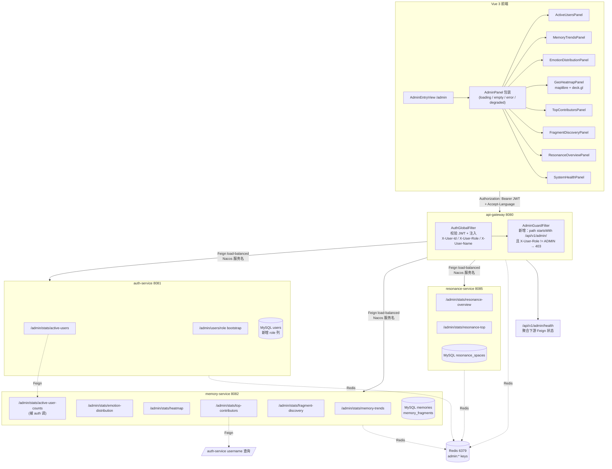
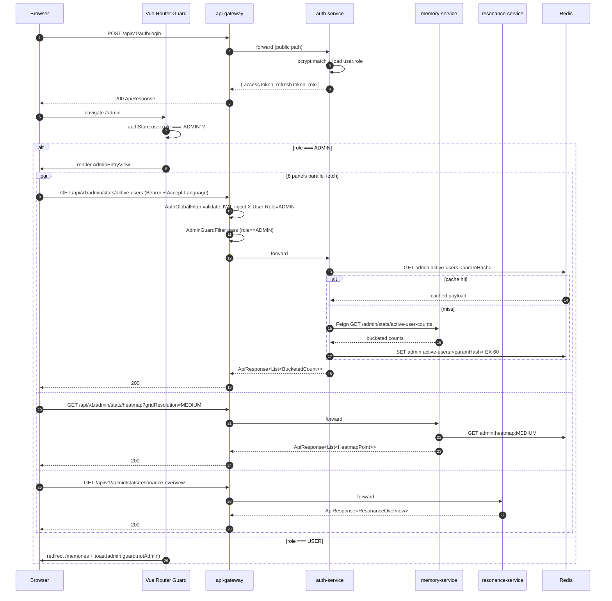
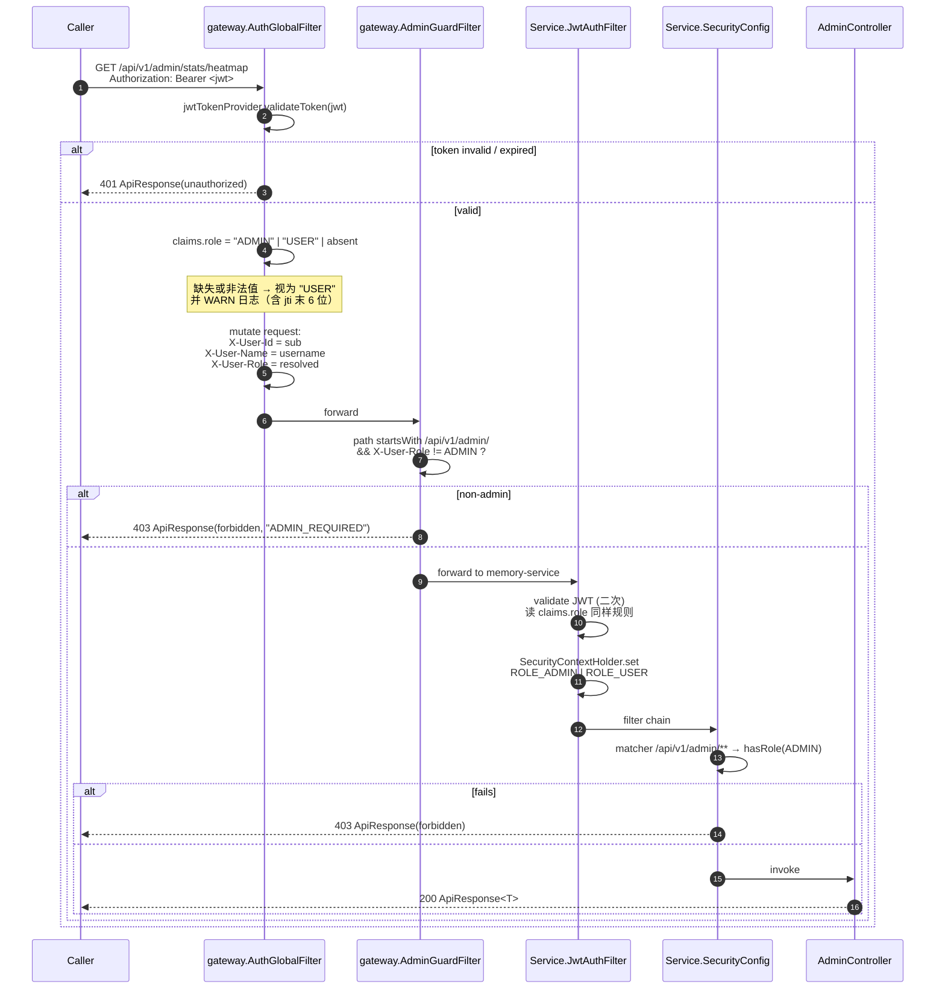
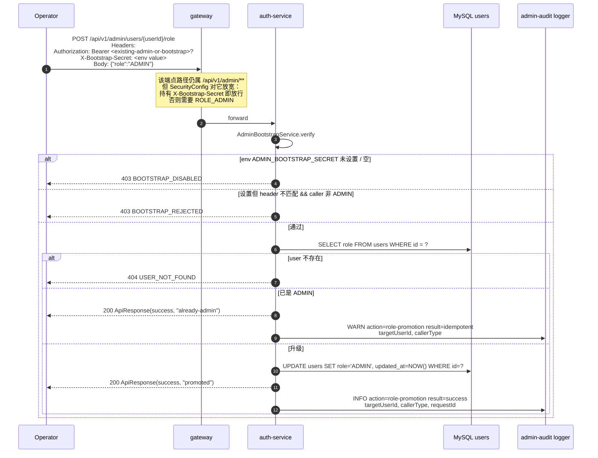
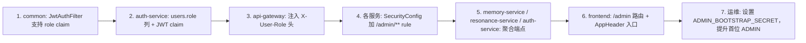

# Design Document: 管理端大屏可视化看板 (admin-dashboard)

## Overview

本特性为 Mnemoscape 平台引入「管理员视角」的全局观测面板。它由三块组成：

1. **角色基础设施**：在 `users` 表上新增 `role` 列，让 `auth-service` 在 JWT 中携带 `role` claim，并由 `gateway` 注入 `X-User-Role` 头给下游；`common.security.JwtAuthFilter` 据此为 `SecurityContext` 授予 `ROLE_USER` / `ROLE_ADMIN`；任何 `/api/v1/admin/**` 路径在 gateway 与各微服务都会被双层 `hasRole('ADMIN')` 拦截。
2. **聚合 API 层**：在 `auth-service` / `memory-service` / `resonance-service` 各自的 `/api/v1/admin/**` 子树下提供只读聚合端点。所有响应统一走 `ApiResponse<T>` 外壳，全部聚合查询命中 Redis 缓存（`@Cacheable` + bypass-on-down）；任何下游 Feign 失败都退化成 `degraded: true` 部分结果。
3. **前端管理路由**：在 Vue 3 前端新增 `/admin` 顶层路由与 8 个子面板（活跃用户、记忆趋势、情绪分布、地理热力、Top 贡献者、碎片探索率、共鸣概览、系统健康）。所有面板共用 `<AdminPanel>` 包装组件统一处理 loading / empty / error / degraded 状态；图表库采用 ECharts（pinned 版本，下文明列）；3D 热力地球继续复用前端已经在用的 `maplibre-gl` + `deck.gl`，不引入新地理库。

实现严格遵守 v1/v2 已经踩过的项目惯例：Feign + LoadBalancer 同时引入；MySQL 8 而非 PostgreSQL；JSON 列；用户隔离 header `X-User-Id`（本特性新增 `X-User-Role`）；`var(--app-header-h, 88px)` 让位；i18n 在 `zh-CN` / `en-US` 双字典同步；不引入 Spring AI。

> **重要校准**：requirements.md 的术语表写的是 "resonances 表"，但仓库中实际的实体是 `com.mnemoscape.resonance.model.entity.ResonanceSpace`，对应的 MySQL 表名是 `resonance_spaces`，分数字段叫 `similarity_score`，状态字段是 `VARCHAR(20)`（默认值 `"pending"`，不是枚举）。本设计以仓库现状为准；若日后改名再回到术语表修正。

---

## Architecture

### 部署拓扑



### 组件分层

| 层 | 模块 | 新增内容 | 修改内容 |
|---|---|---|---|
| 共享库 | `backend/common` | — | `JwtAuthFilter` 增加 role claim → ROLE_ADMIN/ROLE_USER 映射 |
| 网关 | `backend/api-gateway` | `AdminGuardFilter`（reactive WebFilter，order=-90） | `AuthGlobalFilter` 在注入 `X-User-Id` 后追加 `X-User-Role` |
| 鉴权服务 | `backend/auth-service` | `AdminUserController` / `AdminStatsController` / `AdminBootstrapService` / `RolePromotionRequest` | `User` 实体加 `role` 列；`AuthService.generateAccessToken` 加 `role` claim；`SecurityConfig` 加 `/admin/**` rule |
| 记忆服务 | `backend/memory-service` | `AdminStatsController` / `AdminStatsService` / `TimeBucketing` / `HeatmapAggregator` / `EmotionDistributionAggregator` / `MemoryRepository` 新查询 | `SecurityConfig` 加 `/admin/**` rule |
| 共鸣服务 | `backend/resonance-service` | `AdminStatsController` / `AdminResonanceService` / `ResonanceSpaceRepository` 新查询 | `SecurityConfig` 加 `/admin/**` rule |
| 前端 | `frontend` | `views/admin/*`、`components/admin/*`、`api/admin.ts`、`composables/useAdminApi.ts`、`stores/admin.ts`(可选) | `router/index.ts` 加 `/admin/**` 路由 + 守卫；`AppHeader` 加管理员入口；`auth.ts` 增加 `role` 字段；i18n 双字典加 `admin.*` 命名空间；`package.json` 加 `echarts`/`vue-echarts` 依赖 |

### 关键决策与权衡

| 决策 | 选择 | 备选 | 取舍说明 |
|---|---|---|---|
| 角色字段位置 | `users.role VARCHAR(16) NOT NULL DEFAULT 'USER'` | 单独 `user_roles` 多对多表 | 当前需求是简单二值；新增表会让 JWT 颁发额外 join。若日后引入 `MODERATOR` / `EDITOR` 多角色再迁移 |
| 角色信息传递 | JWT claim + Gateway header `X-User-Role` | 每次 Feign 时下游回查 auth-service | header 透传零额外往返，与 `X-User-Id` 一致；token 没 claim 时降级 USER（向后兼容） |
| 网关与服务双层 enforce | gateway 防外部 + 各服务 `hasRole('ADMIN')` 防内部直连 | 仅 gateway | 内部服务在 Tailscale 内网都可达；任何绕过网关的内部调用必须独立鉴权 |
| 缓存抽象 | Spring `@Cacheable` + 自定义 `RedisCacheManager` | 手写 `RedisTemplate` 包 | 注解式可读；统一过期策略；`bypass-on-down` 通过 `try/catch` 包装 cache 操作而非 `RedisCacheManager` 内置失败模式 |
| 图表库 | ECharts 5.5.1 + vue-echarts 7.0.3 | AntV G2/G6（无 Vue3 一等公民）、Chart.js（弱在地理） | 中文社区成熟、MIT、Vue 3 SFC 适配好、能做 line / radar / bar / gauge / force / heatmap |
| 3D 地球 | 复用 maplibre-gl 5.5 globe + deck.gl HexagonLayer 9.3 | three.js 自建球面 / cesium | 已经在 `MemoryAtlasView` 验证 globe 投影 + Tailscale 内可达瓦片源；不引入新依赖 |
| 频道隔离 | `/api/v1/admin/**` 一级前缀（不是子域） | 独立子域 admin.api.* | 不需要新增 DNS / TLS；与 gateway 路由表风格一致 |
| 地理网格算法 | 经纬度 floor 到固定步长（5°/1°/0.25°） | geohash | 步长直接对应人眼可解读的网格大小；deck.gl HexagonLayer 自身做六边化，不需要 geohash |
| 时间桶对齐 | 全部 UTC | 服务器本地时区 | 多服务部署若分布在不同时区会错位；UTC 统一可重现 |
| 路由命名 | `/admin/<panel-key>` 子路由 | `/admin?tab=…` 单页 query | 管理员需要把"活跃用户面板"分享出去；子路由 URL 自然 |

---

## Sequence Diagrams

### 1. 管理员登录 → 看板首屏



### 2. 鉴权链路（含降级）



### 3. Bootstrap 提升 ADMIN




---

## Data Models

### `users.role` 列（auth-service / MySQL）

**MySQL 8 DDL（部署前手工执行的 schema migration）：**

```sql
-- 1) 加列：默认 USER，避免 NOT NULL 冲突
ALTER TABLE users
    ADD COLUMN role VARCHAR(16) NOT NULL DEFAULT 'USER'
    AFTER background_image_url;

-- 2) 兜底回填（理论上 DEFAULT 已经处理；显式 update 只为防御已存在 NULL 的奇异历史行）
UPDATE users SET role = 'USER' WHERE role IS NULL OR role = '';

-- 3) 索引：管理端"按 role 过滤"的潜在场景；极小基数索引，不需要 B-tree 太大
CREATE INDEX idx_users_role ON users (role);

-- 4) 应用约束：MySQL 8.0.16+ 支持 CHECK
ALTER TABLE users
    ADD CONSTRAINT chk_users_role CHECK (role IN ('USER', 'ADMIN'));
```

**JPA 实体改动（`backend/auth-service/.../entity/User.java`）：**

新增字段（不破坏既有 builder / constructor，沿用项目"重载构造器 + builder + setter"风格）：

```java
@Column(nullable = false, length = 16)
private String role = "USER";

public String getRole() {
    return role == null ? "USER" : role;
}

public void setRole(String role) {
    this.role = (role == null || role.isBlank()) ? "USER" : role.trim().toUpperCase();
}
```

`@PrePersist onCreate()` 末尾追加 `if (role == null || role.isBlank()) role = "USER";`，保证新插入行 100% 有值（与 R1.2 / R1.3 对齐）。

### Audit log：**不**新增表

按 R15.4，admin-audit 仅作为结构化日志输出（Logback `admin-audit` 这个 logger 单独 appender，写到 `logs/admin-audit.log` + 滚动）。理由：

1. requirements 没有审计**查询**功能（只要求"产生记录"），写日志即满足。
2. 写日志比写库更廉价，不会影响管理 API 的延迟预算。
3. 审计日志的归档策略（保留期、合规打包）由运维侧 logrotate / 日志聚合（Loki / ELK）负责，与业务 schema 解耦。

如果未来需要"在管理端查看审计历史"，再用一张 `admin_audit_logs` 表 + 异步 EventListener 双写。本次设计**不**预留该表 DDL，避免占用迁移名额。

### resonance-service：现状校准（无 DDL 改动）

requirements.md §Glossary 提到的 `resonances` 表在仓库实际叫 `resonance_spaces`，列：`id, memory_id_1, memory_id_2, similarity_score, emotion_similarity, scene_similarity, scene_data_url, status, created_at`。R12 的 "edge" 即 `ResonanceSpace` 一行；R12.3 要求只暴露 `{memoryAId, memoryBId, resonanceScore, status, createdAt}` —— DTO 中字段命名做匹配映射即可，不需要改 DB schema。

> **一致性微调**：在控制器返回 DTO 中沿用 requirements 的命名 `memoryAId / memoryBId / resonanceScore`，但仓库内部仍用 `memoryId1 / memoryId2 / similarityScore`，仅在 Mapper 层做改名。这避免了破坏既有 entity API。

### memory-service：无表结构改动

R6/R7/R8/R9/R10/R11 全部基于既有 `memories` / `memory_fragments` 表的聚合查询，不增列、不增表。

---

## Components and Interfaces

> 本章按"后端聚合服务 → 前端架构 → 时间桶工具 → 热力网格工具"四块组织。后端聚合端点的实现细节、前端组件树、可视化算法分别承担在子章节 Backend Components / Frontend Architecture / Time Bucketing Algorithm / Heatmap Grid Algorithm。子章节互相引用，避免重复。

### Backend Components

#### 通用约定

- **包结构**：每个服务在 `com.mnemoscape.<svc>.admin` 子包内放控制器 + 服务 + DTO，与既有业务包并列。
- **DTO 风格**：使用 Java 17 `record`（项目已有 `record` 用法）作为响应载体；输入仍是 query params（不需要 record）。
- **缓存键**：统一格式 `admin:{endpoint-key}:{paramHash}`，其中 `paramHash` 是 SHA-256 输入参数 canonical JSON 后取前 16 hex（详见 §Caching Strategy）。
- **错误码**：`ApiResponse.code` 用 HTTP 数字（已有约定）；`message` 字段对应错误码字符串（如 `INVALID_DIMENSION` / `INVALID_RANGE` / `UPSTREAM_UNAVAILABLE` / `ADMIN_AGG_FEIGN` / `BOOTSTRAP_DISABLED`），通过 `LocaleResolver` 翻译。
- **Spring Security 规则**：每服务在 `SecurityConfig` 加 `auth.requestMatchers("/api/v1/admin/**").hasRole("ADMIN")`，置于 `anyRequest().authenticated()` 之前。
- **Feign client 注册**：每个跨服务调用都引入对应的 `*ServiceClient` 接口；新服务首次接 Feign 时**必须同时**在 pom 添加：
  ```xml
  <dependency>
      <groupId>org.springframework.cloud</groupId>
      <artifactId>spring-cloud-starter-openfeign</artifactId>
  </dependency>
  <dependency>
      <groupId>org.springframework.cloud</groupId>
      <artifactId>spring-cloud-starter-loadbalancer</artifactId>
  </dependency>
  ```
  （resonance-service v2 教训）

#### auth-service · `/admin/**` 端点

##### 1. `POST /api/v1/admin/users/{userId}/role` —— Bootstrap 角色提升 (R1.4–1.6)

| 字段 | 内容 |
|---|---|
| Controller | `AdminUserController.promoteRole(@PathVariable String userId, @RequestHeader(value = "X-Bootstrap-Secret", required = false) String secret, @RequestBody RolePromotionRequest body, HttpServletRequest req)` |
| Service | `AdminBootstrapService.promote(targetUserId, providedSecret, callerRole, callerUserId)` |
| Repository | `UserRepository.findById(String)` + `save` |
| Cache key | 不缓存（写操作） |
| TTL | — |
| Response DTO | `record RolePromotionResponse(String userId, String role, String result)` —— `result` ∈ `{"promoted","already-admin"}` |
| Errors | 404 `USER_NOT_FOUND` / 403 `BOOTSTRAP_DISABLED`（env 未设） / 403 `BOOTSTRAP_REJECTED`（secret 不匹配且 caller 非 ADMIN） / 400 `INVALID_ROLE`（body.role 不是 `"ADMIN"`） |

`AdminBootstrapService` 启动时读 `${ADMIN_BOOTSTRAP_SECRET:}`：

```java
@Value("${mnemoscape.admin.bootstrap-secret:}")
private String configuredSecret;

@PostConstruct
void warnIfDisabled() {
    if (configuredSecret == null || configuredSecret.isBlank()) {
        log.warn("ADMIN_BOOTSTRAP_SECRET is unset; role-promotion endpoint will reject all requests");
    }
}
```

##### 2. `GET /api/v1/admin/stats/active-users` (R6)

| 字段 | 内容 |
|---|---|
| Controller | `AdminStatsController.activeUsers(@RequestParam Dimension dimension, @RequestParam(required=false) LocalDate from, @RequestParam(required=false) LocalDate to)` |
| Service | `AdminStatsService.aggregateActiveUsers(...)` —— 解析默认窗口、校验范围、调 Feign |
| Repository | `MemoryServiceClient.activeUserCounts(dimensionStr, fromIso, toIso)`（Feign） |
| Memory-side query | 见下文 §memory-service 中的 `/admin/stats/active-user-counts` |
| Cache key | `admin:active-users:{sha256(dimension|from|to).16}` |
| TTL | 60s（KPI overview 范围内最低；R14.2 `[30,120]`）|
| Response DTO | `record ActiveUserBucket(String bucket, long activeUserCount)` 列表 |
| Errors | 400 `INVALID_DIMENSION` / 400 `INVALID_RANGE` / 502 `UPSTREAM_UNAVAILABLE` / 502 `ADMIN_AGG_FEIGN`（部分降级时仍 200 但 degraded=true）|

> R6.7 要求"Memory_Service 不可达 → 502 `UPSTREAM_UNAVAILABLE`，不返回 stale"。本服务会直接抛 `UpstreamUnavailableException`，由 `GlobalExceptionHandler` 映射 502。降级路径（R18）只用于 Top contributors / Resonance overview 等"多数据源拼装"场景。

#### memory-service · `/admin/**` 端点

| Endpoint | Controller method | Repo / SQL 概要 | 缓存 key | TTL（s）|
|---|---|---|---|---|
| `GET /admin/stats/active-user-counts?dimension&from&to` | `AdminStatsController.activeUserCounts` | JPQL：`SELECT COUNT(DISTINCT m.userId) FROM Memory m WHERE m.createdAt BETWEEN :from AND :to` 但实际**桶切分**在 Java 层完成（见 §Time Bucketing） | `admin:active-user-counts:{hash}` | 60 |
| `GET /admin/stats/memory-trends?dimension&from&to` | `AdminStatsController.memoryTrends` | 见下方 SQL | `admin:memory-trends:{hash}` | 60 |
| `GET /admin/stats/emotion-distribution?from&to` | `AdminStatsController.emotionDistribution` | 见下方 SQL | `admin:emotion-distribution:{hash}` | 120 |
| `GET /admin/stats/heatmap?gridResolution` | `AdminStatsController.heatmap` | 见下方 SQL | `admin:heatmap:{LOW/MEDIUM/HIGH}` | 600 |
| `GET /admin/stats/top-contributors?limit&from&to` | `AdminStatsController.topContributors` | 见下方 SQL | `admin:top-contributors:{hash}` | 120 |
| `GET /admin/stats/fragment-discovery?groupBy?` | `AdminStatsController.fragmentDiscovery` | 见下方 SQL | `admin:fragment-discovery:{groupBy or NONE}` | 120 |

**`memory-trends` JPQL（R7）**：

```java
@Query("""
    SELECT m.id AS id, m.createdAt AS createdAt, m.updatedAt AS updatedAt
    FROM Memory m
    WHERE (m.createdAt BETWEEN :fromDt AND :toDt)
       OR (m.updatedAt BETWEEN :fromDt AND :toDt)
    """)
List<MemoryTrendRow> findTrendRows(LocalDateTime fromDt, LocalDateTime toDt);

interface MemoryTrendRow {
    String getId();
    LocalDateTime getCreatedAt();
    LocalDateTime getUpdatedAt();
}
```

桶切分仍在 Java 层（同 active-users）。这样比纯 SQL 写 4 套不同 `DATE_FORMAT()` / `YEARWEEK()` 简洁，且能与 active-user-counts 共享 `TimeBucketing` 工具。

**`emotion-distribution` JPQL（R8）**：

由于 `emotion_profile` 是 MySQL JSON 列且 8 维 key 固定，使用原生 SQL 走 `JSON_EXTRACT`：

```sql
SELECT
  AVG(JSON_EXTRACT(emotion_profile, '$.joy'))        AS avgJoy,
  AVG(JSON_EXTRACT(emotion_profile, '$.sadness'))    AS avgSadness,
  AVG(JSON_EXTRACT(emotion_profile, '$.anger'))      AS avgAnger,
  AVG(JSON_EXTRACT(emotion_profile, '$.fear'))       AS avgFear,
  AVG(JSON_EXTRACT(emotion_profile, '$.surprise'))   AS avgSurprise,
  AVG(JSON_EXTRACT(emotion_profile, '$.nostalgia'))  AS avgNostalgia,
  AVG(JSON_EXTRACT(emotion_profile, '$.peace'))      AS avgPeace,
  AVG(JSON_EXTRACT(emotion_profile, '$.melancholy')) AS avgMelancholy,
  COUNT(*)                                           AS sampleSize
FROM memories
WHERE privacy_level = 'PUBLIC'
  AND emotion_profile IS NOT NULL
  AND created_at BETWEEN :fromDt AND :toDt
```

null sample（即 `sampleSize = 0`）时直接构造 8 个 `0.0`（R8.3）。

**`heatmap` 原生 SQL（R9）**：网格量化通过 SQL 层完成，避免内存装载所有点。

```sql
-- 以 MEDIUM (1°) 为例：FLOOR(lat) + 0.5 / FLOOR(lng) + 0.5 落到网格中心
SELECT
  ROUND(FLOOR(memory_lat / :step) * :step + (:step / 2), 6)  AS latBucket,
  ROUND(FLOOR(memory_lng / :step) * :step + (:step / 2), 6)  AS lngBucket,
  COUNT(*)                                                    AS rawCount
FROM memories
WHERE privacy_level = 'PUBLIC'
  AND memory_lat IS NOT NULL
  AND memory_lng IS NOT NULL
GROUP BY latBucket, lngBucket
```

`step ∈ {5.0, 1.0, 0.25}` 由控制器解析（详见 §Heatmap Grid Algorithm）。后端再做归一化（max → 1.0）。

**`top-contributors` JPQL（R10）**：

```java
@Query("""
    SELECT m.userId AS userId, COUNT(m.id) AS memoryCount
    FROM Memory m
    WHERE m.createdAt BETWEEN :fromDt AND :toDt
    GROUP BY m.userId
    ORDER BY COUNT(m.id) DESC
    """)
List<ContributorRow> findTopContributors(LocalDateTime fromDt, LocalDateTime toDt, Pageable pageable);
```

控制器拿到 `[(userId, memoryCount)]` 后通过 `AuthServiceClient.batchUsernames(List<String> userIds)`（新增 Feign 端点 `POST /api/v1/users/batch-usernames`）补 username。**严格 DTO 白名单**：响应 record `record TopContributor(String userId, String username, long memoryCount)` —— 没有 email / passwordHash / 其他字段（R10.4 / R15.2）。

如果 `AuthServiceClient` 调用失败：所有条目的 `username` 字段 fallback 到 `userId.substring(0, 8)`，并返回 `degraded: true` + `degradedReasons: ["auth-service username lookup failed"]`（R18.1）。

**`fragment-discovery` JPQL（R11）**：

```java
@Query("""
    SELECT
      f.fragmentType                                     AS fragmentType,
      COUNT(f.id)                                        AS totalFragments,
      SUM(CASE WHEN f.isDiscovered = true THEN 1 ELSE 0 END) AS discoveredFragments
    FROM MemoryFragment f
    GROUP BY f.fragmentType
    """)
List<FragmentDiscoveryRow> aggregateByType();

@Query("""
    SELECT
      COUNT(f.id) AS totalFragments,
      SUM(CASE WHEN f.isDiscovered = true THEN 1 ELSE 0 END) AS discoveredFragments
    FROM MemoryFragment f
    """)
FragmentDiscoveryRow aggregateOverall();
```

`discoveryRate = totalFragments == 0 ? 0.0 : discoveredFragments / totalFragments`（R11.2）。

#### resonance-service · `/admin/**` 端点

| Endpoint | Controller method | Repo / JPQL | 缓存 key | TTL（s）|
|---|---|---|---|---|
| `GET /admin/stats/resonance-overview` | `AdminResonanceController.overview` | 单条 native：`SELECT COUNT(*) total, AVG(similarity_score) avg, status, COUNT(*) groupCnt FROM resonance_spaces GROUP BY status` | `admin:resonance-overview` | 120 |
| `GET /admin/stats/resonance-top?limit=N` | `AdminResonanceController.topEdges` | `findTop20ByOrderBySimilarityScoreDesc` 的可参数化版本：`@Query SELECT r FROM ResonanceSpace r ORDER BY r.similarityScore DESC` + `Pageable.ofSize(limit)` | `admin:resonance-top:{limit}` | 120 |

Response DTOs:
- `record ResonanceOverview(long totalEdges, double averageScore, Map<String, Long> statusBreakdown)`
- `record ResonanceTopEdge(String memoryAId, String memoryBId, double resonanceScore, String status, OffsetDateTime createdAt)`（注意：仅 5 个字段，不含 memoryId 之外的内容；R12.3 / R15.1）

#### `GET /api/v1/admin/health` (R18.4)

由 gateway 直接实现（reactive `HealthHandlerFunction`）：

```text
GET /api/v1/admin/health
→ 并行 GET each downstream actuator + Redis ping:
   auth-service /actuator/health
   memory-service /actuator/health
   resonance-service /actuator/health
   asset-service /actuator/health
   ai-service /actuator/health
   redis ping
→ 每个组件映射为 UP / DEGRADED / DOWN：
   actuator status="UP"        → UP
   actuator status="OUT_OF_SERVICE" / 5xx in 1s → DEGRADED
   2s 仍无响应 / connection refused             → DOWN
```

响应：

```json
{
  "code": 200,
  "message": "OK",
  "data": {
    "overall": "DEGRADED",
    "components": {
      "auth-service":      { "status": "UP",       "latencyMs":  18 },
      "memory-service":    { "status": "UP",       "latencyMs":  22 },
      "resonance-service": { "status": "DEGRADED", "latencyMs": 1240, "reason": "actuator 503" },
      "asset-service":     { "status": "DOWN",     "latencyMs": 2002, "reason": "timeout" },
      "ai-service":        { "status": "UP",       "latencyMs":  31 },
      "redis":             { "status": "UP",       "latencyMs":   3 }
    }
  }
}
```

`overall` = `DOWN` if any critical (auth/memory/redis) is DOWN; `DEGRADED` if any DEGRADED 或 non-critical DOWN；否则 `UP`。


---

## Time Bucketing Algorithm (R6.6)

### 类签名

```java
package com.mnemoscape.memory.admin.util;

import java.time.*;
import java.time.format.DateTimeFormatter;
import java.time.temporal.IsoFields;
import java.util.*;

public final class TimeBucketing {
    public enum Dimension { DAILY, WEEKLY, MONTHLY, YEARLY }

    /** 把 LocalDateTime（UTC 解读）落到当前维度的桶起点 */
    public static LocalDateTime bucketStart(Dimension dim, LocalDateTime utc);

    /** 桶起点 + 1 个步长 = 下一个桶起点 */
    public static LocalDateTime nextBucketStart(Dimension dim, LocalDateTime bucketStart);

    /** 把桶起点序列化为前端展示的 key（"2026-05-24"/"2026-W21"/"2026-05"/"2026"） */
    public static String formatBucket(Dimension dim, LocalDateTime bucketStart);

    /** 反向解析桶 key 为起点（用于服务端"接收 from/to 时按维度对齐"） */
    public static LocalDateTime parseBucket(Dimension dim, String bucketKey);

    /** 给定 [from,to] 闭区间和维度，生成所有桶起点（升序，含端点） */
    public static List<LocalDateTime> bucketSeries(Dimension dim, LocalDate from, LocalDate to);

    /** 校验桶数 ≤ 366（R6.4） */
    public static void requireBucketCountWithinLimit(Dimension dim, LocalDate from, LocalDate to);

    /** 默认窗口：按维度推回若干个桶（R6.5） */
    public static LocalDate defaultFrom(Dimension dim, LocalDate to);
}
```

### 核心规则

| 维度 | 桶起点对齐 | 步长 | 默认窗口长度 | bucket key 格式 |
|---|---|---|---|---|
| DAILY | UTC 当日 00:00 | 1 天 | 30 天 | `YYYY-MM-DD` |
| WEEKLY | ISO 周一 00:00 UTC | 7 天 | 12 周 | `YYYY-Www`（如 `2026-W21`，使用 `IsoFields.WEEK_BASED_YEAR` + `WEEK_OF_WEEK_BASED_YEAR`）|
| MONTHLY | 月首 00:00 UTC | 1 月 | 12 月 | `YYYY-MM` |
| YEARLY | 年首 00:00 UTC | 1 年 | 5 年 | `YYYY` |

### 零填充逻辑

```pascal
ALGORITHM zeroFillBuckets(dim, from, to, rawCounts)
INPUT:
    dim ∈ {DAILY, WEEKLY, MONTHLY, YEARLY}
    from, to ∈ LocalDate (UTC dates, from ≤ to)
    rawCounts: Map<bucketKey: String, count: long> (sparse)
OUTPUT:
    series: List<{bucket: String, count: long}>  -- 严格按桶升序，每桶恰一项

BEGIN
    requireBucketCountWithinLimit(dim, from, to)
    starts ← bucketSeries(dim, from, to)
    series ← []
    FOR each start IN starts DO
        key ← formatBucket(dim, start)
        ASSERT count ≥ 0  -- 防御性：raw 永远非负
        count ← rawCounts.getOrDefault(key, 0L)
        series.add({bucket: key, count: count})
    END FOR
    ASSERT series.size = starts.size  -- 一桶一项的不变量
    RETURN series
END
```

### Active Users 桶填充（R6.6 完整流程）

```pascal
ALGORITHM aggregateActiveUserBuckets(dim, from, to)
INPUT: dim, from, to
OUTPUT: List<ActiveUserBucket>

BEGIN
    fromDt ← from.atStartOfDay(UTC)
    toDt   ← to.plusDays(1).atStartOfDay(UTC)        -- exclusive 上界
    rows   ← memoryRepo.findActiveUserRowsBetween(fromDt, toDt)
        -- rows: List<{userId, latestActivityAt}> 其中 latestActivityAt =
        -- GREATEST(createdAt, COALESCE(modifiedAt, createdAt))

    -- 按桶累加，但同一用户在同一桶内只算一次
    bucketSets ← Map<bucketKey, Set<userId>>  -- 默认空集
    FOR each row IN rows DO
        b ← bucketStart(dim, row.latestActivityAt)
        key ← formatBucket(dim, b)
        bucketSets[key].add(row.userId)
    END FOR

    rawCounts ← bucketSets mapped to {key, set.size}
    RETURN zeroFillBuckets(dim, from, to, rawCounts)
END
```

### Memory Trends 桶填充（R7）

```pascal
ALGORITHM aggregateMemoryTrendBuckets(dim, from, to)
BEGIN
    fromDt ← from.atStartOfDay(UTC)
    toDt   ← to.plusDays(1).atStartOfDay(UTC)
    rows   ← memoryRepo.findTrendRows(fromDt, toDt)

    createdCounts  ← Map<bucketKey, long>
    modifiedCounts ← Map<bucketKey, long>

    FOR each row IN rows DO
        IF row.createdAt ∈ [fromDt, toDt) THEN
            createdCounts[formatBucket(dim, bucketStart(dim, row.createdAt))]++
        END IF
        IF row.updatedAt > row.createdAt
           AND row.updatedAt ∈ [fromDt, toDt) THEN
            modifiedCounts[formatBucket(dim, bucketStart(dim, row.updatedAt))]++
        END IF
    END FOR

    series ← []
    FOR each bucketKey IN bucketSeries(dim, from, to) DO
        series.add({
            bucket:        bucketKey,
            createdCount:  createdCounts.getOrDefault(bucketKey, 0L),
            modifiedCount: modifiedCounts.getOrDefault(bucketKey, 0L)
        })
    END FOR
    RETURN series
END
```

### 圆角案例

- `dim = WEEKLY`，`from = 2026-05-20`（周三）：第一桶起点 `2026-05-18 00:00 UTC`（ISO 周一），key `2026-W21`。
- `dim = MONTHLY`，`from = 2026-05-15`：第一桶起点 `2026-05-01`，key `2026-05`。
- `dim = DAILY`，`from = to = 2026-05-24`：返回 1 桶 + 1 计数，永不为空数组。

---

## Heatmap Grid Algorithm (R9)

### 决策：snap-to-grid 而非 geohash

理由：

1. requirements 用"5° / 1° / 0.25°"明确约定网格尺度，正是经纬度量化；geohash 的 base32 字符长度对应的精度（5/6/7/8 char）与这三个等级不严格一致。
2. deck.gl `HexagonLayer` 自身做六边形 binning，它需要的是原始点 + radius，而**不是** geohash。如果我们再 geohash 一次反而 conflict（HexagonLayer 会在 geohash 中心点周围再聚簇）。
3. snap-to-grid 让相同 lat/lng 桶坚定地映射到同一个 cell，请求多次结果稳定可缓存。

### 决策：粒度→步长

| `gridResolution` | 步长 step | 网格中心偏移 | 备注 |
|---|---|---|---|
| `LOW` | 5.0° | step/2 | 全球总桶上限 ≈ 36 × 72 = 2592（实际很稀疏）|
| `MEDIUM` | 1.0° | step/2 | 约 64,800 桶上限 |
| `HIGH` | 0.25° | step/2 | 约 1,036,800 桶上限；查询带 PUBLIC + lat/lng not null 过滤后远小于此 |

### Pseudocode

```pascal
ALGORITHM aggregateHeatmap(resolution)
INPUT:  resolution ∈ {LOW, MEDIUM, HIGH}
OUTPUT: List<HeatmapPoint{lat, lon, intensity}>

BEGIN
    step ← stepFor(resolution)        -- 5.0 | 1.0 | 0.25
    rows ← memoryRepo.heatmapBuckets(step)
        -- SQL 已经按 (latBucket, lngBucket) GROUP BY 并 COUNT

    IF rows.isEmpty() THEN
        RETURN []
    END IF

    maxRaw ← MAX(row.rawCount FOR row IN rows)
    ASSERT maxRaw ≥ 1

    out ← []
    FOR each row IN rows DO
        intensity ← row.rawCount / maxRaw           -- ∈ (0, 1]
        intensity ← clamp(intensity, 0.0, 1.0)
        out.add({lat: row.latBucket, lon: row.lngBucket, intensity: intensity})
    END FOR

    -- 稳定输出顺序便于缓存命中相同 byte 序列
    SORT out BY (lat ASC, lon ASC)
    RETURN out
END

FUNCTION stepFor(resolution)
    SWITCH resolution
        CASE LOW    → RETURN 5.0
        CASE MEDIUM → RETURN 1.0
        CASE HIGH   → RETURN 0.25
    END SWITCH
END
```

### Postconditions

- `∀ p ∈ out: 0.0 < p.intensity ≤ 1.0`
- `∃ p ∈ out: p.intensity == 1.0`（最大点归一化为 1）
- `lat ∈ [-90 + step/2, 90 - step/2]`，`lon ∈ [-180 + step/2, 180 - step/2]`（网格中心点）

### 边界场景

| 场景 | 处理 |
|---|---|
| 没有 PUBLIC 记忆 | SQL 返回空 → 返回 `[]`，前端面板渲染 empty state |
| 所有记忆同坐标 | 单点 + intensity=1.0 |
| `lat = -89.9` 在 LOW 下 | `floor(-89.9/5)*5 + 2.5 = -90 + 2.5 = -87.5`（合法） |

---

## Frontend Architecture

### 路由表（`router/index.ts`）

```ts
// 新增：在既有 routes 数组末尾追加 /admin 子树
{
    path: '/admin',
    component: () => import('../views/admin/AdminEntryView.vue'),
    meta: { requiresAuth: true, requiresAdmin: true },
    children: [
        { path: '',                    name: 'AdminHome',           component: () => import('../views/admin/AdminHomeView.vue') },
        { path: 'active-users',        name: 'AdminActiveUsers',    component: () => import('../views/admin/ActiveUsersView.vue') },
        { path: 'memory-trends',       name: 'AdminMemoryTrends',   component: () => import('../views/admin/MemoryTrendsView.vue') },
        { path: 'emotion',             name: 'AdminEmotion',        component: () => import('../views/admin/EmotionDistView.vue') },
        { path: 'heatmap',             name: 'AdminHeatmap',        component: () => import('../views/admin/HeatmapView.vue') },
        { path: 'top-contributors',    name: 'AdminContributors',   component: () => import('../views/admin/ContributorsView.vue') },
        { path: 'fragments',           name: 'AdminFragments',      component: () => import('../views/admin/FragmentDiscoveryView.vue') },
        { path: 'resonance',           name: 'AdminResonance',      component: () => import('../views/admin/ResonanceOverviewView.vue') },
        { path: 'health',              name: 'AdminHealth',         component: () => import('../views/admin/SystemHealthView.vue') },
    ],
},
```

### 守卫（`router/index.ts` 的 `beforeEach`）

```ts
router.beforeEach((to, _from, next) => {
    const auth = useAuthStore()

    // 既有 guest / requiresAuth 保留不动
    if (to.meta.requiresAuth && !auth.isLoggedIn) {
        return next({ path: '/login', query: { redirect: to.fullPath } })   // R4.2
    }
    if (to.meta.guest && auth.isLoggedIn) {
        return next('/memories')
    }

    // 新增：requiresAdmin
    if (to.meta.requiresAdmin) {
        if (!auth.isLoggedIn) {
            return next({ path: '/login', query: { redirect: to.fullPath } })   // R4.2
        }
        if (auth.user?.role !== 'ADMIN') {
            // 通过事件总线 / Pinia 通知组件层弹出非阻塞 toast
            useToastStore().push({ key: 'admin.guard.notAdmin', tone: 'warning' })   // R4.3
            return next('/memories')
        }
    }
    return next()
})
```

> `useToastStore` 是新增的极轻量 Pinia store（仅 `push(toast)` + `dismiss(id)`），用于 R5.5 错误卡 + R4.3 通知 + R18.2 降级 badge 的复用。

### Pinia 拆分策略

**采用"per-panel composable + 共享 useAdminApi"，不引入大型 admin 全局 store**。理由：

1. 8 个面板各自数据独立、刷新策略不同（heatmap 10 分钟刷一次，trends 1 分钟），单一全局 store 会让缓存失效逻辑膨胀。
2. 面板可懒加载（vue-router lazy import），composable 也按需 import，首屏不付带宽。
3. 共享逻辑（请求 / 错误处理 / degraded 状态 / i18n 错误码翻译）抽到 `composables/useAdminApi.ts`。

```ts
// composables/useAdminApi.ts
export interface AdminApiState<T> {
    data: Ref<T | null>
    loading: Ref<boolean>
    error: Ref<{ code: string; message: string } | null>
    degraded: Ref<boolean>
    degradedReasons: Ref<string[]>
    fetch: () => Promise<void>
    reset: () => void
}

export function useAdminApi<T>(endpoint: string, params: Ref<Record<string, unknown>>): AdminApiState<T> {
    // 内部用 axios client（已经走 /api/v1 + Bearer 注入）
    // 解析 ApiResponse<T>，把 data.degraded / data.degradedReasons 扁平化到 state
}
```

```ts
// composables/useAdminActiveUsers.ts
export function useAdminActiveUsers() {
    const dimension = ref<'DAILY'|'WEEKLY'|'MONTHLY'|'YEARLY'>('DAILY')
    const from = ref<string|undefined>(undefined)
    const to   = ref<string|undefined>(undefined)
    const params = computed(() => ({ dimension: dimension.value, from: from.value, to: to.value }))
    const state  = useAdminApi<ActiveUserBucket[]>('/admin/stats/active-users', params)

    // R6.9：切换 dimension 时若 from/to 仍合法，保留之，否则用 default
    watch(dimension, () => {
        if (!isRangeValidForDimension(dimension.value, from.value, to.value)) {
            from.value = undefined
            to.value = undefined
        }
        state.fetch()
    })

    return { dimension, from, to, ...state }
}
```

### auth store 改动（`stores/auth.ts`）

```ts
export interface User {
    id: string
    username: string
    email: string
    avatarUrl?: string
    role: 'USER' | 'ADMIN'   // 新增
    verified: boolean
    createdAt?: string
    updatedAt?: string
}

// toUser 映射时：
role: (profile.role === 'ADMIN' ? 'ADMIN' : 'USER')

// 新增 computed
const isAdmin = computed(() => user.value?.role === 'ADMIN')
return { ..., isAdmin }
```

`AuthResponse` DTO 也要带 role；后端 `AuthService` 在登录返回里加 `"role": user.getRole()`。

### AppHeader 管理员入口（R4.4 / R4.5）

在 `<nav class="app-nav">` 末尾按 `auth.isAdmin` 条件渲染：

```vue
<RouterLink
    v-if="auth.isAdmin"
    to="/admin"
    class="app-nav__link app-nav__link--admin"
>
    <svg viewBox="0 0 24 24" width="16" height="16" aria-hidden="true">
        <path d="M12 3l8 4v5c0 4.5-3.4 8.6-8 9-4.6-.4-8-4.5-8-9V7z"
              stroke="currentColor" stroke-width="1.6" fill="none"/>
        <path d="M9 12l2 2 4-4" stroke="currentColor" stroke-width="1.6" stroke-linecap="round"/>
    </svg>
    <span>{{ t('admin.nav.entry') }}</span>
</RouterLink>
```

### 共享组件 `<AdminPanel>` (R5.4 / R5.5 / R18.2)

`components/admin/AdminPanel.vue` 是所有 8 个面板的统一外壳：

```vue
<script setup lang="ts">
defineProps<{
    title: string                  // i18n key
    state: 'idle' | 'loading' | 'empty' | 'error' | 'ready'
    error?: { code: string; message: string } | null
    degraded?: boolean
    degradedReasons?: string[]
    onRetry?: () => void
}>()
</script>

<template>
    <section class="admin-panel" :data-state="state">
        <header class="admin-panel__header">
            <h3>{{ t(title) }}</h3>
            <span v-if="degraded" class="admin-panel__badge admin-panel__badge--degraded">
                {{ t('admin.common.degradedBadge') }}
            </span>
        </header>

        <div class="admin-panel__body">
            <slot v-if="state === 'ready'" />

            <div v-else-if="state === 'loading'" class="admin-panel__skel">
                <div class="skel-bar" v-for="n in 3" :key="n" />
            </div>

            <div v-else-if="state === 'empty'" class="admin-panel__empty">
                <p>{{ t('admin.common.empty') }}</p>
            </div>

            <div v-else-if="state === 'error'" class="admin-panel__error">
                <p>
                    <strong>{{ t('admin.common.error') }}</strong>
                    <span class="admin-panel__error-code">{{ error?.code }}</span>
                </p>
                <p class="admin-panel__error-msg">{{ error?.message }}</p>
                <button class="button button--ghost" type="button" @click="onRetry?.()">
                    {{ t('admin.common.retry') }}
                </button>
            </div>
        </div>

        <footer v-if="degraded" class="admin-panel__degraded-footer">
            <p>{{ t('admin.common.degradedHint') }}</p>
            <ul>
                <li v-for="r in degradedReasons" :key="r">{{ r }}</li>
            </ul>
        </footer>
    </section>
</template>
```

CSS：每个 panel `<section class="admin-panel">` 自身带 `padding-top: var(--app-header-h, 88px)` 仅在面板"独立成页"时生效（即 `/admin/active-users` 直接访问时）。在 `/admin` 网格内部不重复 padding。

### 面板组件清单与图表选型

| 路径 | 组件 | 数据源 | 图表 | 关键 ECharts option |
|---|---|---|---|---|
| `/admin` | `AdminHomeView.vue` | 全部 8 个面板（缩略图） | 拼图：每个 cell 是 `<AdminPanelCell>` 包一个具体 panel | `responsive: true`, `grid` |
| `/admin/active-users` | `ActiveUsersView.vue` | `useAdminActiveUsers()` | line / column toggle | `xAxis.type='category'`, `yAxis.type='value'` |
| `/admin/memory-trends` | `MemoryTrendsView.vue` | `useAdminMemoryTrends()` | stacked column | `series.stack='total'` 区分 created/modified |
| `/admin/emotion` | `EmotionDistView.vue` | `useAdminEmotion()` | radar | `radar.indicator` 8 维 |
| `/admin/heatmap` | `HeatmapView.vue` | `useAdminHeatmap()` | maplibre + deck.gl HexagonLayer | 见下方 §Heatmap 3D 渲染 |
| `/admin/top-contributors` | `ContributorsView.vue` | `useAdminContributors()` | horizontal bar | `yAxis.type='category'` |
| `/admin/fragments` | `FragmentDiscoveryView.vue` | `useAdminFragments()` | gauge + horizontal bars | `series.type='gauge'` |
| `/admin/resonance` | `ResonanceOverviewView.vue` | `useAdminResonance()` | KPI cards + force graph (echarts `series.type='graph'`) | `force.repulsion=200` |
| `/admin/health` | `SystemHealthView.vue` | `useAdminHealth()` | KPI 矩阵（无图表） | — |

### 依赖版本钉死（`frontend/package.json`）

```json
{
    "dependencies": {
        "echarts": "5.5.1",
        "vue-echarts": "7.0.3"
    }
}
```

> **明确不引入**：`@antv/g2` / `chart.js` / `cesium` / `mapbox-gl`。

> **复用既有**：`maplibre-gl ^5.5.0` / `@deck.gl/core ^9.3.0` / `@deck.gl/aggregation-layers`（**注**：HexagonLayer 在 deck.gl ^9.3 的 `@deck.gl/aggregation-layers` 子包；需在 dependencies 加上 `"@deck.gl/aggregation-layers": "^9.3.0"`，与既有同主版本号一致以避免 peer-dep 冲突）。

### Heatmap 3D 渲染细节

```ts
// HeatmapView.vue 关键片段
const map = new maplibregl.Map({
    container: containerEl,
    style: {
        version: 8,
        projection: { type: 'globe' },     // v2.2.2 已知陷阱：globe 写在 style 里
        sources: { /* 高德 webrd + CartoDB fallback */ },
        layers:  [/* 主底图 + 兜底 */],
    },
    // 不要设 maxBounds（v2.2.3 已知陷阱）
})

const overlay = new MapboxOverlay({
    layers: [
        new HexagonLayer({
            id: 'admin-heatmap',
            data: heatmapPoints.value,                    // [{lat, lon, intensity}]
            getPosition: (p) => [p.lon, p.lat],
            getColorWeight: (p) => p.intensity,
            colorAggregation: 'SUM',
            radius: radiusFor(gridResolution.value),      // 见下表
            elevationScale: 50,
            pickable: true,
            extruded: true,
        }),
    ],
})
map.addControl(overlay)

// ResizeObserver — 不能省（v2.2.4 / R9.6）
const ro = new ResizeObserver(() => map.resize())
ro.observe(containerEl)
onUnmounted(() => { ro.disconnect(); map.remove() })
```

`radiusFor` 表（米）：

| gridResolution | radius (m) |
|---|---|
| `LOW`    | 350_000 |
| `MEDIUM` | 80_000  |
| `HIGH`   | 25_000  |


---

## Privacy Enforcement (R15)

### 防御等级排序（自上而下）

1. **DTO 白名单**：响应类型用 `record`，**只**列允许返回的字段。任何敏感字段进入响应必须经过显式构造，无法"漏"出去。
2. **SQL 投影白名单**：JPQL `SELECT new <DTO>(...)` 或 `SELECT m.userId, COUNT(m.id)` 直接投影到 DTO，避免读出整 entity 后再筛。
3. **PRIVACY 过滤**：所有"sample memories"类型查询（heatmap 数据点、emotion 分布）`WHERE privacy_level = 'PUBLIC'`（R15.3）。
4. **审计日志**：每次成功响应通过 `AdminAuditLogger` 记录 `{adminUserId, endpoint, queryHash, timestamp, responseStatus}`。
5. **拒绝原始查询参数日志**：`queryHash = SHA-256(canonicalize(sortedParams))[..16]`（R15.5）。

### DTO 白名单清单

| 端点 | 允许字段（**当且仅当**） |
|---|---|
| `active-users` | `bucket`, `activeUserCount` |
| `memory-trends` | `bucket`, `createdCount`, `modifiedCount` |
| `emotion-distribution` | `joy, sadness, anger, fear, surprise, nostalgia, peace, melancholy, sampleSize` |
| `heatmap` | `lat, lon, intensity` |
| `top-contributors` | `userId, username, memoryCount` |
| `fragment-discovery` 总 | `totalFragments, discoveredFragments, discoveryRate` |
| `fragment-discovery groupBy=fragmentType` | `fragmentType, totalFragments, discoveredFragments, discoveryRate` |
| `resonance-overview` | `totalEdges, averageScore, statusBreakdown` |
| `resonance-top` | `memoryAId, memoryBId, resonanceScore, status, createdAt` |
| `health` | `overall, components` (each: `status, latencyMs, reason?`) |

**绝不允许出现**：`title`, `description`, `visualData`, `audioData`, `emotionProfile`（明文）, `email`, `passwordHash`, `avatarUrl`, `backgroundImageUrl`, `changeDescription`（R15.1 / R15.2）。

### 反 `@JsonIgnore` 黑名单原则

当前项目代码里**没有**用 `@JsonIgnore` 屏蔽敏感字段的做法，但即使有也不依赖。原因：

- 黑名单容易在新增字段时漏标 → 未来新增 `users.phoneNumber` 时若忘记 `@JsonIgnore`，敏感字段静默泄漏。
- record DTO 是显式白名单：要加字段必须改 record；新增 entity 字段绝不会自动出现在响应里。

### `AdminAuditLogger`

```java
package com.mnemoscape.common.admin;

import org.slf4j.Logger;
import org.slf4j.LoggerFactory;
import net.logstash.logback.argument.StructuredArguments;

public final class AdminAuditLogger {
    // 专属 logger，Logback 配置中单独 appender 输出到 logs/admin-audit.log
    private static final Logger AUDIT = LoggerFactory.getLogger("admin-audit");

    public static void logAccess(
            String adminUserId,
            String endpoint,
            String queryHash,
            int responseStatus,
            long latencyMs) {
        AUDIT.info("admin-access",
            StructuredArguments.kv("adminUserId", adminUserId),
            StructuredArguments.kv("endpoint", endpoint),
            StructuredArguments.kv("queryHash", queryHash),
            StructuredArguments.kv("status", responseStatus),
            StructuredArguments.kv("latencyMs", latencyMs),
            StructuredArguments.kv("ts", System.currentTimeMillis())
        );
    }
}
```

`logback-spring.xml` 增加：

```xml
<appender name="ADMIN_AUDIT" class="ch.qos.logback.core.rolling.RollingFileAppender">
    <file>logs/admin-audit.log</file>
    <encoder class="net.logstash.logback.encoder.LogstashEncoder"/>
    <rollingPolicy class="ch.qos.logback.core.rolling.SizeAndTimeBasedRollingPolicy">
        <fileNamePattern>logs/admin-audit.%d{yyyy-MM-dd}.%i.log</fileNamePattern>
        <maxFileSize>50MB</maxFileSize>
        <maxHistory>90</maxHistory>
    </rollingPolicy>
</appender>

<logger name="admin-audit" level="INFO" additivity="false">
    <appender-ref ref="ADMIN_AUDIT"/>
</logger>
```

### `QueryHasher`

```java
package com.mnemoscape.common.admin;

import com.fasterxml.jackson.databind.ObjectMapper;
import com.fasterxml.jackson.databind.SerializationFeature;

import java.nio.charset.StandardCharsets;
import java.security.MessageDigest;
import java.util.Map;
import java.util.TreeMap;
import java.util.HexFormat;

public final class QueryHasher {
    private static final ObjectMapper MAPPER = new ObjectMapper()
        .configure(SerializationFeature.ORDER_MAP_ENTRIES_BY_KEYS, true);

    /** Canonical SHA-256 over alpha-sorted JSON of params, returns first 16 hex chars. */
    public static String hash(Map<String, ?> params) {
        try {
            TreeMap<String, ?> canonical = new TreeMap<>(params == null ? Map.of() : params);
            byte[] bytes = MAPPER.writeValueAsBytes(canonical);
            byte[] digest = MessageDigest.getInstance("SHA-256").digest(bytes);
            return HexFormat.of().formatHex(digest).substring(0, 16);
        } catch (Exception e) {
            // Hash 失败时 fall back 到 "unhashable"，绝不暴露原始参数
            return "unhashable";
        }
    }
}
```

注意：调用方传入 `Map.of("dimension", dim, "from", from, "to", to)`，**不**传 `Authorization` / `X-User-Id`（这些不属于查询语义）。

### Endpoint → Hash 输入字段

| Endpoint | hash 输入 keys |
|---|---|
| `active-users`, `memory-trends` | `dimension, from, to` |
| `emotion-distribution` | `from, to` |
| `heatmap` | `gridResolution` |
| `top-contributors` | `limit, from, to` |
| `fragment-discovery` | `groupBy` (or `null`) |
| `resonance-overview` | (空 map → hash 固定值) |
| `resonance-top` | `limit` |

### 验证策略（不在测试章节，但留给 tasks 阶段实现）

- 每个端点的 record DTO 都有 unit test 显式 `assertNoField("email")` / `assertNoField("description")`。
- 序列化后 grep 关键字 `"email"` / `"passwordHash"` / `"description"` 必须为 0 命中。

---

## Caching Strategy

### 选用 Spring `@Cacheable`，自定义 `CacheManager` + bypass-on-down

```java
package com.mnemoscape.<svc>.admin.config;

@Configuration
@EnableCaching
public class AdminCacheConfig {

    @Bean
    public RedisCacheManager adminCacheManager(RedisConnectionFactory cf) {
        RedisCacheConfiguration base = RedisCacheConfiguration.defaultCacheConfig()
            .serializeKeysWith(RedisSerializationContext.SerializationPair.fromSerializer(
                new StringRedisSerializer()))
            .serializeValuesWith(RedisSerializationContext.SerializationPair.fromSerializer(
                new GenericJackson2JsonRedisSerializer(adminCacheObjectMapper())))
            .disableCachingNullValues();

        Map<String, RedisCacheConfiguration> perCache = new HashMap<>();
        perCache.put("admin.active-users",         base.entryTtl(Duration.ofSeconds(60)));
        perCache.put("admin.memory-trends",        base.entryTtl(Duration.ofSeconds(60)));
        perCache.put("admin.emotion-distribution", base.entryTtl(Duration.ofSeconds(120)));
        perCache.put("admin.heatmap",              base.entryTtl(Duration.ofSeconds(900)));
        perCache.put("admin.top-contributors",     base.entryTtl(Duration.ofSeconds(120)));
        perCache.put("admin.fragment-discovery",   base.entryTtl(Duration.ofSeconds(120)));
        perCache.put("admin.resonance-overview",   base.entryTtl(Duration.ofSeconds(120)));
        perCache.put("admin.resonance-top",        base.entryTtl(Duration.ofSeconds(120)));
        return RedisCacheManager.builder(cf)
            .cacheDefaults(base.entryTtl(Duration.ofSeconds(60)))
            .withInitialCacheConfigurations(perCache)
            .build();
    }

    /** Wrap the manager so a Redis outage transparently degrades to "no cache". */
    @Bean
    @Primary
    public CacheManager adminBypassableCacheManager(RedisCacheManager redisCacheManager) {
        return new BypassOnFailureCacheManager(redisCacheManager, NoOpCacheManager.INSTANCE);
    }
}
```

`BypassOnFailureCacheManager` 是一个轻量装饰器：

```java
public class BypassOnFailureCacheManager implements CacheManager {
    private final CacheManager delegate;
    private final CacheManager fallback;
    private static final Logger log = LoggerFactory.getLogger(BypassOnFailureCacheManager.class);

    @Override
    public Cache getCache(String name) {
        Cache d = delegate.getCache(name);
        return d == null ? fallback.getCache(name) : new BypassCache(d, fallback.getCache(name));
    }
    // getCacheNames 委托 delegate
}

class BypassCache implements Cache {
    @Override
    public ValueWrapper get(Object key) {
        try { return delegate.get(key); }
        catch (RedisConnectionFailureException | RedisSystemException e) {
            log.warn("Redis cache get failed; bypassing. cause={}", e.getClass().getSimpleName());
            return null;     // miss → 走 method body
        }
    }
    @Override
    public void put(Object key, Object value) {
        try { delegate.put(key, value); }
        catch (RedisConnectionFailureException | RedisSystemException e) {
            log.warn("Redis cache put failed; bypassing. cause={}", e.getClass().getSimpleName());
        }
    }
    // evict / clear 同上
}
```

### Cache key 规范

```java
@Cacheable(
    cacheNames = "admin.active-users",
    key = "T(com.mnemoscape.common.admin.QueryHasher).hash(" +
          "T(java.util.Map).of('dimension', #dimension, 'from', #from?.toString() ?: '', 'to', #to?.toString() ?: ''))"
)
public List<ActiveUserBucket> aggregateActiveUsers(Dimension dimension, LocalDate from, LocalDate to) { ... }
```

实际 Redis 中的物理 key 形如 `admin.active-users::a3f5c7b921e08f4d`，符合 R14.1 "encoding endpoint path, query parameters, and dimension"。

### TTL 决定

| Endpoint | TTL (s) | Requirement | 解释 |
|---|---|---|---|
| heatmap | 900 | R14.2 [600, 3600] | 热力数据成本最高（全表 GROUP BY），变化慢 |
| trends / active-users | 60 | R14.2 [60, 300] | 桶内统计随用户活动滚动；1 分钟容忍 |
| emotion / contributors / fragments / resonance overview / resonance top | 120 | R14.2 [30, 120] | KPI 类，介于热力和趋势之间 |

### Bypass-on-down 行为（R14.3）

| Redis 状态 | `@Cacheable` 行为 |
|---|---|
| OK | 命中 → 返回缓存；miss → 执行方法 + put |
| connection refused / timeout | `BypassCache.get()` 返回 null（miss），方法执行；put 也静默失败；无任何 5xx 抛给客户端 |
| 数据反序列化失败（schema drift） | `get()` 抛 `SerializationException` → 由我们的 wrapper 同样吞掉视为 miss |

### Manual eviction 不需要

聚合数据本身是只读 + 短 TTL，不存在"用户写操作要立即看到"的场景。统一靠 TTL 自动失效。


---

## Round-trip Properties (R17)

### 三类 round-trip 所在位置

| 类别 | 序列化器 | 反序列化器 | 自然测试点（PBT 入口）|
|---|---|---|---|
| `Time_Dimension` | `Dimension.name()`（即 `DAILY`/`WEEKLY`/`MONTHLY`/`YEARLY`） | `Dimension.parse(String)` 自定义工具 | `TimeDimensionPropTest.parseAfterPrint()` |
| ISO LocalDate | `DateTimeFormatter.ISO_LOCAL_DATE.format(LocalDate)` | `DateTimeFormatter.ISO_LOCAL_DATE.parse(String, LocalDate::from)` | `IsoDatePropTest.parseAfterPrint()` |
| `Heatmap_Point` 列表 | Jackson `ObjectMapper.writeValueAsString(List<HeatmapPoint>)` | Jackson `ObjectMapper.readValue(String, new TypeReference<List<HeatmapPoint>>() {})` | `HeatmapJsonPropTest.parseAfterPrint()` |

### 1. `Time_Dimension` 解析/打印工具

```java
package com.mnemoscape.common.admin.codec;

import java.util.Locale;
import java.util.Optional;

public final class TimeDimensionCodec {
    public enum Dimension { DAILY, WEEKLY, MONTHLY, YEARLY }

    /** 严格 case-sensitive 解析；不接受小写、不接受 alias。 */
    public static Optional<Dimension> tryParse(String s) {
        if (s == null) return Optional.empty();
        try { return Optional.of(Dimension.valueOf(s)); }
        catch (IllegalArgumentException e) { return Optional.empty(); }
    }

    /** 永远输出 ALL_CAPS；与解析对称。 */
    public static String print(Dimension d) {
        return d.name();    // 已经是 canonical 大写
    }
}
```

**Round-trip property：**

```text
∀ d ∈ Dimension.values():
    tryParse(print(d)).orElseThrow() == d
```

> 注意：requirements 文档使用 `Time_Dimension`（带下划线）作为类型名；在 Java 实现里是 `Dimension`，二者语义对应。

### 2. ISO Date 解析/打印

直接复用 JDK：

```java
public final class IsoDateCodec {
    public static String print(LocalDate d) {
        return DateTimeFormatter.ISO_LOCAL_DATE.format(d);    // YYYY-MM-DD
    }
    public static Optional<LocalDate> tryParse(String s) {
        if (s == null) return Optional.empty();
        try { return Optional.of(LocalDate.parse(s, DateTimeFormatter.ISO_LOCAL_DATE)); }
        catch (DateTimeParseException e) { return Optional.empty(); }
    }
}
```

**Round-trip property：**

```text
∀ d ∈ LocalDate (year ∈ [1, 9999]):
    tryParse(print(d)).orElseThrow().equals(d)
```

### 3. `Heatmap_Point` JSON 往返

```java
package com.mnemoscape.memory.admin.dto;

public record HeatmapPoint(double lat, double lon, double intensity) {}
```

序列化用全局 `ObjectMapper`（项目已有 `Jackson2ObjectMapperBuilder`）。Round-trip：

**Property：**

```text
∀ ps ∈ List<HeatmapPoint>(每个分量都是有限 double):
    let json   = mapper.writeValueAsString(ps)
    let parsed = mapper.readValue(json, new TypeReference<List<HeatmapPoint>>() {})
    parsed.equals(ps)
```

> 排除 `NaN` / `±Infinity`：Jackson 默认会拒绝写入 NaN/Infinity 为 JSON（除非 `WRITE_NAN_AS_STRINGS`）。我们的 record 字段都是聚合后的归一化结果，理论上恒为有限数；property test 应限定生成器只产生 finite double。

### PBT 引导（实施在 tasks 阶段）

项目已经在 ai-service 引入过 jqwik（看到 `.jqwik-database` 文件）。后端 PBT 用 jqwik；前端如有需要，复用既有 `fast-check@^3.23.1`（在 devDependencies）。本设计**不**写测试代码本身；仅指出"自然测试点"位置：

| 类 | 文件 |
|---|---|
| `TimeDimensionPropTest` | `backend/common/src/test/java/com/mnemoscape/common/admin/codec/TimeDimensionPropTest.java` |
| `IsoDatePropTest` | `backend/common/src/test/java/com/mnemoscape/common/admin/codec/IsoDatePropTest.java` |
| `HeatmapJsonPropTest` | `backend/memory-service/src/test/java/com/mnemoscape/memory/admin/dto/HeatmapJsonPropTest.java` |
| `TimeBucketingPropTest`（额外，非 R17 但同性质） | `backend/memory-service/src/test/java/com/mnemoscape/memory/admin/util/TimeBucketingPropTest.java` |

后两个类需要 jqwik 的 `@Property` + 自定义 `@Provide` 提供有限 double / 合法日期生成器。

---

## Bootstrap Secret Workflow (R1.4–R1.6)

### 完整运维流程

**1. 部署前：在 auth-service 的 `application.yml` 暴露开关：**

```yaml
mnemoscape:
  admin:
    bootstrap-secret: ${ADMIN_BOOTSTRAP_SECRET:}    # 默认空 = 关闭
```

**2. 设置环境变量（仅在第一次需要建管理员的环境）：**

```powershell
# Windows PowerShell（单次会话）
$env:ADMIN_BOOTSTRAP_SECRET = "<随机 32+ 字符强密码>"

# 然后启动 auth-service
.\mvnw -pl auth-service spring-boot:run
```

启动日志期望：
```
INFO  AdminBootstrapService - Bootstrap endpoint enabled (secret length=44)
```
若 env 未设：
```
WARN  AdminBootstrapService - ADMIN_BOOTSTRAP_SECRET is unset; role-promotion endpoint will reject all requests
```

**3. 调用：先用普通账号注册一个用户，拿到该用户的 `id`：**

```http
POST http://localhost:8080/api/v1/auth/register
{
  "username": "alice",
  "email":    "alice@example.com",
  "password": "..."
}
# → 拿到 userId
```

**4. 提升为 ADMIN（一次性）：**

```http
POST http://localhost:8080/api/v1/admin/users/{userId}/role
Headers:
  X-Bootstrap-Secret: <env value>
  Content-Type: application/json
Body:
  {"role": "ADMIN"}
```

> 注意：此请求**没有** Authorization header，因为 bootstrap 流程的初衷是"还没有任何 ADMIN 时怎么造第一个"。SecurityConfig 对该路径的规则是：
>
> ```java
> .requestMatchers(HttpMethod.POST, "/api/v1/admin/users/*/role")
>     .access((auth, ctx) -> {
>         var req = ctx.getRequest();
>         String hdr = req.getHeader("X-Bootstrap-Secret");
>         if (hdr != null && !hdr.isBlank()) {
>             return new AuthorizationDecision(true);   // 后续在 service 层精校 secret
>         }
>         return new AuthorizationDecision(
>             auth.get().getAuthorities().stream()
>                 .anyMatch(a -> "ROLE_ADMIN".equals(a.getAuthority())));
>     })
> ```
>
> 即：携带 header 时放行到 service 层做精校；没带 header 则要求已经是 ADMIN 才能调用（用于第二个 ADMIN 之后正常授权）。

**5. service 层精校（`AdminBootstrapService`）：**

```pascal
ALGORITHM promote(targetUserId, providedSecret, callerAuthority)
INPUT:
    targetUserId    ∈ String
    providedSecret  ∈ String?     (X-Bootstrap-Secret header)
    callerAuthority ∈ {USER, ADMIN, ANONYMOUS}
OUTPUT:
    {userId, role, result: "promoted" | "already-admin"}
SIDE EFFECTS:
    audit log; conditional UPDATE users SET role='ADMIN'

BEGIN
    -- 1) 全局 disable 检查
    IF env.ADMIN_BOOTSTRAP_SECRET IS NULL OR env.ADMIN_BOOTSTRAP_SECRET = "" THEN
        IF callerAuthority ≠ ADMIN THEN
            log.WARN action=role-promotion result=disabled targetUserId=...
            THROW BizException(403, "BOOTSTRAP_DISABLED")
        END IF
        -- env 为空但 caller 已是 ADMIN：仍允许（普通 admin 操作其他人）
    END IF

    -- 2) Secret 校验（常量时间比较）
    IF providedSecret IS NOT NULL THEN
        IF NOT MessageDigest.isEqual(env.bytes, providedSecret.bytes) THEN
            IF callerAuthority ≠ ADMIN THEN
                log.WARN action=role-promotion result=secret-mismatch
                THROW BizException(403, "BOOTSTRAP_REJECTED")
            END IF
        END IF
    ELSE
        -- 没带 header → 必须已是 ADMIN
        IF callerAuthority ≠ ADMIN THEN
            log.WARN action=role-promotion result=missing-secret
            THROW BizException(403, "BOOTSTRAP_REJECTED")
        END IF
    END IF

    -- 3) 查目标用户
    user ← userRepo.findById(targetUserId)
    IF user IS NULL THEN
        log.WARN action=role-promotion result=not-found targetUserId=...
        THROW BizException(404, "USER_NOT_FOUND")
    END IF

    -- 4) 幂等
    IF user.role = "ADMIN" THEN
        log.INFO action=role-promotion result=already-admin targetUserId=...
        RETURN {userId, "ADMIN", "already-admin"}
    END IF

    -- 5) 升级
    user.role ← "ADMIN"
    user.updatedAt ← now()
    userRepo.save(user)
    log.INFO action=role-promotion result=success targetUserId=... callerAuthority=...
    RETURN {userId, "ADMIN", "promoted"}
END
```

### 安全注记

- Secret 必须用 `MessageDigest.isEqual(byte[], byte[])` 做比较（恒定时间，抗 timing 攻击）。
- 所有 reject 分支都写日志（WARN）。
- 永远不在响应中回显 `providedSecret`。
- 一旦在生产建立了首个 ADMIN，建议**取消** `ADMIN_BOOTSTRAP_SECRET` 环境变量并重启 auth-service。后续再有提升需求由现任 ADMIN 走 `Authorization: Bearer <admin-jwt>` 调同一端点（不带 X-Bootstrap-Secret），走 ROLE_ADMIN 通道。

### 关于 R1.4 中的"CLI 或 SQL migration"备选

requirements 给了三种可选方式（CLI flag / SQL migration / endpoint）。本设计选择 **endpoint**，理由：

- CLI flag 在容器化部署中需要 attach exec，操作复杂。
- 直接 SQL 跳过应用层校验，未来如果新增 role 列上的领域校验（例如"upgrade 时必须发邮件通知"）会被绕过。
- Endpoint 与既有运维通道一致（curl / Postman），且会写审计日志。


---

## Bilingual i18n Plan (R16)

所有 admin 文案都在 `admin.*` 命名空间下；任何新增 key 必须**同时**写到 `frontend/src/i18n/locales/zh-CN.json` 和 `en-US.json`。下表给出全部需要新增的 key，分组排列；占位翻译可由实施者直接拷贝（中英文都已就绪）。

### `admin.nav.*` —— 顶部入口

| key | zh-CN | en-US |
|---|---|---|
| `admin.nav.entry` | 管理面板 | Admin |
| `admin.nav.home` | 总览 | Overview |
| `admin.nav.activeUsers` | 活跃用户 | Active Users |
| `admin.nav.memoryTrends` | 记忆趋势 | Memory Trends |
| `admin.nav.emotion` | 情绪分布 | Emotion Distribution |
| `admin.nav.heatmap` | 全球热力 | Global Heatmap |
| `admin.nav.contributors` | 贡献者榜 | Top Contributors |
| `admin.nav.fragments` | 碎片探索 | Fragment Discovery |
| `admin.nav.resonance` | 共鸣概览 | Resonance Overview |
| `admin.nav.health` | 系统健康 | System Health |

### `admin.guard.*`

| key | zh-CN | en-US |
|---|---|---|
| `admin.guard.notAdmin` | 仅管理员可访问该页面，已为你跳转回记忆首页 | Admin only — redirected to your memories |
| `admin.guard.loginRequired` | 请先登录管理员账号 | Please sign in with an admin account |

### `admin.common.*` —— `<AdminPanel>` 包装组件复用

| key | zh-CN | en-US |
|---|---|---|
| `admin.common.empty` | 暂无数据 | No data yet |
| `admin.common.error` | 加载失败 | Failed to load |
| `admin.common.retry` | 重试 | Retry |
| `admin.common.degradedBadge` | 数据降级 | Degraded |
| `admin.common.degradedHint` | 部分上游服务暂不可用，以下为可用范围内的聚合结果： | Some upstream services are unavailable. Showing partial results: |
| `admin.common.loading` | 数据加载中…… | Loading… |
| `admin.common.lastUpdated` | 最后更新 | Last updated |

### `admin.errors.*` —— 错误码翻译（前端做最终展示）

| key | zh-CN | en-US |
|---|---|---|
| `admin.errors.INVALID_DIMENSION` | 维度参数无效，请选择 DAILY / WEEKLY / MONTHLY / YEARLY | Invalid dimension. Choose DAILY / WEEKLY / MONTHLY / YEARLY. |
| `admin.errors.INVALID_RANGE` | 时间范围无效或超过 366 个桶 | Invalid range or more than 366 buckets |
| `admin.errors.UPSTREAM_UNAVAILABLE` | 上游服务暂不可达 | Upstream service unavailable |
| `admin.errors.ADMIN_AGG_FEIGN` | 跨服务聚合失败 | Cross-service aggregation failed |
| `admin.errors.ADMIN_AGG_REDIS` | 缓存层暂不可用 | Cache layer unavailable |
| `admin.errors.BOOTSTRAP_DISABLED` | Bootstrap 端点已关闭 | Bootstrap endpoint disabled |
| `admin.errors.BOOTSTRAP_REJECTED` | Bootstrap secret 校验未通过 | Bootstrap secret rejected |

### `admin.activeUsers.*`

| key | zh-CN | en-US |
|---|---|---|
| `admin.activeUsers.title` | 活跃用户 | Active Users |
| `admin.activeUsers.subtitle` | 创建或修改过记忆的独立用户数 | Unique users who created or modified memories |
| `admin.activeUsers.dimensions.DAILY` | 按日 | Daily |
| `admin.activeUsers.dimensions.WEEKLY` | 按周 | Weekly |
| `admin.activeUsers.dimensions.MONTHLY` | 按月 | Monthly |
| `admin.activeUsers.dimensions.YEARLY` | 按年 | Yearly |
| `admin.activeUsers.legend.activeUsers` | 活跃用户 | Active users |

### `admin.memoryTrends.*`

| key | zh-CN | en-US |
|---|---|---|
| `admin.memoryTrends.title` | 记忆趋势 | Memory Trends |
| `admin.memoryTrends.subtitle` | 各时段新增 / 修改记忆数量 | New / modified memories per bucket |
| `admin.memoryTrends.legend.created` | 新建 | Created |
| `admin.memoryTrends.legend.modified` | 修改 | Modified |

### `admin.emotion.*`

| key | zh-CN | en-US |
|---|---|---|
| `admin.emotion.title` | 情绪分布 | Emotion Distribution |
| `admin.emotion.subtitle` | 公开记忆的情绪向量平均值 | Mean emotion vector across PUBLIC memories |
| `admin.emotion.sampleSize` | 样本数 {count} | Sample size {count} |
| `admin.emotion.components.joy` | 喜悦 | Joy |
| `admin.emotion.components.sadness` | 悲伤 | Sadness |
| `admin.emotion.components.anger` | 愤怒 | Anger |
| `admin.emotion.components.fear` | 恐惧 | Fear |
| `admin.emotion.components.surprise` | 惊奇 | Surprise |
| `admin.emotion.components.nostalgia` | 怀旧 | Nostalgia |
| `admin.emotion.components.peace` | 平静 | Peace |
| `admin.emotion.components.melancholy` | 忧郁 | Melancholy |

### `admin.heatmap.*`

| key | zh-CN | en-US |
|---|---|---|
| `admin.heatmap.title` | 全球记忆热力 | Global Memory Heatmap |
| `admin.heatmap.subtitle` | 按经纬度网格聚合的公开记忆密度 | PUBLIC memories aggregated to a lat/lon grid |
| `admin.heatmap.resolution.LOW` | 低（5°）| Low (5°) |
| `admin.heatmap.resolution.MEDIUM` | 中（1°）| Medium (1°) |
| `admin.heatmap.resolution.HIGH` | 高（0.25°）| High (0.25°) |
| `admin.heatmap.intensity` | 相对强度 | Relative intensity |

### `admin.contributors.*`

| key | zh-CN | en-US |
|---|---|---|
| `admin.contributors.title` | Top 贡献者 | Top Contributors |
| `admin.contributors.subtitle` | 创建记忆数排名 | Ranked by memories created |
| `admin.contributors.countSuffix` | 条记忆 | memories |
| `admin.contributors.usernameUnknown` | 未知用户 | Unknown user |

### `admin.fragments.*`

| key | zh-CN | en-US |
|---|---|---|
| `admin.fragments.title` | 碎片探索率 | Fragment Discovery |
| `admin.fragments.subtitle` | 已被发现的碎片占比 | Share of fragments that have been discovered |
| `admin.fragments.gauge.label` | 总体探索率 | Overall discovery rate |
| `admin.fragments.byType` | 按碎片类型 | By fragment type |
| `admin.fragments.types.forgotten_detail` | 被遗忘的细节 | Forgotten detail |
| `admin.fragments.types.emotion_flashback` | 情感闪回 | Emotion flashback |
| `admin.fragments.types.scene_artifact` | 场景遗物 | Scene artifact |
| `admin.fragments.types.audio_echo` | 声音回响 | Audio echo |

> 这里的 fragmentTypes 需要与既有 `memory.detail.fragmentTypes.*` 保持值一致；前端通过 `t('admin.fragments.types.' + type, type)` 模式做缺失回退（R16.2）。

### `admin.resonance.*`

| key | zh-CN | en-US |
|---|---|---|
| `admin.resonance.title` | 共鸣概览 | Resonance Overview |
| `admin.resonance.subtitle` | 共鸣关系总量 / 平均得分 / 状态分布 | Total edges / average score / status breakdown |
| `admin.resonance.kpi.totalEdges` | 关系总数 | Total edges |
| `admin.resonance.kpi.averageScore` | 平均得分 | Average score |
| `admin.resonance.statusBreakdown` | 状态分布 | Status breakdown |
| `admin.resonance.status.pending` | 待审核 | Pending |
| `admin.resonance.status.active` | 进行中 | Active |
| `admin.resonance.status.archived` | 已归档 | Archived |
| `admin.resonance.top.title` | 最强共鸣 Top {n} | Top {n} resonances |
| `admin.resonance.top.scoreLabel` | 得分 | Score |

### `admin.health.*`

| key | zh-CN | en-US |
|---|---|---|
| `admin.health.title` | 系统健康 | System Health |
| `admin.health.subtitle` | 各下游服务实时状态 | Real-time status of downstream services |
| `admin.health.overall` | 整体 | Overall |
| `admin.health.status.UP` | 正常 | UP |
| `admin.health.status.DEGRADED` | 降级 | DEGRADED |
| `admin.health.status.DOWN` | 故障 | DOWN |
| `admin.health.latency` | 延迟 {ms} ms | Latency {ms} ms |

### i18n 加载规则（R16.3）

- 所有上述 key 必须在 zh-CN / en-US 两个字典中**完全成对**存在；CI 时可加一个 jq 脚本对比两边的 key 集合。
- 任何枚举类（dimensions / fragmentTypes / status / resolution / health.status）使用 `t('admin.<panel>.<group>.${value}', value)` 三参形态，缺翻译时回退原 enum 字符串而不是空白（v2.4.4 经验）。

---

## Observability (R14.5 / R15.4 / R18.3)

### Micrometer 指标

每个聚合端点统一在 `AdminMetrics` 装饰器中暴露三组指标：

```java
package com.mnemoscape.common.admin.metrics;

@Component
public class AdminMetrics {
    private final MeterRegistry registry;

    public Counter cacheHits(String endpointKey)   { return Counter.builder("mnemoscape.admin.cache.hits").tag("endpoint", endpointKey).register(registry); }
    public Counter cacheMisses(String endpointKey) { return Counter.builder("mnemoscape.admin.cache.misses").tag("endpoint", endpointKey).register(registry); }
    public Timer  uncachedLatency(String endpointKey) { return Timer.builder("mnemoscape.admin.uncached.latency").tag("endpoint", endpointKey).register(registry); }
    public Counter degradedResponses(String endpointKey, String reason) { return Counter.builder("mnemoscape.admin.degraded").tag("endpoint", endpointKey).tag("reason", reason).register(registry); }
    public Counter authzRejects(String pathPrefix, String decision) { return Counter.builder("mnemoscape.admin.authz.rejects").tag("path", pathPrefix).tag("decision", decision).register(registry); }
}
```

### 指标命名表

| Metric name | tags | 来源 | requirement |
|---|---|---|---|
| `mnemoscape.admin.cache.hits` | `endpoint=active-users\|memory-trends\|emotion-distribution\|heatmap\|top-contributors\|fragment-discovery\|resonance-overview\|resonance-top` | `BypassCache.get()` 命中分支 | R14.5 |
| `mnemoscape.admin.cache.misses` | 同上 | `BypassCache.get()` miss 分支 | R14.5 |
| `mnemoscape.admin.uncached.latency` (Timer) | 同上 | service 方法 around-aspect 计时 | R14.5 |
| `mnemoscape.admin.degraded` | `endpoint`, `reason` | 任何 Feign 失败回填 degradedReasons 时 | R18.3 |
| `mnemoscape.admin.authz.rejects` | `path=/api/v1/admin`, `decision=401\|403` | gateway `AdminGuardFilter` | R3.5（额外可观测）|
| `mnemoscape.admin.bootstrap.attempts` | `result=success\|already-admin\|secret-mismatch\|disabled\|missing-secret\|not-found` | `AdminBootstrapService` | R1（运维监控）|

### 结构化日志字段

#### `admin-audit` logger（R15.4）

每条日志含字段（JSON via logstash encoder）：

```json
{
  "timestamp":   "2026-05-27T14:23:01.123Z",
  "logger":      "admin-audit",
  "level":       "INFO",
  "message":     "admin-access",
  "adminUserId": "0a51c7d2-...",
  "endpoint":    "/api/v1/admin/stats/heatmap",
  "queryHash":   "a3f5c7b921e08f4d",
  "status":      200,
  "latencyMs":   42,
  "ts":          1748358181123,
  "requestId":   "<correlation-id>"
}
```

#### Degradation warning logger（R18.3）

固定 logger 名 `admin-degradation`，每次 degraded 响应输出一条 WARN：

```json
{
  "timestamp":          "2026-05-27T14:23:02.001Z",
  "logger":             "admin-degradation",
  "level":              "WARN",
  "message":            "admin-degraded",
  "endpoint":           "/api/v1/admin/stats/top-contributors",
  "downstream":         "auth-service",
  "errorClass":         "feign.RetryableException",
  "errorMessage":       "Connection refused",
  "degradedReasons":    ["auth-service username lookup failed"],
  "requestId":          "<correlation-id>"
}
```

#### Gateway authz reject logger（R3.5）

logger 名 `admin-authz`，INFO/WARN：

```json
{
  "logger":      "admin-authz",
  "level":       "INFO",
  "message":     "admin-access-attempt",
  "userId":      "0a51c7d2-...",   // 可能为 null（未认证）
  "userRole":    "USER",            // 或 ADMIN / null
  "path":        "/api/v1/admin/stats/heatmap",
  "method":      "GET",
  "decision":    "ALLOW|FORBIDDEN|UNAUTHORIZED",
  "ts":          1748358182001,
  "requestId":   "<correlation-id>"
}
```

### Prometheus / Grafana 抓取

`actuator/prometheus` 已经在所有服务暴露；新指标会自动出现在 `/actuator/prometheus`。建议运维侧 dashboard：

- Cache hit ratio 折线 = `rate(mnemoscape_admin_cache_hits_total[5m]) / (rate(mnemoscape_admin_cache_hits_total[5m]) + rate(mnemoscape_admin_cache_misses_total[5m]))`
- p95 uncached latency = `histogram_quantile(0.95, sum by (le, endpoint) (rate(mnemoscape_admin_uncached_latency_seconds_bucket[5m])))`
- Degraded ratio = `rate(mnemoscape_admin_degraded_total[5m])` 按 reason 分


---

## Migration & Rollout

### 部署顺序（保障向后兼容）

按以下顺序部署各组件，**任意中间步骤暂停都不会让线上崩**：



### 各步骤的具体变更与回滚边界

#### Step 1 · `backend/common`：`JwtAuthFilter` 支持 role claim

**变更**：在 `doFilterInternal` 内 `claims.get("username", String.class)` 之后加：

```java
String roleClaim = claims.get("role", String.class);
String resolvedRole = "USER";
if (roleClaim != null && (roleClaim.equals("USER") || roleClaim.equals("ADMIN"))) {
    resolvedRole = roleClaim;
} else if (roleClaim != null) {
    log.warn("JWT role claim has unexpected value '{}' on path={}; downgrading to USER",
            sanitize(roleClaim), request.getRequestURI());
}
String authority = "ROLE_" + resolvedRole;

UsernamePasswordAuthenticationToken authentication =
        new UsernamePasswordAuthenticationToken(
                userId, null,
                List.of(new SimpleGrantedAuthority(authority)));
```

`sanitize(...)` 截断 ≤32 字符避免日志注入。

**向后兼容性**：
- 老 token 没有 `role` claim → 走 `else` 分支也不到，直接 `roleClaim == null` → `resolvedRole = "USER"`，行为与旧版相同。
- 没有任何下游需要 ROLE_ADMIN 时（Step 4 之前），新增的判断**只**改变了授权列表的内容，没有改变路由匹配 → 全部既有端点仍然可达。

**回滚**：还原此文件即可。

#### Step 2 · `backend/auth-service`：`users.role` 列 + JWT claim

**变更**：
1. 在 MySQL 上执行 §Data Model Changes 中的 DDL（加列、加索引、加 CHECK）。
2. `User` 实体 + Builder + setter 加 `role`。
3. `JwtTokenProvider.generateAccessToken(...)` 改签名为 `generateAccessToken(String userId, String username, String role)`，原签名保留为重载，内部传 `"USER"` 默认值（向后兼容）：

```java
public String generateAccessToken(String userId, String username) {
    return generateAccessToken(userId, username, "USER");
}
public String generateAccessToken(String userId, String username, String role) {
    return buildToken(userId, username, role, accessTokenExpiration);
}
private String buildToken(String userId, String username, String role, long expiration) {
    return Jwts.builder()
        .id(UUID.randomUUID().toString())
        .subject(userId)
        .claim("username", username)
        .claim("role", "ADMIN".equals(role) ? "ADMIN" : "USER")
        .issuedAt(new Date())
        .expiration(new Date(System.currentTimeMillis() + expiration))
        .signWith(secretKey)
        .compact();
}
```

4. `AuthService.login` / `refresh` 拿到 `User` 后调用新签名传 `user.getRole()`。
5. `AuthResponse` DTO 加 `role` 字段。
6. `UserProfileResponse` DTO 加 `role` 字段（前端 `fetchProfile` 拿到后写入 store）。

**向后兼容性**：
- DDL 用 `DEFAULT 'USER'`：既有行不会因 NOT NULL 失败。
- JWT 加 claim 不破坏老前端解析（jwt-decode 等都是 ignoreUnknown）。
- `AuthResponse` 加字段是 additive；老前端不读新字段也能跑。

**回滚**：删列 + 撤销 token claim（但建议保留列，回滚仅撤代码）。

#### Step 3 · `backend/api-gateway`：注入 `X-User-Role`

**变更**：在 `AuthGlobalFilter.filter` 中 mutate request builder 时追加：

```java
String role = claims.get("role", String.class);
String resolvedRole = "ADMIN".equals(role) ? "ADMIN" : "USER";
ServerHttpRequest.Builder requestBuilder = exchange.getRequest().mutate()
        .header("X-User-Id", claims.getSubject())
        .header("X-User-Role", resolvedRole);
```

新增独立 `AdminGuardFilter`（reactive `WebFilter`，order=-90，紧跟在 AuthGlobalFilter 之后）：

```java
@Component
@Order(-90)
public class AdminGuardFilter implements WebFilter {
    @Override
    public Mono<Void> filter(ServerWebExchange ex, WebFilterChain chain) {
        String path = ex.getRequest().getURI().getPath();
        if (!path.startsWith("/api/v1/admin/")) {
            return chain.filter(ex);
        }
        String role = ex.getRequest().getHeaders().getFirst("X-User-Role");
        if (!"ADMIN".equals(role)) {
            // 401 if no auth at all (Auth filter would already have rejected),
            // 403 if authenticated but wrong role
            ServerHttpResponse resp = ex.getResponse();
            resp.setStatusCode(role == null ? HttpStatus.UNAUTHORIZED : HttpStatus.FORBIDDEN);
            resp.getHeaders().setContentType(MediaType.APPLICATION_JSON);
            String body = role == null
                ? "{\"code\":401,\"message\":\"AUTH_REQUIRED\",\"data\":null}"
                : "{\"code\":403,\"message\":\"ADMIN_REQUIRED\",\"data\":null}";
            // Audit log（admin-authz）
            return resp.writeWith(Mono.just(resp.bufferFactory().wrap(body.getBytes(UTF_8))));
        }
        return chain.filter(ex);
    }
}
```

**向后兼容性**：现有路径都不以 `/api/v1/admin/` 开头，过滤器直通；`X-User-Role` 头额外加上不会被既有下游拒绝。

#### Step 4 · 各服务 `SecurityConfig`：`/admin/**` rule

在 auth-service / memory-service / resonance-service / asset-service / ai-service 各自的 `SecurityConfig` 加：

```java
.authorizeHttpRequests(auth -> auth
    // ... existing rules ...
    .requestMatchers("/api/v1/admin/**").hasRole("ADMIN")    // 新增
    .anyRequest().authenticated()
)
```

注意：`hasRole("ADMIN")` 自动加 `ROLE_` 前缀，与 Step 1 我们 grant 的 `ROLE_ADMIN` 对齐。

#### Step 5 · 聚合端点实现

按服务并行：
- `auth-service`：`/api/v1/admin/users/{userId}/role`、`/api/v1/admin/stats/active-users`、`AuthServiceClient` 内部端点 `POST /api/v1/users/batch-usernames`（供 memory-service top-contributors 用）。
- `memory-service`：上面 §Backend Components 列出的全部 6 个 `/admin/stats/*` 端点 + 内部 `/admin/stats/active-user-counts`（供 auth-service Feign 调用）。
- `resonance-service`：`/admin/stats/resonance-overview` + `/admin/stats/resonance-top`。

每个服务还要：
- pom 加 `spring-boot-starter-data-redis` + `spring-boot-starter-cache`（auth-service / memory-service 已经有 Redis；resonance-service 现状未用 Redis 的话需要新增）。
- 引入 `BypassOnFailureCacheManager`（放 common 模块，复用）。

#### Step 6 · 前端

`frontend/src/router/index.ts` 加 `/admin/**` 路由 + `requiresAdmin` 守卫；`stores/auth.ts` 加 `role` 字段；`AppHeader.vue` 加管理员入口；新建 `views/admin/*` + `components/admin/*` + `composables/useAdminApi.ts` + `api/admin.ts`；`i18n/locales/*` 加 §Bilingual i18n Plan 全部 key。

`frontend/package.json` 加：

```json
"echarts": "5.5.1",
"vue-echarts": "7.0.3",
"@deck.gl/aggregation-layers": "^9.3.0"
```

#### Step 7 · 运维

- 在 `backend/.env.workpc` 或对应部署 secret store 中设置 `ADMIN_BOOTSTRAP_SECRET`。
- 重启 auth-service。
- POST `/api/v1/admin/users/{userId}/role` with `X-Bootstrap-Secret` 提升首个 ADMIN。
- 撤销 `ADMIN_BOOTSTRAP_SECRET`，重启 auth-service。
- 后续 ADMIN 由现任 ADMIN 通过同端点（带 Authorization）授予。

### 向后兼容矩阵

| 场景 | 行为 | Requirement |
|---|---|---|
| 老 token 无 role claim | JwtAuthFilter 视为 USER；`/admin/**` 拒绝 | R2.4 |
| token role 非 USER/ADMIN | 同上 + WARN 日志 | R2.4 |
| Gateway 未升级、服务已升级 | 服务不会收到 `X-User-Role`，但 JwtAuthFilter 自己会从 claim 恢复 → ROLE_USER；`/admin/**` 拒绝 | 安全 |
| Gateway 已升级、服务未升级 | 服务里没 `/admin/**` rule，请求会被 `anyRequest().authenticated()` 兜住成 200 → 但服务里也还没有该端点，returns 404 | 安全 |
| 部署 Step 5 但前端没升级 | 前端不会调 admin 端点；端点不可见但安全 | 透明 |
| 部署前端但后端未升级 | 调用 `/admin/**` 收到 404 → AdminPanel 显示 error 卡 + retry | 透明 |

### 数据迁移注意事项

- `users.role DEFAULT 'USER'` 迁移在线上 MySQL 8 是 instant ALTER（< 1s 锁表），无需 maintenance window。
- 没有数据回填（不需要批量 UPDATE 既有用户 → 都默认 USER）。
- 唯一手动操作就是 Step 7 的 bootstrap secret + 一条 UPDATE 提升首位 admin。

### 监控告警建议（部署后 24h 内）

| 告警 | 阈值 | 含义 |
|---|---|---|
| `mnemoscape_admin_authz_rejects_total{decision="UNAUTHORIZED"}` 突增 | > 10 / min for 5 min | 可能有人扫管理路径，确认是不是合法访问 |
| `mnemoscape_admin_uncached_latency_seconds_bucket{quantile=0.95}` | > 1.5s | R14.4 红线 |
| `mnemoscape_admin_degraded_total` | 任意非零持续 > 1 min | 上游降级 |
| `admin-audit` 日志缺失 | 无 INFO 行持续 5 min | logger 配置错误（admin 没人在用也可能）|
| `admin.bootstrap.attempts{result="secret-mismatch"}` 任意 > 0 | 即时 | 可能有人在尝试爆破 |


---

## Dependencies

### 后端新增（Maven 坐标）

| 模块 | 坐标 | 来源 | 用途 |
|---|---|---|---|
| common | `net.logstash.logback:logstash-logback-encoder:7.4` | Maven Central | admin-audit 结构化日志 |
| common | `org.springframework.boot:spring-boot-starter-cache` | parent BOM | `@Cacheable` 注解 |
| auth-service / memory-service / resonance-service | `org.springframework.boot:spring-boot-starter-data-redis` | parent BOM | RedisCacheManager 后端 |
| resonance-service | `org.springframework.cloud:spring-cloud-starter-openfeign` + `spring-cloud-starter-loadbalancer` | parent BOM | 已经在 v2 加上，本特性新增 admin Feign 端点时无需再加 |
| 各服务 | `io.micrometer:micrometer-registry-prometheus` | parent BOM | actuator/prometheus 已暴露，确认存在即可 |

### 前端新增（npm，pinned 版本）

```json
{
  "dependencies": {
    "echarts": "5.5.1",
    "vue-echarts": "7.0.3",
    "@deck.gl/aggregation-layers": "^9.3.0"
  }
}
```

### 前端复用（已存在，不变更版本）

- `vue@^3.5.13`
- `vue-router@^4.4.5`
- `pinia@^2.2.6`
- `vue-i18n@^9.14.5`
- `axios@^1.7.7`
- `maplibre-gl@^5.5.0`
- `@deck.gl/core@^9.3.0` / `@deck.gl/mapbox@^9.3.0`
- `three@^0.160.1`（只在系统健康面板某些装饰用 —— 不引入新场景，可不动）
- 测试：`vitest@^2.1.8` + `fast-check@^3.23.1`（已存在，本设计为 PBT 留口）

### 后端 PBT（jqwik）

`backend/ai-service` 已经使用 jqwik（看到 `.jqwik-database`）。本特性的 PBT 测试将在 `backend/common` 与 `backend/memory-service` 的 `pom.xml` `test` scope 加：

```xml
<dependency>
    <groupId>net.jqwik</groupId>
    <artifactId>jqwik</artifactId>
    <version>1.8.5</version>
    <scope>test</scope>
</dependency>
```

> 与 ai-service 版本保持一致；具体测试代码留给 tasks 阶段。

### 不引入的依赖

- `cesium` / `mapbox-gl`（与现有 maplibre 重复）
- `chart.js` / `@antv/g2` / `@antv/s2`（ECharts 已覆盖需求）
- `flyway` / `liquibase`（项目当前手工 SQL 迁移；本次也不破例）
- `@types/d3`（ECharts 自带类型）

---

## 设计要点回顾（与 requirements 的逐条映射）

| Requirement | 设计章节 |
|---|---|
| R1.1 持久化 role 列 | Data Model Changes · `users.role` |
| R1.2/1.3 默认 USER + null 兜底 | DDL `DEFAULT 'USER'` + `setRole` 兜底 + `@PrePersist` |
| R1.4–1.6 Bootstrap secret + 端点 + WARN 日志 | Bootstrap Secret Workflow |
| R2.1–2.6 JWT role claim + 网关注入 + Filter 授权 | Sequence Diagrams §2 + Migration §Step 1–3 |
| R3 网关 + 服务双层 enforce + 401/403 + 日志 | Sequence Diagrams §2 + AdminGuardFilter + admin-authz logger |
| R4 路由守卫 + AppHeader 入口 | Frontend Architecture · 路由表 + 守卫 + AppHeader |
| R5 看板布局 + 错误隔离 + `--app-header-h` | Frontend Architecture · `<AdminPanel>` |
| R6 active-users 多维度 | Backend Components · auth-service 端点 + Time Bucketing |
| R7 memory-trends | Backend Components · memory-trends + Time Bucketing |
| R8 emotion-distribution 8 维 | Backend Components · emotion-distribution SQL |
| R9 全球热力 3D + ResizeObserver | Heatmap Grid Algorithm + Frontend §Heatmap 3D 渲染 |
| R10 Top 贡献者 + 字段白名单 | Backend Components · top-contributors |
| R11 fragment 探索率 + 按类型 | Backend Components · fragment-discovery |
| R12 共鸣概览 + Top edges + 不暴露内容 | Backend Components · resonance-service 端点 |
| R13 ApiResponse 外壳 + 502 + ISO date + Accept-Language | Backend Components · 通用约定 |
| R14 Redis 缓存 + TTL 区间 + bypass | Caching Strategy + Observability |
| R15 隐私边界 + DTO 白名单 + audit + queryHash | Privacy Enforcement |
| R16 i18n 双字典 + enum fallback | Bilingual i18n Plan |
| R17 round-trip 三类 | Round-trip Properties |
| R18 degradation flag + badge + warning log + /admin/health | Observability + Backend Components · `/admin/health` |


---

## Correctness Properties

> 这些性质由 §Round-trip Properties 与 §Time Bucketing Algorithm 推导而来；编号配合 R17 + 隐式后置条件。具体的 PBT 测试代码留给 tasks 阶段，此处仅给出可被生成器枚举验证的形式化命题。

### Property 1: TimeDimension round-trip

`∀ d ∈ Dimension.values(): TimeDimensionCodec.tryParse(TimeDimensionCodec.print(d)).orElseThrow() == d`

**Validates: Requirements 17.1, 17.2**

### Property 2: ISO LocalDate round-trip

`∀ d ∈ LocalDate where 1 ≤ d.year ≤ 9999: IsoDateCodec.tryParse(IsoDateCodec.print(d)).orElseThrow().equals(d)`

**Validates: Requirements 17.3, 17.4**

### Property 3: Heatmap JSON round-trip

`∀ ps ∈ List<HeatmapPoint> where every component is finite double: mapper.readValue(mapper.writeValueAsString(ps), List<HeatmapPoint>).equals(ps)`

**Validates: Requirements 17.5**

### Property 4: 桶序长度 = 窗口桶数

`∀ (dim, from, to) where from ≤ to ∧ bucketCount ≤ 366: zeroFillBuckets(dim, from, to, raw).size() == bucketCount(dim, from, to)`

**Validates: Requirements 6.1, 7.1**

### Property 5: 桶严格升序

`∀ i: zeroFillBuckets(...).get(i).bucket < .get(i+1).bucket` —— 按 bucket key 字典序与时间序一致

**Validates: Requirements 6.1, 7.1**

### Property 6: 零填充非负

`∀ entry ∈ zeroFillBuckets(...): entry.count ≥ 0` —— 不存在负计数

**Validates: Requirements 6.1, 7.1**

### Property 7: Heatmap intensity 归一化

`∀ p ∈ aggregateHeatmap(res): 0 < p.intensity ≤ 1.0` 且 `∃ p: p.intensity == 1.0`

**Validates: Requirements 9.4**

### Property 8: Heatmap 网格中心对齐

`∀ p ∈ aggregateHeatmap(res): p.lat == k * step + step/2 ∧ p.lon == k' * step + step/2` 其中 step ∈ {5, 1, 0.25}

**Validates: Requirements 9.3**

### Property 9: Privacy 不泄漏

`∀ admin endpoint response: serialized(response) does NOT contain field names {"title", "description", "visualData", "audioData", "email", "passwordHash", "changeDescription"}`

**Validates: Requirements 15.1, 15.2**

### Property 10: Default window 维度对应

`defaultFrom(DAILY, to) == to.minusDays(30)` ∧ `defaultFrom(WEEKLY, to) == to.minusWeeks(12)` ∧ `defaultFrom(MONTHLY, to) == to.minusMonths(12)` ∧ `defaultFrom(YEARLY, to) == to.minusYears(5)`

**Validates: Requirements 6.5**

### Property 11: Bootstrap 幂等

`∀ user where role == "ADMIN": promote(user.id, validSecret, …) returns "already-admin" without UPDATE`

**Validates: Requirements 1.4**

### Property 12: Authority mapping 全单射

`role claim "ADMIN" ⟹ ROLE_ADMIN` ∧ `role claim "USER" ⟹ ROLE_USER` ∧ `(其他/缺失) ⟹ ROLE_USER + WARN log`

**Validates: Requirements 2.3, 2.4**

---

## Error Handling

### HTTP 状态码 → ApiResponse code 映射

| 触发条件 | HTTP 状态 | `ApiResponse.code` | `ApiResponse.message`（错误码字符串） | 来源 |
|---|---|---|---|---|
| 未携带 / 无效 JWT 访问 `/admin/**` | 401 | 401 | `AUTH_REQUIRED` | gateway AdminGuardFilter / R3.3 |
| 持有 USER token 访问 `/admin/**` | 403 | 403 | `ADMIN_REQUIRED` | gateway / 服务 hasRole / R3.1 / R3.2 |
| `dimension` 不在合法集合 | 400 | 400 | `INVALID_DIMENSION` | service 校验 / R6.3 / R7.3 |
| `from > to` 或桶数 > 366 或日期解析失败 | 400 | 400 | `INVALID_RANGE` | service 校验 / R6.4 / R7.3 |
| `limit` 非正 / 超 100 | 400 | 400 | `INVALID_LIMIT` | service 校验 / R10.3 / R12.2 |
| Bootstrap secret 关闭 | 403 | 403 | `BOOTSTRAP_DISABLED` | AdminBootstrapService / R1.6 |
| Bootstrap secret 不匹配 | 403 | 403 | `BOOTSTRAP_REJECTED` | AdminBootstrapService / R1.5 |
| Bootstrap target user 不存在 | 404 | 404 | `USER_NOT_FOUND` | AdminBootstrapService |
| Body `role` 非 `"ADMIN"` | 400 | 400 | `INVALID_ROLE` | AdminBootstrapService |
| 关键 Feign 调用（active-users → memory-service）失败 | 502 | 502 | `UPSTREAM_UNAVAILABLE` | AdminStatsService / R6.7 |
| 非关键 Feign 失败（top-contributors → auth-service username lookup） | 200 | 200 | `OK` + `degraded:true` + `degradedReasons` | AdminStatsService / R18.1 |
| Redis 不可达 | 200 | 200 | `OK`（透明 bypass） | BypassCache / R14.3 |
| 通用 Feign 故障无明确分类 | 502 | 502 | `ADMIN_AGG_FEIGN` | GlobalExceptionHandler / R13.2 |
| 其他未捕获异常 | 500 | 500 | `INTERNAL_ERROR` | GlobalExceptionHandler |

### 错误响应 schema

```json
{
  "code":      403,
  "message":   "ADMIN_REQUIRED",
  "data":      null,
  "requestId": "<correlation-id>"
}
```

### 降级响应 schema（R18.1）

```json
{
  "code":    200,
  "message": "OK",
  "data": {
    "items":           [ /* 部分聚合结果 */ ],
    "degraded":        true,
    "degradedReasons": [
      "auth-service username lookup failed: feign.RetryableException"
    ]
  },
  "requestId": "<correlation-id>"
}
```

### 前端错误处理路径

```pascal
ALGORITHM useAdminApi.fetch()
BEGIN
    state.loading ← true
    state.error   ← null
    TRY
        resp ← axios.get(endpoint, params)
        IF resp.data.code != 200 THEN
            state.error ← {code: resp.data.message, message: t('admin.errors.' + resp.data.message)}
        ELSE
            state.data ← resp.data.data
            IF resp.data.data.degraded == true THEN
                state.degraded        ← true
                state.degradedReasons ← resp.data.data.degradedReasons ?? []
            END IF
        END IF
    CATCH err
        IF err.response.status == 401 THEN
            authStore.logout()
            router.push('/login')
        ELSE IF err.response.status == 403 THEN
            state.error ← {code: 'ADMIN_REQUIRED', message: t('admin.errors.ADMIN_REQUIRED')}
        ELSE IF err.response.status == 502 THEN
            state.error ← {code: 'UPSTREAM_UNAVAILABLE', message: t('admin.errors.UPSTREAM_UNAVAILABLE')}
        ELSE
            state.error ← {code: 'NETWORK', message: t('admin.errors.NETWORK')}
        END IF
    FINALLY
        state.loading ← false
    END TRY
END
```

### Bootstrap 失败的特殊处理

`POST /api/v1/admin/users/{userId}/role` 不走前端常规 admin path（前端不调用它）。运维人员通过 curl / Postman 直接调用：所有错误都是 4xx，响应 body 是 ApiResponse JSON；运维侧能直接看 `message` 字段判断原因。

### 异常的"不要泄漏"原则

| 异常细节 | 是否暴露给客户端 | 是否记录 |
|---|---|---|
| Feign 失败 stack trace | ❌ | ✅ admin-degradation logger |
| Redis exception class name | ❌ | ✅ admin-degradation logger |
| MySQL SQL string | ❌ | ✅ 服务自身 application log（带参数 placeholder）|
| Bootstrap secret 内容 | ❌ | ❌（绝不写日志） |
| Caller IP / userAgent | ❌ 在响应里 | ✅ admin-audit logger |

---

## Testing Strategy

### 测试金字塔（仅做"自然测试点"枚举，具体代码在 tasks 阶段）

#### Unit Test（每模块各自单测）

| 测试目标 | 位置 | 关键断言 |
|---|---|---|
| `User.role` 兜底逻辑 | `auth-service` test | `setRole(null)` 后 `getRole() == "USER"` |
| `JwtTokenProvider.buildToken` 携带 role | `common` test | parse 回来 `claims.get("role")` 等于输入 |
| `JwtAuthFilter` 授权映射 | `common` test | role=ADMIN → `ROLE_ADMIN`；role=null/`MOD` → `ROLE_USER` + WARN log |
| `AdminBootstrapService.promote` 各分支 | `auth-service` test | 5 个状态：disabled / rejected / not-found / already-admin / promoted |
| `AdminGuardFilter` 401/403 区分 | `api-gateway` test | 无 X-User-Role → 401；非 ADMIN → 403 |
| `TimeBucketing.bucketStart` / `bucketSeries` | `memory-service` test | DAILY/WEEKLY/MONTHLY/YEARLY 各 ≥3 个手算样本 |
| `HeatmapAggregator.normalize` | `memory-service` test | max → 1.0；空集 → [] |
| DTO 白名单（序列化检查） | 每服务 admin DTO test | grep "email" / "description" / "passwordHash" 计数 0 |
| `QueryHasher.hash` 稳定性 | `common` test | 同输入两次 hash 结果相同；输入 keys 顺序变化结果相同（canonical 序）|
| `BypassCache.get` 异常吞噬 | `common` test | mock Redis 抛 RedisConnectionFailureException → 返回 null + WARN log |

#### Property-Based Test（jqwik）

如 §Round-trip Properties 列出的 12 条，重点覆盖：
- `TimeDimensionCodec` round-trip（性质 1）
- `IsoDateCodec` round-trip（性质 2）
- `HeatmapPoint` JSON round-trip（性质 3）
- `TimeBucketing` 桶序长度与单调性（性质 4 / 5 / 6）
- `Heatmap` intensity ∈ (0, 1] 且包含 1.0（性质 7）
- `JwtAuthFilter` authority mapping 全单射（性质 12）

#### 前端 Vitest + fast-check

| 测试目标 | 位置 | 关键断言 |
|---|---|---|
| Admin route guard | `frontend/test/router/admin-guard.spec.ts` | 未登录 → /login + redirect query；USER → /memories + toast；ADMIN → 通过 |
| `useAdminApi` 错误码翻译 | `frontend/test/composables/useAdminApi.spec.ts` | mock axios 返回 502 → `state.error.code === 'UPSTREAM_UNAVAILABLE'` |
| `<AdminPanel>` 状态机 | `frontend/test/components/AdminPanel.spec.ts` | loading / empty / error / ready / degraded 五态截图（DOM 结构断言） |
| ECharts option 构造（active-users） | `frontend/test/views/admin/ActiveUsersView.spec.ts` | 数据传入后 series.data 长度 = bucket count |
| Heatmap 渲染 ResizeObserver 装拆 | `frontend/test/views/admin/HeatmapView.spec.ts` | mount 触发 observe；unmount 触发 disconnect |

#### 集成测试

- `auth-service` Spring Boot test：完整登录 → 提升 → 再登录拿到 role=ADMIN 的 JWT。
- `memory-service` Spring Boot test：在 H2 / Testcontainers MySQL 上跑 active-users 端点，构造 100 条记忆校验桶 + 零填充。
- `api-gateway` WebFlux test：携带 USER token 访问 `/api/v1/admin/anything` → 403；携带 ADMIN token → 经过过滤进入下游 mock。

#### 端到端（手动 / 后续）

- 用 Postman collection 跑全部 8 个聚合端点 + bootstrap promote。
- 在 dev 环境用 `npm run dev` 打开 `/admin`，用 ADMIN 账号访问 → 8 个面板均渲染；用 USER 账号访问 → 跳回 /memories + toast。

#### Performance test

- 在 100,000 条 memories 的开发库（Tailscale `100.66.166.46:3306`）上跑：
  - 各非 heatmap 端点冷启动 < 1500ms p95（R14.4）
  - 缓存命中后 < 200ms p95（R14.4）
  - heatmap LOW < 800ms 冷启动；MEDIUM < 1500ms；HIGH < 3000ms（合规 R14 但 HIGH 超 1500，按 R14.4 仅"非 heatmap"严格 1500ms 限）
- JMeter / k6 脚本可在 tasks 阶段编排。

### 不在测试范围

- 性能测试在 PROD 数据规模（业务真实数据可能更大或更小，非本特性责任）。
- 多租户隔离（项目当前无多租户）。
- 全量 i18n 文案语义正确性（视实施者翻译水平）。
