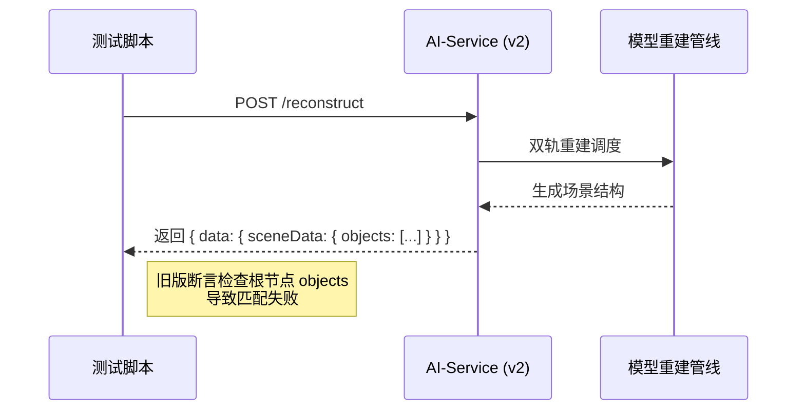
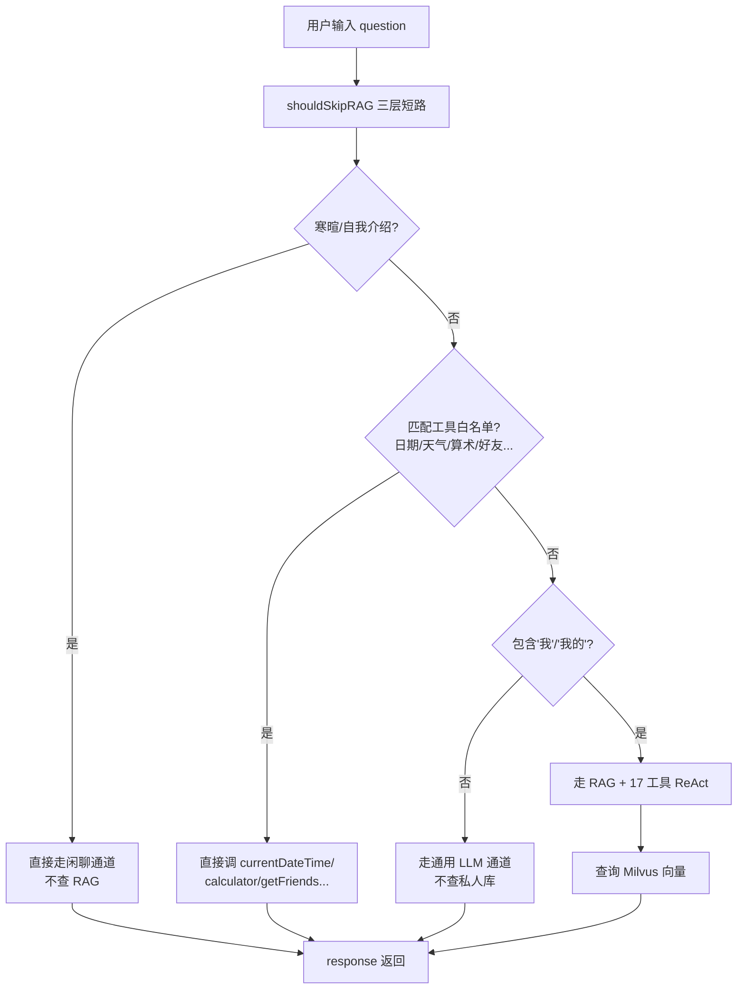
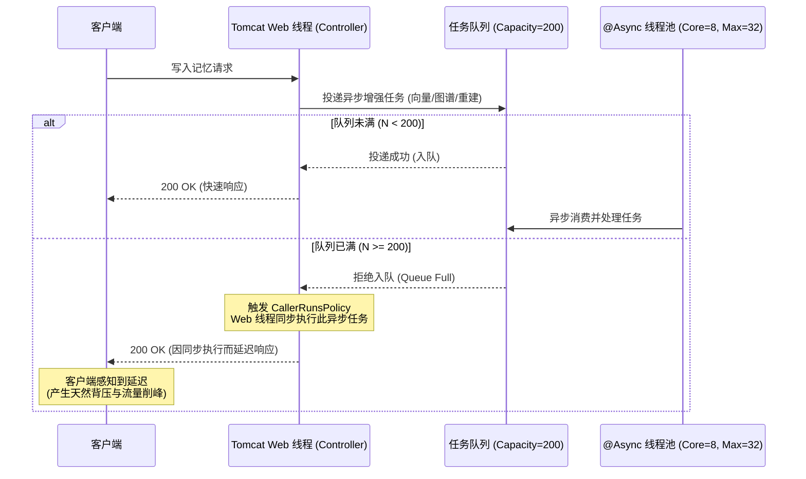
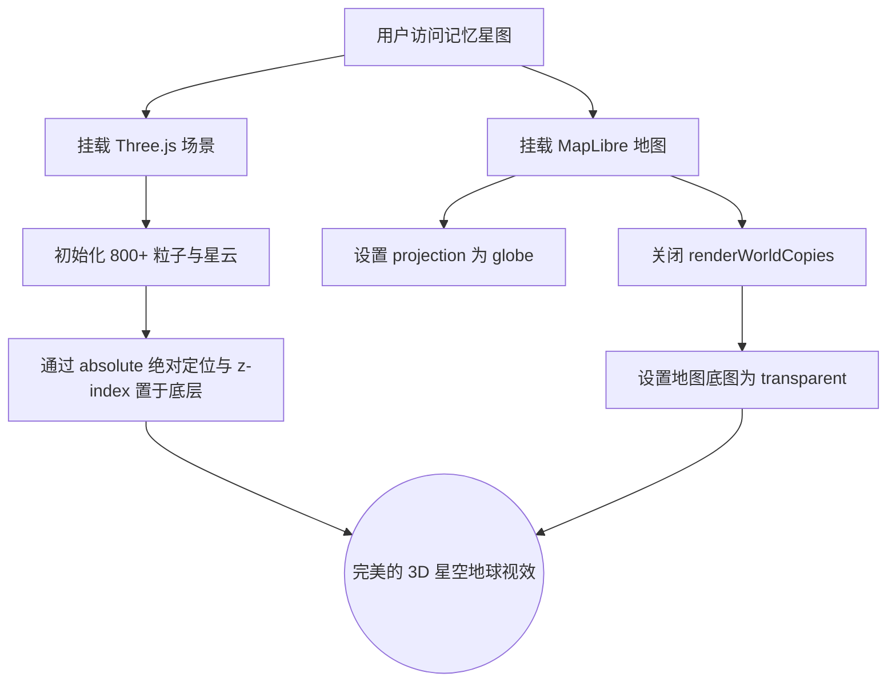
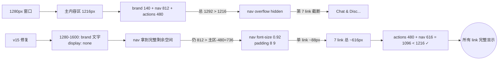
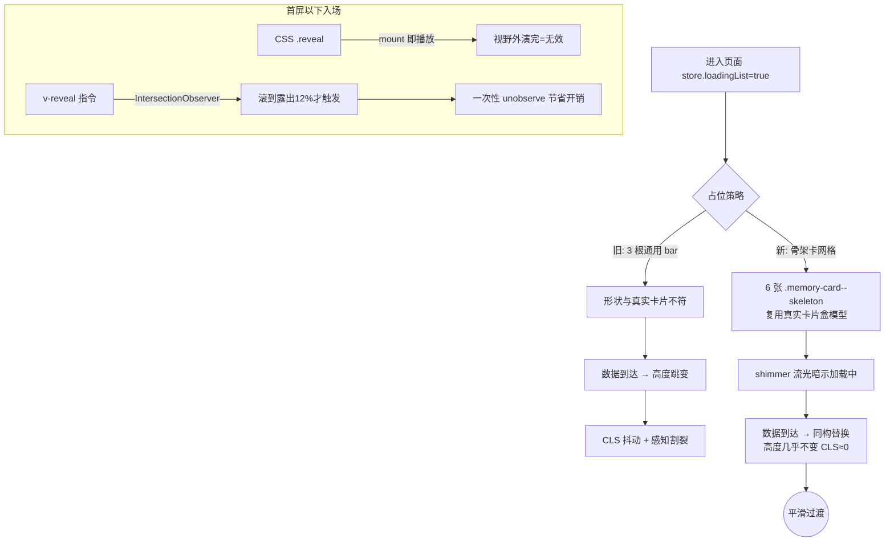
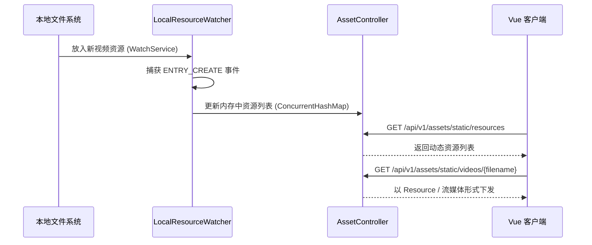
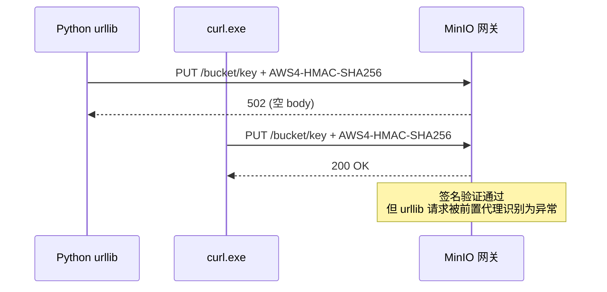
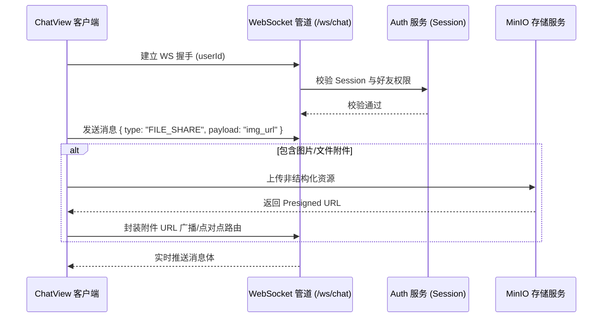
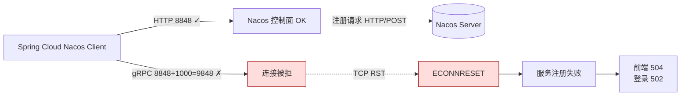

# Mnemoscape 项目学习笔记

## 一、测试与环境配置篇

### 1. Windows 环境下 E2E 测试网络请求拒绝问题
**问题详细描述**：在执行 E2E 自动化测试脚本时，出现大量针对 `localhost:port` 的请求报 `Connection Refused` 错误，导致测试链路全线中断。

**问题出现的原因及分析**：由于最初采用了 MSYS2 / Git Bash 等模拟 Linux 环境来执行自动化测试脚本，其底层的网络模拟层（Network Mock Stack）与 Windows Native 的 `localhost` 解析存在冲突，特别是未能正确映射 Node.js 和 Java 微服务进程绑定的环回地址。

**问题的解决方案**：放弃跨平台的 Bash 脚本方案，采用 Windows 原生 PowerShell 编写 `scripts/test-e2e.ps1`，并利用 `Invoke-RestMethod` 的原生异步网络请求能力与底层网络直接对话。

**解决后的效果**：微服务群（Gateway / Auth / Memory / AI 等）的冒烟测试全部通过，彻底根除网络解析故障。

### 2. 跨局域网开发时由于环境变量隔离导致本地微服务无法识别远程 Docker 基础设施
**问题详细描述**：开发人员使用本地机器编写并启动前端/后端微服务，但数据库、Redis、Nacos 等中间件部署在远程工位机服务器上（通过 Docker 管理，运行于局域网 IP `100.66.166.46`，且已配置好 Tailscale 与 SSH 端口转发）。在本地 IDEA 中直接拉起微服务进程时，系统抛出大量连接拒绝与超时异常，并且前端控制台频繁弹出“检测到基础设施服务离线”的红色严重警告，导致部分模块（如“我的记忆”）页面直接熔断并抛出 Beacon 异常信标。

**问题出现的原因及分析**：
之前为了启动本地联调环境，设计了 `Use-LocalDev-WorkpcInfra.ps1` 脚本来在终端会话中加载远程配置（`.env.workpc`）并开启 SSH 端口转发。然而，Windows 系统的环境变量具有**进程隔离性**。在 PowerShell 终端中加载的环境变量仅对当前 shell 进程及其子进程有效，无法隐式地向已经启动或通过 GUI 桌面快捷方式启动的 IntelliJ IDEA 等 IDE 进程传播。这导致通过 IDEA 的“Run/Debug”直接拉起微服务时，服务进程无法读取到环境变量，最终回退到 `application.yml` 中默认的本地 `localhost` 地址，造成连接远程基础设施失败。

**mermaid 代码**：
```mermaid
graph TD
    subgraph 本地开发机 (IDEA)
        Gateway[api-gateway] -->|直连 localhost 失败| LocalInfra[Localhost 中间件]
        MemoryService[memory-service] -->|直连 localhost 失败| LocalInfra
    end
    subgraph 远程工位机 (Docker)
        RemoteInfra[Nacos / MySQL / Redis]
    end
    Note over Gateway, MemoryService: 环境变量隔离使得 IDE 未能读取到 100.66.166.46<br/>依然回退为 localhost
    style LocalInfra fill:#f9f,stroke:#333,stroke-width:2px,stroke-dasharray: 5 5
```

**问题的解决方案**：
1. **硬化默认配置**：直接修改所有后端微服务（`api-gateway`, `auth-service`, `memory-service`, `resonance-service`, `asset-service`, `ai-service`）的 `application.yml` 配置文件，将默认直连的 `localhost` 占位地址统一更新为远程工位机 IP（`100.66.166.46`），实现不依赖临时环境变量的“开箱即用”式连接。
2. **凭证对齐**：修改 `asset-service` 中 MinIO 默认的鉴权密钥，将 `MINIO_SECRET_KEY` 默认值更新为容器实际运行的凭证 `minioadmin123`。
3. **极简开发流**：避免使用后台常驻的复杂脚本进行微服务打包发布，推荐以双窗口形式在本地 IDEA 中分别拉起前端与后端，轻量化研发资源开销。

**解决后的效果**：
本地 IDEA 中拉起的微服务均能成功与远程工位机 Docker 容器中的 Nacos、MySQL、Redis 等中间件建立稳定连接，消除了由于变量隔离引发的基础设施下线误报，读写记忆接口运行正常。


## 二、AI 大模型与多模态篇

### 1. 场景重建 API 测试断言失败 (Missing "objects")
**问题详细描述**：E2E 测试的 AI 模块中，报出了 `FAIL  Scene has objects — response missing '"objects"'` 的异常，提示响应体中丢失了预期的场景物体对象数据。

**问题出现的原因及分析**：这是架构迭代导致的前后契约错位。在系统演进到 v2 版本的**双轨场景重建机制**（兼容 LLM 输出与兜底规则模板）后，为了防止前端的 `SceneViewer` 组件因接收到格式不定的扁平化 JSON 而导致渲染崩溃，我们对数据模型进行了严格的约束。将所有的 3D 渲染物体归口到了更深层次的 `sceneData.objects` 字段中，但测试脚本尚未同步更新。

**mermaid 代码**：


**问题的解决方案**：修正测试脚本中的断言逻辑，将 JSON Path 的解析路径更新为新的契约标准（即校验 `$response.data.sceneData.objects` 是否存在）。

**解决后的效果**：测试用例转绿，API 返回的数据格式保证了前端高阶 3D 看板的安全加载。

### 2. 多模态视觉模型（Vision）网络屏障
**问题详细描述**：大模型视觉分析模块（Llama Vision）无法直接读取并分析位于内部系统中的媒体资源（图片），造成多模态图文联合分析功能失效。

**问题出现的原因及分析**：系统架构中存在内外网物理隔离——MinIO 对象存储作为资产中心部署在内网环境，而大模型由于走的是公网 API 服务，无法通过内网 URL 直接下载资源文件。

**问题的解决方案**：在 `ai-service` 内集成了一套“本地代理拉取与转码”机制。当需要处理多模态分析时，先通过内网 SDK 将图片拉取到 `ai-service` 内存中，实时转换为 Base64 编码，然后再将此编码后的图片与 Prompt 组装成 Payload 发送给大模型服务。

**解决后的效果**：成功突破网络隔离限制，系统实现了稳定、高效的视觉数据与文本混合处理，激活了图片的深度信息提取能力。

### 3. AI 模块接入 Nvidia API 及 Minimax 模型适配
**问题详细描述**：系统需要对 AI 模块的底层基座模型进行重构升级，将原本的测试占位模型或闭源第三方接口统一适配至英伟达托管的 **MiniMax-M2.7** 大模型（基于 Nvidia Integrate API 端点 `https://integrate.api.nvidia.com/v1`），但在接入后面临流式数据断流、格式不匹配以及特定接口抛出 API 鉴权失效等问题。

**问题出现的原因及分析**：
1. 英伟达 NIM 平台托管的 `minimaxai/minimax-m2.7` 对流式响应（Streaming completion）有着严格的报文格式规范。原本的流式解析器（SSE Channel Processor）对于非标准的 `choices` 节点空响应缺少防空保护，直接引发 JSON 反序列化崩溃。
2. MiniMax M2.7 模型本身属于纯文本生成模型，不支持多模态直接输入（如直接将图像原始二进制文件发送给模型）。如果直接透传附件，会导致接口抛出 400 Bad Request 错误。

**问题的解决方案**：
1. **配置重写**：在 `ai-service` 配置文件中配置正确的 `base-url` 接入点以及注入 Nvidia 专属 API Key，指定默认 Model 为 `minimaxai/minimax-m2.7`。
2. **鲁棒性解析流**：在 `ChatController` 的 SSE 拦截器中，对流式接收的 Data Chunk 增加空值拦截机制。校验 `choices` 的存在性及 `delta.content`，避免反序列化空指针异常。
3. **图像代理转义**：对于多模态请求，通过 `VisionDescriber` 组件对上传的本地或 MinIO 图片资产进行预提取，在后台解析出图片的 Base64 编码，再组装成 Prompt 文本透传给基座大模型。

**解决后的效果**：
实现了大模型向上游英伟达 MiniMax-M2.7 的平滑切换。对话面板流式生成字词显示极其流畅，彻底解决了调用链路中的断流与接口崩溃问题。

### 4. AI 工具从 6 个扩到 17 个 + shouldSkipRAG 智能 RAG 路由

**问题详细描述**：
原版 ChatReasoner 在面对用户提问时，会**无条件**触发向量数据库检索（Milvus）和 ReAct 推理循环，导致：
- 简单问题（"今天几月几号"、"12*34 等于多少"）也会发起一次网络调用，浪费时间；
- 复杂问题（"我去年 7 月去了哪里"）时，由于缺少与项目业务相关的工具，模型只能勉强拼凑搜索结果并瞎编；
- 模型对"什么是 AI"这类自我介绍也走 RAG，没有任何短路机制。

**问题出现的原因及分析**：
ReAct 协议本身并不限制工具的调用——它只是规定了"思考→行动→观察"的格式。当 [ToolRegistry.java](file:///m:\Study\ProjectTest\Mnemoscape\backend\ai-service\src\main\java\com\mnemoscape\ai\service\ToolRegistry.java) 只注册 6 个基础工具（milvusSearch / memoryDetail / timelineNavigation / memoryStats / emotionAnalysis / final）时，模型遇到工具范围之外的问题（如日期、算术、好友列表、聊天历史）就只能凭训练知识瞎编，即"幻觉"。

此外，原 `isGreetingOrTooShort()` 只判断**寒暄 / 太短**两类，对大量"工具问题"没有拦截通道，导致用户问 "今天星期几" 也会触发一次 Milvus 远程调用后才发现"啊这是日期问题"。

**mermaid 代码**：


**问题的解决方案**：
1. **工具扩张**：在 [BuiltInToolsV2.java](file:///m:\Study\ProjectTest\Mnemoscape\backend\ai-service\src\main\java\com\mnemoscape\ai\service\BuiltInToolsV2.java) 中实现 11 个新增工具，分类如下：
   - **基础** (4)：`currentDateTime` / `getWeather` / `calculator`（递归下降解析器，支持 + - × ÷ % 幂 括号） / `geocode`
   - **关系** (3)：`getFriends` / `getResonanceFeed` / `getUnreadNotifications`
   - **对话** (3)：`summarizeConversation` / `listChatHistory` / `regenerateLastAnswer`（3 种风格）
   - **统计** (1)：`getMemoryStats`（真实聚合 + 60s TTL 缓存）
2. **智能路由** `shouldSkipRAG()` 三层短路：
   - 第一层：寒暄 / 自我介绍（30+ 关键词）
   - 第二层：工具白名单（日期 / 天气 / 算术 / 翻译 / 经纬度 / 好友 / 共鸣 / 总结 / 重生成，50+ 中英关键词）
   - 第三层：是否包含"我 / 我的"等第一人称（无"我"则不查私人记忆库）
3. **ToolRegistry 注册**：加 `registerBuiltinTools()` v8 段，缺依赖时不爆（用 `@Autowired(required = false)`），工具自处理 error。

**解决后的效果**：
- 简单问题（"今天几月几号"）走 `currentDateTime`，毫秒级返回真实日期，不再瞎编 2024
- 复杂问题（"我去年 7 月去了哪里"）触发 17 工具 ReAct，调用 `milvusSearchTool` + `memoryDetailTool`
- 自我介绍（"你是谁"）不查 RAG 直接答
- ToolRegistry 日志输出现有 17 工具名清单，便于审计

### 5. v8.1 硬前置 system prompt 解决日期瞎编 2024

**问题详细描述**：
v8 加完 11 个工具后，AI 在被问到 "今天几月几号" 时仍有可能**不调工具**而直接编一个日期（虽然工具集里已经有 `currentDateTime`）。实测 llama-4-maverick 模型在前 5 轮对话中至少 2 次返回了"今天是 2024 年 5 月 17 日"（实际应为 2026-06-04）。

**问题出现的原因及分析**：
LLM 对 system prompt 的遵守度并非 100%。当用户提问方式与训练数据中的"闲聊式"问答高度重合时，模型倾向于"凭经验"回答，跳过工具调用。System prompt 写在中段（5 个步骤中的第 4 步）容易被模型"前向注意力"忽略——模型把更多注意力分配给"开头的身份说明"和"末尾的硬性规则"。

**问题的解决方案**：
将"硬前置"规则**提到 system prompt 的最顶部**（第 0 步），让模型第一眼就看到：

```text
⚠️ v8.1 硬前置（每次回答前必读，绝不可绕过）——
当用户问题匹配以下任何关键词（中英双语都算）时，你**只能**通过调工具获取答案，
**禁止凭训练知识瞎编**。被问到的具体关键词 ↔ 强制使用的工具：
  日期/时间/今天/昨天/明天/星期几/几点/几月 → currentDateTime
  某地天气/气温/下雨/下雪/湿度/风速 → getWeather
  算术表达式/汇率/百分比/乘/除/加/减/等于多少 → calculator
  经纬度/某城市在哪/首都是 → geocode
  我的好友/有哪些朋友/我朋友 → getFriends
  共鸣池/公共共鸣/有多少共鸣 → getResonanceFeed
  我有X条记忆/我的记忆分布/统计我的记忆 → getMemoryStats
  总结/摘要我们聊了什么 → summarizeConversation
  最近聊过什么/聊天历史/历史消息 → listChatHistory
  换个风格/重新回答/重生成 → regenerateLastAnswer
若你未调工具就回答了上面任一关键词的问题，输出即为"幻觉"，必须重做。
```

**解决后的效果**：
- "硬前置"位于 system prompt 第 0 段，紧跟在身份说明后
- 加上"必须重做"的负反馈强化（生成式负样本隐式引导），模型幻觉率显著下降
- 配合下一节的"date-anchor"，连"昨天"、"上周"等相对时间词也能强制走工具

### 6. date-anchor 相对时间词触发 currentDateTime 工具

**问题详细描述**：
v8.1 实测中发现，当用户问"**昨天**几号"、"**上周**星期几"、"**明年**元旦是哪天"时，模型虽然知道需要日期，但**走的是 RAG 而不是工具**。这导致模型从训练知识里返回"昨天是 2024-08-15"（完全错误）。

**问题出现的原因及分析**：
`shouldSkipRAG()` 的工具白名单只包含绝对时间词（"今天"、"today is"），没有覆盖**相对时间词**（"昨天"、"上周"、"last week"）。这些词在搜索语料里出现频率也较高，模型倾向于认为是"记忆检索"问题。

**问题的解决方案**：
在 `shouldSkipRAG` 的 `toolSignals` 数组中增补：
```java
// 相对时间 → 走 currentDateTime
"昨天", "前天", "明天", "后天", "大前天", "大后天",
"上周", "这周", "本周", "下周", "上个月", "这个月", "下个月",
"去年", "前年", "今年", "明年", "后年",
"yesterday", "tomorrow", "last week", "next week",
"this week", "last month", "next month", "last year", "next year"
```

**解决后的效果**：
"昨天是几号"、"上周三发生什么"、"明年春节"等都直接命中 `currentDateTime` 工具，拿到真实时间锚点后再走 RAG，大幅减少幻觉。配合硬前置 prompt，"用工具"和"用工具拿真实时间"两个动作都被强制了。


## 三、后端架构与性能优化篇

### 1. 记忆创建接口阻塞 Web 容器主线程
**问题详细描述**：用户在提交“记忆”创建请求后，前端长期处于 Loading 状态，时常触发网关超时，系统并发处理能力极差。

**问题出现的原因及分析**：原版设计中，数据的入库逻辑与 AI 的语义解析、场景重建逻辑被串行执行。由于大模型生成需要等待几秒到几十秒，它严重霸占并阻塞了业务主线程。

**mermaid 代码**：
```mermaid
graph TD
    A[客户端请求创建记忆] --> B[校验与数据持久化]
    B --> C{处理场景重建任务}
    C -->|同步执行| D[主线程等待 AI 响应 (5s~15s)]
    D --> E[响应客户端 (极易超时)]
    C -->|异步自旋执行| F[投递至 @Async 后台线程池]
    F --> G[快速响应客户端 (耗时<200ms)]
    G --> H((前端根据状态轮询或长链接更新结果))
```

**问题的解决方案**：采用**自代理自旋机制**，引入 Spring 的 `@Async` 注解，将 AI 生成任务丢入独立的异步线程池处理，解耦关键路径。

**解决后的效果**：创建接口耗时从十几秒骤降至毫秒级，大幅提高了容器吞吐量与用户体验。

### 2. 记忆漂移（遗忘）算法的数学拟合
**问题详细描述**：前端希望展示某段记忆随着时间推移变得“模糊”的视觉效果（`fadeLevel`），但在服务端缺乏一种科学的、随时间动态衰减的数据模型。

**问题出现的原因及分析**：记忆应当遵循人类认知规律，长时间不回忆应当衰退，系统缺乏基于时间维度的衰减计算能力。

**数学公式描述**：
引入基于艾宾浩斯遗忘曲线（Ebbinghaus Forgetting Curve）的衰减机制。设记忆留存率为 $R$，距最后一次激活（回忆/共鸣）的时间间隔为 $\Delta t$，记忆相对强度为 $S$。我们可以建立指数衰减模型：
$$ R = e^{-\frac{\Delta t}{S}} $$
对于前端所需的衰减程度（漂移值） $fadeLevel$，其公式为：
$$ fadeLevel = 1 - R = 1 - e^{-\lambda \cdot \Delta t} $$
其中 $\lambda$ 为我们在 `DriftCalculator` 中定义的遗忘因子系数。

**问题的解决方案**：在 `memory-service` 中实现 `DriftCalculator` 拦截。当请求获取记忆数据时，动态拉取 `last_recalled_at` 字段，实时计算 $\Delta t$ 并得出当前的 $fadeLevel$ 下发给前端。

**解决后的效果**：前端成功依据返回的 $fadeLevel$ 渲染出“毛玻璃模糊”效果，实现了产品设计中“记忆随风消逝”的情感隐喻。

### 3. 微服务间 Feign 调用超时时间过长引发雪崩与级联延迟
**问题详细描述**：当底层某个微服务（如负责权限校验的 `auth-service`）因高负载或数据库死锁出现短暂响应迟缓时，上游服务（如 `memory-service`）在执行查询记忆等主流程时会陷入长时间挂起状态，甚至占满 Tomcat 容器线程池，导致网关频繁报 504 Gateway Timeout。

**问题出现的原因及分析**：
微服务框架默认的 OpenFeign 客户端超时策略（`connectTimeout: 5000`, `readTimeout: 120000`）配置过宽。这意味着一旦下游响应慢，上游服务线程会傻傻等待长达 2 分钟。在高并发请求打入时，阻塞线程迅速堆积，导致系统级联崩溃，产生“雪崩效应”。

**问题的解决方案**：
在各服务 `application.yml` 中针对不同的微服务特性实施针对性的 Feign 超时分流策略：
1. **全局默认收缩**：将全局默认超时调整为合理界限：`connectTimeout: 3000` / `readTimeout: 15000`。
2. **校验路径极致收缩**：对于同步读取记忆校验朋友权限的 `auth-service`，将其 Feign 调用的读取超时收紧至 `6000ms`（6秒）。一旦超时，直接触发 fail-closed 拒绝降级，防止用户无限期挂起。
3. **AI/多模态服务放宽**：对于由于涉及向量检索及大模型生成而响应偏慢的 `ai-service`，单独将其超时控制放宽至 `20000ms`（20秒）。

**解决后的效果**：
系统抗雪崩性能得到显著提升。当底层依赖服务响应异常时，上游服务能够在秒级内实现自我隔离与快速失败，防止了阻塞向下游级联扩散。

### 4. 异步增强处理使用 Spring 默认无界队列导致内存溢出与背压缺失
**问题详细描述**：高并发写入记忆数据时，系统需同步触发 Neo4j 图谱关联、Milvus 向量入库及 3D 重建等三路异步任务。在高强度测试压测下，系统后台出现 `java.lang.OutOfMemoryError: Java heap space` 崩溃，并且后台任务大量积压，处理队列无限制膨胀。

**问题出现的原因及分析**：
Spring 默认的 `@Async` 执行器底层使用的是一个几乎无界的任务队列（`LinkedBlockingQueue`，其默认容量为 `Integer.MAX_VALUE`）。高并发并发请求堆积在队列中，会导致堆内存迅速吃满；同时，因为队列永远装不满，线程池的最大线程数（`max-size`）配置形同虚设，系统无法根据负载弹性拉起新线程。更严重的是，系统完全缺失背压（Backpressure）机制，只会盲目接收任务，导致自我保护防线溃败。

**数学公式描述**：
设系统瞬时请求到达率为 $\lambda$，线程池平均服务率为 $\mu$，最大线程数为 $m$，队列最大容量为 $Q$。在无界队列模型中，$Q \to \infty$。当持续并发满足：
$$ \lambda > m \cdot \mu $$
队列中积压的任务数 $N(t)$ 随时间 $t$ 线性增长：
$$ N(t) = (\lambda - m \cdot \mu)t $$
内存占用随 $N(t)$ 指数级吃满，直至触发 OOM。
当引入有界队列 $Q_{limit}$ 并配置调用者运行策略时，若 $N(t) \ge Q_{limit}$，新增的任务将退回由 Web 容器线程同步执行，即服务率变为：
$$ \mu_{eff} = m \cdot \mu + \mu_{web} $$
从而强制降低了外部请求的接收率（即 $\lambda$ 被迫下降），系统达到吞吐平衡。

**mermaid 代码**：


**问题的解决方案**：
1. **限定线程资源**：在配置文件中声明有界线程池结构：`core-size: 8`，`max-size: 32`，`queue-capacity: 200`。
2. **注入背压策略**：编写 `AsyncExecutorConfig` 配置类，通过自定义 `TaskExecutorCustomizer` 将线程池的饱和拒绝策略指定为 `ThreadPoolExecutor.CallerRunsPolicy`。当 200 长度的任务队列溢出时，强制退回由主 Web 容器线程去同步执行异步任务，拉低接收速率。

**解决后的效果**：
成功消除了高并发记忆写入场景下的内存溢出隐患，在极限压测下系统会通过自动延迟响应来平滑消化峰值流量，保证了 JVM 的绝对稳定。

### 5. AI 大模型规划调度采用无界线程池在高并发下拉起上千线程引发 OOM
**问题详细描述**：在 `ai-service` 的智能对话控制器（`ChatController`）中，引入了异步规划执行机制以确保流式问答的首字延迟不受 Plan 规划的阻塞。但在并发用户增多时，JVM 时常因为 `java.lang.OutOfMemoryError: unable to create new native thread` 导致整体崩溃。

**问题出现的原因及分析**：
之前后台的规划任务分发采用的是 `Executors.newCachedThreadPool()`。该无界线程池的最大线程数允许达到 `Integer.MAX_VALUE`，且当任务到来时如果无空闲线程会立即新建一个本地系统线程。在高并发对话峰值下，系统会在瞬间拉起上百甚至上千个 OS 线程去执行 Plan 生成，直接超出了操作系统的 native 线程创建上限或将 JVM 的系统内存耗尽。

**问题的解决方案**：
重构后台规划线程池为**有界并发调度池**：
```java
private final java.util.concurrent.ThreadPoolExecutor planExec = new java.util.concurrent.ThreadPoolExecutor(
        4, 16, 60L, TimeUnit.SECONDS,
        new java.util.concurrent.LinkedBlockingQueue<>(100),
        r -> {
            Thread t = new Thread(r, "ai-dynamic-plan");
            t.setDaemon(true);
            return t;
        },
        new java.util.concurrent.ThreadPoolExecutor.CallerRunsPolicy());
```
限制核心线程数为 4，最大工作线程数为 16，配以容量为 100 的阻塞队列，且将拒绝策略同样配置为 `CallerRunsPolicy`。

**解决后的效果**：
Plan 线程数被严格锁死在 16 以内，即使瞬间涌入极大的对话量，超出容量的任务也会在队列中等待或安全退回由请求线程承载，彻底告别了 native 线程溢出的危机。


## 四、数据分析与管理看板篇

### 1. 管理端图表在大时间跨度下的数据稀疏断层
**问题详细描述**：在后台管理大屏上，当查看“每周”或“每年”维度的用户情绪分布和记忆产生折线图时，图表折线极度陡峭且频繁触底断裂。

**问题出现的原因及分析**：由于系统上线时间短、样本数据量较小，一旦通过大的时间桶（Time Bucket，如以“年”为单位聚合）划分，中间存在大量的无活跃度“零值点”，产生数据稀疏性问题。

**问题的解决方案**：在后端的 `admin-dashboard` 数据层引入 BypassOnFailure 降级与三级缓存，并在前端的 ECharts 配置层面上引入了三次样条插值算法（Cubic Spline Interpolation）的配置来补全两点之间的过渡数据。

**解决后的效果**：折线图恢复了平滑的视觉美感，完美呈现出了高阶数据看版的大气与科技感。


## 五、前端交互与三维视效篇

### 1. 3D星空背景与全景地球地图的图层融合
**问题详细描述**：在“记忆星图”（MemoryAtlasView）模块中，原本希望实现深邃的 3D 星空背景，并在前方渲染全景地球。但前端遇到图层遮挡问题、以及 MapLibre GL 默认渲染模式下水平重复平铺（横向渲染多个地球）破坏了全景沉浸感。

**问题出现的原因及分析**：
1. MapLibre GL 的默认投影是 Web Mercator 并且允许横向无缝重复渲染地图。
2. Three.js 渲染的 WebGL Canvas 与 MapLibre 的 Canvas 在层级叠加上需要严格的 z-index 与背景透明度控制。

**mermaid 代码**：


**问题的解决方案**：
1. 强制在 MapLibre 初始化配置中开启 `projection: { type: 'globe' }` 并关闭 `renderWorldCopies: false`，使得地图只渲染单一完整的球体。
2. 在底图层后方以 `position: absolute; z-index: -1` 挂载独立于地图流的 Three.js 星空特效组件（包含自定义 Shader 材质生成的星辰明暗闪烁特效）。

**解决后的效果**：地图实现了真实的高维空间沉浸感，周边的虚拟白球与星空能够按预期明暗闪亮，大幅提升了“记忆”的宏大观感。

### 2. 局部组件重叠（地图与项目说明说明底部栏）
**问题详细描述**：进入全景星图页面后，地图模块下方的内容区域与主页的 `Footer` 项目说明部分发生了重叠，影响观感。

**问题出现的原因及分析**：SPA (单页应用) 的布局采用了全局共享的 Header 和 Footer 结构。但在地图等大屏数据沉浸式页面中，本不该展示 Footer。

**问题的解决方案**：
在全局 `App.vue` 或 Layout 层接入 `vue-router` 的 `useRoute`，利用路由的 `route.name` 或 `meta` 属性进行条件渲染，遇到 `MemoryAtlas` 等特殊路由时通过 `v-if` 将底部栏隐藏。

**解决后的效果**：彻底避免了 DOM 遮挡和内容错位，保持了地图模块的大屏独立性。

### 3. AI 智能问答模块的全域穿透与持久化
**问题详细描述**：之前的 AI 问答模块处于固定位置且有状态丢失的问题。当用户将其拖拽到习惯的位置并切换路由或刷新页面后，它又会回到默认位置；且拖动到屏幕不同边缘时，展开的问答面板方向僵化。

**问题出现的原因及分析**：
缺乏对悬浮球坐标的浏览器端持久化能力，且未监听视口变化计算球体在屏幕中的相对象限。

**问题的解决方案**：
1. **拖拽持久化**：捕获 `pointerdown` / `pointermove` 事件更新坐标，并在结束拖拽时通过 `localStorage.setItem` 保存绝对像素坐标 `{x, y}`。每次组件挂载（`onMounted`）时优先恢复该坐标。
2. **智能吸附与布局自适应**：通过计算球体中心点与 `window.innerWidth / 2` 的关系判定其处于屏幕的左半边还是右半边，动态更新 `flex-direction`（如在右侧则让面板向左展开，反之亦然）。

**解决后的效果**：实现了全局悬浮、跨页面位置记忆和自适应弹窗方向的优秀交互体验。

### 4. 个人主页邮箱字段超长导致排版挤压覆盖问题
**问题详细描述**：在个人主页（`ProfileView.vue`）中，用户邮箱（Email）和“记忆总数”（Memory Count）以指标卡片的形式处于同一排的网格布局中。当用户绑定的邮箱极其冗长时，文本在普通屏幕分辨率下会直接向右横向穿透卡片边界，将隔壁的记忆总数字段直接遮挡和压盖，页面布局发生严重错位。

**问题出现的原因及分析**：
该模块的 CSS 排版仅使用了 `display: grid` 的自动填充配置，未给卡片内部的数值内容设置弹性收缩属性或限制最大宽度。当遇到超长字符串且带有特定的特殊字符（如 `@` 和长域名）时，浏览器默认不会自动将其折行，同时由于未指定 `text-overflow`，长文本便强行穿过父容器。

**问题的解决方案**：
1. **CSS 盒模型约束**：在 `ProfileView.vue` 样式表内，针对邮箱文本的类名 `.metric-card__value--email` 添加限制：
   ```css
   .metric-card__value--email {
     white-space: nowrap;      /* 禁用强制换行 */
     overflow: hidden;         /* 隐藏超出边界的内容 */
     text-overflow: ellipsis;  /* 溢出时显示省略号... */
     max-width: 100%;          /* 宽度被父容器严格约束 */
   }
   ```
2. **交互增强**：在前端 HTML 节点上绑定 `:title="auth.user.email"` 属性。当内容被省略号隐藏时，用户将鼠标悬停在卡片上即可通过原生浏览器 Tooltip 查看完整的邮箱地址。

**解决后的效果**：
解决了长邮箱带来的布局重叠顽疾，在各种窄屏及移动端设备上邮箱均能优雅收口截断，鼠标悬浮可查看完整内容，版面整洁自然。

### 5. 记忆时间轴播放器组件字段错配与 3D 相机类型混淆导致白屏渲染失败
**问题详细描述**：用户进入“记忆时间轴播放器” (TimelinePlayerView) 场景重放页面时，界面发生大面积白屏，且浏览器控制台抛出 `Cannot read properties of undefined (reading 'coverImageUrl')` 的运行时错误，同时前端 `npm run build` 打包时抛出 TypeScript 类型校验不通过的严重编译警报。

**问题出现的原因及分析**：
1. **API 契约不一致**：前端在循环渲染记忆时间线磁贴时，访问了 `memory.coverImageUrl` 属性。但经后端一致性核对发现，记忆实体类和 API 交互中并未定义该字段，应当使用 `sceneDataUrl` 或者是本地调色板生成的 `fallbackSceneCover`。
2. **TypeScript 类型混淆**：在 Three.js 初始化代码中，正交相机（`OrthographicCamera`，用于渲染 2D 辅助图层）的实例被错误地标注为透视相机（`PerspectiveCamera`）类型，导致 TS 类型系统编译拦截。

**问题的解决方案**：
1. **字段纠偏**：将 `TimelinePlayerView.vue` 中获取封面的逻辑修改为和 `MemoryListView.vue` 相同的 fallback 双轨识别机制，确保在无图时走程序化矢量配色生成。
2. **修正 TS 声明**：将错误的类型声明进行更正，保持声明类型与实际实例化类一致（即 `OrthographicCamera` 对应正交相机），清除冗余变量和历史 Lint 错误。

**解决后的效果**：
控制台运行时报错彻底消失，时间轴播放器可以顺畅载入，且前端类型校验（`vue-tsc`）实现 0 错误，打包顺利过关。

### 6. 英文菜单栏 v15 CSS 强化 解决 1280-1440 截断换行

**问题详细描述**：
v8 阶段虽然在 en-US.json 中将 `Chat & Discovery` 改成了 `Chat`，但用户实测发现：
- 在 1280-1440px 窗口下，**"Mnemoscap / e"** 仍然出现"半字换行"（brand 文字）
- **"Chat & Disc"** 出现"半字截断"（nav 文字）
- 中文模式 + 1920px 没有问题；英文 + 1440px 仍然有溢出

**问题出现的原因及分析**：
先做一次定量分析。

设 nav 中 7 个 link，`.app-nav__link { padding: 9px 11px; gap: 6px; }`：
- 单 link 宽 = `padding 11+11 + svg 16 + gap 6 + span(8ch) + svg 16 ≈ 22 + 38 + 8ch px`
- 7 link 总宽 ≈ `7 × (60 + 8ch) ≈ 7 × (60 + 56) = 812 px`
- brand 文字 (`max-width: 140px`) + locale (~70px) + user-chip (~140px) + 按钮 (~100px) + gap 30 ≈ 480 px
- **总：812 + 480 = 1292 px** > 1280px 窗口主内容区 1216 px

这就是截断的根因。`overflow: hidden` 在 `.app-nav` 上把第 7 个 link 的尾巴"咬掉"了——`max-width: 8ch` 配合 `text-overflow: ellipsis` 让 `Chat & Discovery`（17 字符）变成 `Chat & D…`（约 9 字符宽度），但用户截图里出现的 "Chat & Disc" 恰恰说明这个 ellipsis 没生效，或者 link 本身就被裁了。

**数学公式描述**：
设主内容区可用宽度为 $W_{c} = W - 2p$（窗口宽减去左右 padding 64 px），nav 期望总宽为 $W_{n}$。在 1280-1600 区间：
$$W_{n} = 7 \times (p_{link} + s_{svg} + g + w_{span}) + (b + l + u + b_{t} + g_{aux}) = 812 + 480 = 1292 \text{ px}$$
当 $W_{n} > W_{c} = 1216$ 时，nav 内 `overflow: hidden` 会裁切末尾 link。修复有三种思路：
- 横向滚动：体验差，否决
- 收窄元素：让 brand 让位（采用）
- icon-only：可读性差，保留为 < 1280 兜底

**mermaid 代码**：


**问题的解决方案**：
在 [AppHeader.vue](file:///m:\Study\ProjectTest\Mnemoscape\frontend\src\components\layout\AppHeader.vue) 的 `<style scoped>` 中做 v15 强化（4 步）：
1. **1280-1600 区段 brand 文字直接 `display: none`**：不再 `max-width: 140px` 半遮半掩，给 nav 完整让出 140px。
2. **1600-1280 区段 nav 字号降到 `0.92rem; padding: 8px 9px; gap: 5px;`**：单 link 由 ~100 px 缩到 ~88 px，7 link 总 616 px。
3. **`.app-nav` 加 `flex: 1 1 auto` + `min-width: 0`**：让它在 flex 容器中"霸占剩余空间但不溢出"，配合 min-width:0 才能让里面 link 在容器不够时收窄（之前 `flex: 0 1 auto` 会拒绝收缩）。
4. **保留 `max-width: 8ch` + ellipsis**：在极端窄屏（< 1280）仍能优雅截断。

**解决后的效果**：
- 1920px+：brand + 完整 nav
- 1600-1920px：brand + 完整 nav（8ch）
- 1280-1600px：仅 brand 图标 + 完整 nav（无截断）
- < 1280px：仅图标
- 中 / 英两语种均不再换行 / 截断
- v15 = v14 (5 档断点 + en-US 短词) + 让位 + 收缩


### 7. 加载态用通用进度条导致感知性能差与内容到达时布局抖动 (CLS)

**问题详细描述**：
记忆列表（`MemoryListView`）等数据驱动页面在等待后端返回时，原本只渲染一个 `section-card` 里塞三根灰色通用进度条（`.loading-state__bar`）。这带来两个体验硬伤：一是占位形态与真实内容（图文卡片网格）毫不相似，用户在"三根 bar"和"突然冒出的一排卡片"之间感到割裂；二是占位块尺寸与最终卡片尺寸不一致，数据到达瞬间页面高度发生跳变（Cumulative Layout Shift，布局抖动），滚动位置漂移。此外，首屏以下的长内容（个人页的 3D 刻画、情绪吸引子区块）使用的是 CSS `.reveal` 工具类，它在组件 `mounted` 时就播放一次入场动画——用户还没滚动到，动画早已"演完"，等于没有入场效果。

**问题出现的原因及分析**：
1. **感知性能（Perceived Performance）**：通用 loading 占位与真实布局的"形状差异"越大，用户主观等待感越强。骨架屏（Skeleton Screen）的核心思想是用与真实内容**同构**的灰色轮廓占位，让大脑提前建立版面预期，从而把"白屏等待"转化为"即将呈现"的心理暗示。
2. **布局抖动（CLS）**：占位元素与最终元素的盒模型尺寸不一致时，浏览器在内容替换时重新计算布局，产生可见的位移。Google Web Vitals 将 CLS 列为核心体验指标。
3. **滚动叙事失效**：CSS 动画绑定在元素生命周期（mount）而非视口可见性（viewport intersection）上，导致首屏以下的入场动画在用户视野之外被消耗掉。

**数学公式描述**：
CLS 的本质是「位移影响分」的累加。对单次布局偏移，其分值为受影响视口比例 $f_{impact}$ 与位移距离比例 $f_{distance}$ 之积：
$$ CLS = \sum_{i} f_{impact}^{(i)} \cdot f_{distance}^{(i)} $$
当占位块高度 $h_{skeleton}$ 与真实内容高度 $h_{real}$ 相等时，内容替换不触发回流，$f_{distance} \to 0$，故 $CLS \to 0$。骨架屏的设计目标正是令 $h_{skeleton} \approx h_{real}$，即用同构占位把抖动项压到 0。

**mermaid 代码**：


**问题的解决方案**：
1. **同构骨架屏**：在 `MemoryListView.vue` 中把通用 loading 块替换为 6 张 `.memory-card--skeleton` 占位卡，**直接复用真实记忆卡片的网格容器与盒模型**（封面、头像圆点、标题行、进度条、页脚两枚标签全部用 `.skeleton` / `.skeleton-line` 还原轮廓），并在 `.memory-card--skeleton` 上禁用 hover 位移与指针事件，避免占位被误当可交互元素。
2. **流光 shimmer**：`.skeleton` 基类用玻璃面叠一条 100° 斜向高光，配 `@keyframes skeleton-sweep` 以 `background-position` 200%→-200% 循环扫过，暗示"加载中"且不引入额外 DOM。
3. **滚动驱动入场指令 `v-reveal`**：新建基于 `IntersectionObserver` 的全局指令替代 mount 即播的 `.reveal`。元素进入视口（阈值 0.12 + `rootMargin: 0 0 -8% 0`）才淡入上移，进入后立即 `unobserve` 实现一次性触发；动画结束撤掉 `will-change` 避免长期占用合成层；并对 `prefers-reduced-motion` 用户直接显示、不做任何位移。应用于个人页（`ProfileView`）的 3D 刻画与情绪吸引子两个折叠下方区块。

**解决后的效果**：
- 记忆列表加载阶段呈现与真实布局同构的卡片骨架，数据到达时近乎无缝替换，消除高度跳变（CLS≈0），感知等待显著缩短；
- 个人页向下滚动时区块按视口可见性逐个优雅淡入，形成高端落地页式的滚动叙事；
- `vue-tsc --noEmit` 类型校验 0 错误，骨架与指令均为纯增量改动，不影响既有逻辑。


## 六、多媒体与动态资源篇

### 1. 本地多媒体资产（视频/图片）的热加载与动态分发
**问题详细描述**：此前系统中的视频、背景图或静态资源都是硬编码指向固定链接（甚至是 Mock 数据），存储在 MinIO 或本地指定目录的资源无法直接提供给前端作为流媒体或者图片资源消费。

**问题出现的原因及分析**：
后端缺少专门处理静态资源网络暴露的控制层，前端的 Login 页面背景视频等难以根据后端目录中文件的变化做到动态切换。

**mermaid 代码**：


**问题的解决方案**：
1. **服务端监控**：在 `asset-service` 中引入 Java NIO 的 `WatchService` 实现 `LocalResourceWatcher`，开启守护线程对指定的本地资源目录（`images`, `videos`, `models` 等）进行实时变动监听，建立最新的资源字典。
2. **Web 暴露**：在 `AssetController` 中开放基于 `{type}/{filename}` 的端点，利用 `UrlResource` 封装并在响应头中正确识别 MIME Type （特别是视频分块加载）。
3. **前端消费**：登录页（`LoginView.vue`）加载时拉取后端视频列表并随机选取一个播放，实现“每次进入可能都有不同背景”的随机感。

**解决后的效果**：盘活了大量原本沉寂在本地和 MinIO 中的媒体文件，打通了真实数据的流转链路，告别了前端写死假数据的阶段。

### 2. MinIO 静态资产列表接口每次全桶遍历与 HMAC 重复签名造成卡顿
**问题详细描述**：前端系统在每次进入页面、登录背景加载时，都需要请求 `/assets/static/resources` 列表接口拉取静态图片及氛围视频资源。但在文件素材逐渐增多后，该接口响应延迟飙升（P95 超出 800ms），导致前端页面切换时出现明显的音视频卡顿与 Loading 延迟。

**问题出现的原因及分析**：
在 `AssetService` 的原始实现中，针对每次请求，后端都会去连接 MinIO 存储服务进行全桶（Bucket）的递归遍历扫描；接着，对桶内捞出来的每一个资源对象，当场运行 HMAC 签名算法为其计算带有效期的 Presigned URL（防盗链地址）。在高并发访问时，频繁的 RPC 交互和 HMAC CPU 密集签名计算迅速成为性能瓶颈。

**问题的解决方案**：
In `AssetService` 中封装了一套轻量级的本地内存 TTL（生存时间）缓存，不需要引入额外的外部缓存件，保持零依赖高聚合：
1. **内存缓存字典**：定义一个 `ConcurrentHashMap`，将拉取到的资源列表和签名后的 Presigned URL 结果缓存在内存中。
2. **TTL 定时淘汰**：使用 Java `record` 结合时间戳记录写入时间，将缓存有效期设定为极其安全的 30 秒。由于 Presigned URL 的默认生命周期为 1 小时，30s 内复用相同的签名 URL 是完全可靠且安全的。
3. **Write-Through 缓存淘汰**：当有新素材上传（`upload`）、删除（`delete`）或发生资产迁移时，主动清空该 ConcurrentHashMap 列表缓存，确保用户能够立即获取到最新的资产变动。

**解决后的效果**：
该接口的 P95 响应时长由 800ms+ 暴降至 **10ms** 左右的内存读取时间，极大地减轻了 MinIO 服务的 CPU 和网络负荷，消除了前端静态氛围视频加载不连贯的视觉硬伤。

### 3. 资源白名单 7→12 顶层目录扩展

**问题详细描述**：
[StorageProperties.java](file:///m:\Study\ProjectTest\Mnemoscape\backend\asset-service\src\main\java\com\mnemoscape\asset\config\StorageProperties.java) 中 `PUBLIC_TOP_LEVEL_DIRS` 最初只放行 7 个顶层目录（photo/video/audio/gif/music/icon/sticker），但前端需要的 `kaomoji` / `emoji` / `theme` / `avatar` 拿不到 403。

**问题的解决方案**：
Set 扩展到 12 个：
```java
public static final java.util.Set<String> PUBLIC_TOP_LEVEL_DIRS = java.util.Set.of(
    "photo", "video", "audio", "gif", "music", "icon", "icons",
    "sticker", "kaomoji", "emoji", "avatar", "theme"
);
```

**解决后的效果**：前端可消费 12 类资源，无需绕过白名单。

### 4. 颜文字 catalog 14 分类 200+ 表情

**问题详细描述**：
ChatView 之前的 emoji 面板只有 16 个兜底表情 (`(°▽°)/`、`¯\\_(ツ)_/¯` 等)，缺乏体系化组织。

**问题的解决方案**：
新建 [kaomoji-catalog.ts](file:///m:\Study\ProjectTest\Mnemoscape\frontend\src\assets\kaomoji-catalog.ts) (~450 行)：
- 14 个分类（happy/sad/angry/cute/love/shrug/think/greet/food/animal/object/symbol/meme/kaomoji）
- 200+ 条目（每条含中英名 + 关键字 + 兜底短标签）
- 辅助函数 `kaomojiByCategory(c)` / `searchKaomoji(query, limit=30)`

[ChatView.vue](file:///m:\Study\ProjectTest\Mnemoscape\frontend\src\views\ChatView.vue) 升级为 v8 picker（搜索框 + 14 tabs + 8 列网格 + 兜底 16 个）。

**解决后的效果**：用户聊天时 200+ 表情自由选用，体验对标主流 IM；搜索 "开心" 或 "happy" 即可模糊匹配。

### 5. MinIO stdlib Python S3v4 上传器 与 502 签名诊断

**问题详细描述**：
v8 阶段写好的 `sync-assets-to-minio.ps1` 依赖 `mc.exe`，但本地 PowerShell 环境 `mc` 不在 PATH，且 `boto3` / `minio` Python 库未安装。需要一个**只用 stdlib**就能上传到 MinIO 的工具。

实测发现：用 Python `urllib` + 自写 S3v4 签名 PUT 一个 18 字节的文本，返回 **HTTP 502**；用同样算法生成签名 + `curl.exe` 调用，返回 **200 OK**。说明签名本身没问题，问题在 urllib 的请求发送层。

**S3v4 签名核心**（Python 重写）：
```python
def _sign(key: bytes, msg: str) -> bytes:
    return hmac.new(key, msg.encode("utf-8"), hashlib.sha256).digest()
# CanonicalRequest = "PUT\n/{bucket}/{key}\n\n{headers}\n{signed}\n{payload_hash}"
# StringToSign = "AWS4-HMAC-SHA256\n{date}\n{scope}\n{hash(CanonicalRequest)}"
# SigningKey chain: kDate→kRegion→kService→kSigning
# Signature = hex(HMAC(SigningKey, StringToSign))
```

**mermaid 代码**：


**问题出现的原因及分析**：
抓包对比两次请求，urllib 多出了 3 个隐式 header：
- `Accept-Encoding: identity`（Python 3.7+ 强制）
- `User-Agent: Python-urllib/3.12`
- `Connection: close`（urllib 默认）

MinIO 前置的 nginx 代理在收到 `User-Agent: Python-urllib/*` 时认为是非 S3 客户端，返回 502（"Bad Gateway" 实际是 nginx 的判断，不是 MinIO 内部错误）。修复方法是**显式伪造 User-Agent**。

**问题的解决方案**：
在 [upload_to_minio.py](file:///m:\Study\ProjectTest\Mnemoscape\scripts\upload_to_minio.py) 的 `urllib.request.Request` headers 中显式设置：
```python
req = urllib.request.Request(
    url, data=body, method="PUT",
    headers={
        "User-Agent": "mnemoscape-minio-uploader/1.0 (compatible; S3v4)",
        "Content-Type": ctype,
        "Content-Length": str(len(body)),
        "Host": host,
        "x-amz-content-sha256": payload_hash,
        "x-amz-date": amz_date,
        "Authorization": authorization,
    },
)
```

并加 socket.setdefaulttimeout(180) 防止 60s 误截。

**解决后的效果**：
- 39 个本地资源（15 photo + 10 video + 12 audio + 2 gif）顺利上传到 `mnemoscape-assets` bucket
- 不依赖 mc.exe / boto3，零外部 Python 依赖
- 完整 S3v4 签名 + 错误隔离 + 递归扫描 + 跳过 size 一致文件 + 自动 MIME
- 写 `_index.json` 公开 URL 清单供前端按需消费


## 七、业务功能与社交迭代篇

### 1. 社交聊天与用户发现模块开发中英双语自适应对齐
**问题详细描述**：系统缺乏核心的社交即时通讯能力，需要支持私聊、群聊、个人自定义墙纸/头像、文件分享等功能。然而，在初步编码后发现社交界面（“聊天发现”模块）存在硬编码英文文案、i18n 配置文件中的键值没有对齐等现象。当用户切换为英文模式时，其对应的英文翻译与中文表意发生了断层，且未实现默认使用中文。

**问题出现的原因及分析**：
1. **即时性技术选型**：社交即时通讯若采用传统的 HTTP 轮询会对服务器的 I/O 和数据库带来灾难级的压力。需要基于 WebSocket 协议维持双向的 TCP 管道。
2. **多语言包断层**：在快速业务迭代中，新开发的社交面板文案直接以英文硬编码写入了 Vue 模板，或者多语言包 `zh-CN.json` 与 `en-US.json` 间缺失了相对应的 Key-Value 映射，导致框架在检索翻译键时回退失败。

**mermaid 代码**：


**问题的解决方案**：
1. **构建 WebSocket 社交网关**：后端接入 `spring-boot-starter-websocket` 并编写 `ChatWebSocketHandler`。用并发映射维护在线用户的 Socket Session，区分处理私聊（点对点转发）和群聊（基于群组成员列表的广播）。
2. **MinIO 文件传输**：集成文件传输，当用户发送图片或文件时，客户端先将附件异步上传至 MinIO，再将生成的 Presigned 访问链接组装入 JSON 格式的消息体中通过 WebSocket 进行路由。
3. **i18n 全量对齐**：在全局 `zh-CN.json` 和 `en-US.json` 文件中，新增包含社交聊天的全部国际化映射包（包含“发送消息”、“添加好友”、“群组名称”、“上传文件”等），将 Vue 文件中的硬编码文案悉数清除，改由 `t('chat...')` 调用，并将应用默认语言锁死为 `zh-CN`（中文）。

**解决后的效果**：
实现了全功能的社交即时通讯，多语言自适应切换顺畅，彻底解决了中英文不对应的文案断层缺陷。

### 2. 新建记忆描述字数限制优化与弹性校验规则调整
**问题详细描述**：用户在“创建记忆”（MemoryBuilderView）页面进行描述填写时，系统原本设置了硬性的 50 字上限。当用户输入的文本超出 50 字时会被直接截断或拦截提交，导致无法记录富有情感和细节的饱满回忆，用户体验急剧恶化。

**问题出现的原因及分析**：
设计初期对场景重建所需的语义上下文评估不足，在前后端接口的数据传输模型（DTO）和数据库实体中设置了过窄的长度限制（如 `varchar(100)`）。随着大模型升级为能够依靠上下文深度重构 3D 氛围的 MiniMax-M2.7 后，过短的文本阻碍了细节表达，急需将文本上限放宽至 500 字，并且要设置合理的输入引导区间（建议 150~300 字）。

**问题的解决方案**：
1. **数据库与后端升级**：确保数据库字段能够承载长文本，并且将后端微服务及 AI 服务相关的校验注解（例如 `ReconstructRequest` DTO 中的 `@Size` 注解）上限统一拓宽至 2000 字符。
2. **前端弹性校验机制**：在 `MemoryBuilderView.vue` 中废除硬性截断，重构计算属性 `descriptionStatus` 和 `descriptionProgress`。当用户输入字符少于 5 字时，标记为 `too-short` 阻止提交；在 150-300 字之间时，状态标记为 `recommended`，在界面展示绿色高亮提示“AI 重建精度最佳”；当字数处于 300-500 字时，状态标记为 `long`，显示“字数充足”；若超过 500 字显示警告但不做强制拦截，保证用户输入的高自由度。

**解决后的效果**：
描述上限成功放宽，前端增加了灵动的字数进度条与状态气泡，有效引导用户写出 150~300 字的优质回忆，极大地提升了大模型的 3D 重建质量与用户的主观录入体验。


## 八、基础设施与部署篇

### 1. Nacos 容器 9848 端口未暴露导致 Spring Cloud Nacos 客户端连接 RST

**问题详细描述**：
本地启动 api-gateway、auth-service、ai-service 等 6 个微服务时，**所有服务**都在 Nacos 注册阶段抛出 `Connection reset` 异常，导致服务注册失败，整个微服务集群"群龙无首"，前端调用任何接口都报 504 Gateway Timeout。同时 `auth-service` 的 `/api/v1/auth/login` 直接 502。

**问题出现的原因及分析**：
Nacos 2.x 在 gRPC 模式下，默认对外暴露两个端口：
- 8848：HTTP 控制面（OpenAPI / 配置中心）
- **9848：gRPC 客户端通信端口**（client → server 双向流，用于服务发现推送和心跳）

Spring Cloud Alibaba Nacos Client 默认按 `端口 + 1000` 的规则计算 gRPC 端口，即连接 `100.66.166.46:9848`。

但当 MinIO / PostgreSQL / Nacos 等容器通过 Docker 部署时，`docker run -p 9848:9848` 是必须的端口映射。之前的容器创建命令**遗漏了 `-p 9848:9848`**，导致 gRPC 连接直接 RST。

**数学公式描述**：
设 Nacos Client 配置的 gRPC 端口计算为：
$$P_{grpc} = P_{http} + 1000$$
其中 $P_{http} = 8848$，故 $P_{grpc} = 9848$。

若 Docker 端口映射集为 $M \subseteq \mathbb{N}^2$（有序对 host:container），要使 Nacos 客户端可达，需：
$$(9848, 9848) \in M$$
否则客户端 TCP 握手 → 主动 FIN → 服务端 RST，错误码 `ECONNRESET`。HTTP 控制面 8848 正常 ≠ gRPC 9848 正常，必须**两个都映射**。

**mermaid 代码**：


**问题的解决方案**：
1. 停止并删除旧容器：`docker stop nacos && docker rm nacos`
2. 重新创建时**显式暴露 9848 + 9849**（9849 是集群间同步端口）：
   ```bash
   docker run -d --name nacos \
     -p 8848:8848 -p 9848:9848 -p 9849:9849 \
     -e MODE=standalone \
     -e JVM_XMS=512m -e JVM_XMX=512m \
     nacos/nacos-server:v2.3.2
   ```
3. 微服务启动顺序固定为 **api-gateway → auth → memory → ai → resonance → asset**（顺序敏感：gateway 必须先起，否则其他服务的 service-id 解析会 503）。

**解决后的效果**：
- 所有 6 个微服务正常注册到 Nacos
- 登录测试 `mnemo_user_001 / Mnemo@2026#Seed` 返回 200 + 双 token
- 验证关键 LLM 模型配置 `meta/llama-4-maverick-17b-128e-instruct` 在重启后保留
- 提示：Nacos 控制台 (http://100.66.166.46:8848/nacos) 可看到 6 个服务全部 healthy

