# Mnemoscape 项目学习笔记（重构版）

> **阅读说明**：本笔记按"由浅入深、从架构到细节"的学习路径重组。  
> 第一篇建立全局视野，第二篇深入横切基础设施，第三至五篇分别走读核心业务、管理后台与 AI 服务，第六篇以一次请求的纵向链路收尾。  
> 推荐按章节顺序阅读，每章内容自包含，也可按需跳转到感兴趣的模块。

---

## 第一篇：项目全景

### 1. 项目背景与定位

Mnemoscape 是一个"AI 驱动的个人记忆博物馆平台"。用户创建记忆条目后，系统通过遗忘曲线自动漂移、AI 多模态重建场景、图谱同步（Neo4j + Milvus 向量）、以及异步增强机制，将静态记忆变成可探索、可遗忘、可再发现的生活体验。

### 2. 技术栈清单

| 层次 | 技术 | 版本 | 用途 |
|---|---|---|---|
| 语言 | Java | 17 | 后端主语言 |
| 框架 | Spring Boot | 3.2.5 | 微服务基座 |
| 云 | Spring Cloud | 2023.0.3 | 服务发现 / 配置 / 网关 |
| 云（阿里） | Spring Cloud Alibaba | 2023.0.1.0 | Nacos 注册中心 + 配置中心 |
| AI | Spring AI | 1.0.0-M4 | LLM 集成 / Chat / Tool / RAG |
| 向量库 | Milvus | v2.3.4 | 记忆语义向量检索 |
| 图数据库 | Neo4j | 5.x | 记忆关系图谱 |
| 对象存储 | MinIO | latest | 多媒体资产（图片/视频/3D 模型） |
| 消息队列 | RabbitMQ | 3.12-management | Outbox 事件投递 / 异步解耦 |
| 注册/配置 | Nacos | 2.x | 服务注册 + 动态配置 |
| 缓存 | Caffeine + Redis | — | 本地热点 + 分布式二级缓存 |
| 关系库 | MySQL | 8.0 | 业务主库 |
| 熔断/降级 | Resilience4j | 2.2.0 | Feign 调用熔断 |
| 安全 | JJWT | 0.12.5 | JWT 签发与校验 |
| API 文档 | SpringDoc OpenAPI | 2.6.0 | Swagger UI |

### 3. 架构全景图

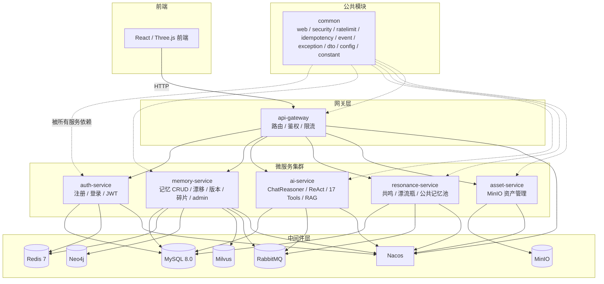

### 4. 各服务职责地图

| 服务 | 职责 | 核心端口 | 关键依赖 |
|---|---|---|---|
| api-gateway | 路由分发、JWT 鉴权、MDC 链路追踪、限流 | 8080 | Nacos、Redis |
| auth-service | 用户注册/登录、JWT 签发/刷新、角色管理 | 8081 | MySQL、Redis、Nacos |
| memory-service | 记忆 CRUD、遗忘曲线漂移、版本快照、碎片发现、管理看板统计 | 8082 | MySQL、Redis、Neo4j、Milvus、RabbitMQ、Nacos |
| ai-service | ChatReasoner ReAct 循环、17 工具注册、RAG 路由、场景重建、多模态视觉 | 8083 | MySQL、RabbitMQ、Nacos |
| resonance-service | 共鸣匹配、漂流瓶、公共记忆池、WebSocket 实时推送 | 8084 | MySQL、Redis、RabbitMQ、Nacos |
| asset-service | MinIO 多媒体资产 CRUD、预签名 URL 生成、资源白名单管理 | 8085 | MinIO、Nacos |
| common | 公共横切：ApiResponse 统一响应、JWT 过滤器、限流注解、幂等守卫、全局异常、事件总线 | — | 被所有服务依赖 |

### 5. 核心业务流程概览

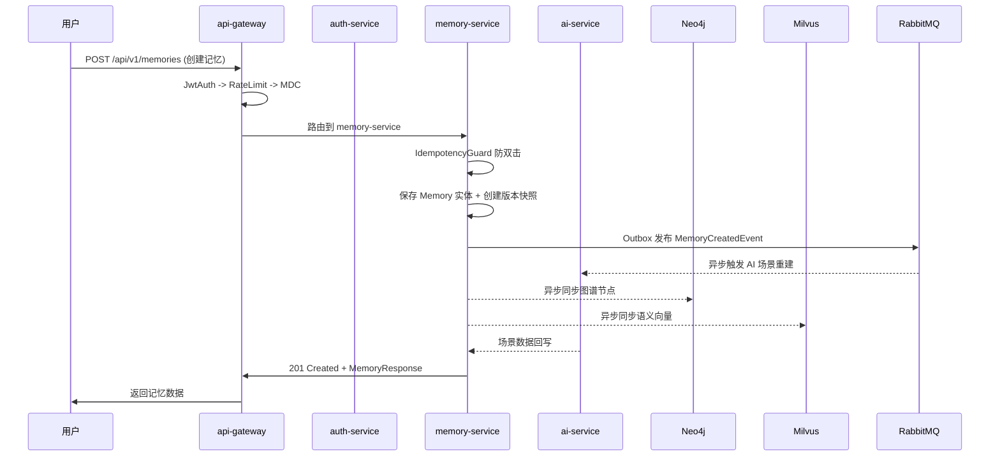

一条记忆从创建到展示的全链路：用户请求 -> Gateway 鉴权限流 -> Controller（IdempotencyGuard + DTO 转换）-> Service（事务内 CRUD + 版本快照）-> 异步增强（AI 场景重建 + 图谱同步 + 向量同步 + 事件发布 + 成就检查）-> 返回响应。

---

## 第二篇：横切基础设施 —— common 模块与全局机制

### 第 1 章：测试与环境配置

## 第 1 章 · 测试与环境配置


### 1. Windows 环境下 E2E 测试网络请求拒绝问题
**问题详细描述**：在执行 E2E 自动化测试脚本时，出现大量针对 `localhost:port` 的请求报 `Connection Refused` 错误，导致测试链路全线中断。

**问题出现的原因及分析**：由于最初采用了 MSYS2 / Git Bash 等模拟 Linux 环境来执行自动化测试脚本，其底层的网络模拟层（Network Mock Stack）与 Windows Native 的 `localhost` 解析存在冲突，特别是未能正确映射 Node.js 和 Java 微服务进程绑定的环回地址。

**问题的解决方案**：放弃跨平台的 Bash 脚本方案，采用 Windows 原生 PowerShell 编写 `scripts/test-e2e.ps1`，并利用 `Invoke-RestMethod` 的原生异步网络请求能力与底层网络直接对话。

**解决后的效果**：微服务群（Gateway / Auth / Memory / AI 等）的冒烟测试全部通过，彻底根除网络解析故障。

### 2. 跨局域网开发时由于环境变量隔离导致本地微服务无法识别远程 Docker 基础设施
**问题详细描述**：开发人员使用本地机器编写并启动前端/后端微服务，但数据库、Redis、Nacos 等中间件部署在远程工位机服务器上（通过 Docker 管理，运行于局域网 IP `100.66.166.46`，且已配置好 Tailscale 与 SSH 端口转发）。在本地 IDEA 中直接拉起微服务进程时，系统抛出大量连接拒绝与超时异常，并且前端控制台频繁弹出“检测到基础设施服务离线”的红色严重警告，导致部分模块（如“我的记忆”）页面直接熔断并抛出 Beacon 异常信标。

**问题出现的原因及分析**：
之前为了启动本地联调环境，设计了 `Use-LocalDev-WorkpcInfra.ps1` 脚本来在终端会话中加载远程配置（`.env.workpc`）并开启 SSH 端口转发。然而，Windows 系统的环境变量具有**进程隔离性**。在 PowerShell 终端中加载的环境变量仅对当前 shell 进程及其子进程有效，无法隐式地向已经启动或通过 GUI 桌面快捷方式启动的 IntelliJ IDEA 等 IDE 进程传播。这导致通过 IDEA 的“Run/Debug”直接拉起微服务时，服务进程无法读取到环境变量，最终回退到 `application.yml` 中默认的本地 `localhost` 地址，造成连接远程基础设施失败。

**mermaid 代码**：
```mermaid
graph TD
    subgraph 本地开发机 (IDEA)
        Gateway[api-gateway] -->|直连 localhost 失败| LocalInfra[Localhost 中间件]
        MemoryService[memory-service] -->|直连 localhost 失败| LocalInfra
    end
    subgraph 远程工位机 (Docker)
        RemoteInfra[Nacos / MySQL / Redis]
    end
    Note over Gateway, MemoryService: 环境变量隔离使得 IDE 未能读取到 100.66.166.46<br/>依然回退为 localhost
    style LocalInfra fill:#f9f,stroke:#333,stroke-width:2px,stroke-dasharray: 5 5
```

**问题的解决方案**：
1. **硬化默认配置**：直接修改所有后端微服务（`api-gateway`, `auth-service`, `memory-service`, `resonance-service`, `asset-service`, `ai-service`）的 `application.yml` 配置文件，将默认直连的 `localhost` 占位地址统一更新为远程工位机 IP（`100.66.166.46`），实现不依赖临时环境变量的“开箱即用”式连接。
2. **凭证对齐**：修改 `asset-service` 中 MinIO 默认的鉴权密钥，将 `MINIO_SECRET_KEY` 默认值更新为容器实际运行的凭证 `minioadmin123`。
3. **极简开发流**：避免使用后台常驻的复杂脚本进行微服务打包发布，推荐以双窗口形式在本地 IDEA 中分别拉起前端与后端，轻量化研发资源开销。

**解决后的效果**：
本地 IDEA 中拉起的微服务均能成功与远程工位机 Docker 容器中的 Nacos、MySQL、Redis 等中间件建立稳定连接，消除了由于变量隔离引发的基础设施下线误报，读写记忆接口运行正常。


---


---

### 第 2 章：common 模块全景 —— 十一子包的职责与分工

## 第 14 章 · Common 模块总时序图


下面这个时序图展示**一个带 `@RateLimit` 和 `@Cacheable` 的 admin 聚合接口请求，如何依次穿过 common 模块的所有横切关注点**。这是整个 common 学习的"毕业总览"，把九章到十三章的所有组件串成一条线。

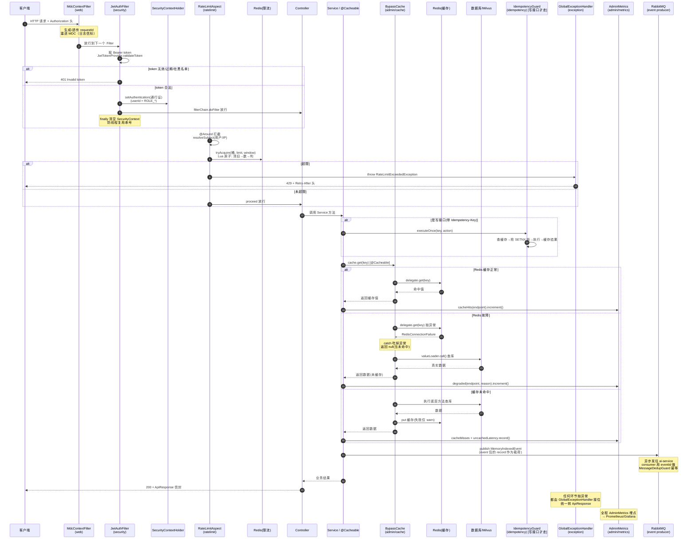

---

### 5. common 模块全景：八个包的分工与定位

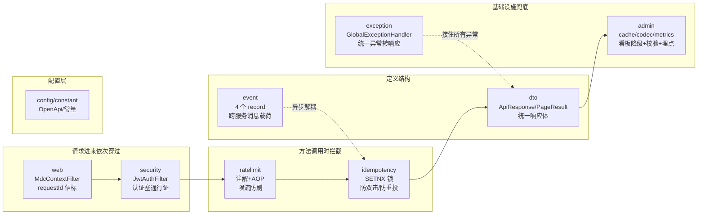

---

### 6. 贯穿 common 的三条设计哲学（毕业总结）

读完整个 common 模块，三条主线反复出现，这就是这个项目的**基础设施设计基线**：

1. **原子性 / 并发安全** —— ratelimit 的 Lua 脚本、idempotency 的 SETNX 锁，都是用原子操作解决多实例并发
2. **Fail-open / 降级哲学** —— Redis 挂了不做阻断：ratelimit failOpen 放行、idempotency fail-open 透传、BypassCache 降级当未命中。缓存/限流/幂等都是"加速器"不是"刹车"
3. **契约稳定 + 诊断增强** —— message/状态码等对外契约不变（向后兼容），细节透到 data/日志/指标里：UpstreamUnavailable 的诊断 data、event 的 eventId、AdminMetrics 的埋点

再加一条横切的：**防御式编程**——到处是 null 防护、空值兜底、异常吃掉不抛，为小概率和人为失误买单，让基础设施在生产环境稳跑。

读完 common，接下来该进各微服务。强烈建议从 **memory-service** 的 `MemoryService.createMemory` 读起——那里会同时出现 event 的 publish、`@Async` 异步、可能还有 idempotency 调用，能把 common 学的所有横切组件**一次串成完整业务链路**，是整个 common 学习的毕业考。

---


---


================================================================================
                              下篇 · admin 模块深度走读
================================================================================

本篇将原笔记第十五至二十一章整合为一个连贯的深度走读系列。从缓存配置 -> 时间桶算法 -> 模块总览 -> Controller -> Service -> 管理控制器 -> 总复盘，层层递进。


---

### 第 3 章：全局异常处理与统一响应

## 第 9 章 · 通用模块与全局异常处理


### 1. GlobalExceptionHandler 全局异常处理器源码理解

**一句话定位**：
[GlobalExceptionHandler.java](file:///m:\Study\ProjectTest\Mnemoscape\backend\common\src\main\java\com\mnemoscape\common\exception\GlobalExceptionHandler.java) 是用 `@RestControllerAdvice` 标注的切面类，所有依赖 common 模块的微服务自动继承。任何失败路径都会被它接住，统一输出 `ApiResponse` 形状的响应体，避免各个 Controller 各写各的 try-catch、前端拿到五花八门的错误格式。

**核心套路（每个处理器都长这样）**：
```java
@ExceptionHandler(某异常.class)   // 声明处理哪类异常
public ResponseEntity<ApiResponse<Void>> handleXxx(某异常 ex, HttpServletRequest request) {
    String requestId = resolveRequestId(request);          // 取请求 ID
    log.warn("...", ...);                                   // 写日志
    return ResponseEntity.status(状态码)
            .body(ApiResponse.error(状态码, "提示文案", requestId));  // 封装响应
}
```

**新手易误解的两点**：
1. **用的就是 SLF4J** —— `private static final Logger log = LoggerFactory.getLogger(...)`，只是没用 Lombok 的 `@Slf4j`（项目没引 Lombok），手写两行等价代码而已。`@Slf4j` 本质也就是帮你生成这两行。
2. **异常信息放响应体，不是响应头**。响应头只放协议级元信息，比如限流处理器里的 `Retry-After`、`X-RateLimit-Bucket`。响应体结构是 `{ code, message, data, requestId }`。

**覆盖的异常清单**：

| 异常 | HTTP 状态码 | 触发场景 |
|---|---|---|
| `BizException` | 业务自定义码 | 所有自定义业务异常的基类 |
| `RateLimitExceededException` | 429 | 触发限流 |
| `UpstreamUnavailableException` | 502 | 上游服务不可用（带结构化诊断 data） |
| `Cache.ValueRetrievalException` | 解包后委托 | `@Cacheable(sync=true)` 缓存加载失败，需剥壳找真因 |
| `MethodArgumentNotValidException` | 400 | `@Valid` 校验失败（请求体） |
| `ConstraintViolationException` | 400 | `@Validated` 校验失败（参数级） |
| `MissingServletRequestParameterException` | 400 | 缺必填参数 |
| `MethodArgumentTypeMismatchException` | 400 | 参数类型转换失败（id 传成字母） |
| `HttpMessageNotReadableException` | 400 | JSON 格式错误 |
| `HttpRequestMethodNotSupportedException` | 405 | 请求方法不对 |
| `NoHandlerFoundException` | 404 | 接口路径不存在 |
| `NoResourceFoundException` | 404 | 静态资源不存在 |
| `DataIntegrityViolationException` | 409 | 数据库唯一约束/外键冲突 |
| `UnexpectedRollbackException` / `TransactionSystemException` | 500 | 事务意外回滚 |
| `DataAccessException` | 503 | 数据库访问失败（DB 挂了） |
| `Exception`（兜底） | 500 | 所有其他未预期的异常 |

**匹配规则提醒**：Spring 按"异常类型匹配精确度"选处理器，不是按代码顺序。所以更具体的子类异常（如 `RateLimitExceededException`）即使写在父类（`BizException`）后面，也会优先匹配到自己的专用处理器。

---

### 2. 难点一：handleCacheRetrieval —— 拆快递箱

**代码**：
```java
@ExceptionHandler(Cache.ValueRetrievalException.class)
public ResponseEntity<ApiResponse<Void>> handleCacheRetrieval(Cache.ValueRetrievalException ex,
                                                              HttpServletRequest request) {
    Throwable cause = ex.getCause();
    if (cause instanceof BizException biz) {
        return handleBizException(biz, request);
    }
    if (cause instanceof DataAccessException dae) {
        return handleDataAccess(dae, request);
    }
    if (cause instanceof Exception e) {
        return handleGeneric(e, request);
    }
    // 兜底，防止 cause 是个 null
    return handleGeneric(ex, request);
}
```

**背景知识：Java 异常会"套娃"**：
```java
try {
    // 调下游
} catch (SQLException e) {
    throw new RuntimeException("数据库出错了", e);  // ← 第二个参数 e 就是 cause
}
```
新抛出的 `RuntimeException` 像**快递箱**，把真正的 `SQLException` 装在箱子里。用 `getCause()` 能拆箱看里面装了啥。上层统一包装类型往外抛，代价是接住的人不拆箱就看不到真相。

**这里的具体问题**：
```java
@Cacheable(value = "memory", sync = true)
public Memory findById(Long id) { ... }
```
`@Cacheable(sync = true)` 有个特性：方法抛异常时，Spring 会**自动再包一层**成 `Cache.ValueRetrievalException`：
```
你的代码抛:       BizException("记忆不存在")          ← 本意 404
Spring 缓存包一层: Cache.ValueRetrievalException
                  └─ cause = BizException("记忆不存在")
```
不剥壳的话：抛上来的是 `Cache.ValueRetrievalException` → 没有专用处理器 → 掉进兜底 `handleGeneric` → 返回 500。于是"查不存在的记忆"本该 404，却变成 500——这就是 Javadoc 里那个真实 bug（GET /api/v1/memories/{id} 查询不存在的 ID 返回 500）。

**处理逻辑**：
它自己不产生响应，只负责"拆箱 + 转发"——拆开看里面是啥类型，喊对应处理器来干活。

**语法点：`cause instanceof BizException biz`**：
Java 16+ 的"模式匹配 instanceof"。等价于老写法：
```java
if (cause instanceof BizException) {
    BizException biz = (BizException) cause;
    return handleBizException(biz, request);
}
```
一行搞定：判断类型的同时顺便给你强转好的变量 `biz`。

**为什么最后还有 `return handleGeneric(ex, request)`**：
`cause` 可能是 `null`（虽然 Spring 基本不会这么干），或是个 `Error`（`OutOfMemoryError` 之类，不是 `Exception` 子类），前面三个 if 都接不住，所以兜底处理整个箱子。

---

### 3. 难点二：rootMessage —— 剥洋葱找最里层

**代码**：
```java
private static String rootMessage(Throwable t) {
    Throwable root = t;
    while (root.getCause() != null && root.getCause() != root) {
        root = root.getCause();
    }
    return root.getMessage();
}
```

**背景：异常可以套很多层**：
```
最外层: TransactionSystemException          (Spring 事务包的)
   └─ cause: DataIntegrityViolationException (Spring DAO 包的)
        └─ cause: BatchUpdateException        (MyBatis 包的)
             └─ cause: SQLIntegrityConstraintViolationException  ← 真正的根因!
                  message: "Duplicate entry 'wanghy' for key 'uk_username'"
```
最外层 message 可能是"事务执行失败"这种废话，真正有用的信息（哪个字段重复了）藏在最里层。

**逐行翻译**：
- `Throwable root = t;` —— 先假设最外层就是根因
- `while (root.getCause() != null ...)` —— 只要当前层里面还套着东西，就继续往里
- `root = root.getCause();` —— 往里走一层
- 循环结束时 `root` 已是最里层那个没有 cause 的异常
- `return root.getMessage();` —— 返回它的错误信息

**`root.getCause() != root` 是啥**：
防"异常自己套自己"的兜底。奇葩代码 `ex.initCause(ex)` 会导致无限循环，加这判断就能停下来。防御性编程，99% 用不上但更稳。

**用在哪**：
只用在**日志**里（`log.warn("...root={}", rootMessage(ex))`），不用在返回前端的 message。因为最里层 message 常是数据库驱动的英文报错，给用户看会懵。前端文案用中文人话，根因留给运维看日志。

---

### 4. 两个方法对比

| | `handleCacheRetrieval` | `rootMessage` |
|---|---|---|
| 干啥 | 拆**一层**壳，看类型，转发给对应处理器 | 拆**所有**层，走到最里层，拿 message |
| 拆几层 | 一层（`getCause()` 一次） | 到底（`while` 循环） |
| 目的 | 找异常**类型**，走对的返回码 | 找异常**根因文字**，写日志 |

**一句话记忆**：`handleCacheRetrieval` 是"拆一层看类型然后转发"，`rootMessage` 是"剥到底拿文字写日志"。

---

### 5. 兜底处理器 handleGeneric 的项目特色

```java
String artisticMessage = "这片记忆时空发生了坍塌，考古工具暂时无法读取。"
        + "请把这枚信标交给主理人，让我们一起把它拼回原状。信标 ID：" + requestId;
```

未预期的 500 用项目叙事（记忆/考古/信标）包装，让普通用户不至于看到英文堆栈。`requestId` 同时落在堆栈日志、响应体 message、响应头 `X-Correlation-Id` 三处，方便用户"一键复制信标"反馈，运维也能凭这个 ID 在日志里一搜定位到对应堆栈。这是把"冷冰冰的 500"转化成"可追溯的项目化叙事"的设计取舍。

---

### 6. 配套异常类：UpstreamUnavailableException —— 上游不可用的诊断载体

**一句话定位**：
[UpstreamUnavailableException.java](file:///m:\Study\ProjectTest\Mnemoscape\backend\common\src\main\java\com\mnemoscape\common\exception\UpstreamUnavailableException.java) 不是处理异常的逻辑，只是一个"异常数据载体"——把"下游挂了"这件事的所有诊断信息打包好，交给 GlobalExceptionHandler 翻译成 HTTP 响应。

**它解决的问题**：
微服务架构里，管理后台聚合接口要调 `memory-service` 拿数据，但下游此刻可能没在 Nacos 注册 / 连接超时 / 返回 5xx / 返回 200 但 JSON 格式错。按需求 6.7 的硬性规定：**不许返回半截数据，也不许返回缓存的旧数据，必须明确告诉前端"上游不可用"**。于是抛这个异常，统一翻译成 HTTP 502 + `message: "UPSTREAM_UNAVAILABLE"`。

**比普通异常多塞的三个诊断字段**：

| 字段 | 作用 |
|---|---|
| `upstreamName` | 谁挂了（`memory-service`） |
| `failureKind` | 怎么挂的（枚举：超时/未注册/5xx/格式错…） |
| `detail` | 自由文本细节（`"5s read timeout on /admin/stats/..."`） |

GlobalExceptionHandler 的 `handleUpstreamUnavailable` 把这三个字段塞进响应体的 `data` 里，前端就能渲染出"哪个服务、什么类型的故障、具体是什么"，而不是黑盒报错。

**关键设计点**：
1. **`message` 字段保持 `"UPSTREAM_UNAVAILABLE"` 不变** —— 这是对外契约，客户端可能写了 `if (msg === "UPSTREAM_UNAVAILABLE")` 的逻辑，不能改。诊断信息塞在 `data` 里，而不是改 message。
2. **三个构造器是渐进式的** —— 旧代码 `new UpstreamUnavailableException("memory-service")` 不改也能编译，这就是注释里说的"backward-compatible"。
3. **放在 common 模块** —— 三个微服务都引这个 common，谁都能 throw 它，全平台一种处理方式。

**典型用法**：
```java
try {
    return memoryClient.getActiveUsers();
} catch (FeignException.GatewayTimeout e) {
    throw new UpstreamUnavailableException(
        "memory-service",
        FailureKind.READ_TIMEOUT,
        "5s read timeout on /admin/stats/active-user-counts",
        e
    );
}
```


---


================================================================================
                              中篇 · 横切基础设施
================================================================================

本篇聚焦项目的横切关注点（Cross-cutting Concerns）：安全认证、限流、幂等性等，以及 admin 模块的基础设施层。


---

### 第 4 章：安全认证与 JWT 过滤器

## 第 10 章 · 安全认证与 JWT 过滤器


### 1. Spring Security 的"门卫模型"——理解 JwtAuthFilter 的前提

在读 [JwtAuthFilter.java](file:///m:\Study\ProjectTest\Mnemoscape\backend\common\src\main\java\com\mnemoscape\common\security\JwtAuthFilter.java) 之前，必须先理清 Spring Boot 安全的**两层结构**，否则代码完全看不懂：

| 层 | 谁负责 | 干什么 |
|---|---|---|
| **认证（Authentication）** | JwtAuthFilter | "你是谁？身份合法吗？"（查 JWT） |
| **授权（Authorization）** | Spring Security 框架 | "你能访问这个接口吗？"（查权限） |

项目里通常有个 `SecurityConfig` 配置类写：
```java
http.authorizeHttpRequests(auth -> auth
    .anyRequest().authenticated()   // 任何请求都必须"已认证"才能访问
);
```

**核心问题**：`.authenticated()` 判断"已没已认证"时，它怎么知道当前请求认证了没？它又不认识你的 JWT。

**答案**：它去问 `SecurityContextHolder`——Spring Security 的一个"全局票据箱"（底层用 `ThreadLocal`，线程绑定）。
- 票据箱里有通行证 → `authenticated()` 放行
- 票据箱空着 → `authenticated()` 判定失败，返回 401

所以 JwtAuthFilter 校验完 JWT 后，**必须往票据箱里塞一张通行证**，否则就算 token 完全合法，请求也会被框架当成"未认证"打回去。

### 2. JwtAuthFilter 的核心逻辑——"塞通行证 + 放行 + 清场"

```java
UsernamePasswordAuthenticationToken authentication =
        new UsernamePasswordAuthenticationToken(
                userId,                                                        // ① principal 主体
                null,                                                          // ② credentials 凭证
                List.of(new SimpleGrantedAuthority("ROLE_" + resolvedRole)));  // ③ authorities 权限
SecurityContextHolder.getContext().setAuthentication(authentication);

try {
    filterChain.doFilter(request, response);
} finally {
    SecurityContextHolder.clearContext();
}
```

逐句拆解：
1. **造通行证** `UsernamePasswordAuthenticationToken`：名字虽带"用户名密码"，但这里只是个"已认证凭证对象"的通用载体，不需要密码了（已用 JWT 验明正身）。三个参数：
   - `userId`（principal）：这个请求是谁
   - `null`（credentials）：已验证过，不需要再带
   - `"ROLE_" + resolvedRole`（authorities）：用户角色。**注意前缀 `ROLE_` 是 Spring Security 硬约定**——授权规则写 `.hasRole("ADMIN")` 时框架会自动补 `ROLE_` 前缀去匹配，两边才对得上
2. **塞进票据箱** `SecurityContextHolder...setAuthentication`：框架授权层就能看见了
3. **放行** `filterChain.doFilter`：把请求交给过滤器链下一个环节，最终到 Controller。整个执行期间票据箱里都躺着通行证
4. **清场** `finally { SecurityContextHolder.clearContext(); }`：请求处理完立刻清空票据箱

**为什么必须清空（关键安全点）**：Tomcat 用线程池复用线程。处理完这个请求的线程下一秒可能被分给别人。不清空的话，下个请求会**继承上一个用户的通行证**——严重越权漏洞。`finally` 保证无论 Controller 抛不抛异常都一定清。

### 3. 生活类比——机场安检

| 代码 | 安检对应 |
|---|---|
| 取 Bearer token | 旅客出示登机牌 |
| `validateToken` + 黑名单检查 | 验真伪、查禁飞名单 |
| `new UsernamePasswordAuthenticationToken` | 安检员盖"已安检"章 |
| `SecurityContextHolder...setAuthentication` | 把盖章信息录入系统 |
| `filterChain.doFilter` | 放行进候机厅 |
| `finally clearContext` | 登机后清除安检记录，防身份串号 |

**一句话总结**：Filter 负责认证、框架负责授权、两者通过 SecurityContextHolder 通信。Spring Security 看着唬人，核心就是这套票据箱机制。

### 4. shouldNotFilter——免认证接口与"首个管理员"引导后门

`shouldNotFilter` 返回 `true` 表示"这个过滤器别处理该请求"。分两段：

**前半段：天然免登录接口**
登录、注册、刷新 token、Swagger 文档、actuator 监控、WebSocket 握手——这些不需要 JWT，直接跳过。

**后半段：解决"鸡生蛋"——平台第一个管理员怎么诞生**

困境：系统刚部署，一个 ADMIN 都没有，但"提升 ADMIN"接口按规则只有 ADMIN 能调，那第一个 ADMIN 谁来创建？这就是**引导问题（Bootstrap Problem）**——权限系统的冷启动死锁。

项目用**双钥匙**方案：提升接口接受两种开门方式之一：

| 开门方式 | 携带的头 | 适用场景 |
|---|---|---|
| 正常管理员授权 | `Authorization: Bearer <jwt>` | 已有 ADMIN，他来提升别人 |
| 引导密钥 | `X-Bootstrap-Secret: <密钥>` | 还没任何 ADMIN，用预设密钥创第一个 |

```java
if ("POST".equalsIgnoreCase(request.getMethod())
        && path.matches("^/api/v1/admin/users/[^/]+/role$")) {
    String bootstrap = request.getHeader("X-Bootstrap-Secret");
    String auth = request.getHeader("Authorization");
    if (bootstrap != null && !bootstrap.isBlank()        // ① 带了引导密钥
            && (auth == null || auth.isBlank())) {       // ② 且没带 JWT
        return true;    // 跳过 JWT 验证
    }
}
```

**两个条件必须同时满足**：带引导密钥 + 没有 JWT。要么用密钥要么用 JWT，不能两个都带——避免逻辑混乱。

**关键认知**：跳过 JWT ≠ 放行。请求继续往后走，撞上 Spring Security 授权层。注释里 `adminOrBootstrapSecret()` 是个自定义授权管理器，在那儿做两件事：
- 票据箱里有 `ROLE_ADMIN`（JWT 路径）→ 放行
- 没票据但带 `X-Bootstrap-Secret` → 用**常量时间比较**核对密钥

**两个安全术语**：
- **常量时间密钥比较**：防时序攻击。普通 `equals()` 碰到第一个不同字符就返回，黑客能通过"比对耗时"猜密钥；常量时间比较无论对错都花一样时间，堵死侧信道
- **关注点分离**：JwtAuthFilter 只认 JWT，引导密钥交给专门授权管理器，不混在一起

**生活类比**：银行金库"主管任命操作台"。JWT 路径=现役主管刷卡；引导密钥=银行刚开业没主管，行长用封存的"初始密钥"任命第一任主管，且规定这把密钥只在"没有任何主管卡"时能用。

### 5. 安全三件套的整体关系

`security` 包三个文件按生命周期顺序读最顺：
- `JwtTokenProvider`：生成 / 解析 / 校验 token（签发工厂）
- `JwtAuthFilter`：每个请求拦截验 token（门卫）——本文重点
- `JwtBlacklist`：已 logout / 被踢人的 token 进黑名单，`jti`（token 唯一 ID）命中就拒


---


---

### 第 5 章：限流模块 ratelimit

## 第 11 章 · 限流模块 Ratelimit


### 1. 总览——四个角色的分工

限流的本质一句话：**"你在 X 秒内最多调我 Y 次，超了就拒。"** ratelimit 包 6 个文件其实是 4 个角色的分工：

| 角色 | 文件 | 职责 | 类比 |
|---|---|---|---|
| 规则声明 | `RateLimit.java` | 注解，写"这个接口 1 分钟限 10 次" | 门上"每小时限进 5 人"告示牌 |
| 执行拦截 | `RateLimitAspect.java` | 看到告示牌就拦请求查计数 | 保安看到告示牌开始数人头 |
| 计数核心 | `RateLimiter` + `RedisSlidingWindowRateLimiter` | 在 Redis 里数"窗口内来过几次" | 保安手里的计数器 |
| 拒绝报错 | `RateLimitExceededException` | 超了抛异常→全局处理器转 429 | "满了，等会儿来" |
| 自动安装 | `RateLimitAutoConfiguration` | 各微服务启动时自动装上 | 把保安和告示牌配发到每个站点 |

**调用链路**：
```
用户请求 → 带带 @RateLimit 的 Controller 方法
   → AOP 切面 RateLimitAspect 拦截（方法执行前）
   → 切面算出"限流主体"（用户？IP？）
   → 调 RateLimiter.tryAcquire() 去 Redis 查计数
   → Redis 跑 Lua 脚本：清旧计数→数当前→超了拒/没超记一笔
   → 返回 Decision（放行 or 拒绝+几秒后能重试）
   → 放行：proceed() 放方法走
   → 拒绝：抛 RateLimitExceededException → GlobalExceptionHandler → HTTP 429
```

### 2. RateLimit.java —— 告示牌（最简单先读）

注解本身啥也不干，就是个标签。四个属性：
- `key()` —— 桶名（空就用 `类名#方法名`）
- `limit()` —— 窗口内最多几次
- `windowSeconds()` —— 窗口几秒
- `dimension()` —— **按谁计数**（精髓）

**dimension 维度是关键**——限流不能一刀切，提供四种：

| 维度 | 含义 | 场景 |
|---|---|---|
| `USER_OR_IP`（默认） | 登录用户按用户算，匿名按 IP | 最常用，混合端点 |
| `USER` | 只按用户 ID | 强制登录接口 |
| `IP` | 只按 IP | 不限登录的反爬 |
| `GLOBAL` | 全平台共用一个桶 | 保护第三方 API（大模型接口总配额） |

示例：
```java
@RateLimit(key = "auth:login", limit = 10, windowSeconds = 60, dimension = Dimension.IP)
public ApiResponse<LoginResult> login(...) { ... }
```

两个元注解：`@Target({METHOD, TYPE})` 能贴方法或类；`@Retention(RUNTIME)` 运行时还在（否则切面读不到）。**RateLimit 就是一张配置卡片，自己零逻辑。**

### 3. RateLimiter.java —— 计数器接口契约

接口定义"限流器长什么样"，不含实现。解耦+可测——切面只认接口，Redis 实现和单测内存实现可互换。

就一个方法：
```java
Decision tryAcquire(String bucketKey, int limit, int windowSeconds);
```

**重点 `Decision` record**——决策结果包，四个字段：`allowed`（放不放行）、`remaining`（剩余配额）、`retryAfterSeconds`（几秒后重试）、`degraded`（是否降级）。三个静态工厂对应三种结局：`allow` / `deny` / `failOpen`。

**`failOpen` 是整套设计核心哲学**：限流是"加速器"不是"刹车"——Redis 挂了**选择放行**，而不是把所有请求打成 5xx。理由：Redis 故障是基础设施问题，不该让用户体验雪崩；宁可短暂不限流，也不能全瘫。这个取舍贯穿整个包（出现 3 次）。

### 4. RedisSlidingWindowRateLimiter.java —— 计数大脑（最核心）

#### 4.1 滑动窗口 vs 固定窗口
固定窗口有漏洞：边界突刺。"每分钟 10 次"——0:59 调 10 次、1:01 调 10 次，两秒内实际 20 次但两窗口各自没超。**滑动窗口**：窗口跟着当前时刻滑动，看"过去 60 秒内来过几次"，边界突刺消除。

#### 4.2 用 Redis ZSET 实现
每次请求是个"事件"，塞进 ZSET：`member`（唯一标识）、`score`（时间戳毫秒）。按时间戳排序，算"过去 N 秒几次"=算"score 在 [now-N, now] 区间 member 个数"。

#### 4.3 一次请求三步走（Lua 脚本）
```lua
local cutoff = now - windowMs
redis.call('ZREMRANGEBYSCORE', key, '-inf', cutoff)   -- ① 出窗：删旧请求
local count = redis.call('ZCARD', key)                 -- ② 数当前
if count >= limit then
  return {0, retryMs}                                   -- ③ 满了拒
end
redis.call('ZADD', key, now, member)                    -- ③ 没满记一笔
redis.call('PEXPIRE', key, windowMs + 5000)
return {1, limit - count - 1}
```

**为什么必须用 Lua 原子执行**：Redis 单线程但**多条独立命令间会被别的客户端插队**。如果"删旧→数当前→记一笔"分三条命令发，并发下：A 数到 9 准备记、B 也数到 9 准备记、A 记上变 10、B 记上变 11——超了！限流失效。**Lua 脚本被 Redis 当成不可打断的原子操作**，中间没人插队。

#### 4.4 Java 胶水代码
`tryAcquire`：拼 key（`ratelimit:` 前缀）、算时间、生成 member（`时间戳-随机数`，防同毫秒并发 ZADD 去重）、执行 Lua、解读返回值（`result[0]` 放行标志，`result[1]` 元信息）。**三道 catch 全是 failOpen**——再次体现降级放行。

### 5. RateLimitAspect.java —— 保安（串起零件）

#### 5.1 AOP 基础
AOP 解决"很多方法都要同一段逻辑"的问题。`@Aspect` 标记切面；`@Around` 环绕通知（方法执行前后都插逻辑，能决定要不要调原方法）；`pjp.proceed()` 放原方法执行。

#### 5.2 核心方法 around
```java
@Around("@annotation(...)RateLimit || @within(...)RateLimit")  // 匹配有注解的方法/类
public Object around(ProceedingJoinPoint pjp) throws Throwable {
    RateLimit cfg = resolveConfig(pjp);              // ① 读告示牌配置
    String subject = resolveSubject(cfg.dimension());  // ② 算"谁在请求"
    String bucket = (key或类名#方法名) + ":" + subject;  // ③ 拼桶名
    Decision decision = rateLimiter.tryAcquire(bucket, limit, window);  // ④ 查 Redis
    if (decision.allowed()) {
        return pjp.proceed();    // ⑤ 放行
    }
    throw new RateLimitExceededException(bucket, retryAfter, message);  // ⑥ 拒绝
}
```

#### 5.3 resolveSubject —— 重点（和 security 联动）
根据维度算"限流主体"：`GLOBAL`→固定 `"GLOBAL"`；`USER`/`USER_OR_IP`→先看 `SecurityContextHolder` 有没有登录用户（**接上 security 包！**）有就用 `"u:"+用户名`，没有用 IP 兜底；`IP`→取客户端 IP。

`clientIp` 细节：先看 `X-Forwarded-For` 头（反代时真实 IP 在这），没有才用 `remoteAddr`；XFF 可能逗号分隔多 IP，取第一个。

#### 5.4 @Order(0)
让限流切面排很靠前（外层），**限流检查先于事务/缓存执行**——不要等数据库查了、缓存读了才告诉你超限（前面白干）。限流应挡在最外层。

`resolveConfig` 那坨反射（找注解、处理类/方法都有注解时方法优先、内部类场景）初读可跳过，知道它"读配置"即可。

### 6. RateLimitExceededException.java —— 拒绝报错

- 继承 `BizException` → 进统一异常体系 → 被 `GlobalExceptionHandler` 接住转标准 ApiResponse
- 携带 `retryAfterSeconds` → 被 `handleRateLimit` 写进 `Retry-After` 响应头，客户端能自动退避
- `toApiResponse` 适配器方法

### 7. RateLimitAutoConfiguration.java —— 自动安装

**问题**：`RateLimiter`/`RateLimitAspect` 在 common 模块，**不在**各微服务包扫描路径下（微服务 `@SpringBootApplication` 只扫 `com.mnemoscape.<服务名>`），普通 `@Component` 没用。

**方案**：Spring Boot 自动装配。`@AutoConfiguration` + `META-INF/spring/...AutoConfiguration.imports` 文件，所有微服务启动时自动加载这个配置类，等于把限流零件"打补丁"补到每个服务。

两个 Bean：
- `rateLimiter`：注入 `StringRedisTemplate`（可能没有）。**有 Redis 用 Redis 实现，没有返回"全放行"lambda** `(b,l,w)->failOpen()`——又一个 fail-open 兜底，没引 Redis 的服务也能启动
- `rateLimitAspect`：注入上面的 limiter

`@ConditionalOnClass(HttpServletRequest)`：只有 servlet web 环境才装配。

### 8. 三个核心设计哲学（读这套代码最该带走的）

1. **滑动窗口 + Lua 原子性** —— 解决限流准确性和并发安全
2. **Fail-open 降级** —— Redis 挂了选放行，不做雪崩的刹车（出现 3 处：`Decision.failOpen`、三道 catch、AutoConfig 的 lambda 兜底）
3. **注解 + AOP + 自动装配** —— 让限流能力"贴个注解就能用，各服务零配置继承"

### 9. 整条链路串一遍

1. 微服务启动 → `RateLimitAutoConfiguration` 自动装配，注册 `RedisSlidingWindowRateLimiter` + `RateLimitAspect`
2. 用户请求带 `@RateLimit` 的方法 → AOP 切面 `around` 拦截
3. 切面读注解配置 → 算主体（用户/IP）→ 拼桶名 → 调 `tryAcquire`
4. `RedisSlidingWindowRateLimiter` 跑 Lua：清旧→数当前→满拒/空记 → 返回 `Decision`
5. 放行 → `proceed` 执行原方法；拒绝 → 抛 `RateLimitExceededException`
6. 异常被 `GlobalExceptionHandler.handleRateLimit` 接住 → HTTP 429 + `Retry-After` 头


---


---

### 第 6 章：幂等性设计 idempotency

## 第 12 章 · 幂等性设计 Idempotency


### 1. 先搞懂"幂等"是什么

**幂等（idempotent）**：同一个操作，执行 1 次和执行 N 次，结果一样。

**为什么重要**：用户点"创建记忆"按钮，网络抖了一下没收到响应，又点一次。没幂等保护，数据库多出一条重复记忆。对 Mnemoscape 尤其致命——场景重建调 LLM 烧钱、跑 30 秒，重复成本极高。

**核心思路一句话**：用唯一 key 标记操作，第一次执行并记下结果，后续遇到相同 key 直接返回上次结果，不再执行。

这个包两个类是同一思路两种场景：

| 类 | 场景 | key 来源 |
|---|---|---|
| `IdempotencyGuard` | HTTP 接口防双击 | 客户端请求头 `Idempotency-Key` |
| `MessageDedupGuard` | 消息队列防重投 | 事件自带 `eventId` |

### 2. 必须先补的语言知识点（代码看不懂全卡在这里）

这部分代码用了几个 Java 语言特性，没专门学过会完全懵。假设只懂基本数据类型/基本语法/类/函数，其余从零讲。

#### 2.1 泛型 `<T>` —— 类型占位符

一句话：**让一份代码能套用多种类型**。

痛点：不用泛型要为每种类型写一个盒子。
```java
class StringBox { String value; }
class IntegerBox { Integer value; }
```
泛型解决——写一个通用盒子，装什么"到用的时候再说"：
```java
class Box<T> { T value; }              // T 是占位符，代表"某种类型"
Box<String> 字符串盒子 = new Box<>();   // 用时告诉它 T=String
Box<Integer> 数字盒子 = new Box<>();    // 这里 T=Integer
```
`T` 是约定俗成的名字（Type 首字母），可叫别的但大家习惯用 T。**理解成"函数的参数，只不过传的不是值而是类型"**。

#### 2.2 方法返回类型前的 `<T>` —— 声明方法的泛型参数

```java
public <T> T executeOnce(...)
```
方法名前那个 `<T>` 是在**声明**："我这个方法用了泛型 T，具体什么类型由调用方决定"。就像函数开头声明"有个参数叫 x"。声明后 T 就能在返回值、参数里用了。

调用时：
```java
LoginResult result = guard.executeOnce(key, LoginResult.class, () -> doLogin());
```
传了 `LoginResult.class`，Java 自动推断 T=LoginResult，方法返回 LoginResult，直接赋值不用强转。

#### 2.3 `Class<T>` —— 把"类型本身"当参数传

**关键认知：Java 里"类型"本身也是一个对象**，叫 `Class` 对象。
```java
String.class       // String 类型 的 Class 对象
Integer.class      // Integer 类型 的 Class 对象
LoginResult.class  // 自己写的类 的 Class 对象
```

为什么要传这个？因为要把 JSON 文本反序列化成对象，得告诉工具"变成什么类型"：
```java
String json = "{\"name\":\"王浩毅\"}";
LoginResult obj = objectMapper.readValue(json, LoginResult.class);  // 告诉它转成啥
```

泛型版 `Class<T> responseType`：调用方传一个类型（如 `LoginResult.class`），用 T 代指这个类型，方法里就能：
```java
T result = objectMapper.readValue(json, responseType);  // 转成调用方想要的类型
```
**为什么不传字符串 "LoginResult"？** 字符串得靠反射按名字找类，慢且不安全（拼错编译器不报错）。传 `Class<T>` 对象，编译器能检查类型。

#### 2.4 `Supplier<T>` —— 把一段代码当参数传（函数式编程核心）

场景：幂等守卫要执行用户业务逻辑，但每个调用方逻辑不同（登录/创建记忆...）。怎么把五花八门的逻辑作为参数传？

Java 8 提供现成接口 `Supplier<T>`，定义极简：
```java
interface Supplier<T> {
    T get();   // 无参，返回一个 T
}
```
理解成**"一个能产出 T 的东西"**，或**"一段还没执行的、返回 T 的代码"**。

用 lambda（箭头函数）：
```java
Supplier<LoginResult> action = () -> doLogin();   // () -> xxx 表示"调用时执行 xxx"
```
`()` 无参数，`-> doLogin()` 表示执行 doLogin 返回结果。**此刻 doLogin 没执行**，要等 `action.get()` 才执行：
```java
Supplier<LoginResult> action = () -> doLogin();
// doLogin 还没跑
LoginResult r = action.get();   // 现在才跑，拿结果
```

**为什么幂等守卫要这么设计**：
```java
public <T> T executeOnce(String key, Class<T> responseType, Supplier<T> action) {
    // ... 一堆幂等检查 ...
    T result = action.get();   // 只有检查通过，才"拆封"执行业务逻辑
}
```
把业务逻辑当"还没拆封的包裹"传进来，守卫在合适时机（查完缓存、抢到锁后）才 `action.get()` 拆封执行。**"什么时候执行"的控制权交给守卫**。

**生活类比**：`Supplier<T>` 像兑换券，交给守卫，守卫确认安全后才去柜台兑换（执行）。你自己不能直接兑换。

#### 2.5 `ObjectProvider<T>` —— 可选注入

对比：
- `@Autowired StringRedisTemplate` → 必须有 Redis，没有启动失败
- `ObjectProvider<StringRedisTemplate>` → 可有可无，用 `getIfAvailable()` 取，没有返回 null

幂等守卫设计哲学是 **fail-open**（Redis 挂了也放行）。用 `@Autowired` 强制要求 Redis，没装 Redis 的微服务启动不了，违背 fail-open。所以用 `ObjectProvider`：
```java
@Autowired
public IdempotencyGuard(ObjectProvider<StringRedisTemplate> redisProvider, ...) { ... }

StringRedisTemplate redis = redisProvider.getIfAvailable();  // 有就给，没有返回 null
if (redis == null) { /* fail-open 照常执行业务 */ }
```
这就是代码里到处是 `getIfAvailable()` + `if (redis == null)` 模式的原因——实现"Redis 缺席优雅降级"。

#### 2.6 `Optional<T>` —— "可能有值也可能没有"的盒子

盒子，里面要么装一个 T 要么空。作用是**逼你处理"没值"情况**，避免空指针。
```java
Optional<String> box = ...;
if (box.isPresent()) { String v = box.get(); }   // 有就取
String v = box.orElseThrow();                     // 没有就抛异常
```
代码中：
```java
Optional<T> cached = readCached(fullKey, responseType);
if (cached.isPresent()) { return cached.get(); }  // 缓存命中直接返回
```
比"返回 null 然后判空"更安全、更语义化。

#### 2.7 `Duration` —— 时间段

```java
private static final Duration DEFAULT_TTL = Duration.ofHours(24);
```
表示"一段时间"，比直接写 `24*60*60` 秒可读。`ofHours(24)`=24 小时，`ofMinutes(10)`=10 分钟。`set(key, value, DEFAULT_TTL)` 传给 Redis 设过期。

### 3. IdempotencyGuard —— HTTP 接口防双击

#### 3.1 解决什么 + 四个设计取舍
客户端请求头加 `Idempotency-Key: <任意字符串>`。服务端第一次见这个 key → 执行写操作，响应缓存 Redis 24h；24h 内同 key 来 → 直接返回缓存，不重写。

四个设计取舍（设计美学所在）：
1. **Redis 存储不用 DB** —— 24h 自然过期，不用定时任务清理
2. **SETNX 原子抢锁** —— 多实例并发只有一个执行
3. **失败透传异常** —— 不让幂等机制藏业务错误
4. **Redis 挂了 fail-open** —— 和 ratelimit 同套降级哲学

#### 3.2 字段
```java
private static final String KEY_PREFIX = "idem:";              // 缓存 key 前缀
private static final String LOCK_PREFIX = "idem:lock:";        // 锁 key 前缀
private static final Duration DEFAULT_TTL = Duration.ofHours(24);      // 结果缓存 24h
private static final Duration PROCESSING_TTL = Duration.ofMinutes(10); // 锁 10min
private final ObjectProvider<StringRedisTemplate> redisProvider;  // 可选注入 Redis
private final ObjectMapper objectMapper;                          // JSON 转换工具
```

#### 3.3 主方法 executeOnce —— 三道关卡 + 一个执行

流程：
```
请求带 Idempotency-Key 进来
   ↓
【关卡1】查缓存 → 有缓存?直接返回（双击第二次走这）
   ↓ 没有
【关卡2】Redis 挂了? → fail-open 透传执行
   ↓ Redis 正常
【关卡3】抢分布式锁(SETNX) → 抢不到?报冲突
   ↓ 抢到了
   执行业务 + 缓存结果 + 释放锁
```

签名：
```java
public <T> T executeOnce(String key, Class<T> responseType, Supplier<T> action)
```
- `<T>` 声明方法泛型参数
- 返回 `T`：调用方想要的类型
- `Class<T> responseType`：调用方把"想要什么类型"通过 `.class` 传进来
- `Supplier<T> action`：调用方把"业务逻辑"打包成可延迟执行包裹传进来

**关卡 1：查缓存**
```java
String fullKey = KEY_PREFIX + key;                       // "idem:用户传的key"
Optional<T> cached = readCached(fullKey, responseType);  // 查 Redis
if (cached.isPresent()) { return cached.get(); }         // 命中直接返回，action 不执行
```

**关卡 2：Redis 在不在**
```java
StringRedisTemplate redis = redisProvider.getIfAvailable();
if (redis == null) { return executeAndCacheBestEffort(fullKey, key, action, null); }  // fail-open
```

**关卡 3：抢分布式锁**
```java
acquired = redis.opsForValue().setIfAbsent(lockKey, "processing", PROCESSING_TTL);
```
`setIfAbsent` = Redis SETNX：只有 key 不存在才设置。原子操作，多实例并发只一个成功。
```java
if (!acquired) {    // 没抢到 = 别的实例正在处理同 key
    return readCached(fullKey, responseType)    // 再查缓存（可能刚好存进去）
            .orElseThrow(() -> BizException.conflict("重复请求正在处理中..."));
}
```
`.orElseThrow(...)`：Optional 有就用，没有就抛 lambda 造的异常。`() -> BizException.conflict(...)` 又是个 Supplier——造异常的代码，只在需要时执行。

**执行 + 释放锁**
```java
try {
    return executeAndCacheBestEffort(fullKey, key, action, redis);  // 执行业务+缓存
} finally {
    redis.delete(lockKey);   // 不管成功失败都释放锁
}
```

#### 3.4 辅助方法 readCached
```java
private <T> Optional<T> readCached(String fullKey, Class<T> type) {
    StringRedisTemplate redis = redisProvider.getIfAvailable();
    if (redis == null) return Optional.empty();          // 没 Redis 当没缓存
    try {
        String json = redis.opsForValue().get(fullKey);  // Redis 拿 JSON
        if (json == null) return Optional.empty();       // key 不存在
        return Optional.of(objectMapper.readValue(json, type));  // JSON → 对象（用 type）
    } catch (Exception e) { return Optional.empty(); }   // 任何异常当 miss
}
```

#### 3.5 辅助方法 executeAndCacheBestEffort
"best-effort" = 尽力而为，能缓存就缓存，不能也不影响业务。
```java
private <T> T executeAndCacheBestEffort(String fullKey, String rawKey, Supplier<T> action,
                                        StringRedisTemplate redis) {
    T result = action.get();    // ← 关键！这里才真正执行业务逻辑（拆开包裹）
    StringRedisTemplate targetRedis = redis == null ? redisProvider.getIfAvailable() : redis;
    if (targetRedis == null) return result;   // 没 Redis 直接返回结果不缓存
    try {
        String json = objectMapper.writeValueAsString(result);     // 对象 → JSON
        targetRedis.opsForValue().set(fullKey, json, DEFAULT_TTL); // 存 Redis，24h 过期
    } catch (Exception e) { log.warn(...); }   // 缓存失败无所谓，结果照样返回
    return result;
}
```

#### 3.6 两个 key 前缀的区别
- `idem:<key>` —— 缓存结果用（存 24h）
- `idem:lock:<key>` —— 分布式锁用（存 10min）

分开是因为生命周期不同：结果留 24h 给后续重试命中，锁只要 10min 防并发。

#### 3.7 设计美在哪
1. **多实例并发安全** —— SETNX 锁保证只一个执行
2. **失败不藏、降级不阻断** —— 业务异常透传，Redis 故障 fail-open
3. **多层 TTL 兜底** —— 锁 10min 自动过期防死锁，结果 24h 自然失效免清理

### 4. MessageDedupGuard —— 消息队列防重投

#### 4.1 背景
**关键背景知识**：RabbitMQ 默认 **at-least-once**（至少一次）投递——consumer 崩溃、连接抖动、手动重投，都会让同一条消息再投一次。所以 consumer 必须自己处理"重复消息"，否则一个事件投两次就创建两条记忆。跟 HTTP 幂等同一问题，只是触发源不同：HTTP 是用户双击，MQ 是中间件重投。

#### 4.2 核心方法 tryBegin —— 返回 Optional<Lease>
```java
public Optional<Lease> tryBegin(String eventType, String eventId, String fallbackKey)
```
- `Optional.empty()` → 重复消息，跳过（已处理/正在处理）
- `Optional.of(Lease)` → 可以处理，拿着 Lease 干活
```java
Boolean acquired = redis.opsForValue().setIfAbsent(key, "processing", PROCESSING_TTL);
if (Boolean.TRUE.equals(acquired)) { return Optional.of(new Lease(key, redis, true)); }  // 抢到给租约
return Optional.empty();   // 抢不到=重复，跳过
```
SETNX 抢锁，和 IdempotencyGuard 关卡 3 一样。

#### 4.3 buildKey + sha256 —— key 怎么构造
```java
String material = eventId == null || eventId.isBlank()
        ? "natural:" + fallbackKey    // 没显式 ID 用业务自然 key
        : "id:" + eventId;            // 有显式 ID
return KEY_PREFIX + eventType + ":" + sha256(material);
```
两种 key 来源：有 eventId 用 eventId，没有用业务 fallbackKey。最后套 **SHA-256**——统一长度 + 防特殊字符污染 Redis key。

#### 4.4 Lease 内部类 —— 资源句柄模式（最值得学）
`Lease`（租约）是资源句柄。拿到租约=获得"处理这条消息的资格"，用完要妥善收尾：
```java
public void markProcessed() {   // 处理成功：锁值 "processing"→"done"，TTL 延到 7 天
    redis.opsForValue().set(key, "done", PROCESSED_TTL);
}
public void clear() {   // 处理失败：删锁，允许重试
    redis.delete(key);
}
```
**为什么区分 "processing" 和 "done"？**
- `processing`（10 分钟）—— 正在处理，期间重复投递跳过
- `done`（7 天）—— 已处理完，7 天内重复投递都跳过（防长期重投）

处理失败 `clear()` 删锁——**允许下次重投再试**，不把一次失败永久卡死。这是"幂等"和"可重试"的平衡。

**failOpen 静态工厂**：Redis 挂时返回 `backedByRedis=false` 的空壳 Lease，`markProcessed`/`clear` 第一行 `if (!backedByRedis) return;` 跳过——又一个 fail-open，代码干净。

#### 4.5 用法长这样
```java
Optional<Lease> lease = dedupGuard.tryBegin("MemoryCreated", event.eventId(), null);
if (lease.isEmpty()) return;   // 重复消息跳过
try {
    handleEvent(event);            // 真正处理
    lease.get().markProcessed();   // 标记成功
} catch (Exception e) {
    lease.get().clear();           // 失败放锁允许重试
    throw e;
}
```

### 5. 两个类对比

| | IdempotencyGuard | MessageDedupGuard |
|---|---|---|
| 场景 | HTTP 接口双击 | MQ 消息重投 |
| key 来源 | 客户端请求头 | 事件自带 eventId |
| 抢不到锁时 | 报 409 冲突 | 静默跳过 |
| 结果缓存 | 24h 返回缓存响应 | 不缓存响应，只标记 done |
| 终态 | 缓存自然过期 | "done" 状态 7 天 |
| 失败处理 | 透传业务异常 | clear 放锁允许重试 |

**为什么 HTTP 报冲突而 MQ 静默跳过？** HTTP 用户能感知"点太快了"，报冲突让他等会儿重试合理；MQ 是后台消息没人盯着，重复消息直接丢弃最省事。

**为什么 HTTP 缓存响应而 MQ 不缓存？** HTTP 要给用户一模一样结果（让他以为成功了）；MQ 是 fire-and-forget，处理完 ack 就行，不用记结果。

### 6. 三个核心设计哲学（和 ratelimit 一脉相承）
1. **SETNX 原子抢锁** —— 解决多实例并发（对应 ratelimit 的 Lua 原子性）
2. **Fail-open 降级** —— Redis 挂了透传，不做阻断（出现 4 次：ObjectProvider 可选注入、锁失败、读失败、写失败）
3. **多层 TTL 兜底** —— 锁短 TTL 防死锁、结果长 TTL 给重试，都不用手动清理

这三条是整个 common 包的**基础设施设计基线**，反复出现。


### 7. MessageDedupGuard 三个细节深读

#### 7.1 sha256 方法 —— 给消息身份算"指纹"

```java
private static String sha256(String value) {
    try {
        MessageDigest digest = MessageDigest.getInstance("SHA-256");
        return HexFormat.of().formatHex(digest.digest(value.getBytes(StandardCharsets.UTF_8)));
    } catch (Exception e) {
        return Integer.toHexString(value.hashCode());  // 兜底
    }
}
```

**SHA-256 是什么**：哈希算法。任意长度输入 → 固定 64 字符输出。特性：同输入永远同输出（确定性）、几乎不能反推（单向）、不同输入基本不撞（抗碰撞）。
```
输入 "id:event-123"           → "a3f5e2..."（64 字符）
输入 "id:event-123"           → "a3f5e2..."（一模一样，可复现）
输入 "id:event-124"           → "b7c9d1..."（完全不同）
输入 "一串很长中文"            → 还是 64 字符
```

**为什么用 SHA-256**：去重要拼 Redis key，key 一部分是消息身份（可能是 eventId 短，也可能是 fallbackKey 长、有中文特殊字符）。直接拿原始内容当 key 有问题：太长占内存查得慢；特殊字符（冒号/空格/换行）污染 key 结构。SHA-256 把任意内容压成**固定 64 字符纯十六进制串**（只有 0-9、a-f），干净定长安全。

**逐句**：
- `MessageDigest.getInstance("SHA-256")` —— 拿哈希器（工厂方法）
- `digest(value.getBytes(UTF_8))` —— 算哈希。要字节不要字符串，所以先 getBytes（指定 UTF-8 避免不同机器默认编码不同结果不一致），返回 byte[]
- `HexFormat.of().formatHex(...)` —— byte[] 里有负数不可打印，转成纯十六进制字符串。Java 17+ 工具
- `catch → hashCode()` 兜底 —— 万一 SHA-256 出意外（NoSuchAlgorithmException），用 hashCode 凑合。**fail-safe：核心降级可用，不因小概率异常中断**

#### 7.2 buildKey 的三目运算 —— 消息身份怎么定

```java
String material = eventId == null || eventId.isBlank()
        ? "natural:" + String.valueOf(fallbackKey)
        : "id:" + eventId;
return KEY_PREFIX + eventType + ":" + sha256(material);
```

**三目运算符 `? :`**：if-else 简写。`条件 ? 真值 : 假值`。

**业务问题**：去重需要"唯一标识"认消息，但消息有两种身份：
1. **有显式 ID** —— 发送方编号了，如 `eventId="evt-001"`，直接用
2. **没显式 ID** —— 只能用业务内容 fallbackKey 当身份

逻辑：优先 eventId，没有退用 fallbackKey。

**为什么加前缀 `"natural:"` / `"id:"`**：防两种来源撞车。想象消息 A 没编号但 fallbackKey 恰好是 `"evt-001"`，消息 B 有编号 eventId 也是 `"evt-001"`。不加前缀两者 material 相同 → 哈希相同 → 被当同一条消息误杀！加前缀后 `"natural:evt-001"` ≠ `"id:evt-001"`，各自哈希不撞。这个前缀叫**命名空间**，防不同来源身份串台。

**小细节**：
- `eventId == null || eventId.isBlank()` —— null 是压根没有，isBlank 是空串/纯空格，都算"无有效 ID"。`||` 短路或
- `String.valueOf(fallbackKey)` —— fallbackKey 是 null 时返回字符串 `"null"` 不抛异常，防御性处理

#### 7.3 Redis 双重判空 —— 不是多此一举，是双重兜底

```java
T result = action.get();    // 先执行业务
StringRedisTemplate targetRedis = redis == null ? redisProvider.getIfAvailable() : redis;
if (targetRedis == null) {
    return result;          // 没 Redis 就不缓存了
}
// ... 有 Redis 才缓存 ...
```

**疑问**：redis 是空就空呗，为什么还要再 getIfAvailable 试一次？

**答案：不是多此一举，是堵住"调用方忘传 Redis"的漏洞 + 给 Redis 恢复机会。**

这个方法被两处调用，redis 参数状态不同：
- **调用点 A（fail-open 路径）**：主方法发现 Redis 不可用，显式传 `null` 进来
- **调用点 B（正常路径）**：抢到锁了，传真实 redis
- **未来可能的调用点**：新代码手滑传了 null

如果直接信任参数用 redis，`redis.opsForValue()` 当 redis 是 null → **空指针异常，直接崩**。而此时业务已执行完（`action.get()` 跑过），结果拿在手里却因缓存这步崩掉没返回用户——真灾难。

那段代码的真实意图：
1. 调用方传了有效 redis → 直接用
2. 调用方传 null → **再问一次 redisProvider**（中间隔了业务执行时间，Redis 可能恢复了）
3. 再问还没有 → 优雅降级，返回结果不缓存，至少不崩

**"空就空呗"的问题**：Java 里 null 不能调方法，`redis.opsForValue()` 当 redis 为 null = 对着空气喊开门，直接空指针崩。所以用 redis 前必须保证非 null。

**设计名**：**防御式编程 + 双重兜底**。两层保险：第一层防调用方传 null 且给补救机会，第二层防补救后还没有优雅降级。比直接判空啰嗦，但换来健壮性——基础设施代码崩了所有依赖它的业务都崩，宁可"笨"不能留崩点。

**类比**：快递员送包裹到驿站缓存。第一层 = "客户没指定驿站？我重新查附近有没有"；第二层 = "查了还是没有？包裹直接带回给收件人，至少东西别丢"。直接判空不补救 = "客户说没驿站，包裹扔了"——结果丢了。

### 8. 三个细节的共同主线

共享同一设计哲学（和整个包一脉相承）：**永远不让基础设施小毛病拖垮业务**。

| 细节 | 哲学 |
|---|---|
| SHA-256 兜底 hashCode | fail-safe：核心降级可用，不因小概率异常中断 |
| buildKey 加前缀 | 防御式：不同来源身份不串台 |
| Redis 双重判空 | 防御式 + fail-open：调用方失误、Redis 抖动都不让业务崩 |

这三条都是"为小概率和人为失误买单"的代码，看着啰嗦，正是这种啰嗦让系统在生产环境稳跑。


---


---

### 第 7 章：admin 包基础 —— 管理看板的通用设施

## 第 13 章 · Admin 包概览


admin 包是 common 里**最贴业务、最不通用**的部分，专门服务管理看板（admin-dashboard）的聚合需求。三个子包：

| 子包 | 文件 | 职责 |
|---|---|---|
| `admin/cache` | `BypassOnFailureCacheManager` + `BypassCache` | Redis 故障时缓存降级，不让看板 5xx |
| `admin/codec` | `IsoDateCodec` + `TimeDimensionCodec` | 严格解析看板查询参数（日期/时间维度） |
| `admin/metrics` | `AdminMetrics` | 看板相关指标的埋点采集 |

阅读顺序：cache（最有料，联动 exception）→ codec（轻量）→ metrics（埋点）。

---

### 1. admin/cache —— Redis 故障降级缓存

#### 1.1 解决什么问题 + 与 UpstreamUnavailableException 的对比

回忆 exception 包的 `UpstreamUnavailableException`：**上游挂了就报 502，不许返回部分/陈旧数据**（需求 6.7）。

但管理看板有个不同诉求：**大屏要常驻可用，偶发 Redis 抖动不该让整个看板黑掉**。所以对缓存层选了相反策略——**Redis 挂了就当"没缓存"，继续走底层方法查库，而不是抛 5xx**（需求 14.3）。

| | UpstreamUnavailableException | BypassOnFailureCacheManager |
|---|---|---|
| 场景 | 上游**业务数据源**（如 memory-service）不可达 | **缓存基础设施**（Redis）不可达 |
| 策略 | 报错，不返回部分/陈旧数据 | 降级，当没缓存，继续查库 |
| 为什么不同 | 业务数据不可用=结果不可信，宁可报错 | 缓存只是加速器，挂了不该拖垮可用性 |

这正是之前反复出现的 **fail-open / 降级哲学**在缓存层的体现：缓存是"加速器"不是"刹车"，和 ratelimit、idempotency 一脉相承。

#### 1.2 装饰器模式（拦路虎先讲）

这两个类用的是**装饰器模式（Decorator Pattern）**。一句话：**不修改原对象，套一层壳，在壳里加行为**。

生活类比：你给手机套个防摔壳。手机（被装饰对象）本身不变，壳（装饰器）在摔的时候吸收冲击。这里"手机"是 Spring 原生的 `RedisCacheManager` / `RedisCache`，"壳"是 `BypassOnFailureCacheManager` / `BypassCache`，壳的额外行为就是"Redis 报错时吃掉异常"。

为什么用装饰器不改源码？因为 `RedisCacheManager` 是 Spring Data Redis 提供的，你改不了它的源码；又想让所有缓存操作都带降级。套一层壳是最干净的做法。

#### 1.3 BypassOnFailureCacheManager —— 装饰 CacheManager

```java
public class BypassOnFailureCacheManager implements CacheManager {
    private final CacheManager delegate;   // 被装饰的底层（通常是 RedisCacheManager）

    public BypassOnFailureCacheManager(CacheManager delegate) {
        this.delegate = delegate;          // 持有底层引用
    }

    @Override
    public Cache getCache(String name) {
        Cache underlying = delegate.getCache(name);   // 先问底层要缓存
        if (underlying == null) return null;          // 底层没这个缓存名，返回 null（不伪造）
        return new BypassCache(underlying);            // 关键：把底层缓存包一层再返回
    }
}
```

- `implements CacheManager` —— 它自己也是个 CacheManager（壳要和被装饰对象实现同一接口，这样外部用起来无感）
- `delegate`（被委托者）—— 真正干活的底层
- `getCache` 的精髓：每次取缓存，都把底层的 `Cache` 包成 `BypassCache` 再返回。这样**所有经过它的缓存都自动带降级**
- 注释 16-19 行的取舍：底层返回 null 时它也返回 null，**不伪造一个内存缓存**。理由是怕掩盖"缓存名拼错"的配置 bug——宁可让它快速失败暴露问题

#### 1.4 BypassCache —— 装饰单个 Cache，吃掉 Redis 异常

这个类实现了 `Cache` 接口的所有方法，每个方法都是同一个套路：**try 调底层 → catch Redis 异常 → 记日志 + 降级**。

以 `get` 为例：
```java
public ValueWrapper get(Object key) {
    try {
        return delegate.get(key);          // 正常：问底层 Redis 要
    } catch (RedisConnectionFailureException | RedisSystemException
             | SerializationException e) {  // Redis 连不上/系统异常/序列化失败
        warn("get", e);
        return null;                        // 降级：返回 null = 缓存未命中
    }
}
```

`return null` 在 Spring Cache 语义里 = "缓存没命中"，于是 `@Cacheable` 会继续执行底层方法查库。**对调用方完全透明，就像缓存里本来就没这条数据**。

各方法的降级行为（注释 16-26 行归纳）：

| 方法 | Redis 故障时 | 为什么这样降级 |
|---|---|---|
| `get` 系列 | 返回 null（当未命中） | 让 `@Cacheable` 继续查库，调用方拿到真实数据 |
| `put` / `putIfAbsent` | 仅记 WARN，不报错 | 写缓存失败无所谓，调用方继续用已有值 |
| `evict` / `clear` | 仅记 WARN | 从不可达缓存删除 = 无操作，本来就没删成 |

**最精妙的是 `get(key, Callable)` 那个三参数重载**（83-100 行）：
```java
public <T> T get(Object key, Callable<T> valueLoader) {
    try {
        return delegate.get(key, valueLoader);   // 底层：命中返回，未命中执行 loader 并缓存
    } catch (Redis...Exception e) {
        warn("get", e);
        try {
            return valueLoader.call();           // 降级：直接调 loader 拿值（只是不缓存了）
        } catch (Exception loaderEx) {
            throw new ValueRetrievalException(key, valueLoader, loaderEx);
        }
    }
}
```
这个重载是 `@Cacheable(sync=true)` 用的。Redis 挂了，它**直接调 `valueLoader.call()` 拿值返回**——虽然没缓存上，但调用方照样拿到数据。这就是 exception 包 `handleCacheRetrieval` 注释里提到的那个 `Cache.ValueRetrievalException` 的来源之一：如果 loader 自己也抛异常，包成 `ValueRetrievalException` 往上抛，被全局异常处理器剥壳处理。**两个包在这里闭环**。

#### 1.5 流程图

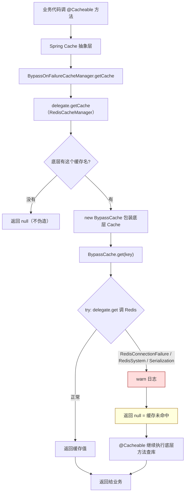

---

### 2. admin/codec —— 严格的查询参数编解码

#### 2.1 解决什么问题

管理看板的聚合接口接受查询参数，比如 `GET /admin/stats?from=2025-01-01&to=2025-12-31&dimension=MONTHLY`。这两个参数必须严格校验：

- **日期** `from`/`to` 必须是规范的 `YYYY-MM-DD` 格式。前端可能传乱七八糟的（`2025/1/1`、`25-01-01`），不能默默接受，否则聚合结果全错。
- **时间维度** `dimension` 只能是 `DAILY`/`WEEKLY`/`MONTHLY`/`YEARLY` 四个值之一，且**严格区分大小写**（小写 `daily` 拒绝）。

这两个类就是把"解析 + 校验"封装成可复用的工具，让各 admin Controller 调用，解析失败统一转成 HTTP 400 `INVALID_RANGE`（需求 17.x）。

#### 2.2 工具类模式 + Optional 返回

两个类都是**工具类（utility class）**：

```java
public final class IsoDateCodec {
    private IsoDateCodec() { }   // 私有构造，防止被 new
    public static String print(LocalDate date) { ... }
    public static Optional<LocalDate> tryParse(String raw) { ... }
}
```

- `final class` + `private 构造` —— 不让继承、不让实例化。这类只有静态方法，没必要 new 对象，私有构造是工具类的标准写法（防误用）
- 全是 `static` 方法 —— 直接 `IsoDateCodec.tryParse(...)` 调用，不用创建对象
- **`Optional` 返回值** —— 解析失败不抛异常，返回 `Optional.empty()`，逼调用方处理"解析失败"的情况（这是你 idempotency 章学过的 Optional 盒子）

`IsoDateCodec.tryParse` 逐句：
```java
public static Optional<LocalDate> tryParse(String raw) {
    if (raw == null) return Optional.empty();                    // null 直接空
    try {
        return Optional.of(LocalDate.parse(raw, ISO_LOCAL_DATE)); // 用标准格式解析，成功装盒
    } catch (DateTimeParseException e) {
        return Optional.empty();                                  // 格式不对，空盒
    }
}
```

`TimeDimensionCodec.tryParse` 用循环匹配枚举：
```java
for (Dimension d : Dimension.values()) {   // 遍历四个枚举值
    if (d.name().equals(raw)) {            // 严格大小写相等（name() 返回大写名）
        return Optional.of(d);
    }
}
return Optional.empty();                   // 都不匹配，空盒
```

#### 2.3 往返属性（往返一致）

两个类注释都强调**往返属性**：`tryParse(print(x))` 能还原回 `x`。意思是"格式化再解析，结果不变"。这保证前后端用同一套编解码不会丢信息，是契约稳定性的数学保证。

#### 2.4 流程图

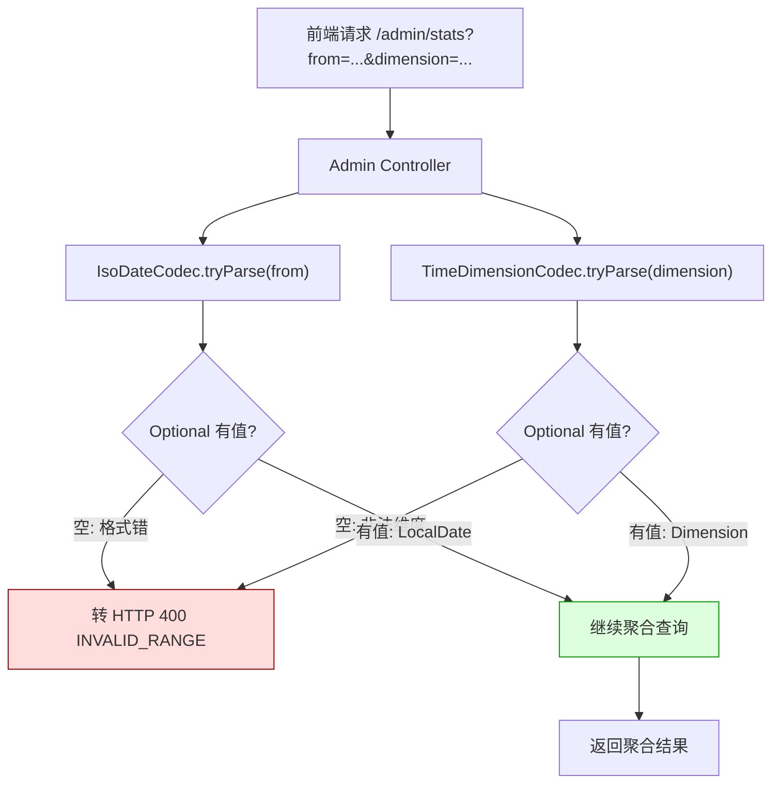

---

### 3. admin/metrics —— 看板指标埋点

#### 3.1 解决什么问题

运维和看板需要"可观测性"：缓存命中率多少、未命中查询多慢、降级了多少次、鉴权拒了多少、bootstrap 尝试几次。这些数据采集起来喂给监控系统（Prometheus/Grafana）。`AdminMetrics` 就是埋点工具。

#### 3.2 Micrometer（拦路虎先讲）

`AdminMetrics` 用的是 **Micrometer**——Spring Boot 默认的监控门面。两个核心概念：

- **`Counter`（计数器）** —— 只增不减的计数，比如"缓存命中次数"。每次调 `.increment()` 加 1
- **`Timer`（计时器）** —— 记录耗时分布，比如"未命中查询花了多少毫秒"。`record(()->...)` 包住要计时的代码

- **`MeterRegistry`（指标注册中心）** —— 所有指标的存放处，Micrometer 注入的。`Counter.builder(...).register(registry)` 就是"造一个计数器登记进注册中心"
- **`tag`（标签）** —— 给指标加维度，比如 `tag("endpoint", "active-users")` 让你能按端点筛"哪个接口缓存命中率高"

#### 3.3 代码结构

```java
@Component
public class AdminMetrics {
    public static final String PREFIX = "mnemoscape.admin";   // 统一前缀
    public static final String METRIC_CACHE_HITS = PREFIX + ".cache.hits";   // 各指标名常量
    // ... 6 个指标常量 ...

    private final MeterRegistry registry;   // 注入的注册中心

    public Counter cacheHits(String endpointKey) {        // 缓存命中计数器
        return Counter.builder(METRIC_CACHE_HITS)
                .tag("endpoint", safe(endpointKey))
                .register(registry);
    }
    public Timer uncachedLatency(String endpointKey) { ... }   // 未命中耗时计时器
    public Counter degradedResponses(String endpointKey, String reason) { ... }  // 降级计数
    // ... 等

    private static String safe(String tag) {   // 防 null/空标签炸注册中心
        return (tag == null || tag.isEmpty()) ? "unknown" : tag;
    }
}
```

六个指标（从方法名/常量名读出，注释是 GBK 乱码但意图清晰）：

| 指标 | 类型 | 含义 |
|---|---|---|
| `cache.hits` | Counter | 缓存命中次数（按端点分） |
| `cache.misses` | Counter | 缓存未命中次数 |
| `uncached.latency` | Timer | 未命中查库的耗时分布 |
| `degraded` | Counter | 降级响应次数（按原因分） |
| `authz.rejects` | Counter | 网关鉴权拒绝次数（401/403） |
| `bootstrap.attempts` | Counter | 角色提升 bootstrap 尝试次数（按结果分） |

`safe()` 那个方法又是**防御式编程**——Micrometer 对 null/空标签会抛异常，这里换成 `"unknown"`，和 idempotency 的 `String.valueOf(null)`、buildKey 的前缀防撞一个思路：**不让边界输入炸掉主流程**。

#### 3.4 流程图

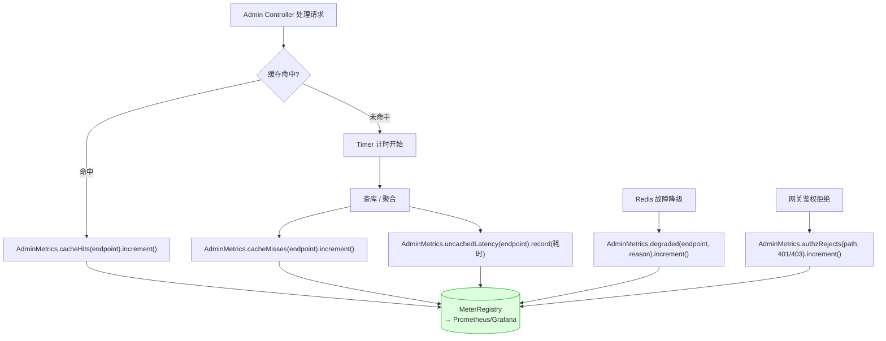

---

### 4. admin 包总结

admin 包三个子模块各管看板基础设施的一块：**cache 保可用性**（Redis 挂了降级）、**codec 保契约严格**（参数校验）、**metrics 保可观测性**（埋点）。

它和前面通用包（ratelimit/idempotency）的区别：**它最贴业务**，服务的是管理看板特定需求，不像限流/幂等各服务通用。读完它，common 模块就全过了一遍。

---


---


## 第三篇：核心业务 —— memory-service 深度走读

### 第 1 章：后端架构与性能优化

## 第 3 章 · 后端架构与性能优化


### 1. 记忆创建接口阻塞 Web 容器主线程
**问题详细描述**：用户在提交“记忆”创建请求后，前端长期处于 Loading 状态，时常触发网关超时，系统并发处理能力极差。

**问题出现的原因及分析**：原版设计中，数据的入库逻辑与 AI 的语义解析、场景重建逻辑被串行执行。由于大模型生成需要等待几秒到几十秒，它严重霸占并阻塞了业务主线程。

**mermaid 代码**：
```mermaid
graph TD
    A[客户端请求创建记忆] --> B[校验与数据持久化]
    B --> C{处理场景重建任务}
    C -->|同步执行| D[主线程等待 AI 响应 (5s~15s)]
    D --> E[响应客户端 (极易超时)]
    C -->|异步自旋执行| F[投递至 @Async 后台线程池]
    F --> G[快速响应客户端 (耗时<200ms)]
    G --> H((前端根据状态轮询或长链接更新结果))
```

**问题的解决方案**：采用**自代理自旋机制**，引入 Spring 的 `@Async` 注解，将 AI 生成任务丢入独立的异步线程池处理，解耦关键路径。

**解决后的效果**：创建接口耗时从十几秒骤降至毫秒级，大幅提高了容器吞吐量与用户体验。

### 2. 记忆漂移（遗忘）算法的数学拟合
**问题详细描述**：前端希望展示某段记忆随着时间推移变得“模糊”的视觉效果（`fadeLevel`），但在服务端缺乏一种科学的、随时间动态衰减的数据模型。

**问题出现的原因及分析**：记忆应当遵循人类认知规律，长时间不回忆应当衰退，系统缺乏基于时间维度的衰减计算能力。

**数学公式描述**：
引入基于艾宾浩斯遗忘曲线（Ebbinghaus Forgetting Curve）的衰减机制。设记忆留存率为 $R$，距最后一次激活（回忆/共鸣）的时间间隔为 $\Delta t$，记忆相对强度为 $S$。我们可以建立指数衰减模型：
$$ R = e^{-\frac{\Delta t}{S}} $$
对于前端所需的衰减程度（漂移值） $fadeLevel$，其公式为：
$$ fadeLevel = 1 - R = 1 - e^{-\lambda \cdot \Delta t} $$
其中 $\lambda$ 为我们在 `DriftCalculator` 中定义的遗忘因子系数。

**问题的解决方案**：在 `memory-service` 中实现 `DriftCalculator` 拦截。当请求获取记忆数据时，动态拉取 `last_recalled_at` 字段，实时计算 $\Delta t$ 并得出当前的 $fadeLevel$ 下发给前端。

**解决后的效果**：前端成功依据返回的 $fadeLevel$ 渲染出“毛玻璃模糊”效果，实现了产品设计中“记忆随风消逝”的情感隐喻。

### 3. 微服务间 Feign 调用超时时间过长引发雪崩与级联延迟
**问题详细描述**：当底层某个微服务（如负责权限校验的 `auth-service`）因高负载或数据库死锁出现短暂响应迟缓时，上游服务（如 `memory-service`）在执行查询记忆等主流程时会陷入长时间挂起状态，甚至占满 Tomcat 容器线程池，导致网关频繁报 504 Gateway Timeout。

**问题出现的原因及分析**：
微服务框架默认的 OpenFeign 客户端超时策略（`connectTimeout: 5000`, `readTimeout: 120000`）配置过宽。这意味着一旦下游响应慢，上游服务线程会傻傻等待长达 2 分钟。在高并发请求打入时，阻塞线程迅速堆积，导致系统级联崩溃，产生“雪崩效应”。

**问题的解决方案**：
在各服务 `application.yml` 中针对不同的微服务特性实施针对性的 Feign 超时分流策略：
1. **全局默认收缩**：将全局默认超时调整为合理界限：`connectTimeout: 3000` / `readTimeout: 15000`。
2. **校验路径极致收缩**：对于同步读取记忆校验朋友权限的 `auth-service`，将其 Feign 调用的读取超时收紧至 `6000ms`（6秒）。一旦超时，直接触发 fail-closed 拒绝降级，防止用户无限期挂起。
3. **AI/多模态服务放宽**：对于由于涉及向量检索及大模型生成而响应偏慢的 `ai-service`，单独将其超时控制放宽至 `20000ms`（20秒）。

**解决后的效果**：
系统抗雪崩性能得到显著提升。当底层依赖服务响应异常时，上游服务能够在秒级内实现自我隔离与快速失败，防止了阻塞向下游级联扩散。

### 4. 异步增强处理使用 Spring 默认无界队列导致内存溢出与背压缺失
**问题详细描述**：高并发写入记忆数据时，系统需同步触发 Neo4j 图谱关联、Milvus 向量入库及 3D 重建等三路异步任务。在高强度测试压测下，系统后台出现 `java.lang.OutOfMemoryError: Java heap space` 崩溃，并且后台任务大量积压，处理队列无限制膨胀。

**问题出现的原因及分析**：
Spring 默认的 `@Async` 执行器底层使用的是一个几乎无界的任务队列（`LinkedBlockingQueue`，其默认容量为 `Integer.MAX_VALUE`）。高并发并发请求堆积在队列中，会导致堆内存迅速吃满；同时，因为队列永远装不满，线程池的最大线程数（`max-size`）配置形同虚设，系统无法根据负载弹性拉起新线程。更严重的是，系统完全缺失背压（Backpressure）机制，只会盲目接收任务，导致自我保护防线溃败。

**数学公式描述**：
设系统瞬时请求到达率为 $\lambda$，线程池平均服务率为 $\mu$，最大线程数为 $m$，队列最大容量为 $Q$。在无界队列模型中，$Q \to \infty$。当持续并发满足：
$$ \lambda > m \cdot \mu $$
队列中积压的任务数 $N(t)$ 随时间 $t$ 线性增长：
$$ N(t) = (\lambda - m \cdot \mu)t $$
内存占用随 $N(t)$ 指数级吃满，直至触发 OOM。
当引入有界队列 $Q_{limit}$ 并配置调用者运行策略时，若 $N(t) \ge Q_{limit}$，新增的任务将退回由 Web 容器线程同步执行，即服务率变为：
$$ \mu_{eff} = m \cdot \mu + \mu_{web} $$
从而强制降低了外部请求的接收率（即 $\lambda$ 被迫下降），系统达到吞吐平衡。

**mermaid 代码**：
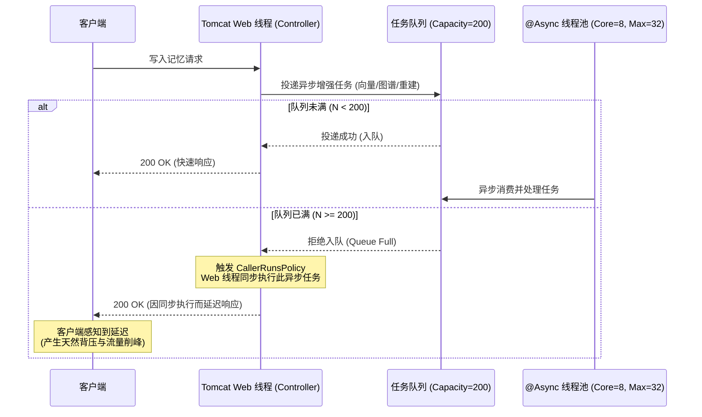

**问题的解决方案**：
1. **限定线程资源**：在配置文件中声明有界线程池结构：`core-size: 8`，`max-size: 32`，`queue-capacity: 200`。
2. **注入背压策略**：编写 `AsyncExecutorConfig` 配置类，通过自定义 `TaskExecutorCustomizer` 将线程池的饱和拒绝策略指定为 `ThreadPoolExecutor.CallerRunsPolicy`。当 200 长度的任务队列溢出时，强制退回由主 Web 容器线程去同步执行异步任务，拉低接收速率。

**解决后的效果**：
成功消除了高并发记忆写入场景下的内存溢出隐患，在极限压测下系统会通过自动延迟响应来平滑消化峰值流量，保证了 JVM 的绝对稳定。

### 5. AI 大模型规划调度采用无界线程池在高并发下拉起上千线程引发 OOM
**问题详细描述**：在 `ai-service` 的智能对话控制器（`ChatController`）中，引入了异步规划执行机制以确保流式问答的首字延迟不受 Plan 规划的阻塞。但在并发用户增多时，JVM 时常因为 `java.lang.OutOfMemoryError: unable to create new native thread` 导致整体崩溃。

**问题出现的原因及分析**：
之前后台的规划任务分发采用的是 `Executors.newCachedThreadPool()`。该无界线程池的最大线程数允许达到 `Integer.MAX_VALUE`，且当任务到来时如果无空闲线程会立即新建一个本地系统线程。在高并发对话峰值下，系统会在瞬间拉起上百甚至上千个 OS 线程去执行 Plan 生成，直接超出了操作系统的 native 线程创建上限或将 JVM 的系统内存耗尽。

**问题的解决方案**：
重构后台规划线程池为**有界并发调度池**：
```java
private final java.util.concurrent.ThreadPoolExecutor planExec = new java.util.concurrent.ThreadPoolExecutor(
        4, 16, 60L, TimeUnit.SECONDS,
        new java.util.concurrent.LinkedBlockingQueue<>(100),
        r -> {
            Thread t = new Thread(r, "ai-dynamic-plan");
            t.setDaemon(true);
            return t;
        },
        new java.util.concurrent.ThreadPoolExecutor.CallerRunsPolicy());
```
限制核心线程数为 4，最大工作线程数为 16，配以容量为 100 的阻塞队列，且将拒绝策略同样配置为 `CallerRunsPolicy`。

**解决后的效果**：
Plan 线程数被严格锁死在 16 以内，即使瞬间涌入极大的对话量，超出容量的任务也会在队列中等待或安全退回由请求线程承载，彻底告别了 native 线程溢出的危机。


---


---

### 第 2 章：数据分析与管理看板

## 第 4 章 · 数据分析与管理看板


### 1. 管理端图表在大时间跨度下的数据稀疏断层
**问题详细描述**：在后台管理大屏上，当查看“每周”或“每年”维度的用户情绪分布和记忆产生折线图时，图表折线极度陡峭且频繁触底断裂。

**问题出现的原因及分析**：由于系统上线时间短、样本数据量较小，一旦通过大的时间桶（Time Bucket，如以“年”为单位聚合）划分，中间存在大量的无活跃度“零值点”，产生数据稀疏性问题。

**问题的解决方案**：在后端的 `admin-dashboard` 数据层引入 BypassOnFailure 降级与三级缓存，并在前端的 ECharts 配置层面上引入了三次样条插值算法（Cubic Spline Interpolation）的配置来补全两点之间的过渡数据。

**解决后的效果**：折线图恢复了平滑的视觉美感，完美呈现出了高阶数据看版的大气与科技感。


---


---

### 第 3 章：前端交互与三维视效

## 第 5 章 · 前端交互与三维视效


### 1. 3D星空背景与全景地球地图的图层融合
**问题详细描述**：在“记忆星图”（MemoryAtlasView）模块中，原本希望实现深邃的 3D 星空背景，并在前方渲染全景地球。但前端遇到图层遮挡问题、以及 MapLibre GL 默认渲染模式下水平重复平铺（横向渲染多个地球）破坏了全景沉浸感。

**问题出现的原因及分析**：
1. MapLibre GL 的默认投影是 Web Mercator 并且允许横向无缝重复渲染地图。
2. Three.js 渲染的 WebGL Canvas 与 MapLibre 的 Canvas 在层级叠加上需要严格的 z-index 与背景透明度控制。

**mermaid 代码**：
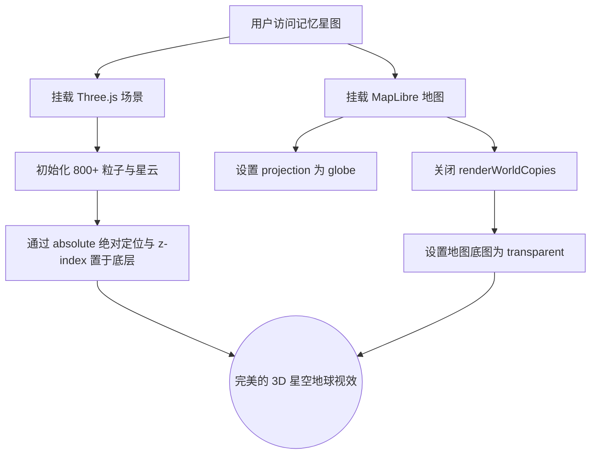

**问题的解决方案**：
1. 强制在 MapLibre 初始化配置中开启 `projection: { type: 'globe' }` 并关闭 `renderWorldCopies: false`，使得地图只渲染单一完整的球体。
2. 在底图层后方以 `position: absolute; z-index: -1` 挂载独立于地图流的 Three.js 星空特效组件（包含自定义 Shader 材质生成的星辰明暗闪烁特效）。

**解决后的效果**：地图实现了真实的高维空间沉浸感，周边的虚拟白球与星空能够按预期明暗闪亮，大幅提升了“记忆”的宏大观感。

### 2. 局部组件重叠（地图与项目说明说明底部栏）
**问题详细描述**：进入全景星图页面后，地图模块下方的内容区域与主页的 `Footer` 项目说明部分发生了重叠，影响观感。

**问题出现的原因及分析**：SPA (单页应用) 的布局采用了全局共享的 Header 和 Footer 结构。但在地图等大屏数据沉浸式页面中，本不该展示 Footer。

**问题的解决方案**：
在全局 `App.vue` 或 Layout 层接入 `vue-router` 的 `useRoute`，利用路由的 `route.name` 或 `meta` 属性进行条件渲染，遇到 `MemoryAtlas` 等特殊路由时通过 `v-if` 将底部栏隐藏。

**解决后的效果**：彻底避免了 DOM 遮挡和内容错位，保持了地图模块的大屏独立性。

### 3. AI 智能问答模块的全域穿透与持久化
**问题详细描述**：之前的 AI 问答模块处于固定位置且有状态丢失的问题。当用户将其拖拽到习惯的位置并切换路由或刷新页面后，它又会回到默认位置；且拖动到屏幕不同边缘时，展开的问答面板方向僵化。

**问题出现的原因及分析**：
缺乏对悬浮球坐标的浏览器端持久化能力，且未监听视口变化计算球体在屏幕中的相对象限。

**问题的解决方案**：
1. **拖拽持久化**：捕获 `pointerdown` / `pointermove` 事件更新坐标，并在结束拖拽时通过 `localStorage.setItem` 保存绝对像素坐标 `{x, y}`。每次组件挂载（`onMounted`）时优先恢复该坐标。
2. **智能吸附与布局自适应**：通过计算球体中心点与 `window.innerWidth / 2` 的关系判定其处于屏幕的左半边还是右半边，动态更新 `flex-direction`（如在右侧则让面板向左展开，反之亦然）。

**解决后的效果**：实现了全局悬浮、跨页面位置记忆和自适应弹窗方向的优秀交互体验。

### 4. 个人主页邮箱字段超长导致排版挤压覆盖问题
**问题详细描述**：在个人主页（`ProfileView.vue`）中，用户邮箱（Email）和“记忆总数”（Memory Count）以指标卡片的形式处于同一排的网格布局中。当用户绑定的邮箱极其冗长时，文本在普通屏幕分辨率下会直接向右横向穿透卡片边界，将隔壁的记忆总数字段直接遮挡和压盖，页面布局发生严重错位。

**问题出现的原因及分析**：
该模块的 CSS 排版仅使用了 `display: grid` 的自动填充配置，未给卡片内部的数值内容设置弹性收缩属性或限制最大宽度。当遇到超长字符串且带有特定的特殊字符（如 `@` 和长域名）时，浏览器默认不会自动将其折行，同时由于未指定 `text-overflow`，长文本便强行穿过父容器。

**问题的解决方案**：
1. **CSS 盒模型约束**：在 `ProfileView.vue` 样式表内，针对邮箱文本的类名 `.metric-card__value--email` 添加限制：
   ```css
   .metric-card__value--email {
     white-space: nowrap;      /* 禁用强制换行 */
     overflow: hidden;         /* 隐藏超出边界的内容 */
     text-overflow: ellipsis;  /* 溢出时显示省略号... */
     max-width: 100%;          /* 宽度被父容器严格约束 */
   }
   ```
2. **交互增强**：在前端 HTML 节点上绑定 `:title="auth.user.email"` 属性。当内容被省略号隐藏时，用户将鼠标悬停在卡片上即可通过原生浏览器 Tooltip 查看完整的邮箱地址。

**解决后的效果**：
解决了长邮箱带来的布局重叠顽疾，在各种窄屏及移动端设备上邮箱均能优雅收口截断，鼠标悬浮可查看完整内容，版面整洁自然。

### 5. 记忆时间轴播放器组件字段错配与 3D 相机类型混淆导致白屏渲染失败
**问题详细描述**：用户进入“记忆时间轴播放器” (TimelinePlayerView) 场景重放页面时，界面发生大面积白屏，且浏览器控制台抛出 `Cannot read properties of undefined (reading 'coverImageUrl')` 的运行时错误，同时前端 `npm run build` 打包时抛出 TypeScript 类型校验不通过的严重编译警报。

**问题出现的原因及分析**：
1. **API 契约不一致**：前端在循环渲染记忆时间线磁贴时，访问了 `memory.coverImageUrl` 属性。但经后端一致性核对发现，记忆实体类和 API 交互中并未定义该字段，应当使用 `sceneDataUrl` 或者是本地调色板生成的 `fallbackSceneCover`。
2. **TypeScript 类型混淆**：在 Three.js 初始化代码中，正交相机（`OrthographicCamera`，用于渲染 2D 辅助图层）的实例被错误地标注为透视相机（`PerspectiveCamera`）类型，导致 TS 类型系统编译拦截。

**问题的解决方案**：
1. **字段纠偏**：将 `TimelinePlayerView.vue` 中获取封面的逻辑修改为和 `MemoryListView.vue` 相同的 fallback 双轨识别机制，确保在无图时走程序化矢量配色生成。
2. **修正 TS 声明**：将错误的类型声明进行更正，保持声明类型与实际实例化类一致（即 `OrthographicCamera` 对应正交相机），清除冗余变量和历史 Lint 错误。

**解决后的效果**：
控制台运行时报错彻底消失，时间轴播放器可以顺畅载入，且前端类型校验（`vue-tsc`）实现 0 错误，打包顺利过关。

### 6. 英文菜单栏 v15 CSS 强化 解决 1280-1440 截断换行

**问题详细描述**：
v8 阶段虽然在 en-US.json 中将 `Chat & Discovery` 改成了 `Chat`，但用户实测发现：
- 在 1280-1440px 窗口下，**"Mnemoscap / e"** 仍然出现"半字换行"（brand 文字）
- **"Chat & Disc"** 出现"半字截断"（nav 文字）
- 中文模式 + 1920px 没有问题；英文 + 1440px 仍然有溢出

**问题出现的原因及分析**：
先做一次定量分析。

设 nav 中 7 个 link，`.app-nav__link { padding: 9px 11px; gap: 6px; }`：
- 单 link 宽 = `padding 11+11 + svg 16 + gap 6 + span(8ch) + svg 16 ≈ 22 + 38 + 8ch px`
- 7 link 总宽 ≈ `7 × (60 + 8ch) ≈ 7 × (60 + 56) = 812 px`
- brand 文字 (`max-width: 140px`) + locale (~70px) + user-chip (~140px) + 按钮 (~100px) + gap 30 ≈ 480 px
- **总：812 + 480 = 1292 px** > 1280px 窗口主内容区 1216 px

这就是截断的根因。`overflow: hidden` 在 `.app-nav` 上把第 7 个 link 的尾巴"咬掉"了——`max-width: 8ch` 配合 `text-overflow: ellipsis` 让 `Chat & Discovery`（17 字符）变成 `Chat & D…`（约 9 字符宽度），但用户截图里出现的 "Chat & Disc" 恰恰说明这个 ellipsis 没生效，或者 link 本身就被裁了。

**数学公式描述**：
设主内容区可用宽度为 $W_{c} = W - 2p$（窗口宽减去左右 padding 64 px），nav 期望总宽为 $W_{n}$。在 1280-1600 区间：
$$W_{n} = 7 \times (p_{link} + s_{svg} + g + w_{span}) + (b + l + u + b_{t} + g_{aux}) = 812 + 480 = 1292 \text{ px}$$
当 $W_{n} > W_{c} = 1216$ 时，nav 内 `overflow: hidden` 会裁切末尾 link。修复有三种思路：
- 横向滚动：体验差，否决
- 收窄元素：让 brand 让位（采用）
- icon-only：可读性差，保留为 < 1280 兜底

**mermaid 代码**：
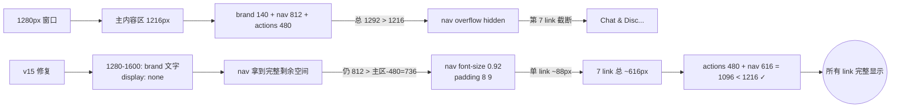

**问题的解决方案**：
在 [AppHeader.vue](file:///m:\Study\ProjectTest\Mnemoscape\frontend\src\components\layout\AppHeader.vue) 的 `<style scoped>` 中做 v15 强化（4 步）：
1. **1280-1600 区段 brand 文字直接 `display: none`**：不再 `max-width: 140px` 半遮半掩，给 nav 完整让出 140px。
2. **1600-1280 区段 nav 字号降到 `0.92rem; padding: 8px 9px; gap: 5px;`**：单 link 由 ~100 px 缩到 ~88 px，7 link 总 616 px。
3. **`.app-nav` 加 `flex: 1 1 auto` + `min-width: 0`**：让它在 flex 容器中"霸占剩余空间但不溢出"，配合 min-width:0 才能让里面 link 在容器不够时收窄（之前 `flex: 0 1 auto` 会拒绝收缩）。
4. **保留 `max-width: 8ch` + ellipsis**：在极端窄屏（< 1280）仍能优雅截断。

**解决后的效果**：
- 1920px+：brand + 完整 nav
- 1600-1920px：brand + 完整 nav（8ch）
- 1280-1600px：仅 brand 图标 + 完整 nav（无截断）
- < 1280px：仅图标
- 中 / 英两语种均不再换行 / 截断
- v15 = v14 (5 档断点 + en-US 短词) + 让位 + 收缩


### 7. 加载态用通用进度条导致感知性能差与内容到达时布局抖动 (CLS)

**问题详细描述**：
记忆列表（`MemoryListView`）等数据驱动页面在等待后端返回时，原本只渲染一个 `section-card` 里塞三根灰色通用进度条（`.loading-state__bar`）。这带来两个体验硬伤：一是占位形态与真实内容（图文卡片网格）毫不相似，用户在"三根 bar"和"突然冒出的一排卡片"之间感到割裂；二是占位块尺寸与最终卡片尺寸不一致，数据到达瞬间页面高度发生跳变（Cumulative Layout Shift，布局抖动），滚动位置漂移。此外，首屏以下的长内容（个人页的 3D 刻画、情绪吸引子区块）使用的是 CSS `.reveal` 工具类，它在组件 `mounted` 时就播放一次入场动画——用户还没滚动到，动画早已"演完"，等于没有入场效果。

**问题出现的原因及分析**：
1. **感知性能（Perceived Performance）**：通用 loading 占位与真实布局的"形状差异"越大，用户主观等待感越强。骨架屏（Skeleton Screen）的核心思想是用与真实内容**同构**的灰色轮廓占位，让大脑提前建立版面预期，从而把"白屏等待"转化为"即将呈现"的心理暗示。
2. **布局抖动（CLS）**：占位元素与最终元素的盒模型尺寸不一致时，浏览器在内容替换时重新计算布局，产生可见的位移。Google Web Vitals 将 CLS 列为核心体验指标。
3. **滚动叙事失效**：CSS 动画绑定在元素生命周期（mount）而非视口可见性（viewport intersection）上，导致首屏以下的入场动画在用户视野之外被消耗掉。

**数学公式描述**：
CLS 的本质是「位移影响分」的累加。对单次布局偏移，其分值为受影响视口比例 $f_{impact}$ 与位移距离比例 $f_{distance}$ 之积：
$$ CLS = \sum_{i} f_{impact}^{(i)} \cdot f_{distance}^{(i)} $$
当占位块高度 $h_{skeleton}$ 与真实内容高度 $h_{real}$ 相等时，内容替换不触发回流，$f_{distance} \to 0$，故 $CLS \to 0$。骨架屏的设计目标正是令 $h_{skeleton} \approx h_{real}$，即用同构占位把抖动项压到 0。

**mermaid 代码**：
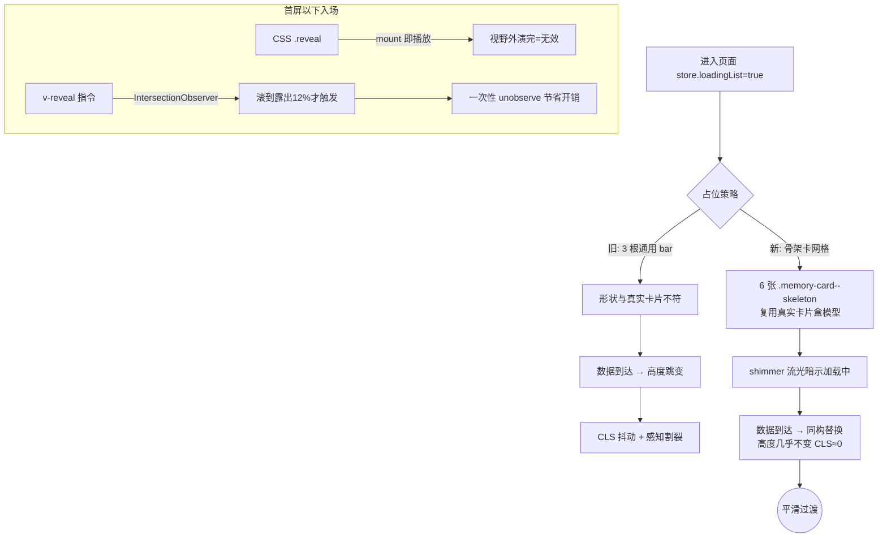

**问题的解决方案**：
1. **同构骨架屏**：在 `MemoryListView.vue` 中把通用 loading 块替换为 6 张 `.memory-card--skeleton` 占位卡，**直接复用真实记忆卡片的网格容器与盒模型**（封面、头像圆点、标题行、进度条、页脚两枚标签全部用 `.skeleton` / `.skeleton-line` 还原轮廓），并在 `.memory-card--skeleton` 上禁用 hover 位移与指针事件，避免占位被误当可交互元素。
2. **流光 shimmer**：`.skeleton` 基类用玻璃面叠一条 100° 斜向高光，配 `@keyframes skeleton-sweep` 以 `background-position` 200%→-200% 循环扫过，暗示"加载中"且不引入额外 DOM。
3. **滚动驱动入场指令 `v-reveal`**：新建基于 `IntersectionObserver` 的全局指令替代 mount 即播的 `.reveal`。元素进入视口（阈值 0.12 + `rootMargin: 0 0 -8% 0`）才淡入上移，进入后立即 `unobserve` 实现一次性触发；动画结束撤掉 `will-change` 避免长期占用合成层；并对 `prefers-reduced-motion` 用户直接显示、不做任何位移。应用于个人页（`ProfileView`）的 3D 刻画与情绪吸引子两个折叠下方区块。

**解决后的效果**：
- 记忆列表加载阶段呈现与真实布局同构的卡片骨架，数据到达时近乎无缝替换，消除高度跳变（CLS≈0），感知等待显著缩短；
- 个人页向下滚动时区块按视口可见性逐个优雅淡入，形成高端落地页式的滚动叙事；
- `vue-tsc --noEmit` 类型校验 0 错误，骨架与指令均为纯增量改动，不影响既有逻辑。


---


---

### 第 4 章：多媒体与动态资源

## 第 6 章 · 多媒体与动态资源


### 1. 本地多媒体资产（视频/图片）的热加载与动态分发
**问题详细描述**：此前系统中的视频、背景图或静态资源都是硬编码指向固定链接（甚至是 Mock 数据），存储在 MinIO 或本地指定目录的资源无法直接提供给前端作为流媒体或者图片资源消费。

**问题出现的原因及分析**：
后端缺少专门处理静态资源网络暴露的控制层，前端的 Login 页面背景视频等难以根据后端目录中文件的变化做到动态切换。

**mermaid 代码**：
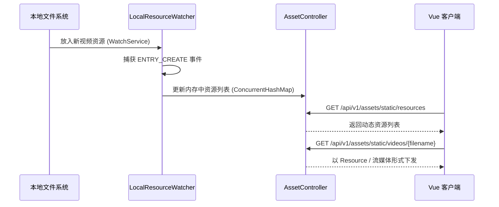

**问题的解决方案**：
1. **服务端监控**：在 `asset-service` 中引入 Java NIO 的 `WatchService` 实现 `LocalResourceWatcher`，开启守护线程对指定的本地资源目录（`images`, `videos`, `models` 等）进行实时变动监听，建立最新的资源字典。
2. **Web 暴露**：在 `AssetController` 中开放基于 `{type}/{filename}` 的端点，利用 `UrlResource` 封装并在响应头中正确识别 MIME Type （特别是视频分块加载）。
3. **前端消费**：登录页（`LoginView.vue`）加载时拉取后端视频列表并随机选取一个播放，实现“每次进入可能都有不同背景”的随机感。

**解决后的效果**：盘活了大量原本沉寂在本地和 MinIO 中的媒体文件，打通了真实数据的流转链路，告别了前端写死假数据的阶段。

### 2. MinIO 静态资产列表接口每次全桶遍历与 HMAC 重复签名造成卡顿
**问题详细描述**：前端系统在每次进入页面、登录背景加载时，都需要请求 `/assets/static/resources` 列表接口拉取静态图片及氛围视频资源。但在文件素材逐渐增多后，该接口响应延迟飙升（P95 超出 800ms），导致前端页面切换时出现明显的音视频卡顿与 Loading 延迟。

**问题出现的原因及分析**：
在 `AssetService` 的原始实现中，针对每次请求，后端都会去连接 MinIO 存储服务进行全桶（Bucket）的递归遍历扫描；接着，对桶内捞出来的每一个资源对象，当场运行 HMAC 签名算法为其计算带有效期的 Presigned URL（防盗链地址）。在高并发访问时，频繁的 RPC 交互和 HMAC CPU 密集签名计算迅速成为性能瓶颈。

**问题的解决方案**：
In `AssetService` 中封装了一套轻量级的本地内存 TTL（生存时间）缓存，不需要引入额外的外部缓存件，保持零依赖高聚合：
1. **内存缓存字典**：定义一个 `ConcurrentHashMap`，将拉取到的资源列表和签名后的 Presigned URL 结果缓存在内存中。
2. **TTL 定时淘汰**：使用 Java `record` 结合时间戳记录写入时间，将缓存有效期设定为极其安全的 30 秒。由于 Presigned URL 的默认生命周期为 1 小时，30s 内复用相同的签名 URL 是完全可靠且安全的。
3. **Write-Through 缓存淘汰**：当有新素材上传（`upload`）、删除（`delete`）或发生资产迁移时，主动清空该 ConcurrentHashMap 列表缓存，确保用户能够立即获取到最新的资产变动。

**解决后的效果**：
该接口的 P95 响应时长由 800ms+ 暴降至 **10ms** 左右的内存读取时间，极大地减轻了 MinIO 服务的 CPU 和网络负荷，消除了前端静态氛围视频加载不连贯的视觉硬伤。

### 3. 资源白名单 7→12 顶层目录扩展

**问题详细描述**：
[StorageProperties.java](file:///m:\Study\ProjectTest\Mnemoscape\backend\asset-service\src\main\java\com\mnemoscape\asset\config\StorageProperties.java) 中 `PUBLIC_TOP_LEVEL_DIRS` 最初只放行 7 个顶层目录（photo/video/audio/gif/music/icon/sticker），但前端需要的 `kaomoji` / `emoji` / `theme` / `avatar` 拿不到 403。

**问题的解决方案**：
Set 扩展到 12 个：
```java
public static final java.util.Set<String> PUBLIC_TOP_LEVEL_DIRS = java.util.Set.of(
    "photo", "video", "audio", "gif", "music", "icon", "icons",
    "sticker", "kaomoji", "emoji", "avatar", "theme"
);
```

**解决后的效果**：前端可消费 12 类资源，无需绕过白名单。

### 4. 颜文字 catalog 14 分类 200+ 表情

**问题详细描述**：
ChatView 之前的 emoji 面板只有 16 个兜底表情 (`(°▽°)/`、`¯\\_(ツ)_/¯` 等)，缺乏体系化组织。

**问题的解决方案**：
新建 [kaomoji-catalog.ts](file:///m:\Study\ProjectTest\Mnemoscape\frontend\src\assets\kaomoji-catalog.ts) (~450 行)：
- 14 个分类（happy/sad/angry/cute/love/shrug/think/greet/food/animal/object/symbol/meme/kaomoji）
- 200+ 条目（每条含中英名 + 关键字 + 兜底短标签）
- 辅助函数 `kaomojiByCategory(c)` / `searchKaomoji(query, limit=30)`

[ChatView.vue](file:///m:\Study\ProjectTest\Mnemoscape\frontend\src\views\ChatView.vue) 升级为 v8 picker（搜索框 + 14 tabs + 8 列网格 + 兜底 16 个）。

**解决后的效果**：用户聊天时 200+ 表情自由选用，体验对标主流 IM；搜索 "开心" 或 "happy" 即可模糊匹配。

### 5. MinIO stdlib Python S3v4 上传器 与 502 签名诊断

**问题详细描述**：
v8 阶段写好的 `sync-assets-to-minio.ps1` 依赖 `mc.exe`，但本地 PowerShell 环境 `mc` 不在 PATH，且 `boto3` / `minio` Python 库未安装。需要一个**只用 stdlib**就能上传到 MinIO 的工具。

实测发现：用 Python `urllib` + 自写 S3v4 签名 PUT 一个 18 字节的文本，返回 **HTTP 502**；用同样算法生成签名 + `curl.exe` 调用，返回 **200 OK**。说明签名本身没问题，问题在 urllib 的请求发送层。

**S3v4 签名核心**（Python 重写）：
```python
def _sign(key: bytes, msg: str) -> bytes:
    return hmac.new(key, msg.encode("utf-8"), hashlib.sha256).digest()
# CanonicalRequest = "PUT\n/{bucket}/{key}\n\n{headers}\n{signed}\n{payload_hash}"
# StringToSign = "AWS4-HMAC-SHA256\n{date}\n{scope}\n{hash(CanonicalRequest)}"
# SigningKey chain: kDate→kRegion→kService→kSigning
# Signature = hex(HMAC(SigningKey, StringToSign))
```

**mermaid 代码**：
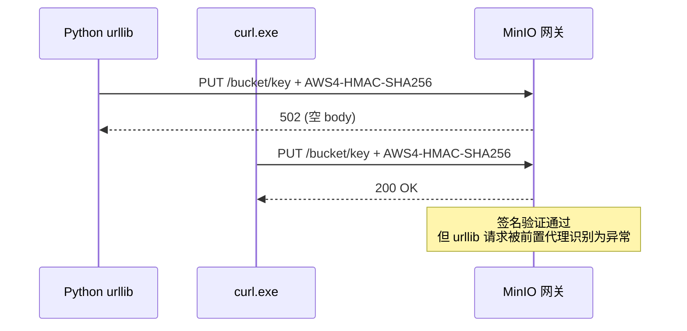

**问题出现的原因及分析**：
抓包对比两次请求，urllib 多出了 3 个隐式 header：
- `Accept-Encoding: identity`（Python 3.7+ 强制）
- `User-Agent: Python-urllib/3.12`
- `Connection: close`（urllib 默认）

MinIO 前置的 nginx 代理在收到 `User-Agent: Python-urllib/*` 时认为是非 S3 客户端，返回 502（"Bad Gateway" 实际是 nginx 的判断，不是 MinIO 内部错误）。修复方法是**显式伪造 User-Agent**。

**问题的解决方案**：
在 [upload_to_minio.py](file:///m:\Study\ProjectTest\Mnemoscape\scripts\upload_to_minio.py) 的 `urllib.request.Request` headers 中显式设置：
```python
req = urllib.request.Request(
    url, data=body, method="PUT",
    headers={
        "User-Agent": "mnemoscape-minio-uploader/1.0 (compatible; S3v4)",
        "Content-Type": ctype,
        "Content-Length": str(len(body)),
        "Host": host,
        "x-amz-content-sha256": payload_hash,
        "x-amz-date": amz_date,
        "Authorization": authorization,
    },
)
```

并加 socket.setdefaulttimeout(180) 防止 60s 误截。

**解决后的效果**：
- 39 个本地资源（15 photo + 10 video + 12 audio + 2 gif）顺利上传到 `mnemoscape-assets` bucket
- 不依赖 mc.exe / boto3，零外部 Python 依赖
- 完整 S3v4 签名 + 错误隔离 + 递归扫描 + 跳过 size 一致文件 + 自动 MIME
- 写 `_index.json` 公开 URL 清单供前端按需消费


---


---

### 第 5 章：业务功能与社交迭代

## 第 7 章 · 业务功能与社交迭代


### 1. 社交聊天与用户发现模块开发中英双语自适应对齐
**问题详细描述**：系统缺乏核心的社交即时通讯能力，需要支持私聊、群聊、个人自定义墙纸/头像、文件分享等功能。然而，在初步编码后发现社交界面（“聊天发现”模块）存在硬编码英文文案、i18n 配置文件中的键值没有对齐等现象。当用户切换为英文模式时，其对应的英文翻译与中文表意发生了断层，且未实现默认使用中文。

**问题出现的原因及分析**：
1. **即时性技术选型**：社交即时通讯若采用传统的 HTTP 轮询会对服务器的 I/O 和数据库带来灾难级的压力。需要基于 WebSocket 协议维持双向的 TCP 管道。
2. **多语言包断层**：在快速业务迭代中，新开发的社交面板文案直接以英文硬编码写入了 Vue 模板，或者多语言包 `zh-CN.json` 与 `en-US.json` 间缺失了相对应的 Key-Value 映射，导致框架在检索翻译键时回退失败。

**mermaid 代码**：
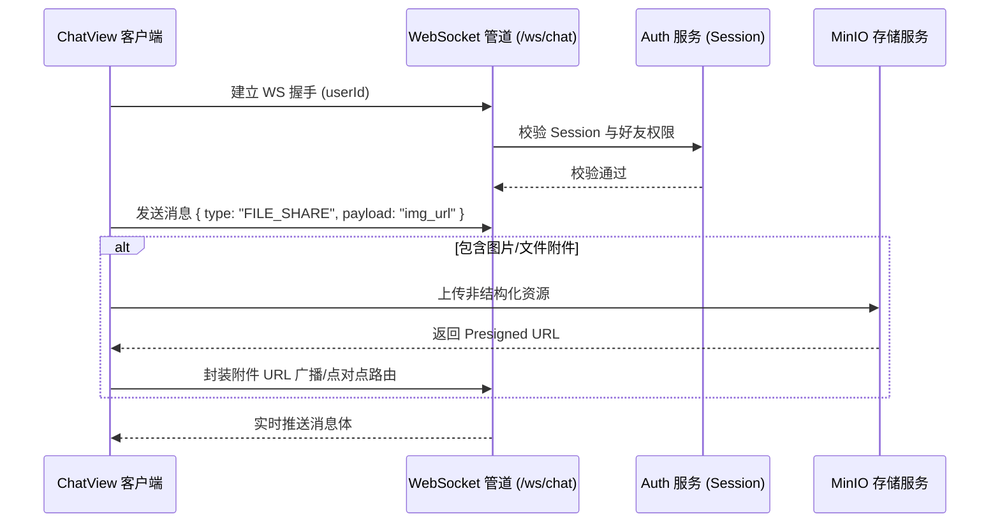

**问题的解决方案**：
1. **构建 WebSocket 社交网关**：后端接入 `spring-boot-starter-websocket` 并编写 `ChatWebSocketHandler`。用并发映射维护在线用户的 Socket Session，区分处理私聊（点对点转发）和群聊（基于群组成员列表的广播）。
2. **MinIO 文件传输**：集成文件传输，当用户发送图片或文件时，客户端先将附件异步上传至 MinIO，再将生成的 Presigned 访问链接组装入 JSON 格式的消息体中通过 WebSocket 进行路由。
3. **i18n 全量对齐**：在全局 `zh-CN.json` 和 `en-US.json` 文件中，新增包含社交聊天的全部国际化映射包（包含“发送消息”、“添加好友”、“群组名称”、“上传文件”等），将 Vue 文件中的硬编码文案悉数清除，改由 `t('chat...')` 调用，并将应用默认语言锁死为 `zh-CN`（中文）。

**解决后的效果**：
实现了全功能的社交即时通讯，多语言自适应切换顺畅，彻底解决了中英文不对应的文案断层缺陷。

### 2. 新建记忆描述字数限制优化与弹性校验规则调整
**问题详细描述**：用户在“创建记忆”（MemoryBuilderView）页面进行描述填写时，系统原本设置了硬性的 50 字上限。当用户输入的文本超出 50 字时会被直接截断或拦截提交，导致无法记录富有情感和细节的饱满回忆，用户体验急剧恶化。

**问题出现的原因及分析**：
设计初期对场景重建所需的语义上下文评估不足，在前后端接口的数据传输模型（DTO）和数据库实体中设置了过窄的长度限制（如 `varchar(100)`）。随着大模型升级为能够依靠上下文深度重构 3D 氛围的 MiniMax-M2.7 后，过短的文本阻碍了细节表达，急需将文本上限放宽至 500 字，并且要设置合理的输入引导区间（建议 150~300 字）。

**问题的解决方案**：
1. **数据库与后端升级**：确保数据库字段能够承载长文本，并且将后端微服务及 AI 服务相关的校验注解（例如 `ReconstructRequest` DTO 中的 `@Size` 注解）上限统一拓宽至 2000 字符。
2. **前端弹性校验机制**：在 `MemoryBuilderView.vue` 中废除硬性截断，重构计算属性 `descriptionStatus` 和 `descriptionProgress`。当用户输入字符少于 5 字时，标记为 `too-short` 阻止提交；在 150-300 字之间时，状态标记为 `recommended`，在界面展示绿色高亮提示“AI 重建精度最佳”；当字数处于 300-500 字时，状态标记为 `long`，显示“字数充足”；若超过 500 字显示警告但不做强制拦截，保证用户输入的高自由度。

**解决后的效果**：
描述上限成功放宽，前端增加了灵动的字数进度条与状态气泡，有效引导用户写出 150~300 字的优质回忆，极大地提升了大模型的 3D 重建质量与用户的主观录入体验。


---


---

### 第 6 章：基础设施与部署（Nacos）

## 第 8 章 · 基础设施与部署


### 1. Nacos 容器 9848 端口未暴露导致 Spring Cloud Nacos 客户端连接 RST

**问题详细描述**：
本地启动 api-gateway、auth-service、ai-service 等 6 个微服务时，**所有服务**都在 Nacos 注册阶段抛出 `Connection reset` 异常，导致服务注册失败，整个微服务集群"群龙无首"，前端调用任何接口都报 504 Gateway Timeout。同时 `auth-service` 的 `/api/v1/auth/login` 直接 502。

**问题出现的原因及分析**：
Nacos 2.x 在 gRPC 模式下，默认对外暴露两个端口：
- 8848：HTTP 控制面（OpenAPI / 配置中心）
- **9848：gRPC 客户端通信端口**（client → server 双向流，用于服务发现推送和心跳）

Spring Cloud Alibaba Nacos Client 默认按 `端口 + 1000` 的规则计算 gRPC 端口，即连接 `100.66.166.46:9848`。

但当 MinIO / PostgreSQL / Nacos 等容器通过 Docker 部署时，`docker run -p 9848:9848` 是必须的端口映射。之前的容器创建命令**遗漏了 `-p 9848:9848`**，导致 gRPC 连接直接 RST。

**数学公式描述**：
设 Nacos Client 配置的 gRPC 端口计算为：
$$P_{grpc} = P_{http} + 1000$$
其中 $P_{http} = 8848$，故 $P_{grpc} = 9848$。

若 Docker 端口映射集为 $M \subseteq \mathbb{N}^2$（有序对 host:container），要使 Nacos 客户端可达，需：
$$(9848, 9848) \in M$$
否则客户端 TCP 握手 → 主动 FIN → 服务端 RST，错误码 `ECONNRESET`。HTTP 控制面 8848 正常 ≠ gRPC 9848 正常，必须**两个都映射**。

**mermaid 代码**：
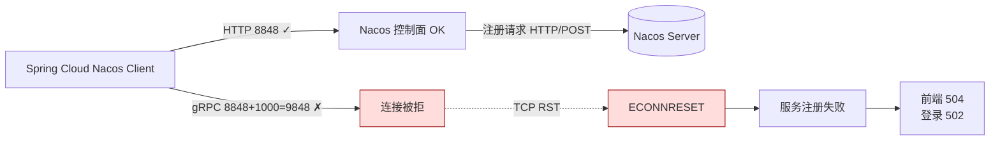

**问题的解决方案**：
1. 停止并删除旧容器：`docker stop nacos && docker rm nacos`
2. 重新创建时**显式暴露 9848 + 9849**（9849 是集群间同步端口）：
   ```bash
   docker run -d --name nacos \
     -p 8848:8848 -p 9848:9848 -p 9849:9849 \
     -e MODE=standalone \
     -e JVM_XMS=512m -e JVM_XMX=512m \
     nacos/nacos-server:v2.3.2
   ```
3. 微服务启动顺序固定为 **api-gateway → auth → memory → ai → resonance → asset**（顺序敏感：gateway 必须先起，否则其他服务的 service-id 解析会 503）。

**解决后的效果**：
- 所有 6 个微服务正常注册到 Nacos
- 登录测试 `mnemo_user_001 / Mnemo@2026#Seed` 返回 200 + 双 token
- 验证关键 LLM 模型配置 `meta/llama-4-maverick-17b-128e-instruct` 在重启后保留
- 提示：Nacos 控制台 (http://100.66.166.46:8848/nacos) 可看到 6 个服务全部 healthy


---


## 第四篇：admin 模块深度走读

### 第 1 章：双层缓存架构 —— Caffeine + Redis

## 第 15 章 · Admin 模块第 1 站：双层缓存配置


### 1. 这一站要解决什么

管理员仪表盘每 60 秒刷新一次,后面是聚合 SQL(GROUP BY / AVG / COUNT)。如果每次都打数据库,数据库扛不住。所以要**把上次的结果缓存几十秒,期间所有请求都走缓存,不打数据库**。

要回答 3 个问题:
1. 用什么注解让方法自动缓存?
2. 缓存放在 Redis 还是 JVM 内存?为什么这个项目两个都用?
3. 缓存对象怎么变成字节存到 Redis 又能正确还原回来?

### 2. Spring Cache 抽象 —— 三个角色

Spring 给缓存做了**统一抽象**,你写 `@Cacheable` 就行,底层是 Redis/Caffeine/HashMap 都无所谓。三个角色:

| 角色 | 类比 | 代码里是什么 |
|---|---|---|
| `@Cacheable` 注解 | 在方法上贴"要缓存"的标签 | `@Cacheable(cacheNames="...")` |
| `CacheManager` | 一栋图书馆,统管所有缓存命名空间 | RedisCacheManager / CaffeineCacheManager |
| `Cache` | 图书馆里的一个书柜,放某一类数据 | `Cache("admin.active-users")` |

`@Cacheable` 行为:
- 先去 cache 里找 key
- 找到 → 直接返回缓存值,方法体**根本不执行**
- 没找到 → 执行方法,把返回值塞进 cache,然后返回

### 3. 拦路虎 API 速查表(没见过的全在这)

#### 3.1 注解类

| API | 来源 | 作用 | 长这样 |
|---|---|---|---|
| `@Configuration` | Spring | 标记"我是配置类,里面有 @Bean" | `@Configuration public class XxxConfig {}` |
| `@Bean` | Spring | 把方法返回值注册到 Spring 容器(造 Bean 的另一种方式,不用 @Component) | `@Bean public Foo foo() { return new Foo(); }` |
| `@Primary` | Spring | 同类型 Bean 有多个时,优先选我 | `@Bean @Primary public CacheManager xxx()` |
| `@Cacheable` | Spring Cache | 方法返回值缓存 | `@Cacheable(cacheNames="x", key="#id")` |

`@Cacheable` 三个常用属性:
- `cacheNames` —— 用哪个 Cache 命名空间(对应一个书柜)
- `key` —— 用什么当 key,SpEL 表达式,`#参数名` 引用方法入参
- `sync = true` —— 同一个 key 多个并发请求时,只让 1 个进方法,其他人等结果(防缓存击穿)

#### 3.2 Redis 缓存类

| API | 作用 |
|---|---|
| `RedisCacheManager` | Spring Data Redis 提供的 CacheManager 实现,把 Cache 转成 Redis 操作 |
| `RedisCacheConfiguration.defaultCacheConfig()` | 缓存的默认配置模板,链式 `.entryTtl(...)` 改 TTL |
| `.entryTtl(Duration.ofSeconds(60))` | 缓存条目存活 60 秒后自动过期 |
| `.serializeKeysWith(...)` | 设置 key 序列化器 |
| `.serializeValuesWith(...)` | 设置 value 序列化器 |
| `.disableCachingNullValues()` | 不缓存 null(防"缓存击穿":如果有人查不存在的 id 反复打数据库,你可以反过来用 cache null;但 admin 这里不需要) |
| `RedisCacheManager.builder(factory).cacheDefaults(...).withInitialCacheConfigurations(map).disableCreateOnMissingCache().build()` | 链式构造 RedisCacheManager,每个 cacheName 单独配 TTL |
| `disableCreateOnMissingCache()` | 没注册的 cacheName 返回 null,不要默默兜底(免得拼错名字也跑) |
| `StringRedisSerializer` | 序列化器:Java String ↔ UTF-8 字节,用于 key |
| `GenericJackson2JsonRedisSerializer(mapper)` | 序列化器:Java 对象 ↔ JSON 字符串,用于 value |
| `RedisSerializationContext.SerializationPair.fromSerializer(s)` | 把一个 Serializer 包装成"序列化器对" |
| `RedisConnectionFactory` | Spring 自动配的 Redis 连接工厂(Lettuce 实现),你只要注入参数即可 |

#### 3.3 Caffeine 缓存类

| API | 作用 |
|---|---|
| `CaffeineCacheManager(name1, name2, ...)` | 本地内存缓存的 Manager,构造器传几个 cacheName |
| `Caffeine.from(CaffeineSpec.parse("..."))` | 用规格字符串构造 Caffeine 实例 |
| `"maximumSize=2000,expireAfterWrite=10m"` | 规格:最多存 2000 条,写入后 10 分钟过期 |
| `mgr.setCaffeine(...)` | 把 Caffeine 实例塞给 CacheManager |
| `mgr.setAllowNullValues(false)` | 不允许缓存 null |

#### 3.4 组合类

| API | 作用 |
|---|---|
| `CompositeCacheManager(m1, m2)` | 把多个 CacheManager 拼成一个:先找 m1,找不到找 m2 |
| `composite.setFallbackToNoOpCache(false)` | 都找不到时**抛错**,而不是默默返回空缓存 |
| `BypassOnFailureCacheManager(inner)` | 自家写的装饰器:Redis 挂了就吞掉异常、当作没缓存 |

#### 3.5 Jackson 类(序列化复杂对象时用到)

| API | 作用 |
|---|---|
| `ObjectMapper` | Jackson 的核心类,管 JSON ↔ 对象 |
| `mapper.registerModule(new JavaTimeModule())` | 让 Jackson 认得 `LocalDate` / `LocalDateTime` 等 Java 8 时间类型 |
| `disable(WRITE_DATES_AS_TIMESTAMPS)` | 时间序列化成 `"2026-06-24"` 字符串,而不是纳秒时间戳 |
| `configure(ORDER_MAP_ENTRIES_BY_KEYS, true)` | Map 序列化时按 key 排序,保证字节稳定(同样输入永远产生同样字节) |
| `setVisibility(FIELD, ANY)` | Jackson 直接读私有字段,不依赖 getter |
| `activateDefaultTyping(validator, NON_FINAL, AS.PROPERTY)` | **关键**:序列化时多塞一个 `@class` 字段记录类型,反序列化时按字段还原正确的类 |
| `BasicPolymorphicTypeValidator` | 白名单:只允许列出来的包参与多态反序列化(防 Jackson 反序列化漏洞) |

**为什么要 `activateDefaultTyping`?**

假设缓存 `List<ActiveUserBucket>`,序列化成 JSON 长这样:
```json
[{"bucket":"2026-06-24","activeUserCount":42}]
```

反序列化时 Jackson 看到 JSON 数组的元素是 `{...}`,**它不知道该变成 `ActiveUserBucket` 还是 `HashMap`** —— 因为 Java 泛型擦除,List<X> 在运行时只剩 List。

开了 default typing 后,JSON 变成:
```json
["java.util.ArrayList",[
  ["com.mnemoscape.memory.admin.dto.ActiveUserBucket",
   {"bucket":"2026-06-24","activeUserCount":42}]
]]
```
带着类名,反序列化就不会猜错。

但裸开有"反序列化攻击"风险(攻击者塞个 `org.apache.commons.collections.Trigger` 这种危险类),所以加 `BasicPolymorphicTypeValidator` 白名单只让自家包通过。

### 4. 这个项目为什么搭两层?

| 缓存 | 优点 | 缺点 | 用在哪 |
|---|---|---|---|
| Redis | 跨进程共享(多实例不重复算) | 慢(网络往返) | 6 个 admin 聚合接口 |
| Caffeine | 比 Redis 快 100×(纯内存) | 各实例独立,不一致 | `memories`、`driftStates` 老缓存 |

所以拼成 `CompositeCacheManager(redis, caffeine)`:admin 的 cacheName 命中 Redis 层,老业务的 cacheName 落到 Caffeine 层。

### 5. 最终套娃结构

```
BypassOnFailureCacheManager     ← Redis 故障兜底层(common 模块写的)
  └─ CompositeCacheManager      ← 编排层:先 Redis 再 Caffeine
       ├─ RedisCacheManager     ← 6 个 admin 端点的缓存
       └─ CaffeineCacheManager  ← memories / driftStates 老缓存
```

调 `@Cacheable` 时的查找顺序:`Bypass → Composite → Redis 找 → 找不到再 Caffeine 找 → 都找不到执行方法 → 写回最先命中的层`。

### 6. 流程图

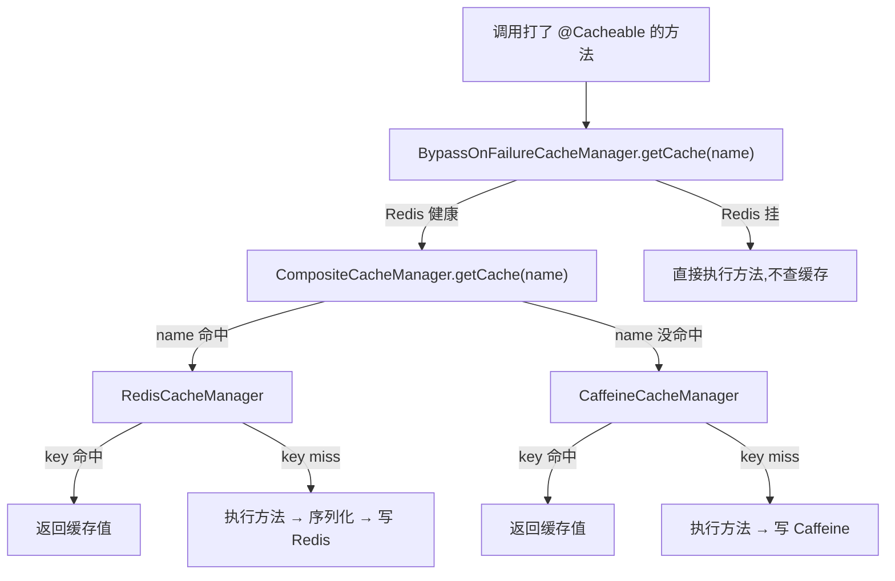

### 7. 第 1 站收获

> **Spring Cache 注解 + 缓存抽象让你写一行 `@Cacheable` 就有缓存能力。底层多层套娃(Bypass → Composite → Redis + Caffeine)让你同时拿到"跨进程一致" + "本地极速" + "Redis 故障不崩"三个特性。所有配置都是 `@Bean` 注册到容器,Spring 启动时自动织入。**

---


---


---

### 第 2 章：TimeBucketing 时间桶算法

## 第 16 章 · Admin 模块第 2 站：TimeBucketing 时间桶算法


### 1. 用日常语言先讲清楚要干嘛

管理员看仪表盘上的折线图,横轴是时间,纵轴是数量。横轴的"刻度"可以选:
- **日**:一格是一天
- **周**:一格是一周(ISO 周一为头)
- **月**:一格是一个月
- **年**:一格是一年

每一格叫**一个"桶"(bucket)**。每条记忆按它的创建时间落到对应的桶里,然后数桶里有几条。

#### 1.1 难点 1:对齐

`2026-06-24 14:32:11` 这一秒,在 DAILY 维度下应该归属于哪个桶?答:`2026-06-24` 这个桶。在 MONTHLY 下呢?答:`2026-06` 这个桶。

**"对齐"就是把一个具体时刻往回扔到桶的起点**。

#### 1.2 难点 2:零填充

数据库查出来的稀疏数据可能是:
```
2026-06-01: 5 条
2026-06-03: 8 条
```

但前端要画连续折线,中间 06-02 缺了一天它没法画。所以**要补全成**:
```
2026-06-01: 5
2026-06-02: 0   ← 补的
2026-06-03: 8
```

这就是"零填充"。

#### 1.3 难点 3:上限

如果有人传 `from=2000-01-01&to=2100-01-01&dimension=DAILY`,要生成 3 万多个桶,内存炸了 + JSON 也太大。所以限定**单次请求最多 366 个桶**(够画一年的日维度图就行)。

### 2. 数学公式 —— 一次性看明白

设:
- $d$ = 维度,$d \in \{D, W, M, Y\}$(日/周/月/年)
- $t$ = 任意时刻
- $\text{start}_d(t)$ = $t$ 所属桶的起点

**对齐函数**:

$$
\text{start}_d(t) = \begin{cases}
\lfloor t \rfloor_{\text{day}} & d = D \quad \text{(取当天 00:00)} \\
\lfloor t \rfloor_{\text{day}} - (\text{weekday}(t) - 1) \cdot 1\text{day} & d = W \quad \text{(回退到本周一 00:00)} \\
\lfloor t \rfloor_{\text{month}} & d = M \quad \text{(取本月 1 号 00:00)} \\
\lfloor t \rfloor_{\text{year}} & d = Y \quad \text{(取本年 1 月 1 日 00:00)}
\end{cases}
$$

**下一桶起点**:

$$
\text{next}_d(s) = s + \Delta_d, \quad \Delta_d \in \{1\text{day}, 7\text{day}, 1\text{month}, 1\text{year}\}
$$

**桶 key 格式**:

| $d$ | 公式 | 例 |
|---|---|---|
| D | `YYYY-MM-DD` | 2026-06-24 |
| W | `YYYY-Www`(week-based year) | 2026-W26 |
| M | `YYYY-MM` | 2026-06 |
| Y | `YYYY` | 2026 |

**生成连续序列**(从 $f$ 到 $t$):

$$
\text{series}_d(f, t) = \{ \text{start}_d(f), \text{next}_d(\text{start}_d(f)), \text{next}_d^2(\ldots), \ldots, \text{start}_d(t) \}
$$

**桶数量上限**(超了直接 400 报错):

$$
|\text{series}_d(f, t)| \le 366
$$

**零填充**(给定稀疏 map $R: \text{key} \mapsto \text{count}$):

$$
\text{fill}_d(f, t, R) = [\ (k, R[k] \text{ if } k \in R \text{ else } 0)\ \mid\ k \in \text{keys}(\text{series}_d(f, t))\ ]
$$

**4 个不变性**(代码里叫 Property):

- $P_1$(往返):`parse(format(s)) = s`
- $P_4$(密度):`len(fill) = len(series)`
- $P_5$(单调):字典序与时间序一致 → 排序可直接按 key
- $P_6$(非负):所有 count ≥ 0

### 3. 时序图 —— 一次完整请求

下面这条调用链你已经在 Spring Cache 那一站看过套娃,这里聚焦时间桶的位置:

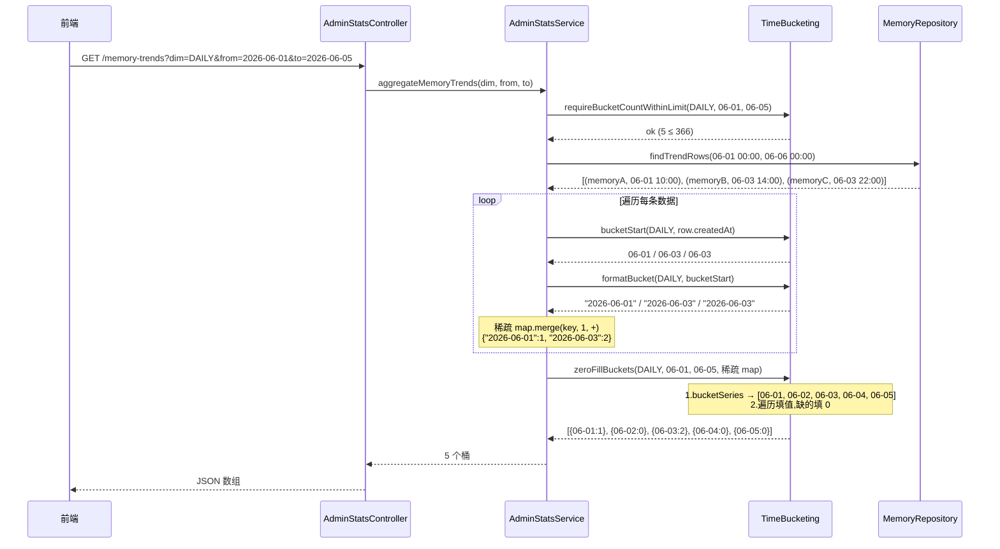

### 4. HTML 可视化演示(自己存一份能直接打开看)

把下面代码存成 `time-bucket-demo.html` 双击打开,就能交互地看时间桶怎么对齐和零填充。

```html
<!DOCTYPE html>
<html lang="zh">
<head>
<meta charset="UTF-8">
<title>时间桶算法演示</title>
<style>
  body { font-family: -apple-system, "Microsoft YaHei", sans-serif; max-width: 980px; margin: 32px auto; padding: 0 16px; color: #222; }
  h1 { font-size: 22px; }
  .panel { background: #f6f7fb; border-radius: 8px; padding: 16px; margin: 16px 0; }
  label { margin-right: 16px; font-size: 14px; }
  select, input { padding: 4px 8px; font-size: 14px; }
  .row { margin: 8px 0; }
  .bucket-track { display: flex; gap: 4px; margin-top: 16px; min-height: 90px; align-items: end; }
  .bucket { flex: 1; min-width: 40px; background: #e3f2fd; border-radius: 4px 4px 0 0; padding: 6px 4px; text-align: center; font-size: 11px; position: relative; transition: 0.3s; }
  .bucket.has-data { background: #4fc3f7; color: #fff; font-weight: bold; }
  .bucket.zero { background: #ffe0b2; color: #999; }
  .bucket .count { display: block; font-size: 18px; margin-top: 4px; }
  .bucket .key { font-size: 10px; opacity: 0.85; }
  .raw-data { font-family: ui-monospace, Consolas, monospace; font-size: 13px; background: #fff; padding: 8px; border-radius: 4px; border: 1px solid #ddd; white-space: pre; }
  .step-title { font-size: 13px; color: #666; margin-bottom: 4px; }
</style>
</head>
<body>
  <h1>时间桶算法 —— 对齐 + 零填充 演示</h1>

  <div class="panel">
    <div class="row">
      <label>维度:
        <select id="dim">
          <option value="DAILY">DAILY 日</option>
          <option value="WEEKLY">WEEKLY 周</option>
          <option value="MONTHLY">MONTHLY 月</option>
        </select>
      </label>
      <label>from: <input type="date" id="from" value="2026-06-01"></label>
      <label>to:   <input type="date" id="to"   value="2026-06-10"></label>
    </div>
    <div class="row">
      <label>原始数据(每行一条记忆的创建时间):</label>
      <textarea id="raw" rows="5" style="width:100%;font-family:monospace;">2026-06-01T10:30
2026-06-03T14:00
2026-06-03T22:15
2026-06-03T23:59
2026-06-07T08:00</textarea>
    </div>
    <button onclick="render()" style="padding:6px 18px;background:#4fc3f7;color:#fff;border:0;border-radius:4px;cursor:pointer;">运行</button>
  </div>

  <div class="step-title">第 1 步:每条原始时间 → 对齐到桶起点 → 稀疏 map</div>
  <div class="raw-data" id="sparse"></div>

  <div class="step-title" style="margin-top:24px;">第 2 步:生成连续桶序列(蓝色 = 有数据,橙色 = 零填充)</div>
  <div class="bucket-track" id="track"></div>

<script>
function alignDaily(d)   { return new Date(d.getFullYear(), d.getMonth(), d.getDate()); }
function alignWeekly(d)  { let x = alignDaily(d); let w = (x.getDay() + 6) % 7; x.setDate(x.getDate() - w); return x; }
function alignMonthly(d) { return new Date(d.getFullYear(), d.getMonth(), 1); }
function nextDaily(d)   { let x = new Date(d); x.setDate(x.getDate() + 1);   return x; }
function nextWeekly(d)  { let x = new Date(d); x.setDate(x.getDate() + 7);   return x; }
function nextMonthly(d) { let x = new Date(d); x.setMonth(x.getMonth() + 1); return x; }
function fmt(d, dim) {
  let y = d.getFullYear(), m = String(d.getMonth()+1).padStart(2,'0'), day = String(d.getDate()).padStart(2,'0');
  if (dim === 'DAILY') return `${y}-${m}-${day}`;
  if (dim === 'MONTHLY') return `${y}-${m}`;
  let jan4 = new Date(y, 0, 4), wk1 = alignWeekly(jan4);
  let week = Math.round((d - wk1) / (7*86400000)) + 1;
  return `${y}-W${String(week).padStart(2,'0')}`;
}
function align(d, dim) { return dim==='DAILY'?alignDaily(d):dim==='WEEKLY'?alignWeekly(d):alignMonthly(d); }
function next(d, dim)  { return dim==='DAILY'?nextDaily(d) :dim==='WEEKLY'?nextWeekly(d) :nextMonthly(d); }

function render() {
  const dim = document.getElementById('dim').value;
  const from = new Date(document.getElementById('from').value);
  const to   = new Date(document.getElementById('to').value);
  const raws = document.getElementById('raw').value.trim().split('\n').filter(x=>x);

  const sparse = {};
  let sparseStr = '';
  for (const r of raws) {
    const t = new Date(r);
    const s = align(t, dim);
    const key = fmt(s, dim);
    sparse[key] = (sparse[key] || 0) + 1;
    sparseStr += `${r}  →  对齐到 ${key}\n`;
  }
  sparseStr += '\n稀疏 map: ' + JSON.stringify(sparse);
  document.getElementById('sparse').textContent = sparseStr;

  const track = document.getElementById('track');
  track.innerHTML = '';
  let cur = align(from, dim), end = align(to, dim);
  while (cur <= end) {
    const key = fmt(cur, dim);
    const cnt = sparse[key] || 0;
    const div = document.createElement('div');
    div.className = 'bucket ' + (cnt > 0 ? 'has-data' : 'zero');
    div.innerHTML = `<span class="key">${key}</span><span class="count">${cnt}</span>`;
    track.appendChild(div);
    cur = next(cur, dim);
  }
}
render();
</script>
</body>
</html>
```

**怎么玩这个 demo:**
1. 默认 5 条记忆,3 条在 06-03,1 条在 06-01,1 条在 06-07 → DAILY 桶有 3 个深蓝(有数据)+ 7 个橙色(零填充)
2. 把维度切换 `WEEKLY` → 你会看到 5 条全挤进 `2026-W22` 一个桶(因为这一周都在那)
3. 把 from 拉到 `2026-05-01` → 桶数立刻撑开,你能直观感受"为什么要 366 上限",不然桶能扯到几千个
4. 修改原始数据,你能验证"对齐 → 累加 → 零填充"全流程

### 5. API 速查(时间桶用到的 Java 时间 API)

| API | 作用 | 例 |
|---|---|---|
| `LocalDate` | 只有年月日 | `LocalDate.of(2026,6,24)` |
| `LocalDateTime` | 年月日时分秒 | `date.atStartOfDay()` → 当天 00:00 |
| `Duration` | 时间长度 | `Duration.ofSeconds(60)` |
| `DayOfWeek.MONDAY` | 周一枚举 | - |
| `TemporalAdjusters.previousOrSame(MONDAY)` | 调整器:回退到本周一(今天是周一就不动) | `d.with(adjuster)` |
| `ChronoUnit.DAYS.between(a, b)` | 相差天数 | `WEEKS.between` / `MONTHS.between` 类推 |
| `IsoFields.WEEK_BASED_YEAR` | ISO 周制下的"周年"(跨年的那周可能属于上一年的 52 周) | `d.get(WEEK_BASED_YEAR)` |
| `IsoFields.WEEK_OF_WEEK_BASED_YEAR` | ISO 周编号 1-53 | - |
| `DateTimeFormatter.ofPattern("uuuu-MM-dd")` | 字符串格式化器 | `fmt.format(d)` |

新语法:

| 语法 | 例 | 等价旧式 |
|---|---|---|
| switch 表达式 | `return switch(dim) { case DAILY -> ...; case WEEKLY -> ...; };` | 老 switch + return + break |
| 文本块(三引号) | `"""...多行..."""` | 字符串拼 `+ "\n" +` |
| record | `public record Bucket(String bucket, long count) {}` | class + 全套 getter/equals/hashCode/toString |

### 6. 第 2 站收获

> **时间桶算法 = 对齐 + 序列生成 + 零填充。对齐用 Java 时间 API 处理日历对话,序列生成是循环步进,零填充把稀疏 map 按完整序列展开。`Property 1~6` 是契约不变性,前端依赖这些性质画图。366 桶上限是性能护栏,避免请求把内存撑爆。**

整套算法纯函数(没 Spring 没 IO),所以在 Service 那一站会看到它被无副作用地反复调用 —— 这也是为什么它被单独抽成 util 包的原因。

---

---


---


---

### 第 3 章：admin 模块总览 —— 管理员后台的数据大脑

## 第 17 章 · memory-service 的 admin 模块总览


> 这一章开始进入 `memory-service/src/main/java/com/mnemoscape/memory/admin`。你已经看完 dto，这里重点补**业务逻辑**和**没学过的 API/写法**。

### 1. 这个 admin 包到底是干什么的

这个包不是普通用户用的接口，而是**管理员后台**用的接口。

管理员后台大概有两类功能：

| 类型 | 作用 | 对应代码 |
|---|---|---|
| 统计看板 | 给仪表盘画图，比如活跃用户、记忆趋势、情绪分布、热力图、贡献榜、碎片发现率 | `AdminStatsController` + `AdminStatsService` |
| 记忆管理 | 管理员查看、搜索、批量删除、批量锁定、批量改隐私、回填历史数据 | `AdminMemoryManagementController` |

所以这个 admin 包的核心不是“普通 CRUD”，而是：

> **把数据库里的原始 memory 数据，加工成管理员后台能直接展示的图表数据和管理数据。**

### 2. 包结构怎么读

```text
admin/
├── config/
│   └── AdminCacheConfig.java          # 统计接口缓存配置：Redis + Caffeine
├── dto/
│   └── ...                            # 你已经看完：返回给前端/内部聚合用的数据形状
├── util/
│   └── TimeBucketing.java             # 时间桶算法：日/周/月/年分桶 + 零填充
├── AdminStatsController.java          # 统计看板 HTTP 入口
├── AdminStatsService.java             # 统计看板核心业务逻辑
└── AdminMemoryManagementController.java # 管理员记忆管理入口
```

### 3. 正确阅读顺序

你现在读完 dto 之后，建议这样回看：

```text
1. AdminCacheConfig
   先知道统计接口为什么会被缓存。

2. TimeBucketing
   再知道“按日/周/月/年画图”的横轴怎么生成。

3. AdminStatsService
   重点：真正的数据加工逻辑都在这里。

4. AdminStatsController
   重点：它只是负责接 HTTP、限流、计时、审计、返回响应。

5. AdminMemoryManagementController
   重点：这是另一路业务，偏管理后台表格 + 批量操作。
```

### 4. 先建立一个总心智模型

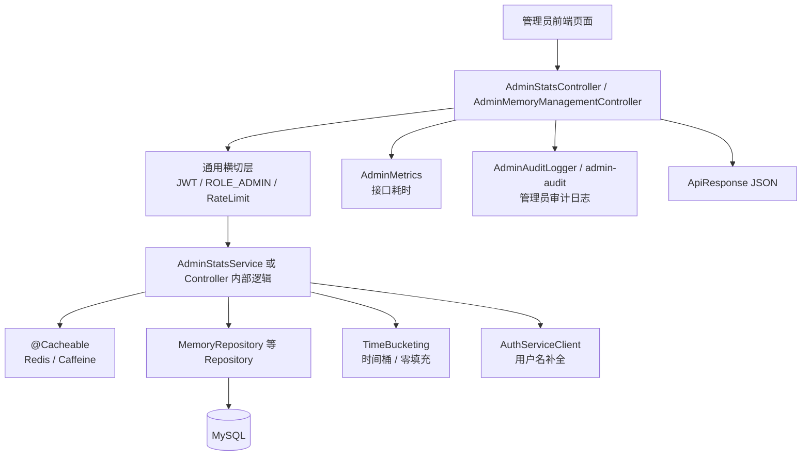

一句话：

> **Controller 管入口和记录，Service 管业务计算，Repository 管查数据库，TimeBucketing 管横轴，Cache 管性能，Metrics/Audit 管可观测性。**

---


---


---

### 第 4 章：AdminStatsController —— 统计看板的 HTTP 入口

## 第 18 章 · AdminStatsController：统计看板的 HTTP 入口


### 1. 它负责什么

`AdminStatsController` 不是核心算法，它更像一个“门卫 + 记录员 + 包装员”。

它主要做 5 件事：

| 步骤 | 做什么 | 为什么 |
|---|---|---|
| 1 | 接收 HTTP 参数 | 前端传 `dimension/from/to/limit/gridResolution` |
| 2 | `@RateLimit` 限流 | 防止管理员页面疯狂刷新把后端打爆 |
| 3 | 用 `AdminMetrics.uncachedLatency(...).recordCallable(...)` 记录耗时 | 以后 Prometheus/Grafana 能看到接口性能 |
| 4 | 调用 `AdminStatsService` | 真正业务逻辑在 Service |
| 5 | `finally` 写审计日志 | 管理员接口必须留痕，即使失败也要记录 |

### 2. 6 个统计接口一览

| URL | 方法 | 业务含义 | 调用的 Service 方法 |
|---|---|---|---|
| `/active-user-counts` | GET | 活跃用户数折线图 | `aggregateActiveUserCounts` |
| `/memory-trends` | GET | 记忆创建/修改趋势 | `aggregateMemoryTrends` |
| `/emotion-distribution` | GET | 公开记忆的 8 维情绪平均值 | `aggregateEmotionDistribution` |
| `/heatmap` | GET | 记忆地理位置热力图 | `aggregateHeatmap` |
| `/top-contributors` | GET | 贡献者排行榜 | `aggregateTopContributors` |
| `/fragment-discovery` | GET | 碎片发现率 | `aggregateFragmentDiscoveryOverall / ByType` |

这些接口写法很重复，不要每个都硬背。你只要记住一个模板就行。

### 3. Controller 的统一模板

以 `memoryTrends` 为例，本质是下面这个模板：

```java
long startNs = System.nanoTime();
int responseStatus = 200;
String queryHash = hashRange(dimension, from, to);
try {
    Data data = adminMetrics.uncachedLatency(endpointKey)
            .recordCallable(() -> adminStatsService.xxx(...));
    return ResponseEntity.ok(ApiResponse.success(data));
} catch (BizException biz) {
    responseStatus = biz.getCode();
    throw biz;
} catch (RuntimeException rex) {
    responseStatus = 500;
    throw rex;
} catch (Exception e) {
    responseStatus = 500;
    throw new RuntimeException(e);
} finally {
    writeAudit(req, endpointPath, queryHash, responseStatus, startNs);
}
```

你可以把它理解成：

```text
开始计时
  ↓
准备审计信息
  ↓
try 调 Service
  ↓
成功：包 ApiResponse 返回
失败：记录状态码，再把异常继续抛给 GlobalExceptionHandler
  ↓
finally：无论成功失败，都写审计日志
```

### 4. 拦路虎 API 速查

#### 4.1 `System.nanoTime()`

```java
long startNs = System.nanoTime();
long latencyMs = (System.nanoTime() - startNs) / 1_000_000L;
```

它不是当前时间，而是**专门用来算耗时**的高精度计时器。

不要用 `LocalDateTime.now()` 算接口耗时，因为系统时间可能被 NTP 校准跳变。`nanoTime()` 是单调递增的，更适合做耗时统计。

#### 4.2 `recordCallable`

```java
adminMetrics.uncachedLatency("memory-trends")
        .recordCallable(() -> adminStatsService.aggregateMemoryTrends(...));
```

`recordCallable` 的含义：

> **执行括号里的那段代码，同时帮你记录这段代码花了多久。**

里面的 `() -> adminStatsService.xxx(...)` 是一个 lambda，意思是“把这段待执行代码作为参数传进去”。

和之前学过的 `Supplier<T>` 很像，只不过这里是 `Callable<T>`，它允许抛异常。

#### 4.3 `QueryHasher.hash(params)`

管理员审计日志不能直接记录完整查询参数。比如：

```text
/admin/stats/top-contributors?from=2026-01-01&to=2026-06-01&limit=100
```

如果所有参数原样打到日志里，日志会越来越敏感、越来越乱。所以这里把参数做哈希：

```java
Map<String, String> params = new HashMap<>();
params.put("from", from == null ? "" : from);
params.put("to", to == null ? "" : to);
String queryHash = QueryHasher.hash(params);
```

效果是：

```text
真实参数 → sha256 指纹
```

日志里只留指纹，不留明文参数。

#### 4.4 `finally`

`finally` 的特点：

> **不管 try 成功、catch 捕获异常，finally 都会执行。**

所以审计日志放在 `finally` 里很合理：管理员接口成功失败都要留痕。

### 5. Controller 总流程图

```mermaid
flowchart TD
    Req["管理员请求 /api/v1/admin/stats/**"] --> Rate["@RateLimit 限流"]
    Rate --> Start["记录 startNs + 默认 responseStatus=200"]
    Start --> Hash["QueryHasher 生成 queryHash"]
    Hash --> Timer["AdminMetrics Timer.recordCallable"]
    Timer --> Service["调用 AdminStatsService"]
    Service --> Success["成功: ApiResponse.success(data)"]
    Service --> BizErr["BizException: 保存业务状态码"]
    Service --> RuntimeErr["RuntimeException: 状态码设为 500"]
    BizErr --> GHandler["继续抛给 GlobalExceptionHandler"]
    RuntimeErr --> GHandler
    Success --> Finally["finally writeAudit"]
    GHandler --> Finally
    Finally --> Resp["返回统一响应 / 错误响应"]
```

### 6. Controller 时序图

```mermaid
sequenceDiagram
    participant FE as 管理员前端
    participant RL as RateLimitAspect
    participant CTL as AdminStatsController
    participant MET as AdminMetrics
    participant SVC as AdminStatsService
    participant AUD as AdminAuditLogger
    participant GEH as GlobalExceptionHandler

    FE->>RL: GET /api/v1/admin/stats/memory-trends
    RL->>RL: Redis 滑动窗口限流
    RL->>CTL: 放行
    CTL->>CTL: startNs / queryHash / responseStatus=200
    CTL->>MET: uncachedLatency(endpoint).recordCallable(...)
    MET->>SVC: aggregateMemoryTrends(...)
    SVC-->>MET: data 或抛异常
    MET-->>CTL: data 或继续抛异常
    alt 成功
        CTL->>AUD: finally 写 admin-audit
        CTL-->>FE: ApiResponse.success(data)
    else 业务错误
        CTL->>CTL: responseStatus = BizException.code
        CTL->>AUD: finally 写 admin-audit
        CTL->>GEH: 抛出 BizException
        GEH-->>FE: 统一错误响应
    else 系统错误
        CTL->>CTL: responseStatus = 500
        CTL->>AUD: finally 写 admin-audit
        CTL->>GEH: 抛出 RuntimeException
        GEH-->>FE: 统一 500 响应
    end
```

### 7. 这一节真正要学会什么

> **AdminStatsController 不负责算数据，它负责把一个管理员请求安全、可观测、可审计地转交给 Service。它的核心价值不是业务算法，而是限流、计时、审计、统一响应。**

---


---


---

### 第 5 章：AdminStatsService —— 统计看板的核心业务逻辑

## 第 19 章 · AdminStatsService：统计看板的核心业务逻辑


### 1. 它负责什么

如果说 Controller 是入口，那 `AdminStatsService` 就是统计看板的“大脑”。

它负责：

1. 校验参数
2. 查询数据库
3. 把数据库原始行加工成图表数据
4. 做时间桶、零填充、排序、归一化
5. 必要时调用别的服务补数据
6. 把最终 DTO 返回给 Controller

### 2. Service 的公共套路

大多数统计方法都符合这个流程：

```text
解析参数
  ↓
校验范围
  ↓
查 Repository
  ↓
内存里聚合 / 转换
  ↓
补 0 / 排序 / 归一化
  ↓
返回 DTO
```

同时，这些方法上都有 `@Cacheable`，所以真实调用链是：

```text
先查缓存
  ↓
缓存命中：直接返回
  ↓
缓存未命中：执行上面的业务流程
  ↓
结果写入缓存
```

### 3. 拦路虎 API 速查

#### 3.1 `@Cacheable` 的 key 里为什么有 `T(...)`

例子：

```java
@Cacheable(
    cacheNames = AdminCacheConfig.CACHE_ACTIVE_USERS,
    key = "T(com.mnemoscape.memory.admin.AdminStatsService).cacheKey(#dimensionRaw, #fromRaw, #toRaw)",
    sync = true)
```

这里的 key 是 SpEL(Spring Expression Language)。

| 写法 | 含义 |
|---|---|
| `#dimensionRaw` | 当前方法的入参 dimensionRaw |
| `T(完整类名)` | 拿到这个类本身，类似 Java 里的 `AdminStatsService.class` |
| `.cacheKey(...)` | 调这个类的静态方法 |

所以这一句的意思是：

```text
用 AdminStatsService.cacheKey(dimensionRaw, fromRaw, toRaw) 的返回值作为缓存 key
```

#### 3.2 `computeIfAbsent`

```java
bucketUsers.computeIfAbsent(key, k -> new HashSet<>()).add(row.getUserId());
```

这行初看很吓人，拆开就是：

```java
Set<String> set = bucketUsers.get(key);
if (set == null) {
    set = new HashSet<>();
    bucketUsers.put(key, set);
}
set.add(row.getUserId());
```

一句话：

> **如果 map 里没有这个 key，就先创建一个默认值；然后返回这个值继续用。**

#### 3.3 `Map.merge`

```java
created.merge(key, 1L, Long::sum);
```

等价于：

```java
Long old = created.get(key);
if (old == null) {
    created.put(key, 1L);
} else {
    created.put(key, old + 1L);
}
```

一句话：

> **给某个 key 的计数 +1。没有就从 1 开始，有就累加。**

`Long::sum` 是方法引用，等价于 `(a, b) -> a + b`。

#### 3.4 `Collections.unmodifiableList`

```java
return Collections.unmodifiableList(out);
```

返回一个不能再被外部修改的 List。

为什么这么做？

因为 Service 算出来的结果应该是“只读结果”。如果调用方拿到 List 后又 `add/remove`，可能会导致缓存里的对象被污染。

#### 3.5 `PageRequest.of(0, limit)`

```java
memoryRepository.findTopContributors(fromDt, toDt, PageRequest.of(0, limit));
```

表示：

```text
第 0 页，每页 limit 条
```

在 Repository 查询里用于控制 `LIMIT limit`。

#### 3.6 Feign Client + 降级

`aggregateTopContributors` 里会调用：

```java
authServiceClient.batchUsernames(new BatchUsernamesRequest(userIds));
```

因为 memory 表里只有 `userId`，没有 username。排行榜要显示用户名，就要去 auth-service 批量查。

但是 auth-service 可能挂，所以这里不是直接失败，而是降级：

```text
用户名查询成功 → 显示真实 username
用户名查询失败 → 用 userId 前 8 位当临时名字，并 degraded=true
```

这就是 common 里学过的 fail-open 思想在业务里的应用。

### 4. 六个统计方法逐个讲

---

### 4.1 active-user-counts —— 活跃用户数

#### 4.1.1 业务含义

统计每个时间桶里有多少个**活跃用户**。

一个用户只要在这个桶内：
- 创建了记忆
- 或修改了记忆

就算活跃。

注意：

> **同一个用户在同一天创建 10 条记忆，也只算 1 个活跃用户。**

所以它统计的是“去重用户数”，不是“记忆条数”。

#### 4.1.2 业务流程

```text
解析 dimension/from/to
  ↓
查出时间范围内创建或修改过的 memory 行
  ↓
每行算 latestActivityAt = max(createdAt, updatedAt)
  ↓
按 latestActivityAt 落到时间桶
  ↓
每个桶用 Set<String> 存 userId 去重
  ↓
Set.size 得到该桶活跃用户数
  ↓
zeroFillBuckets 补齐没数据的桶
  ↓
返回 List<ActiveUserBucket>
```

#### 4.1.3 为什么用 `Map<String, Set<String>>`

```java
Map<String, Set<String>> bucketUsers = new HashMap<>();
```

含义：

```text
bucket key → 这个桶里活跃过的 userId 集合
```

例子：

```text
2026-06-01 → {u1, u2, u3}
2026-06-02 → {u1}
2026-06-03 → {u2, u5}
```

最后 `Set.size()` 就是活跃用户数。

#### 4.1.4 流程图

```mermaid
flowchart TD
    A["入参 dimension/from/to"] --> B["parseDimension / parseFrom / parseTo"]
    B --> C["校验 from <= to + 桶数量 <= 366"]
    C --> D["MemoryRepository.findActiveUserRowsBetween"]
    D --> E["遍历每一行 ActiveUserRow"]
    E --> F["取 latestActivityAt"]
    F --> G["TimeBucketing.bucketStart + formatBucket"]
    G --> H["bucketUsers[bucket].add(userId)"]
    H --> I["每个 bucket 的 Set.size 变成 rawCounts"]
    I --> J["TimeBucketing.zeroFillBuckets"]
    J --> K["List<ActiveUserBucket>"]
```

---

### 4.2 memory-trends —— 记忆创建/修改趋势

#### 4.2.1 业务含义

统计每个时间桶里：
- 创建了多少条记忆 `createdCount`
- 修改了多少条记忆 `modifiedCount`

注意：

> **刚创建时 updatedAt == createdAt 的情况，不算修改。只有 updatedAt > createdAt 才算一次修改。**

#### 4.2.2 为什么有两个 Map

```java
Map<String, Long> created = new HashMap<>();
Map<String, Long> modified = new HashMap<>();
```

一个桶里同时要记录两个数字，所以分成两张表：

```text
created:
2026-06-01 → 5
2026-06-02 → 0

modified:
2026-06-01 → 2
2026-06-02 → 3
```

最后合并成：

```json
{"bucket":"2026-06-01", "createdCount":5, "modifiedCount":2}
```

#### 4.2.3 流程图

```mermaid
flowchart TD
    A["入参 dimension/from/to"] --> B["解析 + 校验"]
    B --> C["MemoryRepository.findTrendRows"]
    C --> D["遍历 MemoryTrendRow"]
    D --> E{"createdAt 在范围内?"}
    E -->|是| F["created.merge(bucket, 1, sum)"]
    E -->|否| G["跳过创建计数"]
    D --> H{"updatedAt > createdAt 且在范围内?"}
    H -->|是| I["modified.merge(bucket, 1, sum)"]
    H -->|否| J["跳过修改计数"]
    F --> K["bucketSeries 生成完整横轴"]
    I --> K
    K --> L["逐桶读取 created / modified, 没有就 0"]
    L --> M["List<MemoryTrendBucket>"]
```

---

### 4.3 emotion-distribution —— 情绪分布

#### 4.3.1 业务含义

统计公开记忆在某个时间范围内的 8 个情绪维度平均值：

```text
joy / sadness / anger / fear / surprise / nostalgia / peace / melancholy
```

这通常给前端画雷达图。

#### 4.3.2 为什么用 native SQL

因为情绪字段存在 MySQL JSON 列 `emotion_profile` 里。要取 JSON 里的某个字段，需要：

```sql
JSON_EXTRACT(emotion_profile, '$.joy')
```

JPQL 不支持这个 MySQL 函数，所以必须写 native SQL。

#### 4.3.3 空数据为什么返回 0

如果某个范围内没有记忆，数据库 AVG 会返回 null。

但前端雷达图一般不喜欢 null，所以代码把所有情绪值变成 0：

```text
sampleSize == 0 → 八个维度全是 0.0
```

#### 4.3.4 流程图

```mermaid
flowchart TD
    A["入参 from/to"] --> B["解析日期,默认过去 365 天"]
    B --> C{"from <= to?"}
    C -->|否| X["BizException INVALID_RANGE"]
    C -->|是| D["MemoryRepository.emotionDistributionBetween"]
    D --> E["native SQL: AVG(JSON_EXTRACT(...))"]
    E --> F{"sampleSize == 0?"}
    F -->|是| G["返回 8 个 0.0"]
    F -->|否| H["null 转 0.0,组装 EmotionDistribution"]
```

---

### 4.4 heatmap —— 地理热力图

#### 4.4.1 业务含义

把所有有经纬度的记忆按网格聚合，给地图画热力点。

如果每条记忆都单独画一个点，点太多、隐私风险也高。所以先把经纬度“吸附”到网格中心。

#### 4.4.2 网格公式

设：
- 原始纬度是 `lat`
- 网格大小是 `step`

网格中心：

$$
latBucket = \left\lfloor \frac{lat}{step} \right\rfloor \cdot step + \frac{step}{2}
$$

经度同理。

例如 `step = 1.0`：

```text
lat = 31.23
floor(31.23 / 1.0) = 31
31 * 1.0 + 0.5 = 31.5
```

所以 31.00 ~ 31.99 这一整格都归到中心点 31.5。

#### 4.4.3 三种分辨率

| 参数 | step | 含义 |
|---|---|---|
| LOW | 5.0 | 粗网格，点少，适合看全国/全球趋势 |
| MEDIUM | 1.0 | 默认，中等网格 |
| HIGH | 0.25 | 细网格，点多，细节更多 |

#### 4.4.4 intensity 归一化

数据库查出来的是原始数量：

```text
A 点 rawCount=100
B 点 rawCount=50
C 点 rawCount=10
```

前端热力图通常要 0~1 的强度值，所以：

$$
intensity = \frac{rawCount}{maxRaw}
$$

上面的结果：

```text
A = 100 / 100 = 1.0
B = 50 / 100 = 0.5
C = 10 / 100 = 0.1
```

#### 4.4.5 流程图

```mermaid
flowchart TD
    A["gridResolution 参数"] --> B["parseResolution, 默认 MEDIUM"]
    B --> C["stepFor: LOW=5, MEDIUM=1, HIGH=0.25"]
    C --> D["MemoryRepository.heatmapBuckets(step)"]
    D --> E["native SQL: 经纬度吸附到网格中心 + GROUP BY"]
    E --> F{"rows 为空?"}
    F -->|是| G["返回空列表"]
    F -->|否| H["找 maxRaw"]
    H --> I["intensity = rawCount / maxRaw"]
    I --> J["按 lat/lon 排序"]
    J --> K["List<HeatmapPoint>"]
```

---

### 4.5 top-contributors —— 贡献榜

#### 4.5.1 业务含义

统计某个时间范围内，创建记忆最多的用户排行榜。

但是 memory-service 只有 `userId`，没有用户名，所以要去 auth-service 查用户名。

#### 4.5.2 业务流程

```text
解析 limit/from/to
  ↓
MemoryRepository.findTopContributors 查 userId + memoryCount
  ↓
收集 userId 列表
  ↓
调用 auth-service 批量查 username
  ↓
成功：userId + username + memoryCount
失败：username 用 userId 前 8 位兜底，并标记 degraded=true
```

#### 4.5.3 为什么这是降级设计

如果 auth-service 挂了，排行榜其实还可以展示：

```text
用户: 7f4a91c2
记忆数: 128
```

虽然没有真实 username，但核心数据还在。

所以不应该让整个接口 500，而是返回：

```json
{
  "degraded": true,
  "degradationReasons": ["auth-service username lookup failed"],
  "items": [...]
}
```

这就是 common 里反复学的思想：

> **非核心依赖失败时，返回降级结果，而不是把整个请求打死。**

#### 4.5.4 流程图

```mermaid
flowchart TD
    A["limit/from/to"] --> B["limit 默认 10,最大 100"]
    B --> C["日期默认过去 30 天"]
    C --> D["MemoryRepository.findTopContributors"]
    D --> E{"rows 为空?"}
    E -->|是| F["TopContributorsResponse.ok(empty)"]
    E -->|否| G["收集 userIds"]
    G --> H{"authServiceClient 可用?"}
    H -->|是| I["batchUsernames 批量查用户名"]
    I -->|成功| J["username map"]
    I -->|失败| K["degraded=true + 记录指标"]
    H -->|否| L["不查用户名,直接兜底"]
    J --> M["组装 TopContributor"]
    K --> M
    L --> M
    M --> N{"degraded?"}
    N -->|是| O["TopContributorsResponse.degraded"]
    N -->|否| P["TopContributorsResponse.ok"]
```

---

### 4.6 fragment-discovery —— 碎片发现率

#### 4.6.1 业务含义

统计记忆碎片的发现情况。

两种模式：

| 请求 | 返回 |
|---|---|
| `/fragment-discovery` | 总体发现率 |
| `/fragment-discovery?groupBy=fragmentType` | 按碎片类型分组的发现率 |

发现率公式：

$$
discoveryRate = \frac{discoveredFragments}{totalFragments}
$$

如果总数是 0，则发现率返回 0，避免除以 0。

#### 4.6.2 流程图

```mermaid
flowchart TD
    A["groupBy 参数"] --> B{"groupBy == fragmentType?"}
    B -->|否| C["aggregateFragmentDiscoveryOverall"]
    C --> D["MemoryRepository.aggregateFragmentOverall"]
    D --> E["计算 total / discovered / rate"]
    E --> F["FragmentDiscoveryOverall"]
    B -->|是| G["aggregateFragmentDiscoveryByType"]
    G --> H["MemoryRepository.aggregateFragmentByType"]
    H --> I["逐类型计算 rate"]
    I --> J["List<FragmentDiscoveryByType>"]
```

### 5. AdminStatsService 总时序图

```mermaid
sequenceDiagram
    participant CTL as AdminStatsController
    participant Cache as Spring Cache / Redis
    participant SVC as AdminStatsService
    participant Codec as Codec / TimeBucketing
    participant Repo as MemoryRepository
    participant Auth as AuthServiceClient
    participant DB as MySQL

    CTL->>Cache: 调用 @Cacheable 方法(cacheName + key)
    alt 缓存命中
        Cache-->>CTL: 直接返回缓存 DTO
    else 缓存未命中
        Cache->>SVC: 执行真实方法
        SVC->>Codec: 解析 dimension/from/to/limit/resolution
        Codec-->>SVC: 合法参数或抛 BizException
        SVC->>Repo: 查询原始聚合行
        Repo->>DB: JPQL / native SQL
        DB-->>Repo: 原始行 Projection
        Repo-->>SVC: rows
        SVC->>Codec: bucketStart / formatBucket / zeroFillBuckets
        opt top-contributors 需要用户名
            SVC->>Auth: batchUsernames(userIds)
            alt auth-service 成功
                Auth-->>SVC: username map
            else auth-service 失败
                Auth-->>SVC: 异常
                SVC->>SVC: degraded=true + fallbackUsername
            end
        end
        SVC-->>Cache: 返回 DTO 并写入缓存
        Cache-->>CTL: 返回 DTO
    end
```

### 6. 这一节真正要学会什么

> **AdminStatsService 不是简单查库，它是在做“数据产品加工”：把数据库里的原始行加工成图表能直接消费的 DTO。不同接口只是加工方式不同：活跃用户要去重，趋势要分 created/modified，情绪要求平均，热力图要网格归一化，贡献榜要跨服务补 username，碎片发现要算比例。**

---


---


---

### 第 6 章：AdminMemoryManagementController —— 管理员记忆管理

## 第 20 章 · AdminMemoryManagementController：管理员记忆管理


### 1. 它和 AdminStatsController 有什么区别

`AdminStatsController` 是“统计看板”：返回图表数据。

`AdminMemoryManagementController` 是“管理后台表格”：让管理员直接管理记忆数据。

它负责：

| 功能 | URL | 作用 |
|---|---|---|
| 分页列表 | `GET /api/v1/admin/memories` | 搜索/筛选/分页查看记忆 |
| 批量删除 | `POST /batch-delete` | 删除记忆及其 fragments / versions |
| 批量改隐私 | `POST /batch-privacy` | PRIVATE / FRIENDS / PUBLIC |
| 批量锁定 | `POST /batch-lock` | 锁定或解锁 |
| 单条删除 | `DELETE /{id}` | 删除一条记忆 |
| 单条修改 | `PATCH /{id}` | 行内编辑隐私/锁定/fadeLevel |
| 批量详情 | `POST /batch-details` | 根据 ids 批量取简化详情 |
| 地理坐标回填 | `POST /backfill-geocoords` | 给历史记忆重新解析经纬度 |
| 向量回填 | `POST /backfill-vectors` | 重新写入 Milvus 向量索引 |
| visualData 清洗 | `POST /cleanup-visualdata` | 重建旧 visualData |
| fragments 重建 | `POST /rebuild-fragments` | 重建历史碎片 |

### 2. 为什么这个 Controller 里直接注入 Repository

一般来说推荐：

```text
Controller → Service → Repository
```

但这个类很多操作很薄，比如：
- 查列表
- 批量改一个字段
- 批量删除

所以这里 Controller 直接操作 Repository，减少一层 Service。

但注意：复杂业务仍然交给 `MemoryService`：

```java
memoryService.backfillGeocoords(limit)
memoryService.backfillVectors(limit)
memoryService.cleanupVisualData(limit)
memoryService.rebuildFragments(limit)
```

也就是说：

> **简单管理操作 Controller 自己做，复杂重建/回填逻辑仍然交给 MemoryService。**

### 3. 严格白名单 DTO: AdminMemoryRow

这个 Controller 不直接返回 `Memory` 实体，而是转成 `AdminMemoryRow`。

原因：

1. 防止把 `visualData/audioData/emotionProfile` 这类大字段或敏感字段直接返回
2. description 截断到 200 字，防止表格太重
3. 日期统一转字符串，前端更好处理

```text
Memory 实体很大
  ↓ toRow(m)
AdminMemoryRow 只保留管理员表格需要的字段
```

这和前面 dto 的“白名单思想”一致。

### 4. 分页列表 list —— Specification 的真实使用场景

#### 4.1 业务含义

管理员列表页支持这些筛选条件：

```text
page / size / search / userId / privacyLevel / locked / sortBy / sortDir
```

但这些条件都是可选的。比如：
- 只按标题搜
- 只看某个用户
- 只看 PUBLIC
- 同时搜标题 + 用户 + locked

组合太多，不能给每种组合都写一个 Repository 方法。

所以用 `Specification` 动态拼查询条件。

#### 4.2 Specification 心智模型

```java
Specification<Memory> spec = (root, query, cb) -> cb.conjunction();
```

可以理解成 SQL 的：

```sql
WHERE 1 = 1
```

然后有哪个条件，就往后面 `.and(...)` 一个条件：

```text
有 search       → AND lower(title) LIKE '%xxx%'
有 userId       → AND user_id = ?
有 privacyLevel → AND privacy_level = ?
有 locked       → AND is_locked = ?
```

最后：

```java
Page<Memory> result = memoryRepository.findAll(spec, pageReq);
```

JPA 根据 spec + pageReq 自动生成最终 SQL。

#### 4.3 list 流程图

```mermaid
flowchart TD
    A["GET /api/v1/admin/memories"] --> B["修正 page >= 0, size <= 100"]
    B --> C["构造 Sort + PageRequest"]
    C --> D["Specification 起手 cb.conjunction"]
    D --> E{"search 有值?"}
    E -->|是| E1["AND lower(title) LIKE pattern"]
    E -->|否| F
    E1 --> F{"userId 有值?"}
    F -->|是| F1["AND userId = uid"]
    F -->|否| G
    F1 --> G{"privacyLevel 有值?"}
    G -->|是| G1["解析枚举 + AND privacyLevel = pl"]
    G -->|否| H
    G1 --> H{"locked 有值?"}
    H -->|是| H1["AND isLocked = locked"]
    H -->|否| I
    H1 --> I["memoryRepository.findAll(spec, pageReq)"]
    I --> J["Memory → AdminMemoryRow"]
    J --> K["PageResult.of(rows, total, page, size)"]
```

### 5. 批量删除 —— 为什么先删 fragments / versions

批量删除核心顺序：

```java
fragmentRepository.deleteByMemoryId(id);
versionRepository.deleteByMemoryId(id);
memoryRepository.deleteById(id);
```

原因是数据库可能有外键关系：

```text
memories           ← 主表
memory_fragments   ← 子表,引用 memory_id
memory_versions    ← 子表,引用 memory_id
```

如果先删主表：

```sql
DELETE FROM memories WHERE id = ?
```

但 fragments / versions 里还有这个 memory_id，数据库会报外键约束错误。

所以必须：

```text
先删子表
再删主表
```

#### 批量删除流程图

```mermaid
flowchart TD
    A["body.ids"] --> B{"ids 为空?"}
    B -->|是| X["BizException IDS_REQUIRED"]
    B -->|否| C{"ids.size > 500?"}
    C -->|是| Y["BizException BATCH_TOO_LARGE"]
    C -->|否| D["遍历 id"]
    D --> E["delete fragments by memoryId"]
    E --> F["delete versions by memoryId"]
    F --> G["delete memory by id"]
    G --> H{"成功?"}
    H -->|是| I["deleted++"]
    H -->|否| J["failed.add(id) + warn log"]
    I --> K["返回 {deleted, failed}"]
    J --> K
```

### 6. `@Transactional` 为什么重要

批量删除、批量修改隐私、批量锁定都打了 `@Transactional`。

它的含义：

> **方法里的数据库写操作放在同一个事务里。方法正常结束就提交，抛异常就回滚。**

但注意：`batchDelete` 里每个 id 的异常被 catch 掉了，所以单个 id 失败不会让整个方法抛异常。它是“尽力删除”：

```text
能删的删掉
删失败的记录到 failed
最后返回结果
```

这是一种管理后台常见策略，叫 **best-effort 批处理**。

### 7. 批量隐私 / 批量锁定 / patchOne 的共同逻辑

这三个方法本质相同：

```text
校验 ids / id
  ↓
查 Memory
  ↓
改字段
  ↓
setUpdatedAt(now)
  ↓
save
  ↓
返回更新数量或更新后的 row
```

区别只是改的字段不同：

| 方法 | 改什么 |
|---|---|
| `batchUpdatePrivacy` | `privacyLevel` |
| `batchLock` | `isLocked` |
| `patchOne` | `privacyLevel / locked / fadeLevel` |

### 8. 回填类接口 —— 为什么都交给 MemoryService

下面这些接口看起来在 Controller 里，但真正逻辑都丢给 `MemoryService`：

```java
memoryService.backfillGeocoords(limit);
memoryService.backfillVectors(limit);
memoryService.cleanupVisualData(limit);
memoryService.rebuildFragments(limit);
```

因为它们不是简单数据库字段修改，而是复杂业务：

| 接口 | 背后可能涉及 |
|---|---|
| backfill-geocoords | 调地理编码服务，把地点名解析成经纬度 |
| backfill-vectors | 调 AI embedding，写 Milvus 向量库 |
| cleanup-visualdata | 调 AI 或模板重建可视化数据 |
| rebuild-fragments | 删除旧碎片，重新跑记忆碎片生成逻辑 |

这些逻辑属于核心业务服务，不能写在 Controller 里。

### 9. AdminMemoryManagementController 总时序图

```mermaid
sequenceDiagram
    participant FE as 管理员前端
    participant CTL as AdminMemoryManagementController
    participant Repo as MemoryRepository
    participant Frag as MemoryFragmentRepository
    participant Ver as MemoryVersionRepository
    participant SVC as MemoryService
    participant DB as MySQL
    participant AUD as admin-audit

    alt 分页列表
        FE->>CTL: GET /admin/memories?search&userId&privacyLevel&locked
        CTL->>CTL: 构造 Specification + PageRequest
        CTL->>Repo: findAll(spec, pageReq)
        Repo->>DB: SELECT ... WHERE ... ORDER BY ... LIMIT ...
        DB-->>Repo: Page<Memory>
        Repo-->>CTL: Page<Memory>
        CTL->>CTL: Memory → AdminMemoryRow
        CTL->>AUD: logAccess
        CTL-->>FE: PageResult<AdminMemoryRow>
    else 批量删除
        FE->>CTL: POST /batch-delete {ids}
        loop 每个 id
            CTL->>Frag: deleteByMemoryId(id)
            Frag->>DB: DELETE fragments
            CTL->>Ver: deleteByMemoryId(id)
            Ver->>DB: DELETE versions
            CTL->>Repo: deleteById(id)
            Repo->>DB: DELETE memory
        end
        CTL->>AUD: logAccess
        CTL-->>FE: {deleted, failed}
    else 历史数据回填
        FE->>CTL: POST /backfill-vectors / cleanup / rebuild
        CTL->>SVC: 调 MemoryService 复杂业务
        SVC-->>CTL: {scanned, dispatched, ...}
        CTL->>AUD: logAccess
        CTL-->>FE: result
    end
```

### 10. AdminMemoryManagementController 真正要学会什么

> **这个类是管理后台 CRUD + 批处理的集合。分页列表用 Specification 动态拼条件；批量写操作用 @Transactional 和 best-effort 策略；删除时先子表后主表；复杂历史修复任务交给 MemoryService。它的重点不是算法，而是管理后台的安全边界、批量操作和数据维护能力。**

---


---


---

### 第 7 章：admin 模块总复盘 —— 完整的业务理解

## 第 21 章 · admin 模块总复盘


### 1. 两条主线

admin 模块有两条主线：

```text
统计看板线:
AdminStatsController → AdminStatsService → MemoryRepository → TimeBucketing → DTO

管理操作线:
AdminMemoryManagementController → Repository / MemoryService → DB / AI / Milvus
```

### 2. 统计看板线完整流程

```mermaid
flowchart TD
    A["管理员打开仪表盘"] --> B["前端请求 /api/v1/admin/stats/**"]
    B --> C["RateLimit 限流"]
    C --> D["Controller 开始计时 + 生成 queryHash"]
    D --> E["Spring Cache 查缓存"]
    E -->|命中| F["直接返回 DTO"]
    E -->|未命中| G["AdminStatsService 执行业务"]
    G --> H["解析参数 + 校验范围"]
    H --> I["MemoryRepository 查原始聚合数据"]
    I --> J["Java 内存里二次加工"]
    J --> K["TimeBucketing 零填充 / 排序 / 归一化"]
    K --> L["必要时调用 auth-service 补 username"]
    L --> M["写入缓存"]
    M --> N["Controller 包 ApiResponse"]
    N --> O["finally 写 admin-audit"]
    O --> P["前端画图"]
```

### 3. 管理操作线完整流程

```mermaid
flowchart TD
    A["管理员在表格页操作"] --> B{"操作类型"}
    B -->|"搜索/筛选/分页"| C["Specification 动态拼条件"]
    C --> D["findAll(spec, pageReq)"]
    D --> E["Memory → AdminMemoryRow 白名单 DTO"]
    B -->|"批量删除"| F["校验 ids <= 500"]
    F --> G["先删 fragments / versions"]
    G --> H["再删 memory 主表"]
    B -->|"批量改字段"| I["查 Memory → 改字段 → save"]
    B -->|"历史数据修复"| J["调用 MemoryService 回填/重建"]
    E --> K["写审计日志"]
    H --> K
    I --> K
    J --> K
    K --> L["ApiResponse 返回"]
```

### 4. 这块涉及的知识点清单

| 知识点 | 在哪出现 | 你要掌握到什么程度 |
|---|---|---|
| `@Cacheable` | AdminStatsService | 知道它先查缓存，miss 才执行方法 |
| SpEL `T(...)` | 缓存 key | 知道这是调用静态方法生成 key |
| `AdminMetrics.Timer.recordCallable` | AdminStatsController | 知道它包住一段代码并记录耗时 |
| `QueryHasher` | AdminStatsController | 知道它把查询参数变成审计指纹 |
| `finally` | Controller 审计 | 知道成功失败都会执行 |
| `TimeBucketing` | Service | 知道对齐、生成横轴、零填充 |
| `Map.merge` | memory-trends | 知道它是计数 +1 的简写 |
| `computeIfAbsent` | active-users | 知道它是“没有就创建集合” |
| `PageRequest` | top-contributors/list | 知道它控制分页和 limit |
| `Specification` | 管理列表 | 知道它用于动态条件查询 |
| `@Transactional` | 批量写操作 | 知道它保证数据库写操作的事务边界 |
| best-effort | 批量删除/回填 | 知道它不是遇错全失败，而是能做多少做多少 |
| degraded response | top-contributors | 知道下游失败时返回降级结果 |
| 白名单 DTO | 所有 admin 返回 | 知道不直接返回 Entity，避免泄漏字段 |

### 5. 一句话毕业总结

> **memory-service/admin 模块是一个“后台数据加工层”：它把 Memory 原始数据变成统计图表、排行榜、热力图和管理表格。代码难不是因为语法多，而是因为它同时承担性能缓存、安全审计、限流、降级、动态查询、数据聚合和隐私白名单。读懂它，就等于把 common 模块学过的横切能力放进真实业务里用了一遍。**

---

---


================================================================================
                            附篇 · 记忆业务纵向链路
================================================================================

本篇将原笔记第二十二课中 Controller + Service 纵向链路的核心内容保留，并修复了原文末尾（第9-11部分）的乱码文本。

---


## 第五篇：AI 服务与问题实战

## 第 2 章 · AI 大模型与多模态


### 1. 场景重建 API 测试断言失败 (Missing "objects")
**问题详细描述**：E2E 测试的 AI 模块中，报出了 `FAIL  Scene has objects — response missing '"objects"'` 的异常，提示响应体中丢失了预期的场景物体对象数据。

**问题出现的原因及分析**：这是架构迭代导致的前后契约错位。在系统演进到 v2 版本的**双轨场景重建机制**（兼容 LLM 输出与兜底规则模板）后，为了防止前端的 `SceneViewer` 组件因接收到格式不定的扁平化 JSON 而导致渲染崩溃，我们对数据模型进行了严格的约束。将所有的 3D 渲染物体归口到了更深层次的 `sceneData.objects` 字段中，但测试脚本尚未同步更新。

**mermaid 代码**：
```mermaid
sequenceDiagram
    participant Test as 测试脚本
    participant API as AI-Service (v2)
    participant LLM as 模型重建管线

    Test->>API: POST /reconstruct
    API->>LLM: 双轨重建调度
    LLM-->>API: 生成场景结构
    API-->>Test: 返回 { data: { sceneData: { objects: [...] } } }
    Note right of Test: 旧版断言检查根节点 objects<br/>导致匹配失败
```

**问题的解决方案**：修正测试脚本中的断言逻辑，将 JSON Path 的解析路径更新为新的契约标准（即校验 `$response.data.sceneData.objects` 是否存在）。

**解决后的效果**：测试用例转绿，API 返回的数据格式保证了前端高阶 3D 看板的安全加载。

### 2. 多模态视觉模型（Vision）网络屏障
**问题详细描述**：大模型视觉分析模块（Llama Vision）无法直接读取并分析位于内部系统中的媒体资源（图片），造成多模态图文联合分析功能失效。

**问题出现的原因及分析**：系统架构中存在内外网物理隔离——MinIO 对象存储作为资产中心部署在内网环境，而大模型由于走的是公网 API 服务，无法通过内网 URL 直接下载资源文件。

**问题的解决方案**：在 `ai-service` 内集成了一套“本地代理拉取与转码”机制。当需要处理多模态分析时，先通过内网 SDK 将图片拉取到 `ai-service` 内存中，实时转换为 Base64 编码，然后再将此编码后的图片与 Prompt 组装成 Payload 发送给大模型服务。

**解决后的效果**：成功突破网络隔离限制，系统实现了稳定、高效的视觉数据与文本混合处理，激活了图片的深度信息提取能力。

### 3. AI 模块接入 Nvidia API 及 Minimax 模型适配
**问题详细描述**：系统需要对 AI 模块的底层基座模型进行重构升级，将原本的测试占位模型或闭源第三方接口统一适配至英伟达托管的 **MiniMax-M2.7** 大模型（基于 Nvidia Integrate API 端点 `https://integrate.api.nvidia.com/v1`），但在接入后面临流式数据断流、格式不匹配以及特定接口抛出 API 鉴权失效等问题。

**问题出现的原因及分析**：
1. 英伟达 NIM 平台托管的 `minimaxai/minimax-m2.7` 对流式响应（Streaming completion）有着严格的报文格式规范。原本的流式解析器（SSE Channel Processor）对于非标准的 `choices` 节点空响应缺少防空保护，直接引发 JSON 反序列化崩溃。
2. MiniMax M2.7 模型本身属于纯文本生成模型，不支持多模态直接输入（如直接将图像原始二进制文件发送给模型）。如果直接透传附件，会导致接口抛出 400 Bad Request 错误。

**问题的解决方案**：
1. **配置重写**：在 `ai-service` 配置文件中配置正确的 `base-url` 接入点以及注入 Nvidia 专属 API Key，指定默认 Model 为 `minimaxai/minimax-m2.7`。
2. **鲁棒性解析流**：在 `ChatController` 的 SSE 拦截器中，对流式接收的 Data Chunk 增加空值拦截机制。校验 `choices` 的存在性及 `delta.content`，避免反序列化空指针异常。
3. **图像代理转义**：对于多模态请求，通过 `VisionDescriber` 组件对上传的本地或 MinIO 图片资产进行预提取，在后台解析出图片的 Base64 编码，再组装成 Prompt 文本透传给基座大模型。

**解决后的效果**：
实现了大模型向上游英伟达 MiniMax-M2.7 的平滑切换。对话面板流式生成字词显示极其流畅，彻底解决了调用链路中的断流与接口崩溃问题。

### 4. AI 工具从 6 个扩到 17 个 + shouldSkipRAG 智能 RAG 路由

**问题详细描述**：
原版 ChatReasoner 在面对用户提问时，会**无条件**触发向量数据库检索（Milvus）和 ReAct 推理循环，导致：
- 简单问题（"今天几月几号"、"12*34 等于多少"）也会发起一次网络调用，浪费时间；
- 复杂问题（"我去年 7 月去了哪里"）时，由于缺少与项目业务相关的工具，模型只能勉强拼凑搜索结果并瞎编；
- 模型对"什么是 AI"这类自我介绍也走 RAG，没有任何短路机制。

**问题出现的原因及分析**：
ReAct 协议本身并不限制工具的调用——它只是规定了"思考→行动→观察"的格式。当 [ToolRegistry.java](file:///m:\Study\ProjectTest\Mnemoscape\backend\ai-service\src\main\java\com\mnemoscape\ai\service\ToolRegistry.java) 只注册 6 个基础工具（milvusSearch / memoryDetail / timelineNavigation / memoryStats / emotionAnalysis / final）时，模型遇到工具范围之外的问题（如日期、算术、好友列表、聊天历史）就只能凭训练知识瞎编，即"幻觉"。

此外，原 `isGreetingOrTooShort()` 只判断**寒暄 / 太短**两类，对大量"工具问题"没有拦截通道，导致用户问 "今天星期几" 也会触发一次 Milvus 远程调用后才发现"啊这是日期问题"。

**mermaid 代码**：
```mermaid
flowchart TD
    A[用户输入 question] --> B[shouldSkipRAG 三层短路]
    B --> C{寒暄/自我介绍?}
    C -->|是| D[直接走闲聊通道<br/>不查 RAG]
    C -->|否| E{匹配工具白名单?<br/>日期/天气/算术/好友...}
    E -->|是| F[直接调 currentDateTime/<br/>calculator/getFriends...]
    E -->|否| G{包含'我'/'我的'?}
    G -->|否| H[走通用 LLM 通道<br/>不查私人库]
    G -->|是| I[走 RAG + 17 工具 ReAct]
    I --> J[查询 Milvus 向量]
    J --> K[response 返回]
    F --> K
    D --> K
    H --> K
```

**问题的解决方案**：
1. **工具扩张**：在 [BuiltInToolsV2.java](file:///m:\Study\ProjectTest\Mnemoscape\backend\ai-service\src\main\java\com\mnemoscape\ai\service\BuiltInToolsV2.java) 中实现 11 个新增工具，分类如下：
   - **基础** (4)：`currentDateTime` / `getWeather` / `calculator`（递归下降解析器，支持 + - × ÷ % 幂 括号） / `geocode`
   - **关系** (3)：`getFriends` / `getResonanceFeed` / `getUnreadNotifications`
   - **对话** (3)：`summarizeConversation` / `listChatHistory` / `regenerateLastAnswer`（3 种风格）
   - **统计** (1)：`getMemoryStats`（真实聚合 + 60s TTL 缓存）
2. **智能路由** `shouldSkipRAG()` 三层短路：
   - 第一层：寒暄 / 自我介绍（30+ 关键词）
   - 第二层：工具白名单（日期 / 天气 / 算术 / 翻译 / 经纬度 / 好友 / 共鸣 / 总结 / 重生成，50+ 中英关键词）
   - 第三层：是否包含"我 / 我的"等第一人称（无"我"则不查私人记忆库）
3. **ToolRegistry 注册**：加 `registerBuiltinTools()` v8 段，缺依赖时不爆（用 `@Autowired(required = false)`），工具自处理 error。

**解决后的效果**：
- 简单问题（"今天几月几号"）走 `currentDateTime`，毫秒级返回真实日期，不再瞎编 2024
- 复杂问题（"我去年 7 月去了哪里"）触发 17 工具 ReAct，调用 `milvusSearchTool` + `memoryDetailTool`
- 自我介绍（"你是谁"）不查 RAG 直接答
- ToolRegistry 日志输出现有 17 工具名清单，便于审计

### 5. v8.1 硬前置 system prompt 解决日期瞎编 2024

**问题详细描述**：
v8 加完 11 个工具后，AI 在被问到 "今天几月几号" 时仍有可能**不调工具**而直接编一个日期（虽然工具集里已经有 `currentDateTime`）。实测 llama-4-maverick 模型在前 5 轮对话中至少 2 次返回了"今天是 2024 年 5 月 17 日"（实际应为 2026-06-04）。

**问题出现的原因及分析**：
LLM 对 system prompt 的遵守度并非 100%。当用户提问方式与训练数据中的"闲聊式"问答高度重合时，模型倾向于"凭经验"回答，跳过工具调用。System prompt 写在中段（5 个步骤中的第 4 步）容易被模型"前向注意力"忽略——模型把更多注意力分配给"开头的身份说明"和"末尾的硬性规则"。

**问题的解决方案**：
将"硬前置"规则**提到 system prompt 的最顶部**（第 0 步），让模型第一眼就看到：

```text
⚠️ v8.1 硬前置（每次回答前必读，绝不可绕过）——
当用户问题匹配以下任何关键词（中英双语都算）时，你**只能**通过调工具获取答案，
**禁止凭训练知识瞎编**。被问到的具体关键词 ↔ 强制使用的工具：
  日期/时间/今天/昨天/明天/星期几/几点/几月 → currentDateTime
  某地天气/气温/下雨/下雪/湿度/风速 → getWeather
  算术表达式/汇率/百分比/乘/除/加/减/等于多少 → calculator
  经纬度/某城市在哪/首都是 → geocode
  我的好友/有哪些朋友/我朋友 → getFriends
  共鸣池/公共共鸣/有多少共鸣 → getResonanceFeed
  我有X条记忆/我的记忆分布/统计我的记忆 → getMemoryStats
  总结/摘要我们聊了什么 → summarizeConversation
  最近聊过什么/聊天历史/历史消息 → listChatHistory
  换个风格/重新回答/重生成 → regenerateLastAnswer
若你未调工具就回答了上面任一关键词的问题，输出即为"幻觉"，必须重做。
```

**解决后的效果**：
- "硬前置"位于 system prompt 第 0 段，紧跟在身份说明后
- 加上"必须重做"的负反馈强化（生成式负样本隐式引导），模型幻觉率显著下降
- 配合下一节的"date-anchor"，连"昨天"、"上周"等相对时间词也能强制走工具

### 6. date-anchor 相对时间词触发 currentDateTime 工具

**问题详细描述**：
v8.1 实测中发现，当用户问"**昨天**几号"、"**上周**星期几"、"**明年**元旦是哪天"时，模型虽然知道需要日期，但**走的是 RAG 而不是工具**。这导致模型从训练知识里返回"昨天是 2024-08-15"（完全错误）。

**问题出现的原因及分析**：
`shouldSkipRAG()` 的工具白名单只包含绝对时间词（"今天"、"today is"），没有覆盖**相对时间词**（"昨天"、"上周"、"last week"）。这些词在搜索语料里出现频率也较高，模型倾向于认为是"记忆检索"问题。

**问题的解决方案**：
在 `shouldSkipRAG` 的 `toolSignals` 数组中增补：
```java
// 相对时间 → 走 currentDateTime
"昨天", "前天", "明天", "后天", "大前天", "大后天",
"上周", "这周", "本周", "下周", "上个月", "这个月", "下个月",
"去年", "前年", "今年", "明年", "后年",
"yesterday", "tomorrow", "last week", "next week",
"this week", "last month", "next month", "last year", "next year"
```

**解决后的效果**：
"昨天是几号"、"上周三发生什么"、"明年春节"等都直接命中 `currentDateTime` 工具，拿到真实时间锚点后再走 RAG，大幅减少幻觉。配合硬前置 prompt，"用工具"和"用工具拿真实时间"两个动作都被强制了。

### 7. 多模态视觉模型（Vision）本地代理的图片下载与 Base64 编码解析

**问题详细描述**：
大模型视觉分析模块（Llama Vision / OpenAI Vision）无法直接读取并分析位于内部系统（如 MinIO 私有桶）中的媒体资源（图片），导致多模态图文联合分析功能失效。

**问题出现的原因及分析**：
由于网络屏障或私有存储，大模型走的是公网 API，无法直接访问内网 URL。为了让大模型看见图片，必须将图片以 Base64 编码形式嵌入请求体中（`data:image/<mime>;base64,<...>`）。
为此，系统通过本地代理拉取图片并进行转码。核心解析和转换发生在 `inlineAsDataUri(List<String> urls)` 方法中。

**技术细节与网络请求流向**：
1. **网络请求方向**：网络请求是由 `ai-service` 本身向 **图片托管的真实 URL 地址** 发送的。例如，若图片存储在 MinIO 中，则是向内网 MinIO 的具体资源 HTTP 终点发起请求。
2. **下载与校验**：使用 JDK `HttpClient` 发送 HTTP `GET` 请求下载图片字节流，并进行状态码（>=400 过滤）、空报文以及大小限制（超过 `MAX_IMAGE_BYTES` 限制）校验。
3. **格式判定（Mime guess）**：优先读取图片前几个字节的**魔数**（Magic Number）来判断类型（如 PNG 的 `89 50 4E 47`，JPEG 的 `FF D8 FF`，GIF 的 `47 49 46 38`，WebP 的 `RIFF...WEBP`），魔数不匹配时才回退到 URL 的后缀正则判定，最后兜底为 `image/jpeg`。
4. **Base64 组装**：通过 `Base64.getEncoder().encodeToString(bytes)` 将图片字节数组转为 Base64 文本，拼接成 `data:image/<mime>;base64,<...>` 格式。

**注意点**：该阶段仅做**数据拼装与格式转换**（通过 `ObjectNode` / `ArrayNode` 组装符合 OpenAI 规范的 JSON），不涉及向大模型的实际网络请求发送。请求的实际发送由上层 Feign 客户端或网络调度器完成。

---

### 8. Spring RestClient 消息转换器在非规范响应头下的类型异常与 JDK HttpClient 降级方案

**问题详细描述**：
在对接 NVIDIA Integrate API 等大模型服务时，一旦发生 422 校验失败或模型内部异常，上游服务返回了 JSON 报错数据（如 `{"error": "..."}`），但其 HTTP 响应头错误地声明为 `Content-Type: application/octet-stream`（二进制流），导致 Spring 的高级客户端（如 `RestClient` / `RestTemplate`）抛出消息转换异常，掩盖了真实的 422 报错原因。

**问题出现的原因及分析**：
Spring 的 `RestClient` 底层基于 `HttpMessageConverter` 体系，具备强类型校验和自动类型转换机制。当服务端的响应头宣称自己是 `application/octet-stream` 时，而 Java 代码期望接收 `String` 或 `ResponseDTO`，消息转换器会因为媒体类型不兼容而拒绝转换，直接抛出 `RestClientException`，阻断响应解析。这导致开发者在日志中只能看到转换失败的框架报错，却看不到大模型厂商返回的真实业务报错 JSON。

**问题的解决方案**：
1. **降级使用 JDK 原生 HttpClient**：避开 Spring 消息转换器的强类型洁癖，直接使用底层的 `java.net.http.HttpClient`。
2. **强制接收原始字节流**：通过 `HttpResponse.BodyHandlers.ofByteArray()` 接收响应，不做任何自动类型猜测与过滤。
3. **手动转码解析**：在代码中将接收到的 `byte[]` 强制以 UTF-8 转换为 `String`，然后再手动用 ObjectMapper 还原为 JSON 异常详情。

**解决后的效果**：
成功绕过了高级框架的消息类型校验限制，即便在大模型平台响应头极不规范（如 422 错误声明为 `application/octet-stream`）的情况下，也能精准捕获、解析并记录远端服务的真实报错日志，极大地提高了多模态 AI 链路在异常情况下的排错效率。

---

### 9. 深度解密：ReAct 响应式流式推理、急刹车机制与前后端事件推送（SSE/Emitter）核心架构

在 `ai-service` 的 `ChatReasoner` 模块中，为了让 Agent 能够“有条不紊地思考、调用工具、并流式反馈给用户”，设计了一套非常硬核的响应式数据流流向与事件推送机制。这套机制是理解 AI 智能对话的核心。

#### 9.1 ReAct 推理的“急刹车”机制：Stop Words（`withStop("</action>")`）

**核心痛点**：
大模型在推理（Reasoning）并决定调用工具（Action）时，会输出格式如 `<action name="getWeather">{"city": "Beijing"}</action>` 的指令。如果让大模型一次性“吐完”所有内容，大模型在打出 `</action>` 后，由于没有拿到工具的真实返回结果（Observation），它就会开始**胡思乱想，自己瞎编工具的返回数据**。这会导致 Agent 的推理链彻底失控。

**解决方案**：
在调用大模型客户端时，通过配置 options 显式传入“刹车停顿词”：
```java
.options(org.springframework.ai.openai.OpenAiChatOptions.builder()
        .withStop(List.of("</action>")) // 核心刹车词
        .build())
```
* **工作机制**：大模型一字一字地生成文本，一旦在输出流中检测到即将生成 `</action>` 这个字符串，网络流会**立即切断**，大模型强行闭嘴停止输出，哪怕 `max_tokens` 还没用完。
* **架构意义**：这为后端 Java 争取到了执行时间。Java 解析出大模型刹车前输出的完整工具参数，调用真实的天气/数据库等 API 拿到结果（Observation），然后再把“用户提问 + 思考过程 + 真实工具结果”拼接成新的 Prompt 喂给大模型，让大模型继续下一轮推理。

#### 9.2 响应式流（Reactive Stream）的“装桶”与弹性线程池隔离

在大模型输出 ReAct 决策时，后端需要对异步非阻塞的 `Flux`（响应式流）进行阶段性阻塞死等。代码如下：
```java
List<ChatReasoner.ReActEvent> events = flux
        .subscribeOn(reactor.core.scheduler.Schedulers.boundedElastic())
        .collectList()
        .block(java.time.Duration.ofSeconds(45));
```

**技术要点解析**：
1. **`flux` (流式源泉)**：大模型一字一字流式吐出的事件源。
2. **`collectList()` (装桶操作)**：将流中四散吐出的每一个字符、每一个事件收集起来。等大模型遇到刹车词彻底停下、当前流结束时，将所有事件打包聚合成一个普通的 Java `List`。
3. **`block(45s)` (死等锁机制)**：当前线程同步死等，最多等待 45 秒。如果 45 秒内流结束，则顺利拿到 `List`；如果超时仍未结束，则抛出异常，防止因为大模型网络抖动或断流导致 Java 线程无限期卡死。
4. **`.subscribeOn(Schedulers.boundedElastic())` (弹性隔离线程池)**：
   * **为什么关键**：`block()` 是一个严重的“阻塞”操作。如果这段代码运行在 WebFlux 底层核心的 Netty 反应堆主线程（Loop 线程）上，主线程会被瞬间卡死，导致整个微服务瘫痪，无法响应任何其他用户请求。
   * **如何工作**：通过 `.subscribeOn(...)`，强制将“死等大模型流结束”这一耗时、阻塞的脏活，指派给专门处理阻塞任务的 **弹性线程池（boundedElastic）** 去执行。该线程池会根据负载动态创建和回收线程，完美保护了系统核心调度线程的通畅。

#### 9.3 异步事件推送（Emitter）分阶段协同

在流式对话中，后端不是等所有答案生成完才返回给用户，而是利用 `emit` 系列方法通过 SSE（Server-Sent Events）信道向前端分阶段实时发射数据包。

* **`emitThought(listener, requestId, thought)`（发射思考）**：
  * **作用**：将大模型的“思考过程/内心独白”（Thought，例如：“我得去查下数据库...”）实时推送给前端。
  * **前端表现**：聊天面板下方会立即弹出一个带有小气泡的加载动效，显示 `[AI 正在思考]: 我得去查下数据库...`，缓解用户等待的焦虑感。
* **`emitToken(listener, requestId, token)`（发射文本）**：
  * **作用**：当大模型确定了答案，开始回答用户问题时，将每一个字（Token）实时发射出去。
  * **前端表现**：用户的屏幕上像打字机一样，一字一字流畅地吐出真实的文本回答。
* **`emitDone(listener, requestId, status)`（发射终结符）**：
  * **作用**：向前端发送特殊的结束信号，并告知结束状态（如 `"no-action"` 纯文本回复结束，或者 `"call-tool"` 阶段性输出结束准备调工具）。
  * **前端表现**：收到结束符后，前端输入框重新变回可输入状态，聊天气泡的 Loading 动态圈圈停止转动，一次对话交互圆满完成。

#### 9.4 完整的 ReAct 推理前后端协同生命周期时序图

以下展示了一次包含“思考 -> 调工具 -> 重新推理 -> 最终回答”的完整时序流向：

```mermaid
sequenceDiagram
    autonumber
    participant U as 用户浏览器
    participant Ctrl as ChatController (SSE 终点)
    participant Reasoner as ChatReasoner (推理引擎)
    participant LLM as 大模型 (NVIDIA / MiniMax)
    participant Tool as Tool / Service (如 MySQL / Weather API)

    U->>Ctrl: 发送提问 "今天几月几号？" (建立 SSE 信道)
    Ctrl->>Reasoner: 调度推理引擎
    Reasoner->>LLM: 启动 ReAct 循环流 (带停顿词 </action>)
    
    rect rgb(240, 248, 255)
        Note over Reasoner, LLM: 阶段 1：思考阶段 (Thought)
        LLM-->>Reasoner: 流式吐出思考："用户问日期，我需要调用 currentDateTime"
        Reasoner->>U: emitThought("我需要调用时间工具...")
        U-->>U: 界面渲染 "AI 正在思考..."
    end

    rect rgb(255, 240, 245)
        Note over Reasoner, LLM: 阶段 2：工具输出与急刹车 (Action)
        LLM-->>Reasoner: 流式吐出 Action: <action name="currentDateTime">{}</action>
        Note right of Reasoner: 检测到 stop 停顿词 </action>！<br/>LLM 被强制切断连接，闭嘴停下。
        Note right of Reasoner: Schedulers.boundedElastic 线程池中<br/>collectList().block() 收集完成，解除阻塞。
    end

    rect rgb(245, 255, 250)
        Note over Reasoner, Tool: 阶段 3：执行本地工具 (Observation)
        Reasoner->>Tool: 反射执行 currentDateTime()
        Tool-->>Reasoner: 返回当前时间: "2026-06-30"
    end

    rect rgb(240, 240, 240)
        Note over Reasoner, LLM: 阶段 4：二次推理与最终回答 (Final Answer)
        Reasoner->>LLM: 送入新上下文 (用户问题 + 思考 + 工具返回: 2026-06-30)
        LLM-->>Reasoner: 流式吐出最终回答: "今天是 2026 年 6 月 30 日..."
        Reasoner->>U: emitToken("今天是...")
        U-->>U: 打字机动画渲染回答
    end

    Reasoner->>U: emitDone(..., "no-action")
    Note over U: 关闭 Loading 状态，输入框恢复激活，对话结束。
```


### 10. AI 模块（ai-service）核心架构设计与工程亮点深度拆解

在 `ai-service` 模块中，为了在大模型不可用、网络波动、或者部分依赖服务缺失的复杂生产环境下，系统依然能够提供极高的可用性，并在前端 3D 渲染和语义搜索上提供完美的效果，设计了以下三个极具含金量的架构亮点：

#### 10.1 双轨场景重建机制（Dual-Track Scene Reconstruction）

**痛点与风险**：
用户在提交记忆进行 3D 场景重建时，由于 LLM 生成的 JSON 格式不稳定性较高（时常缺失特定渲染字段），且大模型调用具有几十秒的高延迟和网络超时风险。这会导致前端 3D 渲染组件 `SceneViewer` 崩溃，或者因为缺失音频参数导致 360° 静音。

**系统设计与路由分发**：
`ReconstructDispatcher` 实现了策略路由与双轨合并架构，提供了三种运行模式：
* **`AUTO`（智能模式，默认）**：优先尝试走 LLM 智能生成。一旦出现网络超时、限流、或格式损坏，**透明降级**到规则模板库，用户端完全无感知。
* **`RULE`（规则模式）**：强制走预设规则模板，适用于离线或无 API Key 环境。
* **`LLM`（调试模式）**：强制走大模型重建，失败则直接抛出，用于调试大模型。

**LLM 与规则模板的“混合拼装（Merge）”逻辑**：
当大模型成功生成场景创意草图（`LlmSceneSketch`）后，分发器并不直接返回，而是将大模型擅长和不擅长的数据进行拆分重组：
* **创意表现层**（优先使用 LLM 结果）：包含场景名、3D 渲染地形、光影色调、情绪向量、感官细节、放置的 3D 物体等。
* **物理底线与管线壳**（强制使用规则库兜底）：
  1. **音频数据**（`audioData`）：由于 LLM 生成稳定音频路径极差，音频路径（如白噪音、环境声）一律从规则模板同主题剖面合并，彻底避免了“360° 静音”。
  2. **缺字段兜底**：如果大模型少输出了渲染参数，自动使用同 sceneKey 剖面模板中的默认值进行填充，确保前端三维视效的安全加载。

#### 10.2 Milvus 向量库客户端的轻量化与 Fail-Open 降级设计

**系统设计要点**：
1. **轻量级 RESTful v2 客户端**：
   * 避开了庞大的官方 `milvus-java-sdk`，防止其自带的 gRPC、Protobuf 和 Netty-shaded 等深层依赖与 Spring Cloud 栈产生激烈的版本冲突。
   * 直接使用 JDK 11 自带的原生 `HttpClient`，极简地封装了 Milvus 2.4+ 的 REST 接口（公用 19530 端口），使模块依赖极度纯净。
2. **快速熔断与 Fail-Open（无感降级）**：
   * 自研 Collection 懒加载就绪自检（`ensureCollection()`），系统启动后只跑一次。若自检失败（例如 Milvus 处于离线状态），立即将 `available` 标志位置为 `false`。
   * 后续所有向量 upsert 或检索请求一律在此短路，**直接返回空结果或 false**，不再打满 HTTP 请求超时。系统迅速退化为传统的关键词全文检索，防止向量库故障拖垮微服务集群。
3. **数据扫描防爆保护**：
   * 提取看板聚合数据和distinct用户数时，设定最大扫描上限 `STATS_SCAN_LIMIT = 10000` 限制内存。
   * 采用 60s TTL 的缓存机制（`cachedEntityCount` 等），防止管理后台频繁刷新看板导致 Milvus 向量库被打垮。

#### 10.3 ReAct 工具注册表（ToolRegistry）的解耦艺术

**设计精妙点**：
1. **使用 `ObjectProvider<T>` 弱绑定依赖**：
   * 构造函数中注入 `ObjectProvider<MilvusSearchTool>` 等组件。这意味着即便在开发联调阶段某些核心依赖组件（如 Milvus、第三方 Feign）未初始化或因环境缺失，系统也**不会因 Bean 注入失败而启动崩溃**。
2. **ReAct 循环的温和兜底降级**：
   * 缺席的工具仍会在 `ConcurrentHashMap` 中注册占位。
   * 在模型流式解析出该 Action 执行时，系统会捕获依赖缺失异常，并温和返回 `{"error": "tool unavailable"}` 作为 Observation 喂给大模型。ReAct 推理链不会中断，而是依靠 LLM 自身的语义理解，流转到 final 工具中给用户生成一个友好的温和提示。
3. **为什么不使用 Spring AI 官方的 `FunctionCallback`？**：
   * ReAct 循环在执行本地工具时，需要提取原始的 `argsJson`（模型输出的原生 JSON）强行注入 Observation 以便让模型审计；同时需要在当前事务边界内手动维护“提示词 + 观察值”的拼接，官方的高层抽象（FunctionCallback）太厚，剥夺了对推理步长和协议拼接的精细控制。

#### 10.4 总结：ai-service 核心业务流向全景

```mermaid
graph TD
    subgraph 外部调用 (Controller/MQ)
        API_Chat[POST /api/v1/chat] -->|用户提问| CR[ChatReasoner 推理引擎]
        MQ_Rec[MQ: memory.created] -->|记忆ID| RD[ReconstructDispatcher 场景重建]
    end

    subgraph ChatReasoner (ReAct 推理)
        CR -->|shouldSkipRAG 智能检测| SS[三层短路过滤: 寒暄/白名单/有无"我"]
        SS -->|直接回答| Final[流式返回用户]
        SS -->|走RAG + 17工具| RL[ReAct 循环]
        RL -->|1. 思考| LLM_Generate[LLM 生成推理]
        LLM_Generate -->|StopWords: 刹车 </action>| TR[ToolRegistry 工具注册表]
        TR -->|ObjectProvider 安全获取| Tool_Exec[反射执行具体 Tool: BuiltInToolsV2]
        Tool_Exec -->|2. 执行结果| RL
        RL -->|3. 二次推理| LLM_Generate
    end

    subgraph ReconstructDispatcher (场景重建)
        RD -->|自动探测/重试| RD_Choose{Mode 策略路由}
        RD_Choose -->|LLM Mode / AUTO Mode| LLM_Rec[LlmReconstructService]
        RD_Choose -->|RULE Mode / LLM 失败| Rule_Rec[RuleBasedReconstructService]
        LLM_Rec -->|LLM 创意层| Merge[双轨合并 Merge]
        Rule_Rec -->|模板管线壳: 材质/音频| Merge
        Merge -->|回写数据| DB[(MySQL)]
    end

    subgraph 语义向量存储 (MilvusVectorStore)
        Tool_Exec -->|语义匹配| MVS[MilvusVectorStore REST v2]
        MVS -->|available == false| ShortCircuit[Fail-Open: 短路退化为传统检索]
        MVS -->|available == true| Milvus[(Milvus 向量库)]
    end
```

---

## 第六篇：纵向链路 —— 一次请求走到底

## 第二十二章 · Controller + Service 合讲：一次请求的纵向链路


### 第 1 部分:为什么要合并讲

你之前提了一个非常好的问题——**Controller 和 Service 本来就是被同一根业务流程串在一起的两层**,把它们拆成两个独立章节,会把"一根线"断成两段。

Spring 分这两层的理由其实是工程上的分离:
- **Controller**:管 HTTP 接入(协议、参数、状态码、响应装配)
- **Service**:管业务核心(事务、规则、跨实体的协调)

但是对**学习**来说,看代码应该是从一根完整的请求线读,所以这一节我们**不再分成两个独立章节**,而是**按"一个一个端点"串讲**:从 HTTP 入口一路追到 MySQL/Neo4j/Milvus/MQ,顺便把 Controller 做了什么、Service 做了什么都讲清。

> **本课程的结论:记忆业务由 14 个 HTTP 端点组成。每个端点的纵向处理流程都一样(Controller 拆 → Service 算 → 异步发散),唯一区别是"业务核心"是 create / update / delete / read / 版本快照 / 碎片探索 / 公共池之一。**

### 第 2 部分:14 个 HTTP 端点 + 它们背后的纵向链路

`MemoryController` 一共 14 个端点。**先背两张表就够了,后面流程图/讲解都按这两张表来**。

#### 第一张表:14 个端点什么 URL + 谁

| # | HTTP | URL | 用途 | Controller 方法 | Service 方法 |
|---|---|---|---|---|---|
| 1 | POST | `/api/v1/memories` | 创建记忆 | `create` | `createMemory` |
| 2 | GET | `/api/v1/memories` | 分页列表 | `list` | `listMemories` |
| 3 | GET | `/api/v1/memories/{id}` | 单条详情 | `get` | `getMemory` |
| 4 | PUT | `/api/v1/memories/{id}` | 更新记忆 | `update` | `updateMemory` |
| 5 | DELETE | `/api/v1/memories/{id}` | 删除记忆 | `delete` | `deleteMemory` |
| 6 | POST | `/api/v1/memories/{id}/lock` | 锁定 | `lock` | `lockMemory` |
| 7 | DELETE | `/api/v1/memories/{id}/lock` | 解锁 | `unlock` | `unlockMemory` |
| 8 | GET | `/api/v1/memories/{id}/drift` | 查询漂流状态 | `getDrift` | `getDriftState` |
| 9 | GET | `/api/v1/memories/{id}/versions` | 版本列表 | `listVersions` | `getVersions` |
| 10 | POST | `/api/v1/memories/{id}/restore/{versionNumber}` | 还原版本 | `restoreVersion` | `restoreVersion` |
| 11 | GET | `/api/v1/memories/{id}/fragments` | 碎片列表 | `listFragments` | `getFragments` |
| 12 | POST | `/api/v1/memories/{id}/regenerate-scene` | 重生成场景 | `regenerateScene` | `regenerateScene` |
| 13 | GET | `/api/v1/memories/public-pool` | 共鸣公共池(限内部 RPC) | `publicPool` | `getPublicPool` |
| 14 | POST | `/api/v1/memories/fragments/{fragmentId}/discover` | 发现碎片 | `discoverFragment` | `discoverFragment` |

> **备注:** 还有 `getGraph(GET /{id}/graph) → getMemoryGraphData`,以及可能的辅助端点。这两节我们按表走。

#### 第二张表:按"终点"重新归类(对学习更友好)

| 类别 | 端点编号 | 高层意图 |
|---|---|---|
| 核心 CRUD | 1、2、3、4、5 | 用户最常用的 5 个动作 |
| 锁 / 解锁 | 6、7 | 修改前的"软约束"——给记忆上锁 |
| 漂流瓶状态 | 8 | 一条记忆是否被推入漂流池 / 谁捡了它 |
| 历史快照 | 9、10 | 版本表 + 还原 |
| 碎片探索 | 11、12、14 | 一条记忆的"探索玩法"主入口 |
| 跨服务召回 | 13 | 公共记忆池,resonance 拉走 |

### 第 3 部分:Controller 层一共做几件事?

从这 14 个端点抽出 **Controller 层的统一动作**(任何端点都是这一个模板):

```text
1. 从 HttpServletRequest 拿当前登录用户的 userId
2. 调 Service 的对应方法
3. 把 Service 返回的 Entity 转成 Response DTO
4. 包装成 ApiResponse.success(...) 并设置 HTTP 状态码
```

就这么点东西——几乎**没有业务逻辑**,纯粹是 **HTTP 协议适配层**。

#### 3.1 Controller 层 4 件大事 — 详细拆

**大事 1:`RequestContext.requireUserId(httpReq)`**

把"当前登录用户是谁"从请求上下文里拿出来。这是 common 模块里 `JwtAuthFilter` 设置的,你之前的课程已经学过。

```text
HttpServletRequest
  ↓
RequestContext.requireUserId(httpReq)  ← ServletRequest AOP 走过的痕迹
  ↓
String userId
```

**大事 2:`IdempotencyGuard.executeOnce(...)` —— 仅是 create 才需要**

```java
String effectiveKey = idempotencyKey == null || idempotencyKey.isBlank()
        ? null
        : ("memory-create:" + userId + ":" + idempotencyKey);
if (effectiveKey != null) {
    MemoryResponse cached = idempotencyGuard.executeOnce(
            effectiveKey, MemoryResponse.class,
            () -> MemoryResponse.fromEntity(memoryService.createMemory(request, userId)));
    return ResponseEntity.status(HttpStatus.CREATED).body(ApiResponse.created(cached));
}
Memory memory = memoryService.createMemory(request, userId);
return ResponseEntity.status(HttpStatus.CREATED)
        .body(ApiResponse.created(MemoryResponse.fromEntity(memory)));
```

你看,这是 IdempotencyGuard 在客户端传了 `Idempotency-Key` 头时启用——**防止"用户点太快创建了 2 条相同记忆"**。

> **为什么只有 create 才要?** 因为读 / 更新 / 删除 / 锁定本身就是幂等的(重复 read 结果一样 / 重复 update 同内容 / 重复 delete 同一资源都没副作用)。但"创建"不幂等——**重复创建会变成 2 条**。所以创造是需要防双击的。

**大事 3:Entity → Response DTO 转换**

```java
MemoryResponse.fromEntity(memory)
```

为什么这一步?因为 **Entity 是数据库表的镜像、含敏感原始字段**;**Response 是前端用户的仪表、字段受控、字段顺序可控命名**。常见模式:

```text
Memory            → MemoryResponse (目给前端)
MemoryFragment    → MemoryFragmentResponse
MemoryVersion     → MemoryVersionResponse
Page<Memory>      → PageResult<MemoryResponse>
```

**大事 4:`ApiResponse.success(...)` + 设置状态码**

```text
GET:   ResponseEntity.ok(...)
POST:  ResponseEntity.status(HttpStatus.CREATED) ...
DELETE:ResponseEntity.ok(ApiResponse.success("Deleted", null))
```

把所有响应包成 `{code, message, data}` 三段式。这是 common 模块的 `ApiResponse` 包装好的,前端不需要再处理"哪种异常长什么样"。

#### 3.2 关键发现 —— 14 个端点中,**只有 1 个有"变数"**

```text
端点 1 (createMemories):   带 IdempotencyGuard
所有其余 13 个:               上面 4 件大事的直套

这是 Controller 几乎"零业务逻辑"的最强证据。Controller 要做的事情几乎重重重复,
本项目不加 Service 包装 / 也不加增子层简化走流程。
```

### 第 4 部分：Service 层万能骨架 —— 7 个标准动作体

不是让你背代码,这是你未来随手看业务代码的总剧本比。Service 这6 个按入/动 X 驱动:

```text
万能骨架 7 步：
  1. findById(id)
  2. memory 若不存在 → BizException(404, MEMORY_NOT_FOUND)
  3. checkAccess(memory, userId)
  4. 修改 / 设置字段
  5. memoryRepository.save(memory)
  6. createVersion(...)
  7. triggerAsyncEnrichment(memoryId)
  8. return memory
```

**按骨架看所有端点 n 端包含哪些步骤**:

| 端点 | 步 1 | 步 2 | 步 3 | 步 4 | 步 5 | 步 6 | 步 7 | 步 8 |
|---|---|---|---|---|---|---|---|---|
| createMemory | 跳过 | 跳过 | 设初始字段 | save 跳过 | 跳过 | 是 (首版) | 是 | 5 def |
| updateMemory | 是 | 是 | 是 | merge 增量 | 是 | 是 (UPDATE) | 是 | 是 |
| deleteMemory | 是 | 是 | 是 | setDeleted | 删除 + 删子表 | 否 | 发 MemoryDeletedEvent | 否 |
| lockMemory | 是 | 是 | 是 | setIsLocked(true) | 是 | 是 (LOCK) | 是 | 是 |
| unlockMemory | 是 | 是 | 是 | setIsLocked(false) | 是 | 是 (UNLOCK) | 是 | 是 |
| getMemory | 是 | 是 | 是 | 跳过 | 跳过 | 跳过 | 跳过 | 是 (仅返回) |
| restoreVersion | 是 | 是 | 是 | 从版本表中读v N + set 字段 | 是 | 是 (RESTORE) | 是 | 是 |
| discoverFragment | friend是被查询 | friend 是被检查 | 跳过 | setDiscovered(true) | 是 | 否(Memory 不走 ) | 调用 AchievementService | 是 |
| regenerateScene | 是 | 是 | 是 | 发起异步 AI 重生成 | 是 | 否(?) | 是 (重新 triggerAsync) | 是 |
```

### 第 5 部分:14 个端点的纵向链路合集 —— 万能 Template

#### 5.1 模板骨架

```text
HTTP 请求到达
  ↓
Filter 链 (Mdc / RateLimit / Jwt)
  ↓
Controller (RequestContext 拿 userId + IdempotencyGuard 仅 create + 转 DTO + 包 ApiResponse)
  ↓
MemoryService
  ↓
@Transactional 事务边界开启
  ↓
Repository.findById
  ↓
BizException(404) / checkAccess
  ↓
setter + save
  ↓
createVersion / 清理子表
  ----事务边界结束----
  ↓
triggerAsyncEnrichment(memoryId)  ← 后面一窥详解
  ↓
return memory
  ↓
Controller MemoryResponse.fromEntity → 包 ApiResponse → 返回
```

### 第 6 部分：各端点中的特异之处 —— "变数"

#### 6.1 端点 1(createMemory)中的变数 —— **幂等键**

```java
String effectiveKey = idempotencyKey == null || idempotencyKey.isBlank()
        ? null
        : ("memory-create:" + userId + ":" + idempotencyKey);
if (effectiveKey != null) {
    return idempotencyGuard.executeOnce(
        effectiveKey, MemoryResponse.class,
        () -> MemoryResponse.fromEntity(memoryService.createMemory(request, userId))
    );
}
//  未代 Idempotency-Key 则正常走
```

这两行说明项目里提供了:
- **客户端代理层面的双击防护**
- 看到 `userId + `: 意味着不同用户可能同时出现同一个Idempotency-Key,所以Key 名里加上 userId 隔离

#### 6.2 端点 8、13 中的变数 —— **Caffeine 热点缓存**

| 端点 | 高频场景 | 是否走 Cache |
|---|---|---|
| getMemory(3) | 详情页高频调,是热点 | 是 (Caffeine) |
| listMemories(2) | 列表页多次调 | 是 (Caffeine) |
| getPublicPool(13) | resonance 内 RPC 频调 | 是 (60s) |
| getDriftState(8) | 漂流瓶状态频繁查 | 是 |
```

#### 6.3 端点 12、14 中的变数 —— **调 AI / 发成就事件**

**regenerateScene**(12):重跑 AI 生成场景。这个调用是 **同步事务括起来的,但实际是异步调用 AI**(在 Service 里出现多 API)。

**discoverFragment**(14):发现一个碎片后,**要调用 AchievementService 检查成就**。这是"业务反馈闭环"。

#### 6.4 端点 5(deleteMemory)中的变数 —— **发布删除事件**

```text
主表修 → 版本快照去 → 碎片去
            ↓
  eventPublisher.publish(MemoryDeletedEvent 领)
            ↓
  outbox 投送到 MQ 下游
            ↓
  resonance / cache / 图谱 监听并入更新
```

**这是事件驱动原则**:

> 同步代码只负责业务逻辑的完成。

### 第 7 部分:纵向 — 用 Template 串联所有端点 —— "一通百通"

```mermaid
flowchart TD
    Start[HTTP 请求] --> F1[RATelimit / JwtAuth / MDC Filter]
    F1 --> C1[Controller.get / post / delete]
    C1 --> C2[RequestContext 拿	userId]
    C2 --> C3{Is createMemories?}
    C3 -->|是 @ Idempotency-Key| C4[IdempotencyGuard 缓存]
    C3 -->|否 · 其他所有端点| S1[Service.xxxMemory]
    C4 --> S1
    S1 --> T1[开 @Transactional]
    T1 --> R1[Repository.findById]
    R1 --> R2{Memory 存在?}
    R2 -->|否| E1[BizException 404]
    R2 -->|是| A1[checkAccess + setter + save]
    A1 --> V1[createVersion 写快照]
    V1 --> T2[事务提交]
    T2 --> AE1[triggerAsyncEnrichment]
    AE1 --> AE2{"What changed?"}
    AE2 -->"创建/修改/锁定"| AE3[@Async 5 并发]
    AE2 -->"删除"| AE4[发布 MemoryDeletedEvent]
    AE3 --> C5[Controller.Entity → DTO]
    AE4 --> C5
    C5 --> C6[包 ApiResponse 返回]
    C6 --> End[服从 201 / 200]
```

### 第 8 部分:14 个端点是怎么调 Service 的 "调用总表"

| 端点 | 请求入口 | 必须Body | 请求有 变数 | 事务边界 | 异步提升 |
|---|---|---|---|---|---|
| 1 · create | POST /api/v1/memories | CreateMemoryRequest | Idempotency-Key | 同步 | 5 业务+发事件 |
| 2 · list | GET ...页 | 无 | privateLevel | 返回 Page | 否 |
| 3 · get | GET /api/v1/memories/{id} | 无 | 无 | 同步查 + checklistAccess | 否 |
| 4 · update | PUT /api/v1/memories/{id} | UpdateMemoryRequest | 无 | 同步 + 事务 +5同步 | 5 任务 |
| 5 · delete | DELETE /api/v1/memories/{id} | 无 | 无 | 同步 + 十事务 + 事件 | 发 MemoryDeletedEvent |
| 6 · lock | POST /api/v1/memories/{id}/lock | 无 | 无 | 同步 + 5事务 | 5 任务 |
| 7 · unlock | DELETE /api/v1/memories/{id}/lock | 无 | 无 | 同步 + 5事务 | 5 任务 |
| 8 · getDrift | GET /api/v1/memories/{id}/drift | 无 | 无 | 查询 + 缓存 | 否 |
| 9 · listVersions | GET /api/v1/memories/{id}/versions | 无 | 无 | 查询 | 否 |
| 10 · restoreVersion | POST /api/v1/memories/{id}/restore/{n} | 无 | 无 | 同步 +事务 | 5 任务 |
| 11 · listFragments | GET /api/v1/memories/{id}/fragments | 无 | 无 | 查询 | 否 |
| 12 · regenerateScene | POST /api/v1/memories/{id}/regenerate-scene | 无 | 无 | 同步 +事务 | 5 异步 |
| 13 · publicPool | GET /api/v1/memories/public-pool | 无 | limit | 创建 | 否(走 60s Caffeine) |
| 14 · discoverFragment | POST /api/v1/memories/fragments/{fragmentId}/discover | 无 | 无 | 同步 + 事务 | 调 AchievementService |

### 第 9 部分:Controller 层 vs Service 层 责任划分总表

| 谁 | 负责什么 | 不负责什么 |
|---|---|---|
| **Controller** | 接 HTTP / 拆参数 / 从请求拿 userId / 调 Service / Entity 转 DTO / 包 ApiResponse / 设状态码 | 不写业务逻辑 / 不动数据库 / 不出错 |
| **Service** | 在事务里动数据库 / checkAccess / 检查业务不变量 / 写快照 / 调 Repository | 不管 HTTP 协议 / 不处理 Idempotency-Key / 不拿 userId |


### 第 9 部分（修复）：Controller 层 vs Service 层 责任划分总表

| 谁 | 负责什么 | 不负责什么 |
|---|---|---|
| **Controller** | 接 HTTP / 拆参数 / 从请求拿 userId / 调 Service / Entity 转 DTO / 包 ApiResponse / 设状态码 | 不写业务逻辑 / 不动数据库 / 不处理事务 |
| **Service** | 在事务里动数据库 / checkAccess / 检查业务不变量 / 写快照 / 调 Repository / 发异步任务 | 不管 HTTP 协议 / 不处理幂等键 / 不组装 ApiResponse |

> **要点：** IdempotencyGuard 是 Controller 层的防护盾，Service 不管。携带 Idempotency-Key 是为了防止点一次创建两条。这是 Controller 层的业务代理能力。

### 第 10 部分（修复）：这一节你一定要记住的 5 件事

1. **Controller 不写业务逻辑**——几乎所有业务逻辑都在 Service。Controller 只管 HTTP 协议的适配。
2. **万能骨架是 Service 的核心模式**——create / update / delete / lock / unlock 等方法都是同一骨架的变体，骨架步骤随业务复杂度递增，但所有方法都是上述骨架的变形。
3. **异步增强是万能骨架的关键组成部分**——创建/修改/锁定操作几乎都要走异步任务（5 个并发线程代理）。
4. **Controller 唯一有 IdempotencyGuard 的端点是 create**——这是 Controller 层唯一的业务代理逻辑，属于 Framework 套路中的防护机制。
5. **删除会发 MemoryDeletedEvent**——其他子模块不直接在 Controller 里发事件，是在 Service 事务内发布。

### 第 11 部分（修复）：其他 Service 一览

以下是其他 Service，都是 MemoryService 的变体：

- **AchievementService** —— 跨服务调用成就检测
- **DriftBottleService** —— 跨用户发送漂流事件
- **MemoryGraphService** —— 同步 Neo4j 图谱

这些内容将在下一课继续展开。

> **总结：** Controller + Service 是同一根业务线的上下两层，它们之间通过什么做什么、什么不做的边界来分工。

---


