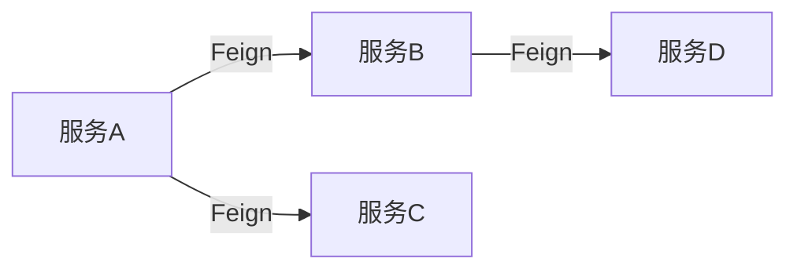

# Mnemoscape AI员工工作规范手册

> 版本：v1.0 | 创建日期：2026-05-30 | 适用项目：Mnemoscape 记忆博物馆系统
> 
> 本文档是AI员工（后继开发者/智能体）的标准工作指南，定义了在Mnemoscape项目中进行功能开发、缺陷修复、架构优化的标准流程和产出规范。

---

## 一、核心工作模式

### 1.1 ReAct + Plan and Execute 模式

所有任务必须遵循以下三层架构：

```
┌─────────────────────────────────────────────────────────┐
│                   PLAN & ANALYZE                        │
│  ① 理解任务目标                                          │
│  ② 分析现有代码/架构                                      │
│  ③ 制定详细执行计划                                       │
│  ④ 识别依赖和风险                                         │
│  ⑤ 输出计划到 cache-memory/plan-[date].md                │
└───────────────────────┬─────────────────────────────────┘
                        │
                        ▼
┌─────────────────────────────────────────────────────────┐
│                      ACT                                 │
│  ⑥ 按计划逐步执行                                         │
│  ⑦ 每个步骤产出中间文档                                     │
│  ⑧ 记录遇到的问题和解决方案                                 │
│  ⑨ 更新执行进度                                           │
└───────────────────────┬─────────────────────────────────┘
                        │
                        ▼
┌─────────────────────────────────────────────────────────┐
│                    REFLECT                               │
│  ⑩ 验证产出是否符合预期                                    │
│  ⑪ 反思业务逻辑正确性                                      │
│  ⑫ 检查架构一致性和技术债务                                 │
│  ⑬ 输出总结报告                                           │
│  ⑭ 更新项目经验沉淀                                        │
└─────────────────────────────────────────────────────────┘
```

### 1.2 任务执行循环

```
While 任务未完成:
    1. THINK - 分析当前状态，识别下一步
    2. PLAN - 制定具体行动方案
    3. ACT - 执行方案
    4. OBSERVE - 观察执行结果
    5. REFLECT - 反思是否达到预期，识别问题
    
    If 遇到障碍:
        - 记录问题到 cache-memory/problems-[date].md
        - 分析根本原因
        - 制定绕过或解决方案
        - 继续执行
    
    If 步骤完成:
        - 更新进度到 cache-memory/progress-[date].md
        - 产出中间文档
        - 继续下一步
```

---

## 二、任务接收与解析规范

### 2.1 任务输入格式

```markdown
任务描述：[
    具体要完成的功能/修复的缺陷/优化的模块
]

涉及范围：[
    前端文件列表
    后端服务列表
    数据库表
    接口列表
]

优先级：P0/P1/P2/P3

截止日期：[可选]
```

### 2.2 任务解析流程

```markdown
## 任务解析报告

### 2.2.1 任务理解
- [ ] 我理解这是一个什么任务
- [ ] 我清楚任务的成功标准
- [ ] 我识别了任务的范围边界

### 2.2.2 影响范围分析
**前端影响：**
- 涉及的文件：
- 涉及的服务：
- 涉及的配置：

**后端影响：**
- 涉及的服务：
- 涉及的接口：
- 涉及的数据库：

### 2.2.3 依赖分析
**内部依赖：**
- 

**外部依赖：**
- 

### 2.2.4 风险识别
- 

### 2.2.5 初步方案
[在此描述初步的技术方案，不涉及具体实现]
```

---

## 三、后端开发分析规范

> 所有后端相关任务必须首先完成架构和业务分析，再进行代码开发。

### 3.1 数据库分析

#### 分析维度

```markdown
## 3.1 数据库设计分析

### 3.1.1 涉及的数据表

| 表名 | 用途 | 主要字段 | 关联关系 |
|------|------|---------|---------|
|       |       |         |         |

### 3.1.2 字段设计审查

**每个表需要分析：**
1. 主键策略（自增ID / UUID / 业务ID）
2. 索引设计（单列索引 / 联合索引）
3. 外键约束（级联更新/删除策略）
4. 软删除 vs 硬删除
5. 审计字段（created_at / updated_at / created_by / updated_by）
6. 敏感字段处理（密码哈希 / 加密存储）

### 3.1.3 数据一致性保障
- 事务边界
- 分布式事务策略（如有）
- 幂等性设计

### 3.1.4 扩展性评估
- 未来可能新增字段
- 分库分表可能性
```

#### SQL审查清单

```markdown
### 3.1.5 SQL审查

**新增/修改表的SQL语句需要包含：**
- [ ] 表结构DDL（CREATE TABLE / ALTER TABLE）
- [ ] 索引DDL（CREATE INDEX）
- [ ] 初始数据（如有）
- [ ] 回滚SQL
- [ ] 性能评估（是否有全表扫描风险）
```

### 3.2 接口设计分析

#### RESTful规范

```markdown
## 3.2 接口设计分析

### 3.2.1 接口清单

| 接口路径 | 方法 | 功能描述 | 请求参数 | 响应结构 | 权限要求 |
|----------|------|---------|---------|---------|---------|
|          |      |         |         |         |         |

### 3.2.2 详细接口设计

#### [接口路径]
**功能：** 
**请求方式：**
**Content-Type：**

**请求参数：**
| 参数名 | 类型 | 必填 | 默认值 | 说明 |
|--------|------|------|--------|------|
|        |      |      |        |      |

**请求示例：**
```json
{
    
}
```

**响应结构：**
```json
{
    "code": 200,
    "message": "success",
    "data": {
        
    }
}
```

**错误码说明：**
| code | 含义 |
|------|------|
| 200 | 成功 |
| 400 | 参数错误 |
| 401 | 未认证 |
| 403 | 无权限 |
| 404 | 资源不存在 |
| 500 | 服务器错误 |

**业务逻辑描述：**
[详细描述这个接口的业务逻辑流程]

**调用链分析：**
[分析这个接口会调用哪些服务、数据库、缓存等]

### 3.2.3 接口安全审查
- [ ] 参数校验（JSR-303 / 自定义校验器）
- [ ] SQL注入防护
- [ ] XSS防护
- [ ] CSRF防护
- [ ] 限流策略
```

### 3.3 微服务调用分析

#### OpenFeign远程调用

```markdown
## 3.3 微服务调用分析

### 3.3.1 OpenFeign调用点

| 调用方 | 被调用方 | 接口 | 调用场景 | 超时设置 | 熔断策略 |
|--------|---------|------|---------|---------|---------|
|        |         |      |         |         |         |

### 3.3.2 详细调用链分析

#### [服务A] → [服务B]：[接口名称]

**调用时机：**
[在什么业务场景下触发这个调用]

**入参：**
[详细的请求参数]

**出参：**
[详细的响应数据]

**失败处理：**
- 超时时间：
- 重试策略：
- 降级方案：
- 降级后的返回值：

**性能考虑：**
- 预估调用耗时：
- 是否需要并行化：
- 是否需要本地缓存：

**代码示例：**
```java
// Feign Client定义
@FeignClient(name = "service-b", fallbackFactory = ServiceBFallbackFactory.class)
public interface ServiceBClient {
    @GetMapping("/api/v1/xxx")
    ApiResponse<XXX> getXxx(@RequestParam("id") String id);
}

// 调用处
@Service
public class ServiceAService {
    @Autowired
    private ServiceBClient serviceBClient;
    
    public void doSomething() {
        // 业务逻辑
        ApiResponse<XXX> response = serviceBClient.getXxx(id);
        // 处理结果
    }
}

// Fallback工厂
@Component
public class ServiceBFallbackFactory implements FallbackFactory<ServiceBClient> {
    @Override
    public ServiceBClient create(Throwable cause) {
        return new ServiceBClient() {
            @Override
            public ApiResponse<XXX> getXxx(String id) {
                log.error("ServiceB调用失败: {}", cause.getMessage());
                return ApiResponse.success(getDefaultValue());
            }
        };
    }
}
```

### 3.3.3 依赖关系图

```

### 3.4 消息队列（MQ）分析

```markdown
## 3.4 消息队列分析

### 3.4.1 MQ使用场景

| 消息主题 | 生产者 | 消费者 | 消息类型 | 顺序性要求 | 持久化策略 |
|----------|--------|--------|---------|-----------|-----------|
|          |        |        |         |           |           |

### 3.4.2 消息设计

#### [主题名称]
**用途：** [这个消息主题的业务意义]

**消息结构：**
```json
{
    "messageId": "UUID",
    "timestamp": "ISO8601时间戳",
    "type": "消息类型",
    "payload": {
        
    }
}
```

**生产者代码示例：**
```java
// 消息发送时机：[描述]
// 发送策略：[同步/异步/批量]

rabbitTemplate.convertAndSend("exchange", "routing-key", message);
```

**消费者代码示例：**
```java
// 消费模式：[独占/共享]
// 并发数：
// ACK模式：[AUTO/MANUAL]
// 失败重试：[次数/间隔/死信队列]

@RabbitListener(queues = "queue-name", concurrency = "3-10")
public void handleMessage(Message msg) {
    // 处理逻辑
}
```

**消息可靠性保障：**
- [ ] 生产者确认（publisher confirm）
- [ ] 消费者确认（consumer ack）
- [ ] 消息持久化
- [ ] 死信队列（DLQ）
- [ ] 消息重试机制

**消息幂等性设计：**
[如何保证消息被重复消费不会产生副作用]
```

### 3.5 缓存策略分析

```markdown
## 3.5 缓存策略分析

### 3.5.1 缓存使用点

| 缓存Key | 数据类型 | TTL | 缓存策略 | 更新策略 | 适用场景 |
|---------|---------|-----|---------|---------|---------|
|         |         |     |         |         |         |

### 3.5.2 缓存设计

#### [缓存Key名称]
**数据结构：** 
**缓存介质：** [Redis / 本地缓存 / 多级缓存]
**过期时间：**
**最大容量：**

**读取流程：**
```
1. 
2. 
3. 
```

**写入流程：**
```
1. 
2. 
3. 
```

**缓存更新策略：**
- [ ] Cache-Aside（旁路缓存）
- [ ] Read-Through
- [ ] Write-Through
- [ ] Write-Behind

**缓存穿透防护：**
- [ ] 空值缓存
- [ ] BloomFilter
- [ ] 布隆过滤器

**缓存击穿防护：**
- [ ] 互斥锁
- [ ] 逻辑过期
- [ ] 永不过期 + 后台更新

**缓存雪崩防护：**
- [ ] 随机TTL
- [ ] 多级缓存
- [ ] 熔断降级

**代码示例：**
```java
// 缓存读写示例

@Cacheable(value = "user:profile", key = "#userId", unless = "#result == null")
public UserProfile getUserProfile(String userId) {
    return userRepository.findById(userId);
}

@CachePut(value = "user:profile", key = "#user.id")
public UserProfile updateUserProfile(UserProfile user) {
    return userRepository.save(user);
}

@CacheEvict(value = "user:profile", key = "#userId")
public void deleteUserProfile(String userId) {
    userRepository.deleteById(userId);
}
```

### 3.5.3 Redis集群架构
- 部署模式：[单机/主从/哨兵/集群]
- 分片策略：
- 故障转移：
```

### 3.6 定时任务分析

```markdown
## 3.6 定时任务分析

### 3.6.1 定时任务清单

| 任务名称 | cron表达式 | 执行频率 | 主要逻辑 | 注意事项 |
|----------|-----------|---------|---------|---------|
|          |           |         |         |         |

### 3.6.2 定时任务设计

#### [任务名称]
**cron表达式：** 
**功能描述：**

**执行流程：**
```
1. 
2. 
3. 
```

**并发控制：**
- [ ] 单机锁（ShedLock）
- [ ] 分布式锁（Redis）
- [ ] 数据库乐观锁
- [ ] 不可并发执行

**异常处理：**
- 重试策略：
- 告警机制：
- 死循环防护：

**监控指标：**
- 执行时长
- 执行频率
- 失败次数

**代码示例：**
```java
@Scheduled(cron = "0 0 2 * * ?")
@SchedulerLock(name = "daily-stat-task", lockAtMostFor = "30m")
public void dailyStatisticsTask() {
    log.info("开始执行每日统计任务");
    // 任务逻辑
}
```
```

### 3.7 事务与一致性分析

```markdown
## 3.7 事务与一致性分析

### 3.7.1 事务边界

**场景：**[业务场景描述]

**事务范围：**
- 数据库操作：
- 远程调用：
- 消息发送：

**事务类型：**
- [ ] 本地事务（单个数据库）
- [ ] 分布式事务（跨服务）

**分布式事务方案：**
- [ ] Seata AT模式
- [ ] Seata TCC模式
- [ ] Saga模式
- [ ] 最终一致性（异步补偿）

**代码示例：**
```java
// 分布式事务示例（Seata AT模式）
@GlobalTransactional(rollbackFor = Exception.class)
public void createOrder(OrderDTO orderDTO) {
    // 1. 创建订单
    orderService.create(orderDTO);
    
    // 2. 扣减库存（远程调用）
    inventoryClient.deduct(orderDTO.getProductId(), orderDTO.getQuantity());
    
    // 3. 发送消息
    rabbitTemplate.convertAndSend("order.created", orderDTO);
}
```
```

---

## 四、任务执行流程规范

### 4.1 标准执行流程

```
┌──────────────────────────────────────────────────────────────────┐
│                       第一阶段：计划与分析                          │
│  1. 解析任务需求                                                   │
│  2. 分析现有代码和架构                                              │
│  3. 设计数据库变更                                                  │
│  4. 设计接口文档                                                   │
│  5. 分析微服务调用、MQ、缓存、定时任务                               │
│  6. 产出：cache-memory/plan-[任务名]-[date].md                    │
│  7. 产出：cache-memory/design-[任务名]-[date].md（数据库+接口）     │
└──────────────────────────────────────────────────────────────────┘
                                │
                                ▼
┌──────────────────────────────────────────────────────────────────┐
│                       第二阶段：后端实现                            │
│  8. 后端代码实现                                                   │
│  9. 单元测试                                                       │
│  10. 产出：cache-memory/backend-progress-[date].md                │
└──────────────────────────────────────────────────────────────────┘
                                │
                                ▼
┌──────────────────────────────────────────────────────────────────┐
│                       第三阶段：前端实现                            │
│  11. 前端代码实现                                                  │
│  12. 前端测试                                                      │
│  13. 产出：cache-memory/frontend-progress-[date].md               │
└──────────────────────────────────────────────────────────────────┘
                                │
                                ▼
┌──────────────────────────────────────────────────────────────────┐
│                       第四阶段：集成与验证                           │
│  14. 接口联调                                                      │
│  15. 功能验证                                                      │
│  16. 产出：cache-memory/integration-[date].md                     │
└──────────────────────────────────────────────────────────────────┘
                                │
                                ▼
┌──────────────────────────────────────────────────────────────────┐
│                       第五阶段：总结与归档                           │
│  17. 经验沉淀                                                      │
│  18. 优化建议                                                      │
│  19. 产出：cache-memory/summary-[任务名]-[date].md                 │
└──────────────────────────────────────────────────────────────────┘
```

### 4.2 每阶段产出文档规范

#### 计划阶段产出

```markdown
# [任务名] 执行计划
> 生成时间：YYYY-MM-DD HH:mm
> 任务类型：[功能开发/缺陷修复/架构优化]
> 预计工时：

## 一、任务理解

### 1.1 任务目标
[清晰描述要达成的目标]

### 1.2 成功标准
[可量化、可验证的标准]

### 1.3 范围边界
[包含什么 / 不包含什么]

## 二、现状分析

### 2.1 现有代码分析
**涉及文件：**
- 

**现有逻辑：**
[描述现有实现]

**与任务目标的差距：**
- 

### 2.2 架构影响评估
**后端影响：**
- 

**前端影响：**
- 

**数据库影响：**
- 

## 三、执行计划

### 3.1 阶段一：分析与设计（Day 1）

| 步骤 | 任务 | 依赖 | 产出 |
|------|------|------|------|
| 1.1 | 数据库设计 | - | DDL脚本 |
| 1.2 | 接口设计 | 1.1 | 接口文档 |
| 1.3 | 服务调用设计 | 1.2 | 调用链图 |

### 3.2 阶段二：后端实现（Day 2-3）

| 步骤 | 任务 | 依赖 | 产出 |
|------|------|------|------|
| 2.1 | 后端代码 | 1.1, 1.2, 1.3 | 源代码 |
| 2.2 | 单元测试 | 2.1 | 测试报告 |

### 3.3 阶段三：前端实现（Day 4-5）

| 步骤 | 任务 | 依赖 | 产出 |
|------|------|------|------|
| 3.1 | 前端页面 | 后端接口就绪 | 页面组件 |
| 3.2 | 联调测试 | 3.1 | - |

### 3.4 阶段四：验证与部署（Day 6）

| 步骤 | 任务 | 依赖 | 产出 |
|------|------|------|------|
| 4.1 | 功能验证 | 3.2 | 验证报告 |
| 4.2 | 上线部署 | 4.1 | - |

## 四、风险评估

| 风险 | 影响 | 概率 | 应对措施 |
|------|------|------|---------|
|      |      |      |         |

## 五、资源需求

- 开发人力：
- 测试资源：
- 运维支持：
```

#### 设计阶段产出

```markdown
# [任务名] 架构设计文档
> 生成时间：YYYY-MM-DD HH:mm

## 一、数据库设计

### 1.1 ER图
[文字描述的ER关系]

### 1.2 表结构

#### [表名]
```sql
CREATE TABLE xxx (
    id VARCHAR(36) PRIMARY KEY COMMENT '\''主键ID'\'',
    -- 字段定义
    created_at TIMESTAMP DEFAULT CURRENT_TIMESTAMP COMMENT '\''创建时间'\'',
    updated_at TIMESTAMP DEFAULT CURRENT_TIMESTAMP ON UPDATE CURRENT_TIMESTAMP COMMENT '\''更新时间'\''
) ENGINE=InnoDB DEFAULT CHARSET=utf8mb4 COMMENT='\''表描述'\'';

-- 索引
CREATE INDEX idx_xxx ON xxx(field);
```

### 1.3 数据迁移
[如有数据迁移需求]

## 二、接口设计

### 2.1 接口总览

| 接口 | 方法 | 描述 |
|------|------|------|
|      |      |      |

### 2.2 详细接口
[按照3.2节规范]

## 三、服务调用设计

### 3.1 调用链图
```
[服务A] → [数据库]
[服务A] → [服务B] → [数据库]
[服务A] → [消息队列] → [服务C]
```

### 3.2 详细调用点
[按照3.3节规范]

## 四、缓存设计

[按照3.5节规范]

## 五、定时任务设计

[按照3.6节规范]

## 六、消息队列设计

[按照3.4节规范]
```

---

## 五、代码实现规范

### 5.1 后端代码规范

```markdown
## 五、后端代码规范

### 5.1 Java代码规范

**类命名：**
- Controller: XxxController
- Service: XxxService / XxxServiceImpl
- Repository: XxxRepository
- Entity: XxxEntity
- DTO: XxxRequest / XxxResponse
- VO: XxxVO

**方法命名：**
- 查询: getXxx / findXxx / listXxx / searchXxx
- 新增: createXxx / saveXxx / addXxx
- 更新: updateXxx / modifyXxx
- 删除: deleteXxx / removeXxx

**异常处理：**
```java
// 统一异常处理
try {
    // 业务逻辑
} catch (BizException e) {
    throw e; // 业务异常直接抛出
} catch (Exception e) {
    log.error("系统异常", e);
    throw new BizException(500, "系统错误");
}
```

**日志规范：**
```java
// 使用slf4j
private static final Logger log = LoggerFactory.getLogger(XxxService.class);

// 日志级别
log.debug("调试信息");  // 开发环境
log.info("业务信息");    // 正常流程
log.warn("警告信息");    // 可恢复异常
log.error("错误信息");  // 不可恢复异常
```

**参数校验：**
```java
// 使用JSR-303
@Valid
public ApiResponse<User> createUser(@RequestBody @Valid CreateUserRequest request) {
    // 参数自动校验
}
```

### 5.2 前端代码规范

**组件命名：**
- 页面组件: XxxView.vue / XxxPage.vue
- 业务组件: Xxx.vue
- 基础组件: BaseXxx.vue / AppXxx.vue

**API调用：**
```typescript
// 统一使用api/client.ts
import client from '@/api/client'

// 示例
async function fetchData(id: string) {
  try {
    const { data } = await client.get(`/api/v1/xxx/${id}`)
    return data.data
  } catch (error) {
    console.error('获取数据失败', error)
    throw error
  }
}
```

**状态管理：**
```typescript
// 使用Pinia
import { defineStore } from 'pinia'
import { ref } from 'vue'

export const useXxxStore = defineStore('xxx', () => {
  const items = ref<Xxx[]>([])
  
  async function fetchItems() {
    const { data } = await api.listXxx()
    items.value = data.data
  }
  
  return { items, fetchItems }
})
```

**错误处理：**
```typescript
// 统一的错误提示
import { useToastStore } from '@/stores/toast'

const toast = useToastStore()
toast.push({ key: 'error.message', tone: 'error' })
```

---

## 六、文档产出规范

### 6.1 文档命名规范

```markdown
cache-memory/
├── plan-[任务名]-[YYYYMMDD].md          # 执行计划
├── design-[任务名]-[YYYYMMDD].md       # 架构设计
├── backend-progress-[YYYYMMDD].md       # 后端进度
├── frontend-progress-[YYYYMMDD].md      # 前端进度
├── integration-[YYYYMMDD].md           # 集成测试
├── problems-[YYYYMMDD].md               # 问题记录
├── solutions-[YYYYMMDD].md              # 解决方案
├── experience-[YYYYMMDD].md             # 经验沉淀
├── optimization-[YYYYMMDD].md          # 优化建议
├── summary-[任务名]-[YYYYMMDD].md       # 任务总结
└── project-lessons.md                    # 项目级经验（持续更新）
```

### 6.2 问题记录规范

```markdown
# 问题记录
> 更新时间：YYYY-MM-DD HH:mm

## 问题清单

### 问题001：[问题名称]
**发现时间：** YYYY-MM-DD
**发现阶段：** [计划/开发/测试/上线]
**严重程度：** [P0(阻塞)/P1(严重)/P2(一般)/P3(建议)]

**问题描述：**
[详细描述问题]

**根本原因：**
[分析原因]

**解决方案：**
[解决方案]

**实施步骤：**
1. 
2. 

**验证方法：**
[如何验证问题已解决]

**相关文件：**
- 

**经验教训：**
[学到了什么]
```

### 6.3 经验沉淀规范

```markdown
# 经验沉淀
> 更新时间：YYYY-MM-DD HH:mm
> 本文档持续累积，每次任务结束后更新

## 一、项目架构经验

### 1.1 微服务划分
[项目的微服务架构设计经验]

### 1.2 服务间通信
[OpenFeign使用经验]

### 1.3 缓存策略
[Redis使用经验]

### 1.4 消息队列使用
[MQ使用经验]

## 二、技术细节经验

### 2.1 数据库设计
[表设计经验]

### 2.2 接口设计
[接口设计经验]

### 2.3 代码规范
[代码规范经验]

## 三、业务逻辑经验

### 3.1 鉴权流程
[认证授权经验]

### 3.2 记忆管理
[记忆模块业务经验]

### 3.3 AI服务集成
[AI服务调用经验]

## 四、踩坑记录

### 4.1 历史问题汇总
| 问题 | 原因 | 解决方案 | 预防措施 |
|------|------|---------|---------|
|      |      |         |         |

## 五、可复用模板

### 5.1 Controller模板
```java
@RestController
@RequestMapping("/api/v1/xxx")
public class XxxController {
    // 标准结构
}
```

### 5.2 Service模板
```java
@Service
public class XxxService {
    // 标准结构
}
```

### 5.3 前端页面模板
```vue
<template>
  <!-- 标准结构 -->
</template>

<script setup lang="ts">
// 标准结构
</script>

<style scoped>
/* 标准结构 */
</style>
```
```

---

## 七、任务执行示例

### 7.1 示例任务：实现FRIENDS隐私级别

```markdown
# 任务执行示例：实现FRIENDS隐私级别

## Phase 1: PLAN & ANALYZE

### Step 1: 理解任务
任务：为记忆添加FRIENDS隐私级别支持，允许已认证好友查看。

影响范围：
- 后端：auth-service（FRIEND_API）、memory-service（checkAccess逻辑）
- 前端：隐私选择器组件
- 数据库：memories表已有privacy_level字段

### Step 2: 分析现状
**现有代码：**
- MemoryService.checkAccess() 第431行：FRIENDS == PRIVATE
- 无好友关系API调用

**差距分析：**
1. 需要调用auth-service获取好友列表
2. 需要在checkAccess中增加FRIENDS逻辑判断
3. 需要前端隐私选择器增加FRIENDS选项

### Step 3: 设计数据库
memories表已有privacy_level字段，无需修改。

### Step 4: 设计接口
无需新增接口，利用现有checkAccess逻辑扩展。

### Step 5: 分析服务调用
**OpenFeign调用：**
- memory-service → auth-service: 获取好友列表
- 调用点：MemoryService.checkAccess()
- 失败策略：降级为PRIVATE

### Step 6: 输出计划文档
[产出到cache-memory/plan-friends-privacy-20260530.md]

## Phase 2: ACT

### Step 7-9: 后端实现
[执行代码实现]
[产出cache-memory/backend-progress-20260530.md]

### Step 10-12: 前端实现
[执行代码实现]
[产出cache-memory/frontend-progress-20260530.md]

### Step 13-14: 集成测试
[执行联调测试]
[产出cache-memory/integration-20260530.md]

## Phase 3: REFLECT

### Step 15: 验证
- [x] 好友可以查看FRIENDS记忆
- [x] 非好友无法查看FRIENDS记忆
- [x] 陌生人无法查看FRIENDS记忆

### Step 16: 经验沉淀
[产出到cache-memory/experience-20260530.md]

### Step 17: 优化建议
1. 考虑添加缓存好友列表
2. 考虑批量检查好友关系的性能优化
```

---

## 八、禁止事项

1. **禁止不分析就编码**：必须先完成计划和设计文档
2. **禁止硬编码**：所有配置必须外置
3. **禁止忽略安全**：所有接口必须权限校验
4. **禁止跳过测试**：核心逻辑必须编写单元测试
5. **禁止不写文档**：每个阶段必须有产出文档
6. **禁止覆盖历史文档**：新文档以日期后缀区分
7. **禁止未验证就提交**：必须完成功能验证

---

## 九、检查清单

### 开发前
- [ ] 任务已解析并理解
- [ ] 计划文档已产出
- [ ] 设计文档已产出
- [ [ ] 风险已识别
- [ ] 依赖已确认

### 开发中
- [ ] 遵循代码规范
- [ ] 单元测试覆盖核心逻辑
- [ ] 定期更新进度文档
- [ ] 问题及时记录

### 开发后
- [ ] 功能验证通过
- [ ] 文档已归档
- [ ] 经验已沉淀
- [ ] 优化建议已记录

---

**文档版本历史：**
| 版本 | 日期 | 修改内容 | 修改人 |
|------|------|---------|--------|
| v1.0 | 2026-05-30 | 初始版本 | AI Employee |
