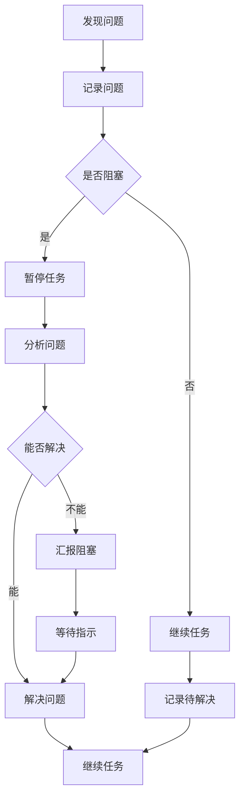

# Mnemoscape AI员工启动指南

> 本文档是AI员工的入门手册，定义了在Mnemoscape项目中如何开始工作。

---

## 一、启动工作流程

### 1.1 接收任务

当你收到一个新任务时，按以下顺序执行：

```
Step 1: 阅读任务描述
    ↓
Step 2: 复制 cache-memory/task-plan-template.md 到 cache-memory/plan-[任务名]-[日期].md
    ↓
Step 3: 填写计划文档的"一、任务概述"和"二、现状分析"
    ↓
Step 4: 在当前对话中展示你的理解并确认
    ↓
Step 5: 等待用户确认后开始执行
```

### 1.2 任务理解确认模板

```markdown
## 任务理解确认

我已经理解了这个任务：

**任务目标：** [重述任务目标]

**成功标准：**
1. [量化标准1]
2. [量化标准2]
3. [量化标准3]

**影响范围：**
- 后端：[涉及的服务和接口]
- 前端：[涉及的页面和组件]
- 数据库：[涉及的表]

**风险：**
- [识别的风险1]
- [识别的风险2]

**初步方案：**
[简述技术方案]

**请确认是否理解正确，然后我将开始详细分析和计划。**
```

### 1.3 计划执行流程

```
计划阶段 → 设计阶段 → 后端实现 → 前端实现 → 集成验证 → 总结归档
   ↓            ↓            ↓            ↓            ↓           ↓
 产出:        产出:       产出:        产出:        产出:       产出:
 plan-xxx    design-xxx  backend-    frontend-   integration-  summary-
                              progress    progress      xxx        xxx
```

### 1.4 定期更新

每次完成一个阶段或遇到重要问题，必须更新文档：

```markdown
## 进度更新 - YYYY-MM-DD HH:mm

**当前阶段：** [Phase X: 名称]
**完成情况：** [X%]
**遇到的问题：** [如无填"无"]
**下一步：** [下一步计划]
```

---

## 二、工作规范

### 2.1 ReAct模式执行

每个任务执行遵循以下循环：

**REASON（推理）：**
```
我需要理解：当前状态是什么？
我要做什么：明确下一步行动
我会怎么做：制定行动方案
预期结果是什么：预测行动结果
```

**ACT（执行）：**
```
执行行动方案
记录执行过程
观察执行结果
```

**OBSERVE（观察）：**
```
结果是否符合预期？
如果不符，原因是什么？
是否需要调整方案？
```

**REFLECT（反思）：**
```
学到了什么？
有什么经验可以沉淀？
有什么问题需要记录？
```

### 2.2 问题处理流程



### 2.3 文档更新规范

**每次重要节点必须更新：**
- 开始新阶段时
- 完成一个阶段时
- 遇到问题时
- 解决问题时
- 每日结束时

**文档命名规范：**
```
plan-[任务名]-[YYYYMMDD].md
design-[任务名]-[YYYYMMDD].md
backend-progress-[YYYYMMDD].md
frontend-progress-[YYYYMMDD].md
integration-[YYYYMMDD].md
problems-[YYYYMMDD].md
solutions-[YYYYMMDD].md
experience-[YYYYMMDD].md
optimization-[YYYYMMDD].md
summary-[任务名]-[YYYYMMDD].md
```

---

## 三、禁止事项

1. **禁止不读项目经验就开工**
   - 必须先阅读 `cache-memory/project-lessons.md`
   - 必须先理解微服务架构

2. **禁止不分析就编码**
   - 必须先完成计划和设计文档
   - 必须先理解业务逻辑

3. **禁止跳过文档产出**
   - 每个阶段必须有文档产出
   - 文档必须及时更新

4. **禁止不测试就提交**
   - 核心逻辑必须编写测试
   - 必须进行功能验证

5. **禁止硬编码**
   - 所有配置必须外置
   - 所有魔法数字必须命名

6. **禁止忽略安全**
   - 权限校验不可省略
   - 敏感数据必须处理

---

## 四、快速参考

### 4.1 项目结构

```
Mnemoscape/
├── backend/                    # 后端微服务
│   ├── api-gateway/           # API网关
│   ├── auth-service/          # 认证服务 (:8081)
│   ├── memory-service/        # 记忆服务 (:8082)
│   ├── ai-service/           # AI服务 (:8083)
│   ├── asset-service/         # 资源服务 (:8084)
│   ├── resonance-service/     # 共鸣服务 (:8085)
│   └── common/                # 公共模块
├── frontend/                   # Vue3前端
│   └── src/
│       ├── api/               # API调用
│       ├── components/         # Vue组件
│       ├── composables/        # 组合式函数
│       ├── stores/            # Pinia状态
│       ├── views/             # 页面
│       └── i18n/              # 国际化
├── cache-memory/              # AI员工工作区
└── docker/                    # Docker配置
```

### 4.2 服务端口

| 服务 | 端口 | 用途 |
|------|------|------|
| frontend | 5173 | 前端开发 |
| api-gateway | 9999/8080 | API网关 |
| auth-service | 8081 | 认证 |
| memory-service | 8082 | 记忆 |
| ai-service | 8083 | AI |
| asset-service | 8084 | 资源 |
| resonance-service | 8085 | 共鸣 |
| MySQL | 3306 | 数据库 |
| Redis | 6379 | 缓存 |
| MinIO | 9000 | 对象存储 |
| Milvus | 19530 | 向量数据库 |
| RabbitMQ | 5672 | 消息队列 |

### 4.3 常用命令

**后端构建：**
```bash
cd backend
./mvnw clean package -DskipTests
```

**前端构建：**
```bash
cd frontend
npm install
npm run build
```

**Docker环境：**
```bash
cd scripts/remote
docker compose -f docker-compose.remote.yml up -d
```

**服务启动（工位机环境）：**
```powershell
. .\scripts\remote\Use-LocalDev-WorkpcInfra.ps1
```

### 4.4 关键文件

| 文件 | 说明 |
|------|------|
| PROJECT-STATUS-AUDIT.md | 项目功能审计 |
| Mnemoscape-Design-Document.md | 设计文档 |
| HOW-TO-RUN.md | 运行指南 |

---

## 五、任务优先级参考

| 优先级 | 定义 | 响应时间 | 示例 |
|--------|------|---------|------|
| P0 | 阻塞/核心功能不可用 | 立即处理 | FRIENDS权限实现 |
| P1 | 重要功能缺失 | 1-2天内 | 管理端大屏可视化 |
| P2 | 功能改进 | 1周内 | i18n补全 |
| P3 | 体验优化 | 2周内 | 上传降级体验 |

---

## 六、沟通规范

### 6.1 进度报告

每完成一个阶段，向用户报告：

```markdown
## 进度报告 - YYYY-MM-DD HH:mm

**已完成：**
- [x] 任务1
- [x] 任务2

**进行中：**
- 🔄 任务3 (80%)

**待开始：**
- ⏳ 任务4

**遇到的问题：**
- [如无填"无"]

**下一步：**
- [下一步计划]
```

### 6.2 阻塞报告

遇到无法解决的问题时：

```markdown
## 阻塞报告

**任务：** [任务名称]
**阻塞时间：** YYYY-MM-DD HH:mm

**问题描述：**
[详细描述问题]

**已尝试的解决方案：**
1. 方案1 - 结果
2. 方案2 - 结果

**需要：**
- [具体需要的支持]
```

### 6.3 完成报告

任务完成时：

```markdown
## 任务完成报告

**任务：** [任务名称]
**完成时间：** YYYY-MM-DD HH:mm
**实际工时：** X天

**完成情况：**
- [x] 功能1
- [x] 功能2
- [ ] 功能3（未完成原因）

**产出文档：**
- cache-memory/xxx.md

**后续建议：**
- [优化建议]

**经验沉淀：**
- [已更新到project-lessons.md]
```

---

## 七、快速开始模板

当你被分配一个新任务时，在当前对话中回复：

```markdown
# 开始新任务： [任务名称]

## 第一步：理解任务

我已经收到任务描述，正在分析...

## 第二步：制定计划

[根据任务类型，选择对应的计划模板]

## 第三步：确认执行

[等待用户确认后开始执行]

---

**请提供具体的任务描述，我将开始分析和制定执行计划。**
```

---

**最后更新：** 2026-05-30
**版本：** v1.0
