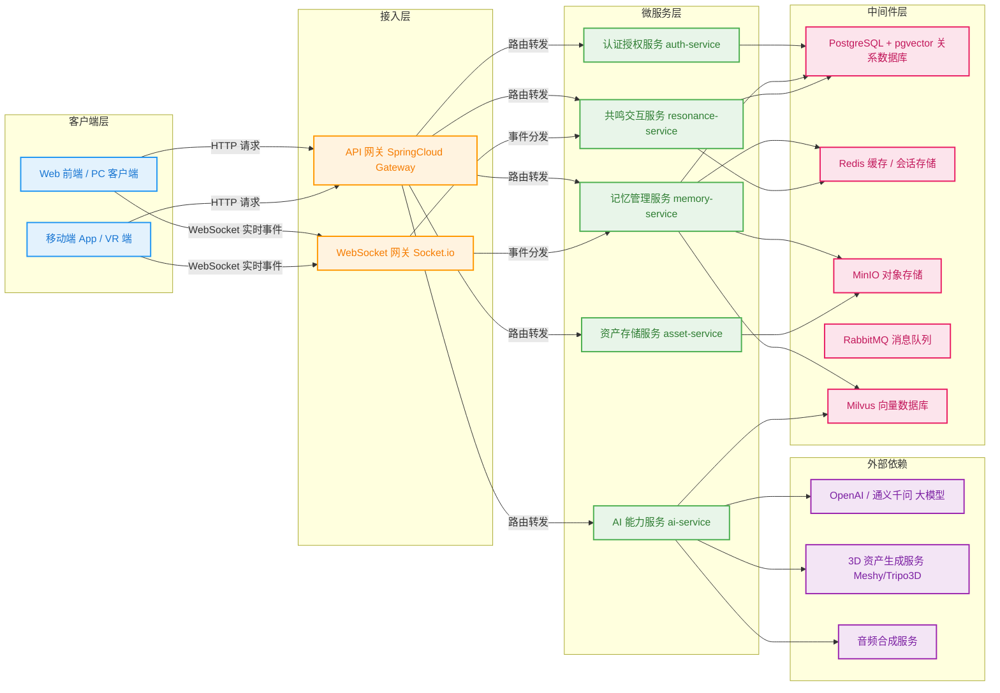
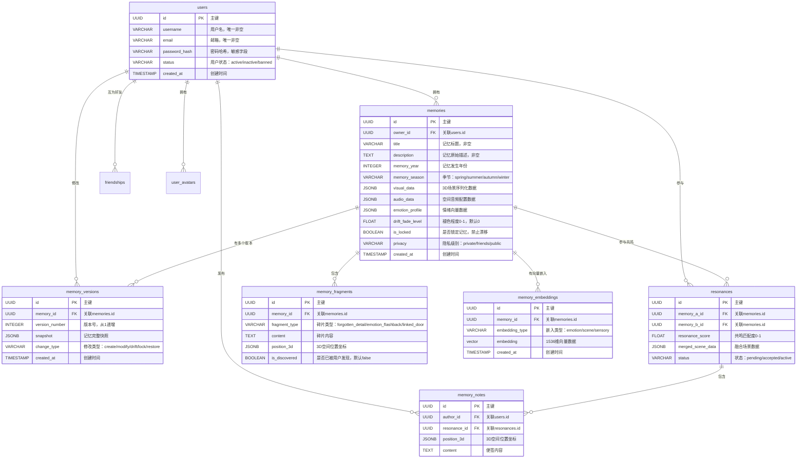

# Mnemoscape 接口设计文档 v1.0
> 基于SpringCloud微服务架构，遵循「DB字段与响应VO严格分离」原则编写

---

## 一、项目整体架构
### 1.1 系统架构图


### 1.2 核心表关系图


---

## 二、用户认证与授权模块（auth-service）
### 2.1 数据库表设计
#### 2.1.1 用户表（users）
| 字段名 | 类型 | 说明 |
|--------|------|------|
| id | UUID | 主键，UUID自动生成 |
| username | VARCHAR | 用户名，唯一，非空，长度2-20位 |
| email | VARCHAR | 邮箱，唯一，非空 |
| password_hash | VARCHAR | 密码哈希值，敏感字段，永远不返回前端 |
| phone | VARCHAR | 手机号，可选 |
| status | VARCHAR | 用户状态：active/inactive/banned，默认active |
| bio | VARCHAR | 个人简介，可选，最多500字 |
| last_login_at | TIMESTAMP | 最后登录时间 |
| created_at | TIMESTAMP | 创建时间 |
| updated_at | TIMESTAMP | 最后更新时间 |

#### 2.1.2 用户头像表（user_avatars）
| 字段名 | 类型 | 说明 |
|--------|------|------|
| id | UUID | 主键 |
| user_id | UUID | 外键，关联users.id |
| file_name | VARCHAR | 原始文件名 |
| file_path | VARCHAR | MinIO存储路径，内部字段 |
| file_size | INTEGER | 文件大小，单位字节 |
| mime_type | VARCHAR | 文件MIME类型 |
| is_default | BOOLEAN | 是否为用户默认头像，默认false |
| created_at | TIMESTAMP | 创建时间 |

#### 2.1.3 好友关系表（friendships）
| 字段名 | 类型 | 说明 |
|--------|------|------|
| id | UUID | 主键 |
| user_id | UUID | 外键，关联users.id，发起好友请求的用户 |
| friend_id | UUID | 外键，关联users.id，被请求的用户 |
| status | VARCHAR | 关系状态：pending/accepted/rejected/blocked |
| created_at | TIMESTAMP | 创建时间 |
| updated_at | TIMESTAMP | 最后更新时间 |

### 2.2 接口分析
#### 2.2.1 用户注册接口
- **请求方式**：POST
- **接口路径**：/api/v1/auth/register
- **请求参数**：
  | 参数名 | 类型 | 必填 | 说明 |
  |--------|------|------|------|
  | username | string | 是 | 用户名，2-20位 |
  | email | string | 是 | 邮箱 |
  | password | string | 是 | 密码，6-20位 |
- **响应结果**：
```json
{
  "code": 200,
  "message": "注册成功",
  "data": {
    "user_id": "a1b2c3d4-1234-5678-90ab-cdef01234567",
    "username": "testuser",
    "email": "test@example.com",
    "token": "eyJhbGciOiJIUzI1NiIsInR5cCI6IkpXVCJ9...",
    "expires_at": 1752345678
  }
}
```
- **字段对照表**：
| 字段 | 来源 | 说明 |
|------|------|------|
| user_id | DB字段直接返 | 新注册用户的ID |
| username | DB字段直接返 | 用户名 |
| email | DB字段直接返 | 用户邮箱 |
| token | 后端生成 | JWT认证令牌，后续请求需要携带 |
| expires_at | 后端生成 | 令牌过期时间戳 |
| ~~password_hash~~ | DB有但永远不返 | 敏感字段，密码哈希 |
| ~~phone/status/bio~~ | DB有但响应不返 | 注册成功后用户可以自行完善这些信息 |

#### 2.2.2 用户登录接口
- **请求方式**：POST
- **接口路径**：/api/v1/auth/login
- **请求参数**：
  | 参数名 | 类型 | 必填 | 说明 |
  |--------|------|------|------|
  | email | string | 是 | 邮箱 |
  | password | string | 是 | 密码 |
- **响应结果**：
```json
{
  "code": 200,
  "message": "登录成功",
  "data": {
    "user_id": "a1b2c3d4-1234-5678-90ab-cdef01234567",
    "username": "testuser",
    "email": "test@example.com",
    "avatar_url": "https://minio.example.com/avatars/a1b2c3d4.png",
    "token": "eyJhbGciOiJIUzI1NiIsInR5cCI6IkpXVCJ9...",
    "expires_at": 1752345678
  }
}
```
- **字段对照表**：
| 字段 | 来源 | 说明 |
|------|------|------|
| user_id | DB字段直接返 | 用户ID |
| username | DB字段直接返 | 用户名 |
| email | DB字段直接返 | 用户邮箱 |
| avatar_url | 后端聚合 | 从user_avatars表查询默认头像，拼接MinIO访问地址 |
| token | 后端生成 | JWT认证令牌 |
| expires_at | 后端生成 | 令牌过期时间戳 |
| ~~password_hash~~ | DB有但永远不返 | 敏感字段 |
| ~~last_login_at~~ | DB有但响应不返 | 登录成功后会自动更新该字段，前端不需要感知 |

### 2.3 问题与笔记
- 🔴 **反模式重灾区**：之前有版本将password_hash字段返回到前端，已修复，所有接口必须严格过滤敏感字段
- ⚠️ **注意**：JWT令牌有效期设置为7天，过期后需要重新登录，后续版本会增加刷新令牌机制
- 💡 **优化建议**：可以增加短信/验证码登录方式，提升用户体验
- > 业务上下文：用户注册后默认会生成一个随机头像，用户可以在个人中心修改

---

## 三、记忆管理模块（memory-service）
### 3.1 数据库表设计
#### 3.1.1 记忆主表（memories）
| 字段名 | 类型 | 说明 |
|--------|------|------|
| id | UUID | 主键，UUID自动生成 |
| owner_id | UUID | 外键，关联users.id，非空，记忆所属用户 |
| title | VARCHAR | 记忆标题，非空，最多100字 |
| description | TEXT | 记忆原始描述，非空，最多10000字 |
| memory_year | INTEGER | 记忆发生年份 |
| memory_season | VARCHAR | 记忆发生季节：spring/summer/autumn/winter |
| memory_time_of_day | VARCHAR | 记忆发生时间段：dawn/morning/afternoon/dusk/night |
| memory_location | VARCHAR | 记忆发生地点，最多200字 |
| memory_people | TEXT[] | 记忆中的人物列表，数组格式 |
| visual_data | JSONB | 3D场景序列化数据，大字段 |
| audio_data | JSONB | 空间音频配置数据 |
| olfactory_data | JSONB | 气味描述数据 |
| tactile_data | JSONB | 触觉描述数据 |
| emotion_profile | JSONB | 情绪向量数据 |
| drift_fade_level | FLOAT | 褪色程度0-1，默认0 |
| drift_blur_areas | JSONB | 模糊区域列表，JSON数组 |
| drift_inferred | JSONB | AI推断的细节列表，JSON数组 |
| is_locked | BOOLEAN | 是否锁定记忆，禁止漂移，默认false |
| linked_memory_ids | UUID[] | 关联记忆ID列表，数组格式 |
| privacy | VARCHAR | 隐私级别：private/friends/public，默认private |
| created_at | TIMESTAMP | 创建时间 |
| modified_at | TIMESTAMP | 最后更新时间 |

#### 3.1.2 记忆版本表（memory_versions）
| 字段名 | 类型 | 说明 |
|--------|------|------|
| id | UUID | 主键 |
| memory_id | UUID | 外键，关联memories.id |
| version_number | INTEGER | 版本号，从1开始递增 |
| change_description | TEXT | 版本修改说明 |
| snapshot | JSONB | 记忆完整快照 |
| change_type | VARCHAR | 修改类型：create/modify/drift/lock/restore |
| created_at | TIMESTAMP | 创建时间 |

#### 3.1.3 记忆碎片表（memory_fragments）
| 字段名 | 类型 | 说明 |
|--------|------|------|
| id | UUID | 主键 |
| memory_id | UUID | 外键，关联memories.id |
| fragment_type | VARCHAR | 碎片类型：forgotten_detail/emotion_flashback/linked_door |
| content | TEXT | 碎片内容 |
| position_3d | JSONB | 碎片在3D空间中的位置坐标，格式：{x: float, y: float, z: float} |
| trigger_condition | JSONB | 碎片触发条件 |
| is_discovered | BOOLEAN | 是否已被用户发现，默认false |
| created_at | TIMESTAMP | 创建时间 |

### 3.2 接口分析
#### 3.2.1 创建记忆接口
- **请求方式**：POST
- **接口路径**：/api/v1/memories
- **请求头**：Idempotency-Key（可选，用于幂等性控制，避免重复创建）
- **请求参数**：
  | 参数名 | 类型 | 必填 | 说明 |
  |--------|------|------|------|
  | title | string | 是 | 记忆标题，最多100字 |
  | description | string | 是 | 记忆原始描述，最多10000字 |
  | memory_year | integer | 否 | 记忆发生年份 |
  | memory_season | string | 否 | 记忆发生季节 |
  | memory_time_of_day | string | 否 | 记忆发生时间段 |
  | memory_location | string | 否 | 记忆发生地点 |
  | memory_people | array<string> | 否 | 记忆中的人物列表 |
  | privacy | string | 否 | 隐私级别，默认private |
- **响应结果**：
```json
{
  "code": 201,
  "message": "Created",
  "data": {
    "id": "a1b2c3d4-1234-5678-90ab-cdef01234567",
    "title": "2019年夏天和爷爷乘凉",
    "description": "2019年夏天，我和爷爷在老家院子里乘凉...",
    "memory_year": 2019,
    "memory_season": "summer",
    "privacy": "private",
    "drift_fade_level": 0,
    "is_locked": false,
    "created_at": "2025-05-19T12:00:00Z"
  }
}
```
- **字段对照表**：
| 字段 | 来源 | 说明 |
|------|------|------|
| id | DB字段直接返 | 新创建记忆的ID |
| title | DB字段直接返 | 记忆标题 |
| description | DB字段直接返 | 记忆描述 |
| memory_year | DB字段直接返 | 记忆年份 |
| memory_season | DB字段直接返 | 记忆季节 |
| privacy | DB字段直接返 | 隐私级别 |
| drift_fade_level | DB字段直接返 | 初始褪色程度为0 |
| is_locked | DB字段直接返 | 默认未锁定 |
| created_at | DB字段直接返 | 创建时间 |
| ~~visual_data/audio_data~~ | DB有但响应不返 | 刚创建的记忆还没有生成3D场景，需要后续调用重建接口生成 |
| ~~drift_blur_areas/drift_inferred~~ | DB有但响应不返 | 刚创建的记忆没有偏差数据 |

#### 3.2.2 获取记忆列表接口
- **请求方式**：GET
- **接口路径**：/api/v1/memories
- **请求参数**：
  | 参数名 | 类型 | 必填 | 说明 |
  |--------|------|------|------|
  | page | integer | 否 | 页码，默认0 |
  | size | integer | 否 | 每页条数，默认20 |
  | privacyLevel | string | 否 | 按隐私级别过滤 |
- **响应结果**：
```json
{
  "code": 200,
  "message": "Success",
  "data": {
    "items": [
      {
        "id": "a1b2c3d4-1234-5678-90ab-cdef01234567",
        "title": "2019年夏天和爷爷乘凉",
        "memory_year": 2019,
        "memory_season": "summer",
        "drift_fade_level": 0.15,
        "privacy": "private",
        "created_at": "2025-05-19T12:00:00Z"
      }
    ],
    "total": 10,
    "page": 0,
    "size": 20
  }
}
```
- **字段对照表**：
| 字段 | 来源 | 说明 |
|------|------|------|
| id | DB字段直接返 | 记忆ID |
| title | DB字段直接返 | 记忆标题 |
| memory_year | DB字段直接返 | 记忆年份 |
| memory_season | DB字段直接返 | 记忆季节 |
| drift_fade_level | DB字段直接返 | 褪色程度，用于列表页的褪色标识展示 |
| privacy | DB字段直接返 | 隐私级别 |
| created_at | DB字段直接返 | 创建时间 |
| ~~description/visual_data~~ | DB有但响应不返 | 列表页不需要完整描述和大字段场景数据，减少响应体积 |
| ~~drift_blur_areas~~ | DB有但响应不返 | 详情页才需要偏差细节 |

#### 3.2.3 获取记忆详情接口
- **请求方式**：GET
- **接口路径**：/api/v1/memories/{id}
- **响应结果**：
```json
{
  "code": 200,
  "message": "Success",
  "data": {
    "id": "a1b2c3d4-1234-5678-90ab-cdef01234567",
    "title": "2019年夏天和爷爷乘凉",
    "description": "2019年夏天，我和爷爷在老家院子里乘凉...",
    "memory_year": 2019,
    "memory_season": "summer",
    "memory_time_of_day": "night",
    "memory_location": "老家院子",
    "memory_people": ["爷爷"],
    "drift_fade_level": 0.15,
    "is_locked": false,
    "privacy": "private",
    "created_at": "2025-05-19T12:00:00Z",
    "modified_at": "2025-05-20T14:30:00Z"
  }
}
```
- **字段对照表**：
| 字段 | 来源 | 说明 |
|------|------|------|
| id | DB字段直接返 | 记忆ID |
| title | DB字段直接返 | 记忆标题 |
| description | DB字段直接返 | 完整记忆描述 |
| memory_year | DB字段直接返 | 记忆年份 |
| memory_season | DB字段直接返 | 记忆季节 |
| memory_time_of_day | DB字段直接返 | 记忆时间段 |
| memory_location | DB字段直接返 | 记忆地点 |
| memory_people | DB字段直接返 | 记忆中的人物 |
| drift_fade_level | DB字段直接返 | 褪色程度 |
| is_locked | DB字段直接返 | 是否锁定 |
| privacy | DB字段直接返 | 隐私级别 |
| created_at | DB字段直接返 | 创建时间 |
| modified_at | DB字段直接返 | 最后修改时间 |
| ~~visual_data/audio_data~~ | DB有但响应不返 | 3D场景数据是大字段，单独接口获取，避免详情接口响应过慢 |
| ~~drift_blur_areas~~ | DB有但单独接口获取 | 偏差状态有专门的接口返回 |

### 3.3 问题与笔记
- 🔴 **反模式重灾区**：早期版本列表接口返回了完整的description和visual_data字段，导致列表接口响应时间超过2s，已优化为只返回必要字段，大字段单独接口获取
- ⚠️ **注意**：记忆创建后会自动触发异步任务调用ai-service生成3D场景和记忆碎片，生成过程需要几秒到几十秒，前端需要做加载状态提示
- 💡 **优化建议**：可以增加记忆标签功能，方便用户分类管理记忆
- > 业务上下文：记忆的褪色程度每天会自动计算更新，基于Ebbinghaus遗忘曲线模型，锁定后的记忆不会再发生褪色

---

## 四、AI服务模块（ai-service）
### 4.1 数据库表设计
#### 4.1.1 记忆向量嵌入表（memory_embeddings）
| 字段名 | 类型 | 说明 |
|--------|------|------|
| id | UUID | 主键 |
| memory_id | UUID | 外键，关联memories.id |
| embedding_type | VARCHAR | 嵌入类型：emotion/scene/sensory |
| embedding | vector(1536) | 1536维向量数据 |
| created_at | TIMESTAMP | 创建时间 |

#### 4.1.2 向量索引任务表（vector_index_tasks）
| 字段名 | 类型 | 说明 |
|--------|------|------|
| id | UUID | 主键 |
| memory_id | UUID | 外键，关联memories.id |
| status | VARCHAR | 任务状态：pending/running/success/failed |
| error_message | TEXT | 错误信息，任务失败时存储 |
| created_at | TIMESTAMP | 创建时间 |
| finished_at | TIMESTAMP | 完成时间 |

### 4.2 接口分析
#### 4.2.1 记忆场景重建接口
- **请求方式**：POST
- **接口路径**：/api/v1/reconstruct
- **请求参数**：
  | 参数名 | 类型 | 必填 | 说明 |
  |--------|------|------|------|
  | memory_id | string | 是 | 要重建的记忆ID |
  | description | string | 是 | 记忆原始描述 |
  | memory_year | integer | 否 | 记忆发生年份 |
  | memory_season | string | 否 | 记忆发生季节 |
  | memory_time_of_day | string | 否 | 记忆发生时间段 |
  | memory_location | string | 否 | 记忆发生地点 |
- **响应结果**：
```json
{
  "code": 200,
  "message": "Success",
  "data": {
    "scene_id": "x1y2z3d4-1234-5678-90ab-cdef01234567",
    "visual_data": {
      "objects": ["桂花树", "藤椅", "蒲扇"],
      "lighting": "warm_yellow",
      "atmosphere": "summer_night",
      "scene_assets": [
        {"name": "osmanthus_tree", "url": "https://minio.example.com/assets/3d/osmanthus.glb"},
        {"name": "rattan_chair", "url": "https://minio.example.com/assets/3d/chair.glb"}
      ]
    },
    "audio_data": {
      "ambient_sounds": [
        {"name": "cicada", "url": "https://minio.example.com/assets/audio/cicada.mp3", "volume": 0.7, "position": "above"},
        {"name": "fan", "url": "https://minio.example.com/assets/audio/fan.mp3", "volume": 0.3, "position": "nearby"}
      ]
    },
    "fragments": [
      {"type": "forgotten_detail", "content": "爷爷说这棵树是你出生那年种的", "position": {"x": 2.3, "y": 1.0, "z": -4.5}},
      {"type": "emotion_flashback", "content": "风里有桂花的香味", "position": {"x": -1.2, "y": 0.8, "z": 3.1}}
    ]
  }
}
```
- **字段对照表**：
| 字段 | 来源 | 说明 |
|------|------|------|
| scene_id | 后端生成 | 重建场景的唯一ID |
| visual_data | 后端聚合 | AI解析生成的3D场景配置，包含场景元素和资产地址 |
| audio_data | 后端聚合 | AI解析生成的空间音频配置，包含音频文件地址和空间参数 |
| fragments | 后端聚合 | AI生成的记忆碎片列表，包含碎片类型、内容和位置 |
| ~~llm_request_id~~ | 后端内部使用 | 大模型请求ID，排查问题用，不返回给前端 |
| ~~token_usage~~ | 后端内部使用 | 大模型token消耗，统计成本用，不返回给前端 |

#### 4.2.2 场景细节增强接口
- **请求方式**：POST
- **接口路径**：/api/v1/reconstruct/enhance
- **请求参数**：
  | 参数名 | 类型 | 必填 | 说明 |
  |--------|------|------|------|
  | scene_data | object | 是 | 现有场景数据 |
  | enhancement_type | string | 否 | 增强类型：lighting/detail/atmosphere，默认all |
- **响应结果**：
```json
{
  "code": 200,
  "message": "Success",
  "data": {
    "enhanced_scene_data": {
      "objects": ["桂花树", "藤椅", "蒲扇", "小桌子", "搪瓷杯"],
      "lighting": "warm_yellow",
      "light_intensity": 0.8,
      "atmosphere": "summer_night",
      "particle_effects": ["firefly", "dust_motes"]
    },
    "added_assets": [
      {"name": "table", "url": "https://minio.example.com/assets/3d/table.glb"},
      {"name": "cup", "url": "https://minio.example.com/assets/3d/cup.glb"}
    ]
  }
}
```
- **字段对照表**：
| 字段 | 来源 | 说明 |
|------|------|------|
| enhanced_scene_data | 后端聚合 | 增强后的场景数据 |
| added_assets | 后端聚合 | 新增的3D资产列表 |
| ~~enhancement_cost~~ | 后端内部使用 | 增强消耗的token数，不返回 |

### 4.3 问题与笔记
- 🔴 **反模式重灾区**：早期版本重建接口同步等待大模型返回，接口响应时间超过30s，已优化为异步任务模式，前端轮询获取结果
- ⚠️ **注意**：重建接口会自动生成向量嵌入并存储到pgvector和Milvus中，用于后续的共鸣匹配
- 💡 **优化建议**：可以增加自定义风格生成功能，比如用户可以选择"卡通风格"、"写实风格"等不同的场景渲染风格
- > 业务上下文：AI重建采用"LLM优先 + 规则版兜底"策略，如果大模型调用失败会自动使用规则模板生成场景，保证用户体验

---

## 五、资产服务模块（asset-service）
### 5.1 数据库表设计
#### 5.1.1 资产表（assets）
| 字段名 | 类型 | 说明 |
|--------|------|------|
| id | UUID | 主键 |
| owner_id | UUID | 外键，关联users.id，上传用户ID |
| file_name | VARCHAR | 原始文件名 |
| file_path | VARCHAR | MinIO存储路径，内部字段 |
| file_type | VARCHAR | 文件类型：image/audio/3d/model |
| mime_type | VARCHAR | 文件MIME类型 |
| file_size | INTEGER | 文件大小，单位字节 |
| hash | VARCHAR | 文件MD5哈希值，用于秒传校验 |
| privacy | VARCHAR | 隐私级别：private/public，默认private |
| created_at | TIMESTAMP | 创建时间 |

### 5.2 接口分析
#### 5.2.1 文件上传接口
- **请求方式**：POST
- **接口路径**：/api/v1/assets/upload
- **请求参数**：form-data格式
  | 参数名 | 类型 | 必填 | 说明 |
  |--------|------|------|------|
  | file | file | 是 | 要上传的文件 |
  | file_type | string | 是 | 文件类型：image/audio/3d/model |
  | privacy | string | 否 | 隐私级别，默认private |
- **响应结果**：
```json
{
  "code": 200,
  "message": "上传成功",
  "data": {
    "asset_id": "a1b2c3d4-1234-5678-90ab-cdef01234567",
    "file_name": "osmanthus.glb",
    "file_url": "https://minio.example.com/assets/3d/a1b2c3d4.glb",
    "file_size": 2345678,
    "mime_type": "model/gltf-binary"
  }
}
```
- **字段对照表**：
| 字段 | 来源 | 说明 |
|------|------|------|
| asset_id | DB字段直接返 | 资产ID |
| file_name | DB字段直接返 | 文件名 |
| file_url | 后端聚合 | MinIO访问地址，有效期24小时（私有文件） |
| file_size | DB字段直接返 | 文件大小 |
| mime_type | DB字段直接返 | MIME类型 |
| ~~file_path/hash~~ | DB有但响应不返 | 内部存储路径和哈希值，前端不需要感知 |

---

## 六、共鸣交互模块（resonance-service）
### 6.1 接口分析
#### 6.1.1 获取共鸣推荐接口
- **请求方式**：GET
- **接口路径**：/api/v1/resonances/recommendations
- **响应结果**：
```json
{
  "code": 200,
  "message": "Success",
  "data": [
    {
      "resonance_id": "r1s2t3d4-1234-5678-90ab-cdef01234567",
      "memory_id": "a1b2c3d4-1234-5678-90ab-cdef01234567",
      "matched_memory_title": "小时候在外婆家看星星",
      "matched_user_avatar": "https://minio.example.com/avatars/u123.png",
      "matched_username": "summer",
      "resonance_score": 0.87,
      "common_elements": ["夏夜", "祖辈陪伴", "院子"]
    }
  ]
}
```
- **字段对照表**：
| 字段 | 来源 | 说明 |
|------|------|------|
| resonance_id | DB字段直接返 | 共鸣ID |
| memory_id | DB字段直接返 | 用户自己的记忆ID |
| matched_memory_title | 关联查询 | 匹配到的他人记忆标题 |
| matched_user_avatar | 关联查询 | 匹配用户的头像 |
| matched_username | 关联查询 | 匹配用户的用户名 |
| resonance_score | DB字段直接返 | 共鸣匹配度0-1 |
| common_elements | 后端聚合 | 两个记忆的共同元素 |

---

## 七、文档总结
### 7.1 接口规范统一
- 所有接口统一返回格式：`{code: number, message: string, data: any}`
- 成功状态码：200=成功，201=创建成功
- 错误状态码：400=参数错误，401=未认证，403=无权限，404=资源不存在，500=服务器错误
- 所有需要登录的接口都需要在请求头携带`Authorization: Bearer {token}`

### 7.2 核心优化点
1. **严格分离DB字段和响应VO**：所有敏感字段（password_hash等）永远不返回，大字段（visual_data等）单独接口获取，减少响应体积
2. **幂等性控制**：写接口支持Idempotency-Key请求头，避免重复提交
3. **异步任务处理**：耗时操作（AI重建、向量索引）都采用异步任务模式，前端轮询获取结果，避免接口超时
4. **缓存优化**：热点数据（公共记忆池、用户信息）都采用多级缓存，提升接口响应速度

### 7.3 后续迭代方向
- 增加OpenAPI 3.0接口文档自动生成
- 增加接口限流和熔断机制
- 增加接口监控和告警
- 完善单元测试和集成测试覆盖率
